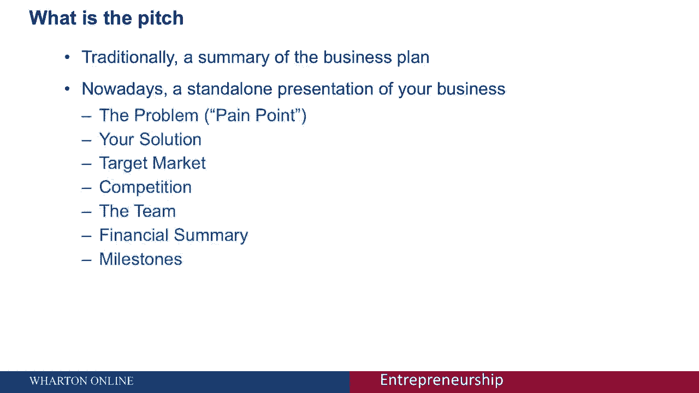

# 🎤 沃顿商学院创业课 P40：路演的艺术

在本节课中，我们将深入学习“路演的艺术”。路演是向不同受众介绍和推销你的创业想法的关键技能。我们将探讨不同形式的路演，从一句话概括到五分钟的详细阐述，并了解如何根据听众调整你的信息。

上一节我们介绍了电梯游说，它是一种单向的、用于概括业务的简短路演。本节中，我们将更详细地介绍所有不同形式的路演。

## 🎯 为何需要多种路演形式

你将与广泛的受众交流你的业务，每位受众可能需要不同类型的信息和路演方式。因此，掌握多种路演形式至关重要。

## 👥 谁来进行路演

路演应由创始人或创始团队中的成员进行。只有他们最了解最初的产品市场契合度、正确的目标细分市场、核心卖点、渠道特点以及定价和营销策略。

## 📝 如何准备路演

有多种方式可以呈现你的信息。以下是几种常见的路演形式，我们将逐一讨论。

### 高概念路演

高概念路演旨在用四到五个词精炼地描述你的公司。例如：
*   **专业人士的Facebook** -> **LinkedIn**
*   **全电动保时捷** -> **特斯拉**

然而，高概念路演可能过于简化。避免为了使用知名品牌而使用，例如“我们是X领域的优步”。在将其纳入你的路演前，确保这种类比有意义。这是最难的路演形式之一，因为它需要大量思考来精准描述你的业务。

### 两句话路演

两句话路演的结构如下：
> **对于[有需求的目标受众]，[产品名称]是一款提供[关键好处]的[产品类别]。不像[竞争对手或替代品]，我们在[关键差异点]方面不同。**

以下是两句话路演的示例：
> **对于追求环保的高端跑车的富人和车迷，特斯拉Roadster是一款提供前所未有性能的电动汽车，且不破坏环境。不像法拉利和保时捷，我们提供惊人的性能，同时实现零直接碳排放。**

### 一分钟路演

一分钟路演需要保持高水平，用简单术语解释，并瞄准核心问题。以下是两个示例：

**示例一（新型混凝土）：**
> 地球上使用最广泛的制造材料是混凝土，平均每人每年消耗超过3吨。不幸的是，混凝土制造过程造成了全球10%以上的二氧化碳排放。然而，我们开发出一种比普通混凝土坚固五倍的新型混凝土。我们的设计是独一无二的，因为我们发现了如何改变混凝土的微观结构。这种方法环保，同时能将混凝土制造成本降低40%。鉴于中国混凝土市场每年规模超过千亿美元，我们的产品对制造商极具吸引力。我们是一个由五名研究人员组成的团队，包括三名麻省理工学院的顶尖人才。我正在寻找两位充满激情的人来完成我们的团队。

**示例二（Evernote）：**
> 我是Evernote的首席执行官Phil Libin。Evernote是你的“外脑”。每当有重要的事情发生，你都可以把它放进Evernote，需要时随时取用。Evernote兼容Windows、Mac、任何网页浏览器、手机或相机。你可以用它给名片拍照、记录白板内容、保存语音备忘录。所有信息都会上传到Evernote服务器进行处理和索引，支持图片文字搜索、按位置搜索，并同步回你的设备。我们提供免费和高级（每月5美元）两种订阅级别，高级版提供近乎无限的存储空间。

### 五分钟或更长路演

五分钟路演是两句话路演的详细阐述。人们常试图塞入过多信息。你应该坚持两句话路演的基础框架：
1.  清晰识别你打算利用的市场机会。
2.  回顾建立业务的关键因素（价值主张、市场与竞争、财务前景）。
3.  如果可以，讨论风险、不确定性及假设检验。
4.  分析关键挑战和风险，以及你计划如何解决它们。

五分钟过得很快。不要只是猜测，尝试用研究和数据来支持你的假设。

## 📌 路演的核心要点

清楚你在做什么以及你在对谁说话至关重要。尝试了解你的听众知道什么，或做出有根据的猜测。根据不同的场合和对象，灵活运用高概念、两句话、一分钟或五分钟的路演形式。

---

本节课中，我们一起学习了路演的艺术。我们探讨了为何需要多种路演形式，明确了应由创始人进行路演，并详细介绍了高概念路演、两句话路演、一分钟路演以及五分钟路演的结构与技巧。记住，成功的路演在于清晰传达价值，并根据听众调整信息深度。