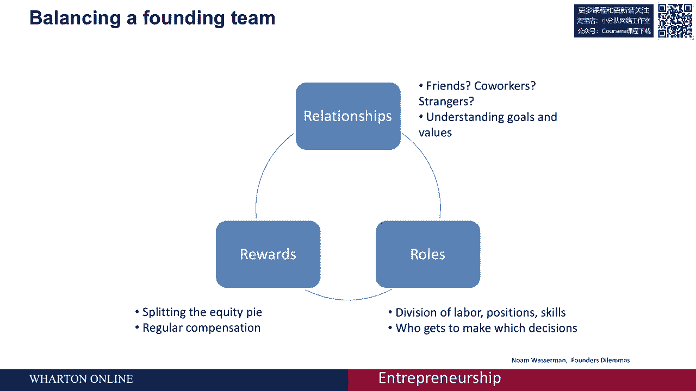

# 🚀 创业课程 P42：为什么创始团队至关重要

在本节课中，我们将探讨创业过程中一个核心但常被忽视的要素：**创始团队**。我们将深入分析为什么在创业初期就组建一个稳固的团队至关重要，以及如何通过平衡几个关键因素来避免团队问题，从而大大提高创业成功的概率。

---

## 📊 创始团队的重要性：数据与案例

上一节我们介绍了课程的整体框架，本节中我们来看看创始团队的具体影响。创始团队对企业的运营绝对至关重要。数据表明，团队问题是企业失败的头号原因，同时也是商业成功的头号原因。

为了理解其重要性，让我们回顾历史上最成功的创始团队之一：史蒂夫·乔布斯和史蒂夫·沃兹尼亚克，即苹果公司的联合创始人。

他们最初在硅谷的一个车库里合作。早期项目之一是为游戏《打砖块》开发版本，这为他们积累了开发苹果电脑和建立业务关系所需的资金。在这个项目中，史蒂夫·乔布斯负责销售并获得了合同，而史蒂夫·沃兹尼亚克负责技术实现，创造了优雅的编程解决方案。

然而，在收益分配上出现了问题。史蒂夫·乔布斯告诉沃兹尼亚克，他们将平分游戏收益。但后来沃兹尼亚克发现，乔布斯在初始合同中隐瞒了真实金额，自己获得了数千美元，只分给沃兹尼亚克一小部分。尽管当时涉及的金额不大，但这次背叛让沃兹尼亚克深感痛苦，甚至质疑了他们共同创业的基础。这次事件，连同其他紧张关系，最终促使沃兹尼亚克离开了苹果。

这个案例表明，即使是最成功的团队也可能因早期的信任和利益问题而破裂。

调查数据显示，在风险投资支持的公司中，**65%的失败原因与高级创始团队的问题有关**。相比之下，只有**3.5%** 的失败源于产品开发、市场营销或日常运营管理等我们在其他课程中会教授的内容。因此，花时间思考并解决团队问题，能显著降低创业失败的风险。

更重要的是，因团队问题导致的失败往往伴随着长期的痛苦和冲突。相比之下，产品失败可能只是一次教训，而与联合创始人持续斗争则会让你在整个创业过程中都非常不开心。

---

## ⚖️ 诺姆·乏色曼的“创始团队3R模型”

在研究创始团队时，学者诺姆·乏色曼提出了一个非常有用的模型，被称为**创始团队的三个R**，即：
1.  **关系**
2.  **角色**
3.  **奖励**

你的目标是平衡这三者。

### 1. 关系

“关系”指的是你与谁一起工作，以及你们之间的关系性质。他们是你的朋友、家人、同事还是陌生人？理解彼此的动机和共同创建组织的初衷至关重要。

数据显示，**84%** 的高增长创业公司由联合创始人创立，而非单人创业。即使是成功的个人创始人也常常希望有一个伙伴来分担工作、在情绪困难时提供支持，或在需要时暂时接管事务。

以下是联合创始人关系的常见类型及其优缺点：

*   **朋友和家人**
    *   **优点**：已有高度信任、温暖和相互支持的基础。不必过于担心背叛。
    *   **缺点**：
        *   失败率更高。当需要在维持创业和维持亲情/友情之间做选择时，人们常选择后者，导致创业被牺牲。
        *   难以进行关于价值观、贡献和利益的艰难对话。
        *   容易导致团队同质化，缺乏多样化的视角，从而限制创新能力。

*   **陌生人**
    *   **优点**：可以基于技能需求寻找合伙人，弥补自身短板，组建能力更全面的团队。
    *   **缺点**：初期信任度低，情感支持少，可能并不真正喜欢共事的人。

没有绝对正确的答案，但无论选择哪种关系，都需要清醒地认识并管理其中潜在的张力。

### 2. 角色

“角色”关乎公司内部的责任与权力分工。在苹果的例子中，沃兹尼亚克是程序员，乔布斯是销售员。明确的分工有助于公司发展。

需要考虑以下几点：

*   **对外角色**：外部世界（如投资者、客户）期望组织有明确的职位，如**CEO**。即使内部决策共享，也需要有人对外担任此角色。
*   **明确分工**：确保团队成员有清晰、不重叠的职责范围，避免混乱。
*   **决策机制**：明确组织内部如何做决策。是通过投票、共识，还是将特定领域的最终决定权赋予特定角色？例如，技术问题由**CTO**决定，运营问题由**CFO**决定，**CEO**在涉及外部事务或重大分歧时拥有最终决定权。这被称为“**功能性不平等**”。
*   **角色演变**：创业初期设定的角色可能随着公司发展而变化，团队需要保持灵活性，适时重新平衡角色。

### 3. 奖励

“奖励”关乎团队成员如何获得回报，尤其是经济补偿。推迟谈论金钱是一个常见错误。

需要考虑以下几点：

*   **坦诚沟通**：如果无法舒适地与潜在合伙人谈论金钱，那么可能不应该一起创业。
*   **长期视角**：为未来预留灵活性。今天的贡献和角色在未来可能发生变化，股权分配等奖励机制需要能适应这种演变。
*   **激励多样化**：激励不仅是金钱。**股权**是核心激励之一。此外，人们创业也可能为了独立、权力、名誉或改变世界。了解联合创始人的深层目标和价值观，有助于定制对他们真正有意义的奖励组合，避免未来冲突。

就像沃兹尼亚克的经历一样，早期的利益背叛可能摧毁多年建立的一切。在整个创业生命周期中保持关于奖励的诚实对话，能增加公司存活和成功的机会。

---

## 🎯 总结与行动指南

本节课中，我们一起学习了为什么创始团队是创业成败的关键。我们通过苹果创始人的案例看到了早期信任破裂的破坏力，并通过数据了解到**65%** 的创业失败源于团队问题。

诺姆·乏色曼的**3R模型**为我们提供了平衡团队的框架：
1.  **关系**：慎重选择联合创始人，认清不同类型关系的利弊。
2.  **角色**：明确内部分工、对外职位和决策机制，并为角色演变留出空间。
3.  **奖励**：尽早并持续地、坦诚地讨论经济回报和其他激励方式，确保与个人目标对齐。

当你思考你的创始团队时，请确保围绕这三个“R”展开明确对话：
*   你们之间的关系性质是什么？
*   每个人担任什么角色？日常负责什么？如何做决策？
*   大家如何获得回报？金钱、股权和其他奖励如何组合与平衡？

这些对话是建立信任的开始。你需要在整个创业过程中，反复审视并调整这三者的平衡，让你的创始团队保持和谐与高效，从而避免成为那**65%** 因团队问题而失败的创业公司之一。