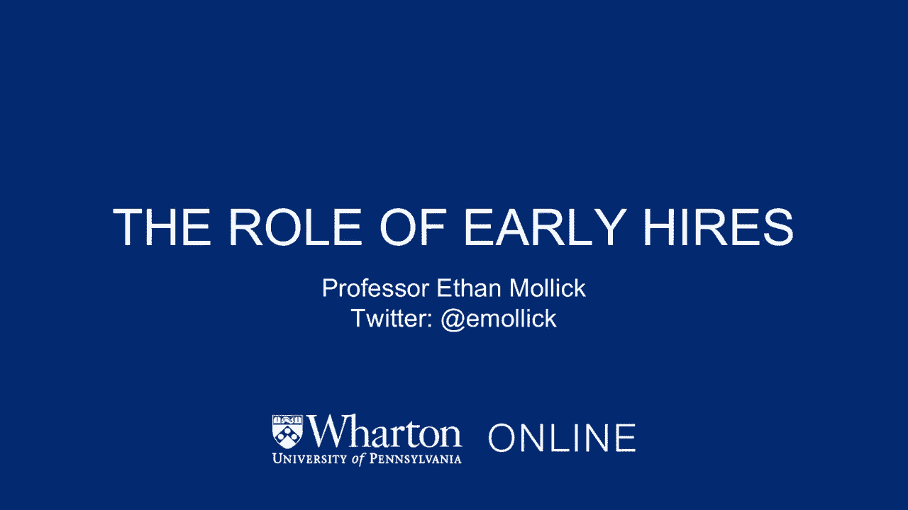
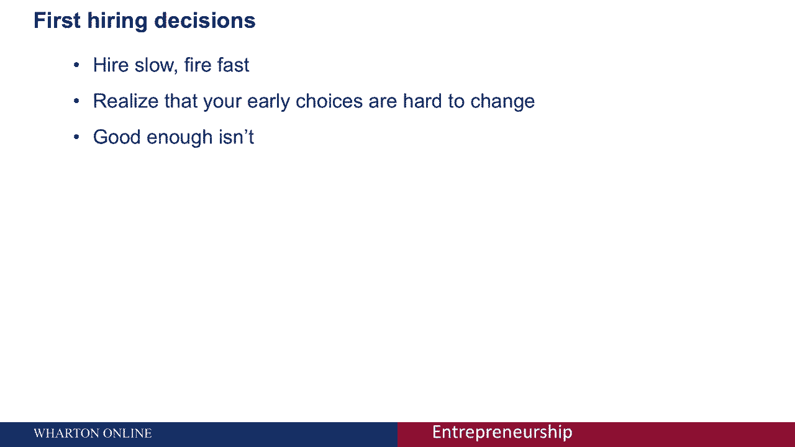

# 🚀 创业课程 P43：早期员工的关键作用



在本节课中，我们将探讨为何初创公司的早期员工与创始团队同等重要。我们将分析早期招聘的三个核心原因，并通过数据和概念帮助你理解如何做出明智的早期招聘决策。

---

## 📊 绩效差异的巨大影响

上一节我们强调了创始团队的重要性，本节中我们来看看早期员工为何同样关键。首先，员工之间的绩效差异是巨大的，这对公司生产力有决定性影响。

研究表明，在编程等技术领域，顶尖人才与普通员工的绩效差距可达数倍甚至十倍。例如，前75百分位的程序员，其生产力可能比后2.5百分位的程序员高出2到7倍。

**公式示例**：`顶尖程序员绩效 ≈ (2x 至 10x) * 普通程序员绩效`

这种差异不仅限于技术岗位。以视频游戏行业为例，即使控制游戏类型、开发预算和平台等因素，不同游戏之间的收入表现仍有巨大差异。深入分析发现：

*   公司本身（即组织架构和战略）只能解释约1%的游戏收入差异。
*   项目经理（高级协调者）能解释约22%的差异。
*   游戏设计师（创意角色）仅能解释约7%的差异。

这意味着，**优秀的经理人**对项目成功的影响远超公司背景或创意设计本身。这些高绩效者将他们的技能带到任何公司，因此，早期招聘到优秀的管理者和技术人才，是决定公司长期表现的关键。

---

## 🧱 角色惯性的长期束缚

除了绩效差异，早期招聘还需警惕“角色惯性”问题。这个概念描述了公司组织结构如何被早期员工的技能所塑造，并难以改变。

想象一下，你早期雇佣了一位人力资源负责人，他擅长招聘但不处理法律事务。随着公司成长，你不得不额外聘请律师处理人力资源相关的法律工作。当这位HR负责人离职时，你需要招聘接替者。此时，你只能寻找同样擅长招聘、且无需处理法律事务的HR，因为法律职责已由律师承担。

**代码示例**（概念性描述）：
```plaintext
初始角色：HR_员工1 { 技能集: [招聘, 员工管理] }
公司扩张后：HR_员工1 + 律师_员工A { 技能集: [劳动法] }
HR_员工1离职后：空缺角色必须匹配 { 技能集: [招聘, 员工管理] } // 无法轻易加入[劳动法]职责
```

以下是角色惯性带来的后果：

*   早期员工的技能缺口决定了后续职位的职责范围。
*   公司的组织结构因此被“锁定”，变得僵化，难以适应新的战略需求。
*   最初的招聘选择，实质上是在为未来公司的组织架构打下基础。

因此，早期招聘不仅是填补一个岗位，更是在**设计未来的岗位和公司结构**。

---

## ⚖️ 早期招聘的核心原则与总结

鉴于绩效差异和角色惯性的巨大影响，初创公司在进行早期招聘时必须遵循核心原则：**宁缺毋滥，追求卓越**。

创业初期通常人手紧缺、事务繁多，压力驱使创始人想尽快招人。但这可能是一个错误。如果仅仅因为“需要人手”而招聘了能力平庸或不适合的人，你将面临双重损失：生产力低下，以及为公司未来套上一个不合适的结构枷锁。

以下是给早期招聘的建议：

*   **标准是“优秀”，而非“足够好”**：不要降低招聘标准。早期员工的素质将极大影响公司轨迹。
*   **为未来而招聘**：思考你雇佣的这个人将如何定义这个角色，以及会如何影响后续的组织结构。
*   **缓慢而审慎**：花足够多的时间进行招聘。解雇不合适的早期员工成本高昂，且会破坏团队稳定。

---



本节课中我们一起学习了早期员工为何至关重要的三个核心原因：巨大的绩效差异、角色惯性的长期影响，以及由此衍生的“追求卓越”的招聘原则。记住，早期招聘是在为公司的基因编码，这一阶段的决策需要格外慎重和富有远见。