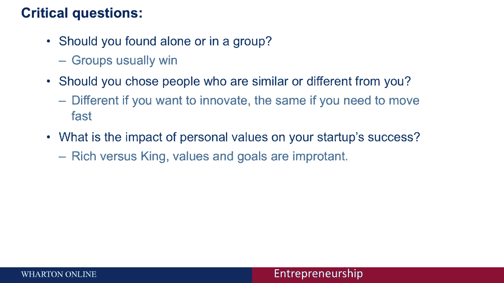

# 🚀 创业基础课程 第44讲：创始团队组建的核心问题

在本节课中，我们将探讨创业初期组建创始团队时必须面对的几个关键决策。我们将基于研究数据，分析团队规模、成员背景多样性以及创始人核心动机如何影响初创公司的成功概率与估值。理解这些因素，能帮助你更有策略地组建团队，为公司的长远发展奠定基础。

---

## 🤝 团队规模：单打独斗还是团队协作？

上一节我们讨论了创始团队问题可能导致公司失败。本节中，我们来看看组建团队时首先面临的选择：你应该独自创业，还是作为团队的一员？

研究数据给出了明确的答案：**团队创业通常更成功**。联合创始人模式不仅成功率更高，创始人通常也更快乐，因为团队互动能提供更好的支持。

以下是支持这一观点的关键数据：

*   从团队动态角度看，**三名创始成员**是一个相当理想的数字。这便于在决策时形成明确的投票结果（例如2:1），也利于清晰划分技术、运营、销售等角色。
*   研究显示，在筹集风险投资或天使资金时，**仍保留三名创始成员的公司估值最高**。
*   当然，市场上也存在许多成功的两人团队甚至单人创业公司。但当创始团队规模过大时，公司估值反而可能下降。

**核心结论**：从统计数据和团队运作角度看，拥有多名创始团队成员通常更具优势。在创业伊始就应认真思考如何建立一个核心团队，而非仅依靠个人力量。

---

## 🧩 团队构成：选择相似还是不同的伙伴？

确定了团队规模后，下一个关键问题是：你应该选择与背景相似的人共事，还是与背景多样的人合作？

这里的“多样性”主要指**职业背景、工作经历和技能**的差异（例如：投资银行家、律师、艺术家、自学成才者），而非特指种族或性别。不过需要指出的是，研究同样表明，性别与种族的多样性也与更高的成功率相关。

同质化团队与多样化团队各有优劣，选择取决于你的创业策略。

### 同质化团队（背景相似）

**优势**：
*   **沟通高效**：团队成员拥有相同的文化背景和处事方式，使用“同样的语言”，能快速达成共识并执行。
*   **运作迅速**：团队更团结，不易分裂，擅长快速抓住并复制现有市场机会。

**劣势**：
*   **创新能力较弱**：由于思维模式相近，解决问题的方法和视角较为单一，难以产生突破性创新。

**适用场景**：如果你的策略是**快速执行**，在一个已有成熟模式的领域内竞争（例如，在你所在的城市开设一家快餐连锁店），那么同质化团队是更合适的选择。

### 多样化团队（背景不同）

**优势**：
*   **创新能力强**：创新源于思想的重组。多样化的背景意味着更多元的问题解决方法和更广泛的经验网络，能催生真正有影响力的创新。
*   **财务价值提升**：研究表明，创始团队每增加一种不同的背景经验，公司的估值**可能提升7%到12%**。

**劣势**：
*   **沟通成本高**：不同背景的人“说不同的语言”，可能导致摩擦，降低决策效率，甚至引发团队分裂。

**适用场景**：如果你的目标是进行**创新或开拓全新领域**，那么多样化团队是你的朋友，它能带来显著的创新优势和财务回报。

---

## 👑 核心动机：追求“财富”还是“王权”？

最后一个关键问题是关于创始人的个人价值观与核心动机。这看似抽象，却对公司的战略选择有直接影响。

创业时，创始人通常怀有两个主要目标，但往往难以兼得：
1.  **“为王”（King）**：追求**独立与控制权**。希望掌控自己的命运，塑造组织，解决自己认为重要的问题。
2.  **“致富”（Rich）**：追求**财富最大化**。希望公司能赚取尽可能多的金钱回报。

这两种动机的冲突非常现实，并会引导公司走向不同的道路：

*   **选择“为王”**：倾向于保持控制。这可能意味着不愿引入有经验的高管（因为他们也想要控制权），更倾向于雇佣初级员工，并可能为避免股权稀释而拒绝外部融资。这些选择通常会**限制公司的增长速度和盈利潜力**。
*   **选择“致富”**：倾向于最大化回报。这意味着愿意引入风险投资或天使投资（这会稀释控制权），聘请资深顾问和高管（他们可能要求股权）。这些选择会**放松创始人对公司的控制，但能加速成长并提升公司估值**。

研究数据清晰地揭示了这种权衡。下图展示了创始人控制权与公司估值的关系：

```
估值（百万美元）
    ↑
    |    ● (致富路径：放弃控制，高估值)
    |   ●
    |  ●
    | ●
    |● (为王路径：保持控制，较低估值)
    +------------------→ 创始人控制权（从放弃到完全控制）
```

**数据显示**：那些选择“致富”路径、放弃更多控制权的创始人，其持有的公司股票价值，平均是那些选择“为王”路径、极力保持控制权的创始人的**两倍**。

**核心结论**：对于绝大多数初创企业而言，**很难同时实现“既当国王又致富”**。像史蒂夫·乔布斯或马克·扎克伯格这样的例子是罕见的例外。因此，创始人需要明确自己的核心目标：是更看重**控制与独立**，还是更看重**财富最大化**。同时，确保创始团队成员在这个根本动机上保持一致，至关重要，因为“富人”与“国王”之间的分歧是导致团队分裂的常见原因。

---

## 📝 本节总结

本节课我们一起学习了组建创始团队时必须深思熟虑的三个核心问题：

1.  **团队规模**：统计数据支持**团队创业**（尤其是2-3人）更有利于成功和创始人幸福感。
2.  **团队构成**：选择相似还是多样的伙伴取决于你的策略。**多样化团队**利于**创新**，**同质化团队**利于**快速执行**。
3.  **核心动机**：需在**追求控制（为王）** 和**追求财富（致富）** 之间做出明确选择，这直接影响融资、招聘和公司成长路径。确保团队成员动机一致。

在组建你的创始团队时，请有意识地思考并回答这些问题：团队有多少人？为何选择这些背景的成员？我们共同的核心价值观与目标是什么？清晰的答案将为公司的稳定与发展打下坚实的基础。



---

