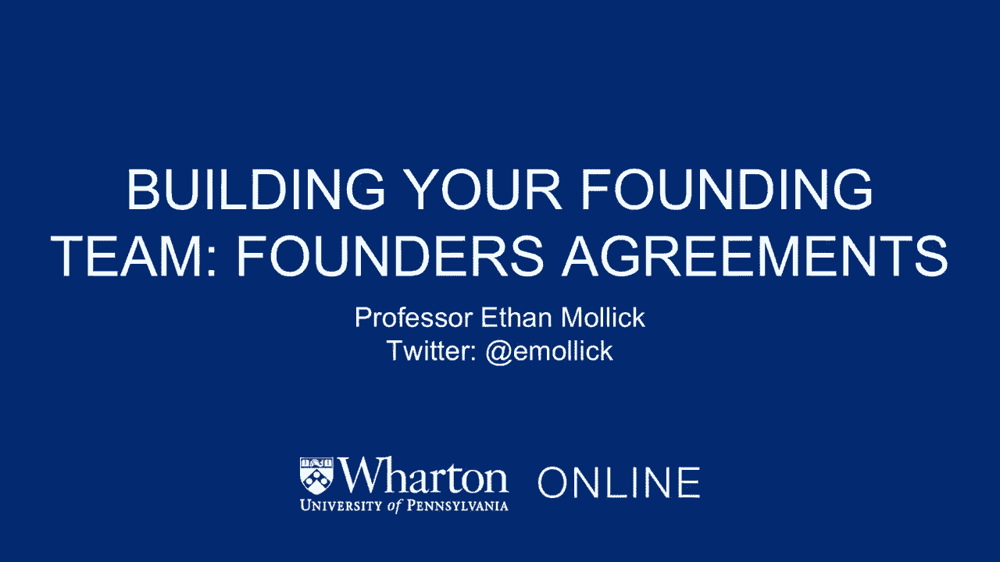
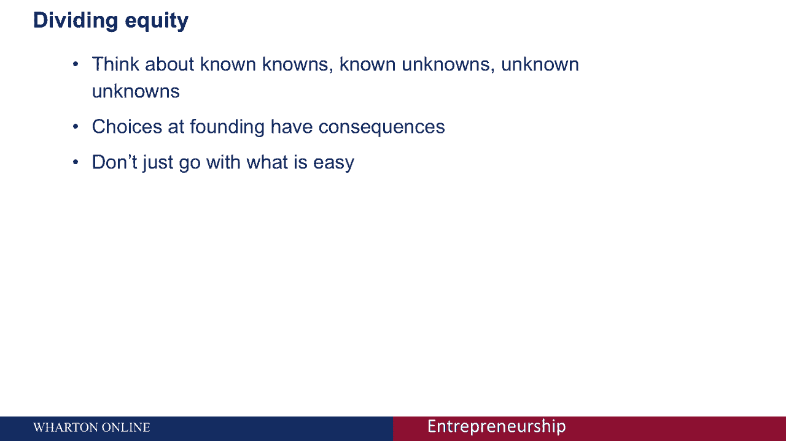

# 【沃顿商学院】创业 四部曲：发现机会、建立公司、增长战略、融资和盈利 - P45：[P45]04_2-3-founders-agreements - 知识旅行家 - BV19Y411q713

所以我们一直在讨论平衡你的创始团队有多重要，正确的是运行一个启动。

但我想谈谈，你如何激励你的团队，你如何就你的创始团队要做的事情达成一致，所以我想先给你们一个迷你盒子，我们把这叫做拼图，沃顿说，所以他们在头脑风暴中一起产生，他们都同意他们每个人都是一起想出这个主意的。

他们每个人都同意在创业中投入一万美元，他们把现金放进去，他们每个人都投入了相同数量的工作来启动，采访人，做一些我们在，到目前为止，你在早期看到的讲座，创业刚刚开始，但到目前为止，他们都做了同样的工作。

他们同意把工作分成三个角色，CEO，首席技术官和首席财务官，这些都对公司的成功负有同样的责任，他们有同样的一套，基本上，对公司长期成功的几个小时的责任和关键，这三个人应该如何分配股权。

所以让我给你一点时间考虑一下，所以我向我的MBA学生提出了这个问题，我想给你一点身体上的崩溃，他们的典型答案，所以大约40%，阶级的多元化倾向于平均分配权益，这是有道理的，这三组人。

对他们的创业做了一些重要的选择，他们都辞去了工作来实现这一点，他们都投入了等量的钱，他们一起提出了这个想法，所以根据到目前为止发生的材料，这确实是一个公平的股权分割，所以这就是人们倾向于选择的。

一个较小的群体倾向于做，即使有某种警告，所以他们会做一些股权或归属规定，我们一会儿再谈，或其他使分割相等的规定，但带有某种星号和某种潜在的变化，我们一会儿会讨论其中的一些。

然后出于某种原因大约20%的学生选择了其他的，所以他们认为首席技术官应该得到更多的股权，或者CEO应该获得更多的股权，或者应该有某种战斗的考验，胜利者决定事情，某种不寻常的模式，正如你所看到的。

我实际上同意这里的多数，根据我们到目前为止所看到的事实，平分股权是有道理的，但问题是你把它建立在，过去发生了什么，创业的危险不是过去发生的事情，但是将来会发生什么，所以公司里可能会发生很多事情。

随着时间的推移，我看到了学生创业公司中发生的所有这些事情，这样你就可以改变公司的方向，那么如果你不再需要首席财务官会发生什么，因为本组织不再有财务部分，你可以有新员工，你把组织里新来的、重要的人带来。

他们需要股权，也许他们更资深，他们得到了什么，他们有什么角色，个人情况可能会有变化，有人生病了，1。有人可能决定要离职，因为那个，呃，因为他们有情绪问题，组织内部可能会发生某种危机。

可能会有群体间的政治，结果三个创始人中的两个最终可能会背叛第三个，所以这些都是组织内部可能发生的问题，确实发生了，这些是可能引起主要担忧的不确定性，所以你需要考虑，不仅仅是过去发生的事情。

但你将来打算做什么，还有可能发生的事情，那会改变你们公司的发展方向，我们称之为不确定性，我觉得值得一听，他们可能对很多话题都不太了解，但肯定对不确定性有所了解，得到他们的印象。

关于我们必须担心的插入类别，有已知的已知吗，有些事情我们知道，我们知道，我们也知道有已知的未知数，也就是说，我们知道，有些事情我们不知道，但也有未知的未知，我们不认识的人，我们不知道，所以这就是。

当然啦，唐纳德·拉姆斯菲尔德，谁是U，入侵伊拉克，他有句名言，在回答关于将来会发生什么的问题时，当时大笑不止，你刚才看到的陈述，但我想撇开其他不谈，这是关于不确定性的最深刻的认识论陈述之一。

你可能会在哲学课程之外得到，让我们看看拉姆斯菲尔德在这里到底说了什么，她说有已知的已知，这些是我们知道我们知道的事情，所以说，我们叫什么已知已知，我们称这些为事实，已知已知，是我们实际上有确定性的事情。

在我给你们的那个关于创始团队的小例子中，已知的已知是什么，团队都是一起提出这个想法的，团队决定平均分配角色，在这一点上，他们都投入了一万美元，这些都是事实，在决定如何分配股权时也很重要。

但也有已知的未知，我们知道我们不知道的事情，什么是我们知道但不太清楚的事情，在组织中发生了很多事情，我们知道人们可能，或者最终可能不会决定从事全职工作，或者辞去工作加入你的创业公司。

你知道你可能需要从组织和一些组织筹集资金，但你不知道会是谁送的，在什么时候这些是已知的，这些都是已知的未知数，你知道这些是你组织中的不确定性，但你知道有些东西会回答这些问题，你得想想怎么筹款。

人们必须辞职才能加入你的创业公司，所以你可以设计系统，我们称这些或有条款，如归属，有助于解决这些问题，所以归属会给你不同数量的股权，如果你决定离开你的组织还是不离开，如果你决定继续为你的初创公司工作。

所以你可以写合同，这些已知的未知数，并解决这些不确定性，最后我们有了未知的未知，我们不知道的事情，我们不知道，这些是一些例子，我先前给你的，如果有人有家庭，决定离开你的组织怎么办。

如果你公司的方向发生了根本性的变化怎么办，如果发生自然灾害怎么办，所有这些都可以从根本上改变你公司的方向，但他们没有被考虑在内，如果你简单地平均分配股权，所以你需要考虑所有三类知识，已知的已知的事实。

已知未知数，不确定性和未知的未知是风险，所以这三类知识实际上是非常重要的当你创建一个创始协议时，如果你想知道股权部门的细节，卡尔·埃利希教授对此有一个演讲，你也可以查看，但我想让你们想想创始协议的条款。

你要分割的方式，首先，你要考虑你已知的知识，这些是事实，在我们的迷你示例中，这是大家投入的一万元，事实上，他们都一起产生了这个想法，这些是你在合同中处理的标准规定，所以每个人在你的公司都有5%的股权。

因为他们都必须在提出这个想法时扮演平等的角色，那么你已经知道了未知数，这些就是那些不确定性，有人要跳槽去你们公司吗？你会从创始人之一的兄弟那里筹集资金吗，你带来的，因为这个原因。

你可以通过我们所说的或有条款来解决这些问题，最著名的或有准备金是归属，所以归属意味着每个人都有一定数量的股权，他们有权赚取，比如说公司的20%，但这种归属只会随着时间的推移而发生，所以可能会有悬崖狂欢。

这意味着在一段时间结束时，假设你自动获得的第一年，如果你还在公司，你所欠股份的四分之一，然后每个月可能会有额外的份额分配给你，在这一点之后，你实际上可以制定更复杂的归属协议，所以你可以有不同的归属。

所以如果有人在公司全职工作，他们以更快的速度赚取股权，然后有人最终决定留在他们的全职组织，为你工作，晚上和周末，你也可以围绕事情写或有规定，获得额外的3%或4%的股权，所以你实际上可以有里程碑。

这些里程碑可以触发股权或现金支付，所以这些都是或有条款，他们让你处理已知的未知，你事先知道的这些不确定性，但你不知道他们会如何发展，那么我们如何处理未知的未知数呢，公司面临的生存风险。

有人生病或有家人生病，或者公司的方向改变得很好，有两种潜在的方法来处理这个问题，第一个听起来很俗气，但这非常重要，在团队成员之间建立信任，如果你不经常和团队的其他成员交谈，你对公司的潜在感觉。

你的担忧和你的担忧，如果你把那些东西扫到地毯下，你的处境很危险，因为当事情改变时，人们之间所有这些隐含的协议都破裂了，所以你需要通过不断地谈论你对组织的感受来建立信任，事情进展如何，开诚布公。

你也可以创造我们所说的不平等，我在之前的视频中提到过，不平等的平等是关于给予，即使你可能在人与人之间有平等的分工，在危机发生时，你可能会给某人决定权，所以如果有涉及产品和技术的危机。

首席技术官得到最终决定，不管其他创始人怎么说，或者是决定是否出售公司，或者接受投资，首席执行官做出最终决定，不管别人怎么说，因此，这解决了围绕管理的一些问题，它也可以被纳入创始人协议。

所以你需要考虑这些问题，关于你如何分配股权，你们是怎样划分管理责任的？这些都是重要的问题，利用已知的，已知，已知，未知，未知，未知的框架真的可以帮助你做到这一点，同样，这些不是盲目的理论问题。

这是诺姆·乏色曼的一些作品，初创企业随着时间的推移的结果，取决于他们在创建公司时做出的决定，你会在这里看到一张图表，图表上的加号表示该公司的生存机会，相对于基线增加，所以公司更有可能生存下来。

A-意味着生存的可能性较小，空白意味着存活率没有差异，你可以看到超过六个月，十二个月、十八个月和二十四个月时间跨度，各种选择对公司生存的机会有什么影响，所以说。

如果创始人团队中的每个人在初创企业上投资相同数量的钱，那么这就增加了公司生存的机会，为什么因为每个人在游戏中都有平等的皮肤对吧，所以如果每个人在创始团队中投入相同数量的现金，公司更有可能生存下来。

因为人们觉得其他人都在扮演重要的角色，异质经验，这就是我在之前的讨论中提到的不同背景，多样化的背景使你的公司更具创新性，但这也使它更有可能分崩离析，你可以在这里看到这种效果，所以在最初的十二个月里。

在你的公司里有不同的背景会增加公司失败的机会，但在那之后，一旦你们学会了一起工作，这种劣势消失了，所以更创新的成本，在最初的十二个月里，公司失败的机会增加了，但在那之后，你仍然更有创新精神。

失败的劣势消失了，创始团队成员之间的平等股权分配，在公司的整个时间框架内增加你的公司生存的机会，所以如果你只是盲目地平分股权，这通常是有利的，直到公司发生了什么事情，这迫使你把公司的价值视为真实的。

所以当你在你的团队中分配股权时，坐在你当地的咖啡店里做这件事，那么与公司有关的钱就不是真钱，这是赌钱，你在为一家理论上的公司分配股权，但一旦你筹集了一轮基金，或者经历一些其他事件。

使你的公司的估值成为现实，所以它从，哦，我们可以，我们可以改变世界，你的公司价值六百万美元，你现在必须处理的事实，贵公司价值的现实，实际上给那些人带来了巨大的劣势，他们只是盲目地平均分配股权，原因是。

人们很少真正平均分配工作，假设你和你的合伙人平分了股权，结果发现你比你的伴侣工作的时间多得多，你的伴侣并没有真正做出贡献，你可能会对此感到不满，但是虽然公司没有实际价值，你可能会把那些东西藏在地毯下。

如果你没有定期的谈话，但一旦你筹集到一轮资金，你意识到你搭档的股份价值300万美元，和你一样，怨恨的原因实际上会以巨大的速度扼杀公司，有时甚至是风险资本家也会想把表现不佳的团队成员赶出去，因此。

平均分配股权的优势变成了劣势，一旦你筹集到一轮资金，因此，盲目的股权分割，有点均匀，通常是一个坏主意，现在我们讨论了前面讨论的关系，在这里你可以看到这些关系问题是什么，所以朋友们用创办公司来筹集公司。

总的来说，和朋友在一起对公司的生存并不有利或不利，除非你平分股权，所以你和你的朋友对半分你公司的股权，在这种情况下，头六个月，公司分崩离析的机会增加了，我想原因正是我们所说的，之前，你有一个朋友。

友谊对你很重要，你平分股权，这意味着你不会花很多时间去想谁做什么，你们中的一个比另一个做得更多，引起其他朋友的怨恨，他们必须在，我想对我的朋友怨恨和生气吗，还是我想让生意成功，还是我想结束生意。

挽救友谊，你看到的是，这是前六个月的负面影响，如果你能解决这个问题，如果你们能找到合作的方法，然后那个劣势就消失了，所以你的公司的生存取决于你所做的一系列选择，作为创始团队，再一次。

平等的股权分割不一定是可行的，一开始就平分股权是没有多大意义的，嗯，因为它降低了你的公司长期生存的机会，然而，你可能认为这是正常的事情发生的方式，但事实并非如此，看一些调查，这也得到了最近数据的支持。

科技公司和生物技术公司的公司创始人，即使创始人之间的股权分割实际上也不是大多数情况，大多数人分配股权不均匀，所以你应该自由地思考这个问题，并认真深入地思考股权分割问题。

而不仅仅是盲目地在人与人之间分配股权，那么，当你考虑你的建国协议时，我给你的最后建议是什么，你需要考虑已知的已知，已知未知数和未知未知数，当你启动你的创业公司时，把这三个因素都考虑在内。

你的选择和你的创始团队对你公司后来的发展有巨大的影响，所以想想创始团队的问题，在事情上花大量的时间，你不应该只做容易的事。

所以最简单的事情是不要讨论和盲目地分割股权，你需要尽早进行严肃的对话，因为你没有在早期得到它们，他们以后会回来缠着你的，所以认真地考虑一下你的创始团队。
