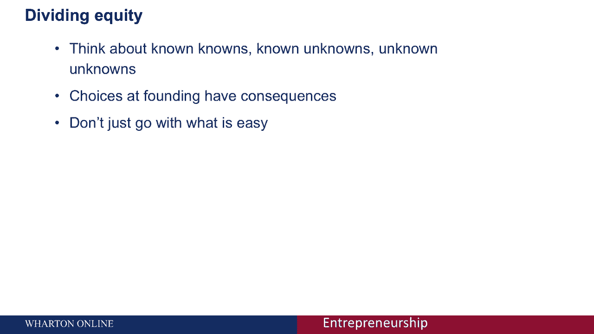

# 🧩 创业课程 45：创始人协议与股权分配

在本节课中，我们将探讨如何为创始团队制定公平且可持续的协议，特别是股权分配。我们将学习如何平衡过去贡献与未来不确定性，确保公司长期稳定发展。

***

## 📊 平衡创始团队的重要性

我们一直在讨论平衡创始团队对于正确运营初创公司的重要性。本节中，我们将探讨如何激励团队，并就创始团队应达成的事项建立共识。

***

## 🧩 股权分配案例：拼图创业公司

首先，我们通过一个案例来思考股权分配。假设有三名创始人共同创立了“拼图”公司。

以下是已知事实：
*   他们共同构思了创业想法。
*   每人投入 **1 万美元** 现金。
*   迄今为止，每人投入了等量的工作。
*   他们平分了三个角色：**CEO**、**CTO**、**CFO**。
*   每人都对公司长期成功负有同等责任。

**问题**：这三名创始人应如何分配公司股权？

***

## 🤔 常见的股权分配倾向

向 MBA 学生提出此问题时，得到了几种典型回答：

*   **平均分配（约 40%）**：多数人倾向于平分股权。这看似公平，因为所有创始人在想法、资金和工作投入上均等。
*   **附条件的平均分配（较小群体）**：部分人建议在平均分配的基础上，增加股权**归属条款**或其他限制条件，以应对未来变化。
*   **不平均分配或其他模式（约 20%）**：少数人认为 **CTO** 或 **CEO** 应获得更多股权，或通过其他竞争性方式决定。

基于目前已知事实，平均分配似乎合理。然而，初创公司的风险不在于过去，而在于未来。

***

## 🔮 应对未来不确定性

公司未来发展充满变数，例如：
*   公司战略方向可能改变。
*   某些角色（如 **CFO**）可能不再需要。
*   需要引入新的重要成员并分配股权。
*   创始人可能因个人原因（如健康、家庭）离职。
*   团队内部可能出现分歧或危机。

因此，制定创始人协议时，不能仅依据过去，必须考虑未来。我们可以借鉴一个关于“知识”的框架来系统化思考。

***

## 🧠 认知框架：已知与未知

在制定协议时，需要考虑三类知识：

1.  **已知的已知**：我们知道自己已知的事实。在上述案例中，包括：共同构思、均等投资、角色分配。这些是协议中处理的基础事实。
2.  **已知的未知**：我们知道自己未知的事情。例如：创始人是否会全职加入？公司何时需要融资？由谁融资？这些是**不确定性**，可以通过**或有条款**来解决。
3.  **未知的未知**：我们不知道自己未知的事情。例如：突发家庭变故、自然灾害、根本性的方向转变。这些是难以预见的**风险**。

接下来，我们看看如何运用这个框架来设计创始人协议。

***

## ⚖️ 设计创始人协议的要点

### 处理已知的已知
这些是协议中的标准条款，直接基于事实。例如，根据初始贡献（如资金、想法）直接分配部分股权。

### 处理已知的未知
这些不确定性需要通过**或有条款**来管理。最常见的条款是**股权归属**。

*   **归属条款示例**：创始人有权获得公司 **20%** 的股权，但需随时间逐步获得。
    *   `归属计划：1年悬崖归属期后获得25%，之后每月匀速归属剩余部分。`
*   **复杂归属安排**：可以根据贡献模式设计不同归属速度。例如，全职工作者比兼职者更快获得股权。
*   **里程碑条款**：达成特定业务目标（如产品上线、获得客户）时，触发额外的股权或现金奖励。

这些条款帮助团队在不确定性显现时，有据可依地调整权益。

### 处理未知的未知
应对无法预见的风险，有两种关键方法：

1.  **建立团队信任**：持续、开放地沟通对公司的感受、进展和担忧。避免将问题隐藏，以防隐含协议在未来破裂。
2.  **设立决策不平等**：在特定领域授予某位创始人最终决定权。例如：
    *   技术危机时，**CTO** 拥有最终决定权。
    *   是否出售公司或接受投资时，**CEO** 拥有最终决定权。
    *   这可以通过协议明确，以在危机时快速决策。

***

## 📈 股权分配选择对公司生存的影响

学术研究（如诺姆·沃瑟曼的研究）表明，创始初期的选择显著影响公司长期生存率。

以下是一些关键发现：
*   **均等投资**：创始人均等投入资金，能**增加**公司生存机会，因为每个人“利益共享，风险共担”。
*   **背景多元化**：团队背景多样在初期（12个月内）可能**增加**失败风险（因磨合困难），但长期看能提升创新能力，且初期劣势会消失。
*   **平均分配股权**：在获得真实估值（如融资）前，平均分配股权能**增加**生存机会。但**一旦公司获得真实估值**（如融资后），如果贡献不均，平均分配会变成**劣势**，引发严重怨恨。
*   **与朋友合伙并平分股权**：在前6个月会**显著增加**公司解体风险。因为友谊可能阻碍对贡献不均等问题的坦诚讨论。若能克服此问题，劣势会消失。

数据显示，大多数成功的科技和生物技术公司，其创始人股权分配**并非完全平均**。因此，你应该深入思考，而非盲目选择最简单的平分方案。

***

## 💡 最终建议与总结

本节课我们一起学习了创始人协议与股权分配的核心要点。

**总结如下**：
1.  制定创始人协议时，需系统考虑**已知的已知**（事实）、**已知的未知**（不确定性）和**未知的未知**（风险）。
2.  使用**归属条款**、**里程碑条款**等工具管理不确定性。
3.  通过**建立信任**和**明确决策权**来应对不可预见的风险。
4.  股权分配深刻影响公司命运。初期看似“简单公平”的平均分配，可能在后期带来巨大问题，尤其是在公司获得真实价值之后。

**最重要的建议是**：与创始团队尽早进行严肃、深入的对话，将各种可能性纳入协议考量。逃避困难对话、选择最简单的方案，未来必将带来更棘手的麻烦。请认真对待你的创始团队建设。

***