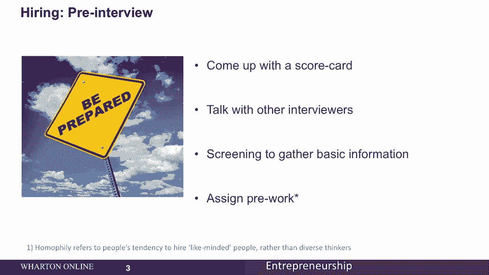
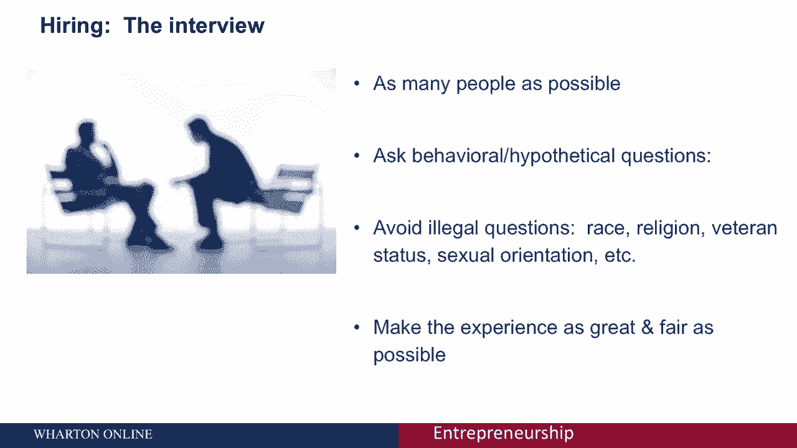
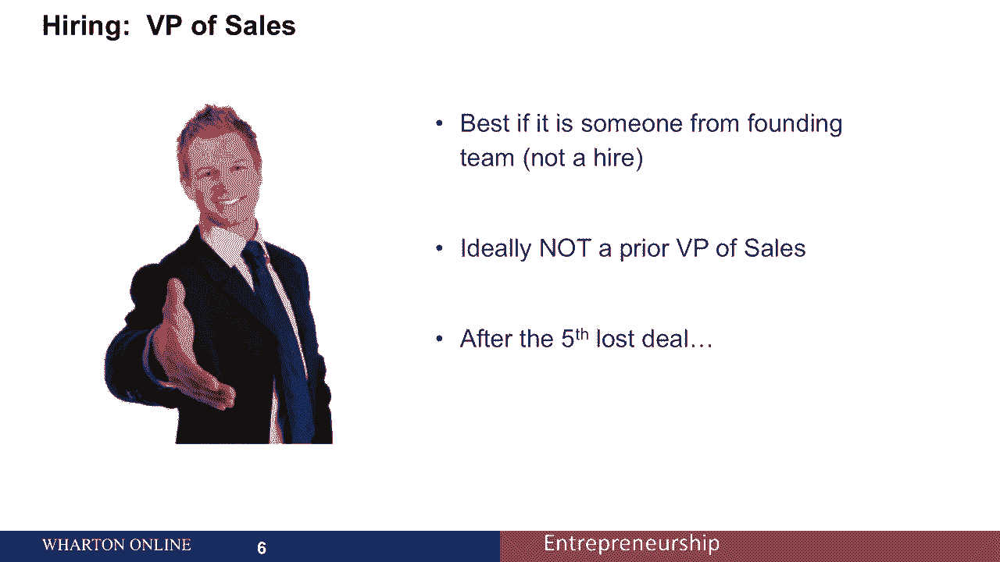

# 创业四部曲 P46：如何招聘关键管理团队成员 👥

在本节课中，我们将学习如何招聘初创公司的关键管理团队成员。我们将重点讨论招聘流程的最佳实践，并深入探讨两个最难招聘的职位：顶级销售/营销人员和顶级技术负责人。

---

## 招聘流程概述 📋

上一节我们介绍了招聘的重要性，本节中我们来看看如何构建一个系统化的招聘流程。一个严谨的流程能帮助你找到最合适的人才。

以下是招聘前和面试中需要准备的关键事项：

*   **制定统一的评估标准**：在面试前，团队应共同制定并同意一份“记分卡”，用于客观评估候选人。
*   **进行面试官协调**：与其他面试官沟通，明确筛选标准和需要收集的基本信息。
*   **考虑布置预工作**：对于技术岗位（如程序员），可以要求候选人在面试前完成一项专门的编程任务，以测试其实际能力。

---

## 面试环节的最佳实践 🗣️

确定了流程和标准后，下一步就是进行面试。有效的面试是识别人才的核心。

在面试过程中，请遵循以下原则：

*   **扩大面试范围**：尽可能多面试一些人，以增加找到最佳人选的机会。
*   **设计多样化的问题**：结合使用行为面试题（“你过去如何处理某种情况？”）、假设性问题（“在这种情况下你会怎么做？”）和技术性问题。
*   **避免非法问题**：严禁询问关于种族、宗教、退伍军人身份等受法律保护的信息。
*   **提供良好体验**：确保面试过程友好、公平，因为候选人之间很可能会交流面试体验。

---

## 面试后的关键步骤 ✅

面试结束并不意味着招聘流程的完结，后续步骤同样至关重要。

面试结束后，你需要完成以下几件事：

*   **收集背景资料**：联系候选人提供的推荐人进行背调。
*   **理性看待推荐信**：请注意，推荐信通常以积极评价为主，需要谨慎判断。
*   **汇总面试决策**：确保所有面试官都基于记分卡，明确给出“录用”或“不录用”的决定。

---

## 招聘两大关键职位 🔍

掌握了通用流程后，我们来看看如何招聘两个最具挑战性的关键职位。

### 1. 招聘顶级销售/营销负责人 💼

如果创始团队已经完成了最初的几笔销售，那么这位成员可能最了解产品与市场的匹配度。理想的销售负责人人选应具备以下特质：

*   **具备管理能力**：应擅长管理销售区域、分析数据和电子表格，而不仅仅是亲自完成交易。
*   **拥有迭代思维**：需要愿意与你共同调整策略。你不希望有人在连续五次交易失败后，只会说“让我们继续努力卖更多”。你希望他们能停下来，与你一起思考销售不顺利的根本原因。
*   **聚焦产品适配**：如果产品符合市场需求，下一步应更多地调整销售策略以适应市场。

### 2. 招聘顶级技术负责人 👨‍💻

对于技术岗位的招聘，可以考虑以下方法：

*   **利用人脉推荐**：通过你的关系网络和员工推荐来寻找优秀人选，这对招聘技术负责人尤其有效。
*   **举办技术活动**：通过组织带有奖品的编程比赛或活动来吸引人才。
*   **发挥光环效应**：顶尖的员工会吸引其他顶尖的员工。一旦你雇佣了一位非常出色的技术专家，他很可能会引荐其他优秀的朋友加入。
*   **测试编程技能**：务必设置专门的任务来测试候选人的实际编程能力，例如：`编写一个函数来解决X问题`。

---

## 总结 📝

本节课中，我们一起学习了招聘关键管理团队成员的系统方法。我们认识到，招聘是创始人最重要的工作之一，需要专注于**完整的流程**、追求候选人的**实质能力**以及考察其是否能**补充团队技能**。通过精心设计的面试和针对性的评估，你可以为初创公司找到推动增长的核心力量。