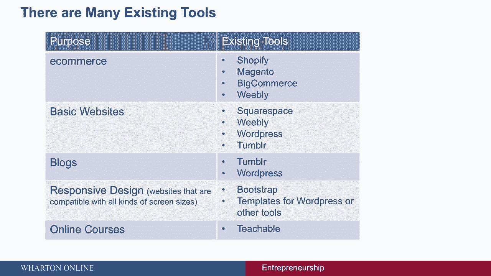
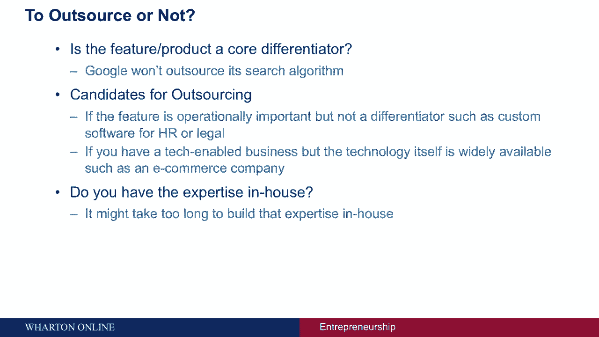
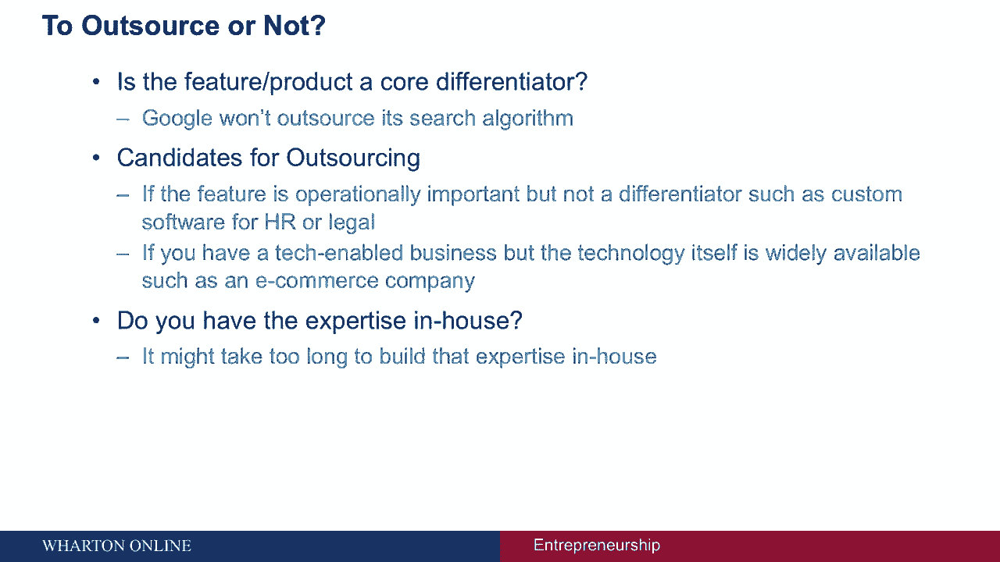
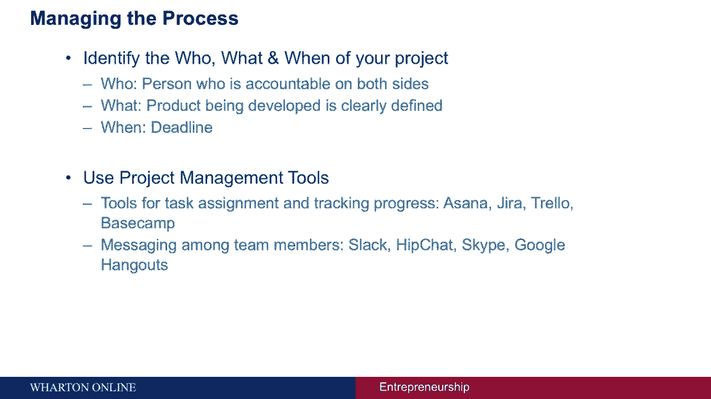

# 【沃顿商学院】创业 四部曲：发现机会、建立公司、增长战略、融资和盈利 - P47：[P47]06_2-5-finding-technical-resources - 知识旅行家 - BV19Y411q713

我是卡尔提克，我们将讨论为软件初创企业寻找技术资源。

非技术创始人面临的一个主要挑战是识别相关的技术资源，企业家必须回答的一些问题包括，我应该自己建立一个功能吗，或者是否有现有的工具或开放源码资源提供我们所寻求的功能，我们应该在内部构建还是外包软件开发。

如果我们在内部建造，我如何找到和招募有合适技能的人，最后如果我们外包，在本届会议上，我们应该如何管理这一进程，我将回答这些问题中的每一个，首先依次，有我可以使用的现有工具吗，而不是从零开始开发产品。

现在我们生活在一个模块化和开源的时代，在我们投入所有的精力来构建一个产品之前，确认外面没有什么东西是有用的，服务于目的的，比如说，如果你想建立一家电子商务公司，许多现有的工具，如Shopify，洋红色。

大商业，韦利地，其他的可能就足够了，事实上，他们中的一些人帮助你建立一个E，使用简单拖放功能的商业网站，如果你想建立一个基本的网站，几个替代方案，如方形空间，韦利地。

WordPress和Tumblr可以用于你网站上的博客，Tumblr和WordPress是相当受欢迎的选择，如果您试图构建响应式设计，意思是一个兼容各种屏幕大小的网站，网上有几个模板。

一个众所周知的响应式设计工具是bootstrap，它最初是在Twitter上开发的，同样地，如果你想推出在线课程，你正在寻找一个可以轻松推出在线课程的网站，Teacable是一个很好的网站，可以使用。

假设您已经得出结论，现有的工具不能解决您的问题，你需要建造它，下一个要问的问题是你是否应该把它建在房子里，或将产品开发过程外包。

我想问两个问题来帮忙，做出那个决定，第一个问题是功能还是产品是您业务的核心区别，如果产品或功能具有战略重要性，公司通常不会外包这些功能，比如说，谷歌不会将其搜索算法外包出去，另一方面。

如果该功能在操作上很重要，但不是区别者，它成为外包的候选者，比如说，与人力资源需求或法律需求相关联的自定义软件，或者如果你有一个技术支持的业务，但这项技术本身是广泛可用的，比如说。

如果你是一家电子商务公司，你希望建立一个具有标准功能的基本网站，比如浏览产品的能力，添加到购物车，该类型的功能和特性。

那么外包可能会奏效。

比如说，如果你想建立一家电子商务公司，你需要一个具有标准功能的基本网站，比如浏览产品，添加到购物车和其他类似功能，电子商务网站需要很好地工作，但技术本身不会让你与众不同，这是你可能不需要自己建立的东西。

外包可能会很好，我想问的第二个问题是你是否有必要的内部专业知识，在内部建立这种专业知识可能需要太长时间，可能会有拥有必要专业知识的局外人。

在这些情况下，外包可能会奏效，如果您得出结论，您需要在内部构建产品，下一步是建立正确的技术团队，能够实现产品愿景，你需要雇佣设计师，你需要雇佣开发人员，事实上。

关于寻找创始团队成员或雇用管理团队成员的许多早期评论，在雇用技术团队成员时同样适用，注重技能、文化契合度和个性契合度在这里同样相关。

即使你外包产品开发，我建议你拥有产品管理的关键方面，比如说，您应该首先对产品特性进行优先级排序，你不能只是和一个自由职业者分享一个产品愿景，然后期望一个产品回来，您需要仔细考虑这些特性。

对它们进行优先级排序，并将其传达给下一个合作伙伴，确定你的预算，这将有助于推动关于外包到哪里的决定，还根据用户流详细说明产品，或者一起开发一些低保真度的线框，这些决定将有助于确保你们都能找到合适的伴侣。

并与合作伙伴建立更好的工作关系，除了拥有产品管理，一个好的做法是也参与筛选开发人员，一个人应该确保在技术技能和软技能方面都有匹配，例如开发人员的沟通技巧，了解他们过去的项目是很有用的。

意味着他们的整个投资组合，并了解它们在这些项目中的确切角色，为开发人员进行推荐人调查是很有用的，所以所有这些都确保了你形成了正确的伴侣，下一个问题是，当然啦，你在哪里找到这些合作伙伴，你在哪里外包。

预算实际上是软件开发的一个很好的起点，你可以找到各种价格的公司，从20英镑到20英镑不等，每小时五到五十元，一路高到每小时一两百元，在范围的低端，你通常在南亚或东南亚寻找开发商。

习惯于为初创企业服务的人，在中档，你看到的是亚洲和东欧的公司，他们习惯于为初创企业和中端市场公司服务，最后，美国或西欧的企业级开发人员每小时的成本接近200美元。

与开发人员处于相同或相似的时区是有帮助的，所以你的位置，连同你的预算，可能有助于适当地集中您的激增，最后，一旦你对预算和地点做出了这些选择，您可以在许多不同的网站上寻找开发人员。

你可以找到开发人员和外包开发公司的市场包括Venture Act，租一个编码器，elance，上工，自由职业者，www。icj-cij。com，和许多其他设计师，99种设计，手和运球是很好的来源。

事实上，还有许多其他很好的选择，终于，无论您是内部构建还是外包开发，你必须管理好这个过程才能做好，确定谁，你的项目的内容和时间，就谁清楚地识别而言，对双方都负责的人，就正在开发的任务或产品而言。

是明确定义和详细说明的，就什么时候是最后期限而言，团队中的每个人都明白产品或功能何时到期，另一个建议是使用项目管理工具，简化与开发人员的交互，用于任务分配和跟踪进度的流行工具包括体式，阿吉拉，特雷洛。

大本营，除其他外，一些通常用于团队成员之间消息传递的工具包括Slack，嬉皮士，Skype，谷歌闲逛，在许多其他方面。

这份清单绝不是全面的--从外面的东西开始，你会发现前面的任务并不是压倒性的，有许多工具和资源可以依靠和使用。

