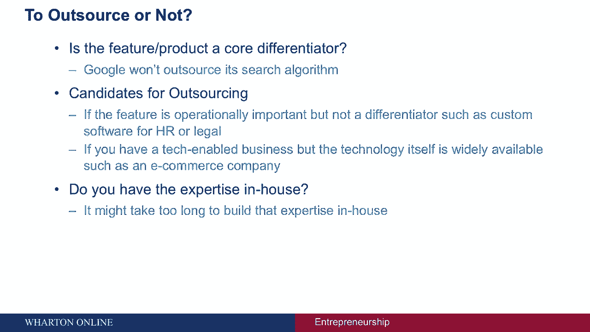

# 🚀 创业四部曲 P47：为软件初创企业寻找技术资源

在本节课中，我们将探讨非技术创始人如何为软件初创企业寻找和管理技术资源。我们将依次回答几个关键问题：是否需要从零开始开发、应该内部构建还是外包、如何组建团队或选择合作伙伴，以及如何有效管理开发过程。

---

## 🔍 第一步：评估现有工具

在投入所有精力构建产品之前，首先应确认是否有现成的工具或开源资源能满足需求。我们生活在一个模块化和开源的时代，许多功能可能已有成熟的解决方案。

以下是几个常见需求的现有工具示例：

*   **电子商务公司**：可以考虑使用 **Shopify**、**Magento**、**BigCommerce** 或 **Wix**。它们通常提供简单的拖放功能来建立网站。
*   **基础网站或博客**：**Squarespace**、**Wix**、**WordPress** 和 **Tumblr** 是流行的选择。
*   **响应式设计（兼容多屏幕尺寸）**：可以使用如 **Bootstrap**（最初由Twitter开发）这样的框架或在线模板。
*   **在线课程平台**：**Teachable** 是一个可以轻松推出在线课程的网站。

---

## 🏗️ 第二步：决定内部构建还是外包

如果现有工具无法解决问题，你需要自己构建。接下来要决定的是在内部构建还是将产品开发外包。

可以通过回答以下两个问题来帮助决策：

1.  **该功能或产品是否是业务的核心区别？**
    *   如果产品或功能具有**战略重要性**，是公司的核心竞争力，通常不应外包。例如，谷歌不会将其搜索算法外包。
    *   如果功能在**操作上很重要，但不是核心区别**，则可以考虑外包。例如，与人力资源或法律需求相关的定制软件，或技术本身已广泛可用的功能。

2.  **是否具备必要的内部专业知识？**
    *   在内部建立所需专业知识可能耗时过长。此时，寻找拥有必要专业知识的外部人员可能是更有效的选择。

**结论**：如果技术本身不会让你的业务与众不同（例如，一个具有标准功能的电子商务网站），且内部缺乏专业知识，那么**外包**可能是一个好选择。

---

## 👥 第三步：组建团队或寻找合作伙伴

### 情况一：决定内部构建

如果你决定在内部构建产品，下一步是建立能够实现产品愿景的正确技术团队。你需要雇佣设计师和开发人员。

早期关于寻找创始团队或管理团队成员的许多原则同样适用：

*   注重候选人的**技能**、**文化契合度**和**个性契合度**。

### 情况二：决定外包开发

即使外包，你也需要掌握产品管理的关键方面，并积极参与筛选合作伙伴。

以下是外包时应注意的要点：

*   **进行产品特性优先级排序**：不能只分享一个愿景，而需要仔细考虑并对特性进行排序和沟通。
*   **确定预算**：预算将影响外包地点的选择。
*   **详细说明产品**：根据用户流程详细说明产品，或共同开发一些低保真线框图。
*   **筛选开发人员**：确保在技术技能和软技能（如沟通能力）上都匹配。查看他们过去的项目组合，了解其具体角色，并进行推荐人调查。

---

## 🌍 第四步：在哪里寻找技术资源

预算和地理位置是寻找开发资源的起点。

*   **预算范围**：开发服务价格差异很大，从每小时 **20-50美元** 到 **100-200美元** 不等。
    *   **低端**：通常可寻找南亚或东南亚的开发商，他们习惯于服务初创企业。
    *   **中端**：可考虑亚洲或东欧的公司，服务于初创企业和中端市场公司。
    *   **高端**：美国或西欧的企业级开发人员，成本可能接近每小时200美元。
*   **地理位置**：与开发人员处于相同或相似的时区有助于沟通协作。

确定预算和地点后，可以在以下市场或平台寻找开发人员或公司：

**开发人员/外包公司市场**：
*   Venture Act
*   Rent a Coder
*   Elance
*   Upwork
*   Freelancer
*   www.icj-cij.org

**设计师平台**：
*   99designs
*   Behance
*   Dribbble

---

## 📋 第五步：管理开发过程

无论内部构建还是外包，都必须有效管理过程以确保成功。

管理的关键在于明确 **“谁”**（负责人）、**“什么”**（任务内容）和 **“何时”**（截止日期）。

**建议使用专业工具来简化协作**：

**项目管理与进度跟踪工具**：
*   Asana
*   Jira
*   Trello
*   Basecamp

**团队沟通工具**：
*   Slack
*   HipChat
*   Skype
*   Google Hangouts

---

## 📚 总结

本节课我们一起学习了为非技术创始人寻找技术资源的系统方法。我们从评估现有工具开始，探讨了内部构建与外包的决策依据，介绍了如何组建团队或筛选外包合作伙伴，提供了寻找技术资源的渠道，并强调了使用明确流程和工具管理开发过程的重要性。记住，从利用现有资源开始，你会发现前方的任务并非不可逾越，有许多工具和资源可供依靠和使用。