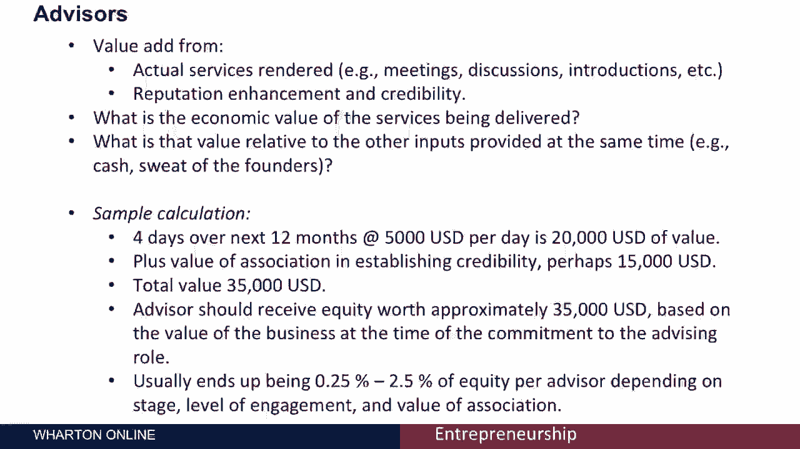

# 【沃顿商学院】创业 四部曲：发现机会、建立公司、增长战略、融资和盈利 - P48：[P48]07_2-6-allocating-equity-among-team-members - 知识旅行家 - BV19Y411q713

这节课是关于在团队成员之间分配公平，让我先举一个例子，然后我会解释什么是权益以及如何分配它，这是中国领先的手机提供商小米的创始团队，小米是由八个人创立的，这是一支来自硅谷精英的梦之队。

来自微软和谷歌等公司，和创始人，首席执行官，坐在中间，这是李骏，他现在是中国的名人，当这八个人走到一起，他们必须弄清楚他们带来了什么，他们如何分享回报，如果他们最终成功了。

这是在创业团队中按股权分配股权的基本挑战，我们是指在新企业中的所有权或利润权益，大多数新企业涉及几个关键的团队成员，如果有兴趣，让这些团队成员分享企业的所有权是有价值的，这通常是有价值的，有几个原因。

首先，这通常是外部投资者要求的，外部投资者想知道管理团队的股份，他们创造一个具有巨大价值的企业的动机，它还允许企业向团队成员支付利润，利息或股份，与现金相反，现金通常是新企业最稀缺的资源，最后。

许多被创业企业吸引的人，也是因为如果他们真的成功了，他们可能会得到巨额的经济奖励，那是唯一可能的，如果你现在有新企业的股权，来解释什么是公平，我需要解释大小写表的概念，通常只是用术语上限表。

上限表只是对公司股份和谁拥有这些股份的核算，我要向你们展示一个非常典型的，虽然有些简化的帽表，通常创始人会在这里拥有一些股份，我向创始人们展示了50万股，代表获授权股份的一半。

所以他们拥有一半或50%的股份，通常会有一些保留股份给在成立活动后被雇佣的关键团队成员，在这种情况下，我展示了为那些关键员工保留的10万股股票，或者10%，通常会有一个叫做期权池的东西。

投资者要求你留出哪些来补偿未来的员工，你们中的许多人可能听说过有人加入一家科技初创公司，获得期权或股票期权，股票期权从这个股票池中产生，这通常是投资者需要的，在他们现在把钱投入新的冒险之前。

就像一个有点神秘的旁白，选项通常就像这个术语所暗示的那样，购买股票的选择权，而不是直接授予股份，这种差异实际上主要与税收待遇有关，在像美国这样的国家，股票的赠与可能作为普通收入征税，为了避免这种情况。

大多数公司会给员工分配期权，它们在发行时通常不会被征税，最后一类股票是分配给外部投资者的股票，在这种情况下，我已经证明了30万股，代表授权股份的百分之三十，所以这是一个帽子桌。

我要仔细检查这里的每一条线，就说几句他们是如何建立的，它们是如何分配的，也就是创始人的股份，以及如何在创始人之间分配这些股份，让我们从外部投资开始，现在外部投资，分配给外部投资的股份数量由两件事决定。

第一件事是投资者向公司投入了多少资金，第二个是在投资者把他们的股票投进去之前，公司的价值是多少，你可能听说过这个术语叫估值，特别是货币前估值，这就是公司的价值所在，公司的估算或隐含估值是多少。

在投资者投入任何资金之前，所以就在这个例子中，让我们假设公司到达评估，通常在与它的70万投资者谈判，u，s，那是在投入任何新资金之前，然后投资者投资30万美元，现在这家公司有70万美元的价值。

这是它得到钱之前的价值，现在它的支票账户里有30万美元，所以它的总价值现在是一百万美元，因为投资者提供了总价值100万美元中的30万美元，他们拥有公司百分之三十的股份，所以这个数字是这样计算出来的。

这里的第二个问题是如何分配选项池，按惯例选择池，通常确定为已发行股份的10%左右，这通常只是投资者的要求，投资者希望你留出一些股份，这样你就可以补偿，未来的员工给他们一些激励来增加公司的价值。

通常是通过协商确定的，该等股份将来可能发行，也可能不发行，但它们必须显示在帽子表上，如果你听过有人讨论帽子桌，在完全稀释的基础上谈论股价，例如，完全稀释的概念意味着你假设所有这些期权都是。

你用这些股票来计算股价，下一部分是分配给关键团队成员的股权，例如，这里的股份数量通常是由市场情况决定的，这就是你必须提供的能够吸引合适的人加入你的团队，在某种程度上，当他们加入冒险时。

所以如果这些很晚了，在公司已经成立和运行并且相当有价值之后雇佣，你在这里可能需要相对较少的股份，但如果是在开始的时候，通常情况下，必须分配相当多的股份来保留，并吸引你团队的关键成员，他们不一定是创始人。

所有的权利，这就是引导我们解决这个关键问题的所有背景，这是在上限表中显示的50万股股票中，就像去找创始人一样，我们如何确定创始团队的每个成员实际获得了多少这些股份，所以让我们把这个问题作为背景。

我想展示一下创始股票在融资之前和之后的典型样子，经常在，在企业成立之初，或者在创始团队工作了一段时间之后，就是当你真正建立起，你把股权分配给创始团队，我们只能说，为了论证，左边显示的是。

我们珍视我们所拥有的，当我们现在以30万美元的价格创办公司时，在投资时，我们有帽子桌，正如我之前展示的那样，我展示了创始人一开始的价值，加上关键员工的股权，加上未来员工的期权池，加上投资者购买的股权。

现在请注意，在本例中，我已经证明了什么的价值，…的陪伴，公司成立时的价值约为30万美元，但当投资进来的时候，如果团队在做它的工作，它实际上增加了它所拥有的价值，这就是为什么我显示这条线向上移动。

所以他们一开始的价值大约是30万美元，在融资时，在计算上限表时，我现在估计的价值是五十万元。当然，这只是一个说明性的例子，贵公司的具体数值会有很大差异，所以你应该把这看作是一个例子，来遍历一些算术。

所以现在我想回到那个建国的时刻，当创始团队坐在那里，看着他们拥有的东西说，好的，我们怎么分，现在如果你仔细想想，什么应该决定这些资产或这些股份如何在创始团队中分配，嗯，这真的是创始人们带来的东西。

他们为聚会带来了什么资产，你可以认为这些资产发生在三个不同的类别中，第一类只是最初的想法是谁想出了这个想法，并开发了机会，也许是伴随着它发展起来的，一些知识产权，也许是一个产品设计，也许是一个算法。

也许做些市场调查，一些原始的知识产权，形成了原始机会的起源，这是创始人带来的第一类资产，第二类是我们所说的汗水，那是汗水的简称，股权和汗水只是意味着创始团队将为企业付出的努力，无现金补偿。

所以这就是为什么我们称之为他们的汗水，他们用自己的汗水在企业中赚取股份，他们没有得到现金报酬，相反，他们得到了有效的报酬，公司未来利润或未来价值的份额，然后第三类是缓存，不管你怎么切。

创始人几乎总是要把手伸进口袋，或者在他们的信用卡上放一些钱，拿出一些钱来开始冒险，但几乎总是有一些现金需求，现在除了创始人自己想办法别无选择，当然啦，没有真正的算法。

用于精确估计每种情况下这三种不同输入的值，还有一些讨价还价，和创始团队成员之间的一些谈判，为了得出一个结果，但这些是基本原则每个人都提出了什么，他们带来的东西有什么价值，所以现在我想更详细地介绍一下。

如何实际计算，以及如何思考，去做那件事，我们真的需要谈谈汗水，汗水是很难估价的东西之一，我想告诉你我在几个新企业中采取的方法，我看到其他人也接受了，我觉得效果很好，它本质上是从，劳动力的市场价值是多少？

创始人将致力于企业，例如，让我们想象一下有人要辞职，他们辞职了，让我们说，作为在一家相对较大的公司工作的产品经理，他们是，假设他们在那份工作中每年得到十万美元的报酬，如果他们花一年的时间。

那么从逻辑上讲，它值十万美元，市场每年付给他们十万美元，对于类似类型的服务，现在他们将在没有现金的情况下为一家新企业提供这些服务，所以从逻辑上讲，这应该值大约10万美元，这就是利用服务的市场价值来建立。

汗水到底值多少钱，这让你可以适应不同的人实际上有不同的市场价值，如果你需要雇用销售人员，销售人员的薪酬通常与不同行业的软件工程师有很大不同，所以它允许你在类似的角色中使用他们的市场价值，也许现在或过去。

来确定他们给创业带来的投入的价值，然而有一个，有一个，这里有一个具有挑战性的问题，也就是那些为企业提供现金的人，很少想要10万美元的现金，是十万元的汗水，他们认为汗水是一种，我们可以称之为有趣的钱。

它涉及到某种软计算，所以出于这个原因，通常会有一个调整，对一美元的市场进行估值，汗的价值低于一美元现金的价值，让我给你一个论点，论点是，基本上，那个，十万元的汗水抵不过十万元的现金。

这里有三个主要的论点来解释为什么这可能是第一个，人们通常不会辞职，所以他们真正做的是，他们利用空闲时间为初创公司工作，人们对空闲时间的重视程度往往低于他们对工资的重视程度，不仅他们经常不给你最好的时间。

他们给你的时间和他们在日常工作中给你的时间不一样，所以这是计算汗水价值的一个逻辑，它可能略低于缓存，第二个论点是一个有点神秘的税收论点，但现金投资是用税后现金进行的，所以当你投资十万美元。

这些都是你辛苦赚来的钱，在你为他们纳税后，汗通常是按税前计算的，所以出于这个原因，税后投资汗水是税前投资，你需要调整一下，最后一个原因是汗水的价值通常低于现金，现金为王缓存通常是初创企业中的稀缺资源。

缓存是最难想出汗水的东西，由于这个原因，我们通常看重现金，比我们重视汗水更重要的是，所以让我带你通过一个典型的计算，如何对这些投入进行估值，以及如何最终获得分配，所以让我们想象一下我们有三个搭档。

创始伙伴，克莱尔，慧晶和桑杰，这是我们的三个合作伙伴，克莱尔实际上有最初的想法，所以克莱尔给派对带来了机会和想法，她把其他人聚集在一起，说嘿，让我们去工作吧，所以我们要对机会识别进行评估，有点武断。

因为我还没说这个冒险是什么，我刚把十万美元的价值放在这里，这篇文章将是与合作伙伴之间的谈判，机会到底值多少钱，相对于我们投入的汗水和现金，我投了十万美元，但很明显，如果克莱尔发明了治疗癌症的方法。

并拥有专利分子，我们估计它的价值会超过10万美元，她所做的就是给人们买咖啡，说嘿，我有个出租车的主意，手机呼叫应用程序，我们可以说和澄清，那真的不值多少钱，所以这只是一个代表性的例子。

我们对最初的想法估价10万美元，好的，现在我们来看看汗片，我在这里展示的方式是，十二万的工资，她投入了12万美元的汗水，慧晶投了六万元，桑杰也放了六万，这通常不仅仅是投入的汗水，到目前为止。

也是汗水的承诺，通常在未来的某个时期，通常直到第一笔融资进来，人们可以开始得到工资，然后如果你看下一栏，折扣后一栏，我所做的是对这些市价打百分之五十的折扣，汗水的，为了再次获得与汗水等值的现金价值。

百分之五十是谈判的结果，这是我经常使用的一个值，我想差不多是对的，但你得和你的搭档一起解决这个问题，然后最后一类输入再次缓存，如果不至少投入一些现金，就很难开始做某事，我在这里展示过。

创始人投入了相当多的现金，所以他们放了进去，他们投入了六十七万八千元现金，这里，克莱尔投入了四十，慧晶投了二十五，桑杰投入十五，当然还有现金，一美元现金值一美元价值，一美元现金，但几乎从定义上来说。

所以把这些放在一起，您可以看到与三类输入中的每一类相对应的所有权百分比，对于三位创始人中的每一位，我们可以把这些相加来估计，或者计算每个创始人拥有的份额，所以说，例如，克莱尔会有三十个，百分之三点三。

加百分之二十，加百分之十三点三，让我们看看卷到三十六，八十，六十六点，百分之六，克莱尔感兴趣的将是最初创始人的一小部分，克莱尔有权要求的股份，这是以前可以做的算术的一个例子，企业现在有新的资金了吗。

如果像这样填写电子表格的想法，和你的创始人在一起真的开始让你反胃，那么实际上有一些更温和的方式来进行这种谈判，我将向你们展示我在最近的一次冒险中使用的一个例子，我们以为，它只是让它变得更友好。

在图形上移动一些几何形状，所以我们所做的是说，需要各种各样的角色和输入，在这个新的冒险中，它们在这里由列表示，大家可以看到，最左边的一栏是思想，最右边的列是缓存，还有一些其他的输入被描述为有效的。

作为企业创建和成长的阶段，作为附加列，然后我们把团队成员作为行，我们所做的只是把一个正方形，单元格中的三角形或小正方形，反映人们的相对信仰，有些人对每个伴侣的相对贡献的看法，企业发展的每个阶段，当然。

你可以把数字放在单元格里，但这就像我说的，以更友好的方式进行讨论，我们实际上发现在这个特殊的例子中，团队成员，团队成员聚集得非常快，在井上有显著的一致，他想出了这个主意，谁在放缓存，谁来做这件事。

谁会做那件事，你可能可以想象，一旦你有了这种相对贡献的表示，然后你需要做一些算术来转换这个，变成一些实际的数字百分比，当你真正去实现这一点时，经常会出现几个问题，在实践中。

第一个问题是有时团队成员不能按计划工作，这可能是因为他们没有做他们真正承诺要做的事情，可能是，团队合不来，可能是你决定团队中真的需要一个不同的人，当然，问题之一是如果你在那里分配了股票，第一天。

你基本上永远和那个股东在一起，这可能会很尴尬，所以通常的工作方式是你发行股票，但股份不归属，这意味着股东实际上并不拥有股票的全部所有权和权益，直到一段时间过去，通常这段时间在三到六个月之间。

在第一个归属里程碑之前，如果在最初的三到六个月内，你意识到一个团队成员会有一些问题吗，你可以分道扬镳，而不让他们永远成为股东，第二个问题是纳税义务，在许多税收管辖区，特别是在美国，即使是非现金授予股票。

你也要承担现金纳税义务，所以如果你得到，如果你得到10万美元的股票赠款，你会欠政府那十万美元的税，即使你从来没有得到任何现金，那个，当然啦，对于加入新企业的人来说，通常是一个真正的问题。

没有很多现金的人，所以通常有两种策略，首先是很早就向团队授予股份，当你可以争辩它们几乎没有价值的时候，经常，你会争辩说它们可能只值一分钱，或者几分之一，你会继续为那只股票纳税，但价值会很低。

几乎没有纳税义务，第二种方法是发行股票期权，它实际上不是股票本身，而是在未来以某种预先指定的价格购买股票的权利，通常价格很低，所以股票期权本身就很有价值，但是在大多数征税的司法管辖区，他们的征税方式。

它们在实际行使之前是不征税的，不是在它们最初发行的时候，不用说，这些都是复杂的事情，它们因管辖范围而异，所以你真的需要咨询律师和会计，当你想到这些的时候，这些形成问题。

当你决定如何向你的创始团队授予股票时，我想解决的最后一个问题是我们如何补偿顾问，以及我们如何将股权分配给顾问，顾问通常可以增加价值，原因有二，首先，顾问通常有特定的专业知识，他们可以通过会议传达，讨论。

导言，电子邮件等等，他们在为你做真正的工作，这是一种提供的服务，但顾问们也会通过给企业带来声誉和信誉来帮助你，你要补偿他们这两件事才公平，都是因为他们的名声，你要把他们放在他们的网站上。

在你的网站和投资文件中，以及他们所提供的实际服务，我喜欢思考这个问题的方式是思考好，这些正在提供的服务的经济价值是什么，价值是多少，相对于同时提供的其他输入，这是缓存，汗水，创始人的缓存和汗水。

所以让我给你们一个示例计算，让我们假设你聘请了一位顾问，这位顾问承诺在接下来的一年里花四天时间，每天价值五千美元，毕竟这些人通常都是收入很高的人他们有很深的专业知识，所以这将给你大约两万美元的价值。

让我们也想象一下，你归因于他们增强的价值，你的信誉大概是一万五千美元，也就是，这就是你愿意付出的，能够在你的网站上列出它们，并把它们放在你的投资文件中，谈谈你所做的事情的可信度。

所以你的总价值是三万五千美元，那么如果你相信这个逻辑，如果你相信这些输入，那么该顾问将获得价值约三万五千美元的股权，就和股权一样，一个现金投资者会投资三万五千美元。

或者创始团队谁会提供三万五千美元的投入。

这个计算值得做，但我想指出的是，冒险回来有一些规范，初创企业和顾问通常最终拥有约四分之一的股份，到两点，每个顾问5%的股权，这个范围内的具体值将取决于顾问是谁，他们带来了什么，所以一个比较有名的人。

很早就加入你的团队并投入相当多时间的人，你需要分配，至少2。5%的股权用于这种参与，另一方面，让我们说一个更多，只是一个有一些特定专业知识的人，也许没有太多的公众声誉，在这个过程的后期。

他会以相对有限的方式帮助你，你会期望这更像是四分之一，所以这让你对顾问股权变化的实际范围有了一个感觉。
