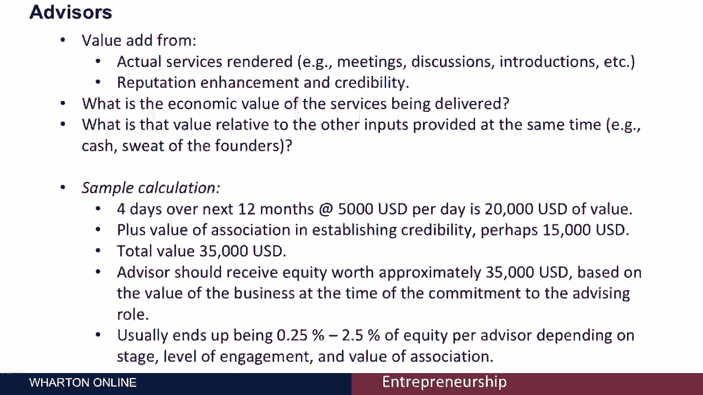

# 🧠 创业课程 P48：团队成员间的股权分配

在本节课中，我们将学习如何在创业团队的创始成员之间公平地分配股权。我们将理解什么是股权、如何通过“资本结构表”来呈现所有权，并探讨决定股权分配的关键因素：创意、汗水（劳动）和现金。课程最后会简要介绍如何为顾问分配股权。

***

## 📊 什么是股权与资本结构表？

上一节我们介绍了课程主题，本节中我们来看看股权的定义以及展示股权结构的工具——资本结构表。

股权指的是在新创企业中的所有权或利润权益。让关键团队成员分享企业所有权通常很有价值。这能激励团队创造价值，也是外部投资者的常见要求。同时，它允许企业用未来收益而非稀缺的现金来补偿团队。

为了清晰地展示股权分配，我们使用**资本结构表**。它是对公司股份及其持有者的核算。

以下是一个简化但典型的资本结构表示例：

```text
创始人股份：500,000股 (50%)
关键员工预留股份：100,000股 (10%)
期权池（未来员工）：100,000股 (10%)
外部投资者股份：300,000股 (30%)
总计授权股份：1,000,000股 (100%)
```

***

## 🔍 资本结构表详解

了解了基本构成后，本节我们来详细拆解资本结构表中各部分的决定方式。

### 外部投资者股份

分配给外部投资者的股份数量由两个因素决定：
1.  投资者投入的金额。
2.  投资前公司的估值（即“投前估值”）。

计算公式为：
**投资者持股比例 = 投资金额 / (投前估值 + 投资金额)**

例如，公司投前估值为70万美元，投资者投入30万美元。则投资后总价值为100万美元，投资者持股比例为 30万 / 100万 = **30%**。

### 期权池

期权池是为未来员工预留的股份，通常占已发行股份的10%左右。这是投资者的常见要求，以确保公司有资源吸引人才。在计算每股价值时，我们常使用“完全稀释”后的总股数，即假设期权池中的所有期权都已行权。

### 关键团队成员股权

分配给早期关键成员的股权比例由市场情况决定。为了吸引合适的人才加入初创团队，通常需要分配相当数量的股份。

***

## ⚖️ 创始人股权分配的核心原则

在明确了外部股份和预留股份后，核心问题是如何在创始团队内部分配那部分创始人股份。

决定分配的核心原则是评估每位创始人**为企业带来的资产价值**。这些资产主要分为三类：

1.  **创意与知识产权**：谁提出了最初的想法，并发展了相关的知识产权、产品设计或市场研究。
2.  **汗水（劳动）**：创始人在没有现金报酬的情况下，为企业付出的努力。其价值可参考该角色在市场上的薪资水平。
3.  **现金**：创始人自掏腰包投入的启动资金。

需要强调的是，**1美元现金的价值通常高于1美元“汗水”的价值**。原因有三：首先，创始人可能用业余时间工作，其价值低于全职市场薪资；其次，现金是税后收入，而汗水常按税前价值计算；最后，现金在初创期是最稀缺的资源。

***

## 📐 股权分配计算示例

基于上述原则，我们可以通过一个具体计算示例来理解分配过程。

假设有三位创始人：克莱尔、慧晶和桑杰。他们对公司的贡献估值如下：

| 创始人 | 创意估值 | 汗水（市场价） | 汗水（折现50%） | 现金投入 | 总贡献值 | 股权比例估算 |
| :--- | :--- | :--- | :--- | :--- | :--- | :--- |
| **克莱尔** | $100,000 | $120,000 | $60,000 | $400,000 | $560,000 | 56% |
| **慧晶** | $0 | $60,000 | $30,000 | $250,000 | $280,000 | 28% |
| **桑杰** | $0 | $60,000 | $30,000 | $150,000 | $180,000 | 18% |
| **总计** | $100,000 | $240,000 | $120,000 | $800,000 | $1,020,000 | 100% |

**计算说明**：
*   “创意估值”需由团队协商确定。
*   “汗水折现”反映了现金比汗水更值钱的逻辑，此处按市场价值的50%计算。
*   每位创始人的“总贡献值”是其三项贡献（创意折价 + 汗水折价 + 现金）之和。
*   **股权比例估算 = 个人总贡献值 / 所有创始人总贡献值之和**。

这是一种量化分配思路，实际分配还需结合团队谈判。

***

## ⚠️ 股权分配的实际问题与注意事项

完成理论计算后，在实践操作中还需注意以下几个关键问题：

以下是股权分配时常见的实际问题：

1.  **股权归属**：不应一次性授予全部股权。通常设置**归属期**（如3-6个月），若团队成员在归属期前离开，则无法获得全部股权。这避免了过早将股权给予不合适的成员。
2.  **税务影响**：在许多地区（如美国），获得股权可能产生即时纳税义务，即使未获得现金。策略之一是**尽早以极低价格授予股权**（此时价值低，税负轻），或授予**股票期权**（在行权时才可能产生税负）。
3.  **咨询专业人士**：股权结构和税务问题非常复杂，且因地区而异。务必咨询律师和会计师。

***

## 👥 顾问的股权分配

最后，我们来看看如何为提供帮助的顾问分配股权。

补偿顾问时应考虑两方面价值：他们提供的专业服务，以及他们为公司带来的声誉与可信度。

评估顾问股权价值的简化方法是计算其贡献的总经济价值。例如：
*   服务价值：4天 × $5,000/天 = $20,000
*   声誉价值：$15,000
*   总价值：$35,000

此价值可等价于$35,000的现金投资所应获得的股权比例。

实践中，顾问获得的股权通常在**0.25% 到 2.5%** 之间。具体比例取决于顾问的名气、参与程度和贡献阶段。

***



## 📝 本节课总结

在本节课中，我们一起学习了创业公司股权分配的核心知识：
1.  我们认识了**股权**的意义和展示工具**资本结构表**。
2.  我们掌握了创始人股权分配的三大基础：**创意、汗水与现金**，并理解了现金通常比汗水“更值钱”。
3.  我们通过示例学习了如何量化计算股权分配比例。
4.  我们了解了实际操作中的关键点：**股权归属机制**和**税务考量**。
5.  最后，我们简单探讨了如何为**顾问**分配股权。

合理的股权分配是创业团队稳定的基石，希望本课内容能帮助你更好地规划这一步。