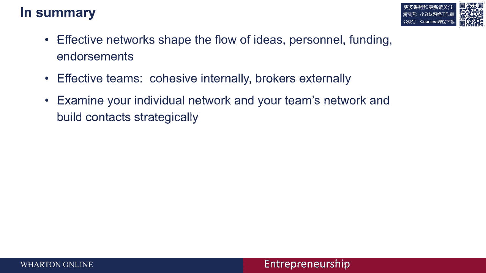

# 🧠 沃顿商学院创业课 P49：网络、创新与创业

在本节课中，我们将学习网络理论的基本原理，并探讨网络如何影响创新与创业。我们将从网络的基本概念入手，逐步分析网络多样性、经纪作用和信任这三个关键特征，并理解它们如何共同塑造创业机会与团队效能。

---

## 🌐 网络的基本概念与假设

网络可以理解为一组**行动者**（actors），他们通过某种**关系**相互连接，这种关系允许信息、资源或支持在其中流动。

当我们观察一个网络时，其结构（即行动者之间连接的模式与性质）会决定个体获取资源（如信息、推荐、背书或支持）的机会和能力。网络的结构会影响你创造机会、获取资源以及实现目标的能力。

**核心假设**：你所处的网络环境、关系的性质以及连接的整体模式，将决定你能否获得所需资源，并影响你引起注意和完成事情的能力。

---

## 🔍 高效网络的三大特征

接下来，我们将深入探讨高效网络的三个关键特征：**多样性**、**经纪**和**信任**。理解这些特征将帮助我们分析不同类型的网络模式及其对创业的影响。

### 1. 网络的多样性

多样性指的是你的联系人能为你带来的**知识或信息类型**是否丰富多元。

假设有两个人，他们维护着相同数量的联系人，但其中一人的所有联系人都提供同质化的信息（例如，都来自同一职能领域），而另一人的联系人则能提供多种不同类型的信息（例如，来自营销、研发、生产等不同部门）。后者因其网络的**知识多样性**更高，往往能获得更广泛的见解和创新的想法。

**知识多样性**是创新的重要源泉。这与经济学家约瑟夫·熊彼特的观点一致：创新常源于现有知识的新组合。

**如何评估与提升网络多样性？**
*   审视你现有的联系人网络，评估他们提供的信息类型是否足够多元。
*   思考如何通过加入新的社群、俱乐部或行业团体，来结识能带来不同知识和视角的新联系人。
*   例如，青年创业者参与创业加速器项目，一个重要原因就是能借此在多个领域建立广泛的网络连接。

### 2. 网络的经纪作用

经纪作用关注的是你在网络中的**位置**，以及你能否成为不同群体之间的“桥梁”。

考虑两个投入相同精力维护网络的行动者A和B。在A的网络中，其所有联系人也彼此紧密相连，形成一个“封闭”的圈子。而在B的网络中，其联系人彼此并不直接相连，B因此能通过他们接触到更多元、更间接的信息源。

**公式化理解**：若将直接联系人视为一度人脉，B因其网络的“结构洞”（Structural Holes），能接触到更多二度人脉，从而扮演了信息**经纪人**的角色。

研究发现，拥有B类“开放”网络的人更擅长产生创新想法。然而，拥有A类“封闭”网络的人，其团队内部往往协作更持久、认同感更强、更能聚焦共同目标。

**对创业团队的启示**：
*   理想的创业团队应在**内部**保持紧密联系（类似A网络），以确保团队凝聚力、目标一致和高效协作。
*   同时，团队每个成员应**对外**拥有开放、多元的网络（类似B网络），为团队带来外部的、互补的知识与资源。
*   研究表明，这种“内聚外联”的团队结构往往能实现最高绩效。

### 3. 网络中的信任

信任决定了网络连接能否被有效“激活”。网络连接可分为**强关系**和**弱关系**。

*   **强关系**：基于长期互动、多重联系（如既是同事又是朋友）建立，蕴含高度信任。在这种关系中，你更可能寻求并获得实质性帮助，也愿意回报对方。
*   **弱关系**：多为偶然结识或一次性互动，信任程度较低，难以激活以获取深层支持或关键资源。

**核心要点**：虽然理论上可以通过多步联系（如六度分隔）接触到任何人，但**两步之外**的联系路径往往难以有效激活。因此，建立和维护基于信任的**强关系**，对于真正利用网络价值至关重要。

对于创业团队而言，关键成员之间的连接（图中粗线所示）应是强关系，以确保网络能切实传递我们讨论的各种益处。

---

## 📝 总结与行动指南

本节课我们一起学习了网络理论的核心概念及其在创业中的应用。

**核心总结**：
1.  **网络结构决定资源获取**：你的网络位置和连接模式深刻影响你获得信息与支持的机会。
2.  **追求知识多样性**：构建能提供多元信息和视角的联系人网络，是激发创新的关键。
3.  **平衡内聚与外联**：创业团队内部需要紧密协作（封闭网络），对外则需要成员扮演经纪人角色，引入外部资源（开放网络）。
4.  **投资于强关系**：基于信任的强关系网络比庞大的弱关系列表更有价值，是激活网络支持的基础。

**行动建议**：定期审视并战略性地构建你的个人网络及团队的整体网络。确保团队内部团结一致，同时积极寻求与外部建立多样化的、可信赖的连接。