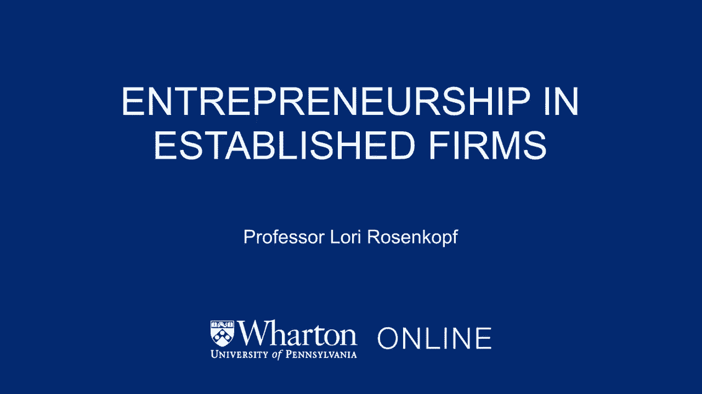
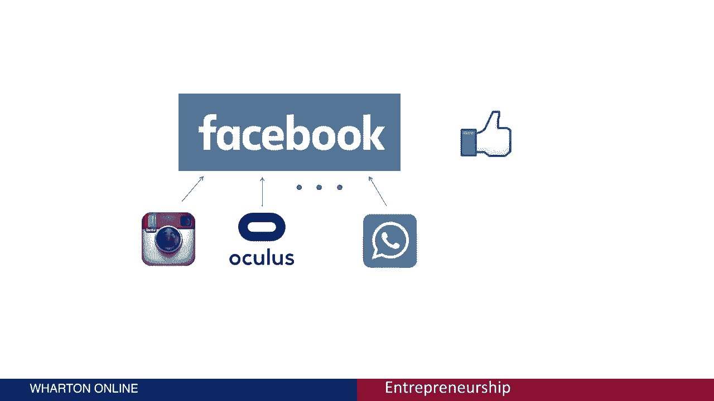

# 创业课程 第五讲：老牌企业中的创业精神 🏢

在本节课中，我们将探讨一个核心问题：老牌企业能否像初创公司一样具备创业精神？我们将分析老牌企业面临的挑战与机遇，并介绍它们为追求创新而采取的一系列策略。

---

## 老牌企业的创业困境 🤔

一方面，许多从业者和学者认为，本课程中提出的创业概念与技术同样适用于大型的、已成立的公司，甚至可能更为重要。这些公司的经理们同样需要评估盈利能力、进行原型测试、获取并保留客户。

另一方面，大众媒体和学术文献中有大量研究表明，新企业和年轻公司比老牌公司更灵活，它们有能力从根本上改变行业和技术。这意味着老牌公司可能难以抓住新的机会，并最终失去市场主导地位。

答案是两者都成立。老牌企业既有挣扎，也有机会。在本模块中，我们将研究为什么老牌公司会变得具有惯性并与创新作斗争，同时，我们也将探讨它们用来开发和追求新机会的实践方法。

---

## 相关理论与概念 📚

在大众媒体和学术文献中，关于老牌公司经理如何创业有大量关注。学者们使用了许多不同的术语来描述这种活动。如果你想深入了解，可以搜索以下术语：
*   **两手灵巧的创新**：指公司同时进行探索新机会和开发现有业务的能力。
*   **动态能力**：指企业整合、构建和重新配置内外部资源以适应快速变化环境的能力。

我们稍后会详细讨论这些概念。

---

## 机会空间与创新类型 📈

下图展示了一个公司的机会空间。已成立的企业在寻找机会时，需要决定两个维度：

*   **X轴：创新类型**
    *   **增量创新**：在现有技术基础上进行改进。
    *   **间断（颠覆性）创新**：带来根本性差异的技术。
*   **Y轴：目标市场**
    *   **现有市场**：面向公司当前的客户群。
    *   **新市场**：开拓全新的客户群体。

**举例说明**：
*   **间断创新**：最初的 **`iPhone`** 是一项颠覆性创新，它从根本上改变了移动设备的功能。
*   **增量创新**：**`iPhone 6S`** 则属于增量创新，它增加了一些新功能，但主要建立在已成熟的技术之上。

老牌公司面临着整个机会空间，它们有很多想法，但资源有限，并且对新机会有收入门槛要求。公司规模越大，这个门槛通常也越高。

因此，许多老牌公司最终被困在图的**左下角**——专注于为现有客户提供增量创新。这虽然能带来稳定收入，但为了长期生存，公司也需要向**绿色圆圈之外的空间**移动，即探索将全新技术带入新市场或现有市场。

这就是学者们强调在已成立公司中**平衡探索与开发**、成为**“两手灵巧”**组织的原因。

---

## 颠覆性创新理论 ⚡

关于老牌公司为何具有惯性的另一个著名观点来自克莱顿·克里斯滕森的“颠覆性创新”理论。

*   **X轴**表示时间。
*   **Y轴**表示产品或服务的性能。
*   **绿线**代表客户不同层次（高、中、低）的性能需求。
*   **上方红线**代表市场主导者（老牌公司）通过**持续创新**提供的产品性能。它最初满足低端需求，随后性能提升，甚至超过了高端客户的需求。
*   **下方红线**代表**颠覆性技术**进入市场。它最初性能较低，无法满足主流客户，但随时间不断改进，首先侵蚀低端市场，最终性能足以满足甚至超越主流客户需求，从而导致老牌公司失败。

克里斯滕森使用的经典案例是**微型轧钢厂**对大型综合钢铁公司的颠覆。

---

## 老牌企业的创新策略 🛠️

接下来，我们关注老牌公司如何培育创业精神。策略主要可分为三类：内部发展、战略合作与收购。

### 内部发展：激发组织内创新

这关乎你要求员工和组织做什么。最简单的方法是进行**文化干预**，即提供专门用于探索的时间。
*   **“15%时间”政策**：例如，**`3M`** 公司曾推行此政策，允许员工将15%的工作时间用于自主探索新想法。**`Google`** 后来也采用了类似的“20%时间”政策。这并非精确计算每日时间，而是赋予员工追求创新项目的自由。
*   **休假研究**：许多公司如 **`IBM`** 和 **`LinkedIn`**，为员工提供带薪休假来专注于新想法的开发。
*   **设立独立研发部门**：许多大公司通过建立独立的研发（R&D）实验室来促进长期和基础性创新。例如，微软、雅虎等都有强大的研发设施。**`Google X`**（现为 **`Alphabet`** 旗下的 **`X`**）则以追求突破性的“登月”项目而闻名。

### 战略合作：借助外部力量

公司可以通过与其他企业合作来获取市场、技术等资源，创造更多机会。
*   **技术合作**：例如，**`特斯拉`** 与 **`丰田`** 合作，为丰田的电动汽车提供电池技术等部件，实现互利。
*   **生态合作**：**`特斯拉`** 还与 **`Airbnb`** 合作，打造电动汽车共享充电网络。Airbnb房东可以安装特斯拉充电桩作为房源特色，服务特斯拉车主租客。
*   **企业风险投资**：许多大公司设有企业风投部门，对初创公司进行战略性股权投资。这与传统风投不同，其投资更侧重于与母公司未来产品和服务相关的技术，常作为未来收购的桥梁。

### 收购：直接获取资源与控制权

通过收购另一家公司，老牌企业可以完全获得其技术、团队、客户等资源。
*   **历史案例：AT&T 与移动通信**
    *   AT&T 在1992年对 **`McCaw Cellular`** 进行股权投资，以进入无线电话市场。
    *   1994年，AT&T 全面收购了 McCaw Cellular。
    *   经过一系列行业整合与并购，这部分业务最终演变为今天的 **`AT&T`** 移动服务。这是一个老牌公司通过收购成功进入新领域的例子。
*   **近期案例：Facebook 的收购策略**
    *   Facebook 已进行超过50次收购，以保持创新。
    *   著名收购包括：以10亿美元收购 **`Instagram`**（整合技术、消除潜在对手）；以约25亿美元收购 **`Oculus VR`**（布局虚拟现实）；以190亿美元收购 **`WhatsApp`**（巩固通讯市场地位）。

> **提示**：你可以通过维基百科等渠道轻松查询任何上市公司（如Facebook）的收购历史列表，了解其收购目标、金额和原产国等信息。

---

## 总结 📝

本节课中，我们一起学习了老牌企业在创新方面面临的挑战，特别是其固有的惯性。我们通过“机会空间”模型和“颠覆性创新”理论理解了这些挑战的根源。同时，我们也系统地探讨了老牌企业为克服惯性、培育创业精神所采取的三类主要策略：**内部发展**（如文化政策、独立研发）、**战略合作**（如技术联盟、企业风投）以及**收购**。这些策略帮助老牌公司在利用现有优势的同时，积极探索新的增长机会。