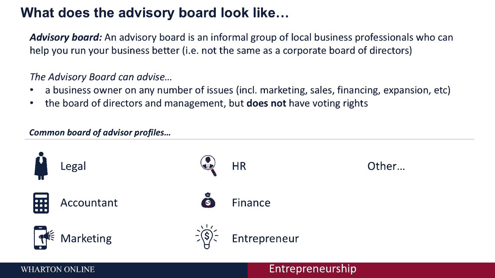
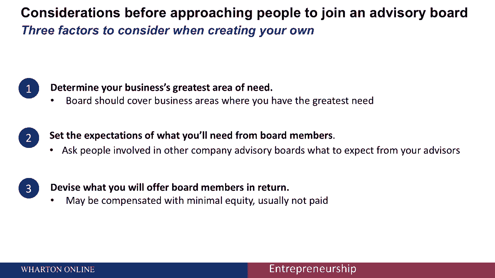
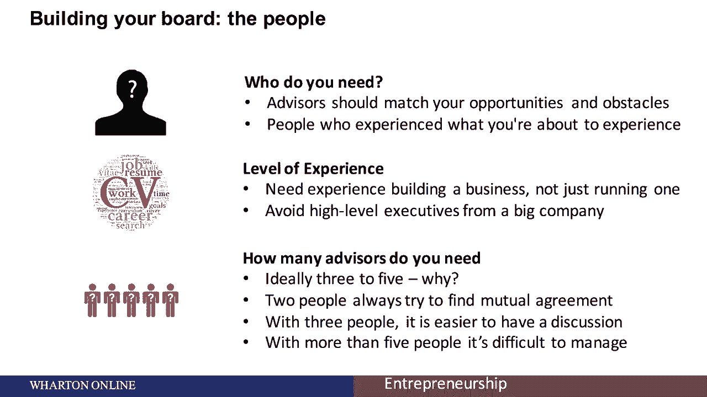
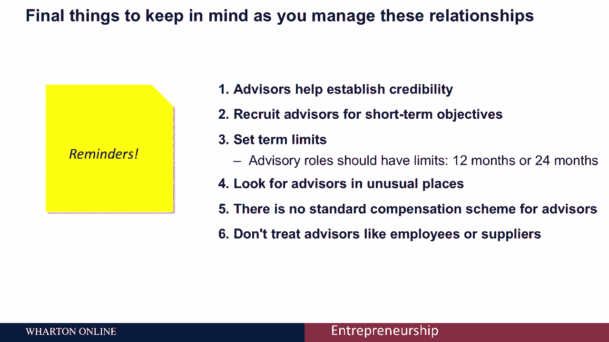
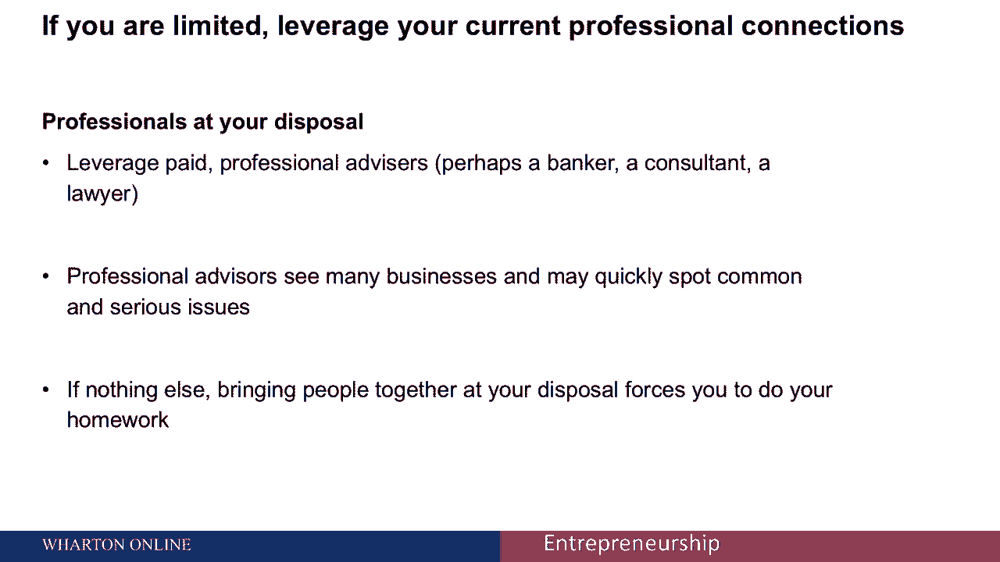
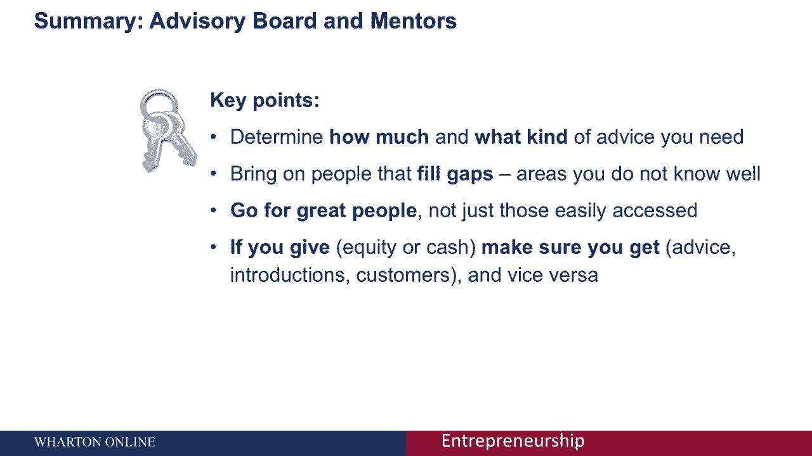

# 🧠 沃顿商学院创业课 P50：导师、顾问与顾问委员会

在本节课中，我们将学习创业过程中导师、顾问与顾问委员会的区别、作用以及如何有效地组建和管理他们。这些角色能为你的创业之路提供宝贵的指导和支持。

---

## 导师、顾问与董事会的区别

我们今天讨论的重点是导师和顾问，这与董事会不同。

董事会通常是在创业的较晚阶段成立的，通常是在你筹集第一轮风投资金的时候。

让我们先来看看导师。导师是帮助你成长的亲密朋友。你向他们寻求的建议通常既是专业的，也是个人的。导师在帮助你方面没有经济上的好处，但他们希望看到你成功。

让我们转向顾问。导师往往更关注你个人，而顾问通常更关注你的公司。在公司的早期阶段，投资者和企业家布拉德·菲尔德说：“顾问提供服务以换取你公司的一部分，而导师只是问‘我能帮你什么忙’。”

你也可以组建一个顾问委员会。顾问委员会是一群你选择来帮助你的顾问，就一些业务问题向你提供建议。但不像董事会，他们无权就商业事务进行投票，只是为了帮助你更好地经营你的业务。

---

## 组建顾问委员会前的关键考虑因素

在邀请他人加入顾问委员会之前，有许多因素需要考虑。

以下是组建顾问委员会前需要考虑的几个关键点：

1.  **确定核心需求领域**：首先确定你的企业最需要的领域。理想情况下，一个顾问委员会将始终如一地提供他们的知识和专长，在你最需要的业务领域，或者你知道得最少的领域。例如，如果你擅长销售和市场营销，你会想创建一个在金融和法律方面有很强背景的委员会，以确保他们帮助你思考你最薄弱的领域的问题。
2.  **明确期望与职责**：第二，设定期望并投入一些时间。概述你的顾问委员会将负责什么，他们有什么权力。他们是否在财务或商业决策中有发言权？或者他们的职责范围是有限的？
3.  **设计合理的回报机制**：第三，想想你会给顾问什么回报。一个伟大的顾问会对你的业务产生巨大而持久的影响。想想你能给他们什么回报，如何通过这个委员会改善他们的生活和事业。通常，给予很小比例的股权是很常见的。在单独的讲座中，你将具体了解如何确定什么数量的股权是最合适的，这取决于你业务的具体情况。

---

## 如何选择与构建你的顾问委员会

当你考虑构建你的顾问委员会时，想想会在这个委员会里的人。

你需要谁？顾问应该匹配你的机会，以及你将要面临的障碍。想想他们的经验水平，你需要既有创业经验又有经营经验的人。你还想考虑一下你需要多少顾问。

理想情况下，你希望有三到五个人。

---

## 吸引、补偿与管理顾问委员会

当你考虑吸引和补偿你的顾问委员会时，可以遵循以下步骤：

1.  **如何吸引他们加入**：首先，想想怎么让他们上船。建立一个两到三页的招股说明书，描述你的业务框架。与未来成员的初步讨论更具探索性，让他们在报酬方面给出自己的想法。
2.  **关于报酬的考量**：报酬有时很棘手，也肯定有争议，所以要警惕那些只追求金钱的顾问。提供一些补偿可能是合适的。我们将在另一堂课中详细讨论这个问题。
3.  **会议结构与后勤**：当你思考会议的结构和操作时，想想会议后勤。通常你想一年见两到四次面，这些会议每次应限制在三小时以内。当你组织对话时，把注意力集中在几个核心战略议题上，以确保你涵盖了最大的问题领域。

---

## 管理顾问关系的要点

最后，当你管理这些关系时，要记住以下几点：

*   **建立信誉**：顾问可以帮助你建立信誉，他们带着他们的名声。
*   **招聘目标**：为短期目标和长期目标招聘顾问。
*   **任期限制**：这些顾问角色应该有限制，通常是十二个月或二十四个月。
*   **寻找渠道**：在不寻常的地方寻找顾问。
*   **薪酬非标**：顾问没有标准的薪酬计划。
*   **尊重关系**：不要像对待员工或供应商一样对待顾问。记住他们给了你宝贵的时间和建议。

---

## 备选方案：专业顾问

如果你不能把必要的时间和资源投入到一个完整的、成熟的顾问委员会，你可以利用付费专业顾问作为其他选择。

例如，银行家、咨询顾问和律师。专业顾问看到许多企业，可以帮助你快速发现常见问题。如果没有别的，把人们聚集在一起听候你的调遣，会迫使你做功课，更深入地思考你的业务。

---

## 总结

本节课中，我们一起学习了导师、顾问与顾问委员会的核心区别与价值。

正如我们所看到的，你需要确定你需要多少和什么样的建议。引进那些能帮助你填补空白、弥补你不太了解的领域的人。追求那些优秀的人，而不仅仅是那些容易获得的。记住，如果你给予股权和现金作为报酬，这是一种付出，确保你得到了相应的建议、人脉和客户作为回报，反之亦然。