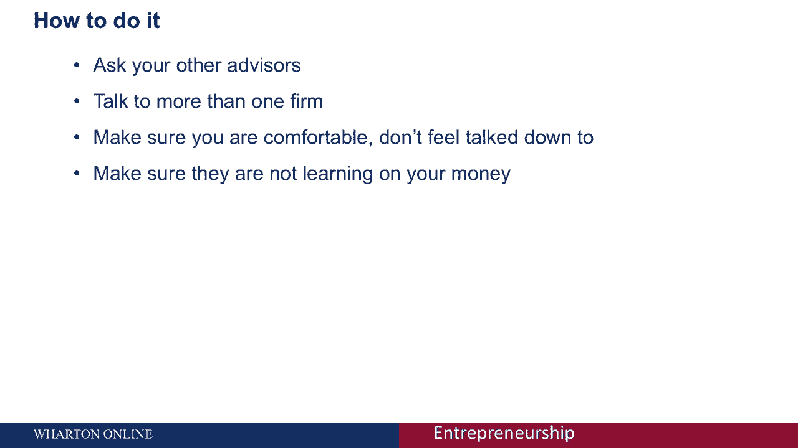

# 【沃顿商学院】创业 四部曲：发现机会、建立公司、增长战略、融资和盈利 - P51：[P51]03_3-2-professional-services-lawyers-and-accountants - 知识旅行家 - BV19Y411q713

会计师和律师，尤其是律师，通常是你与创业公司合作的第一批专业服务，人们试图避开他们，他们避开他们是有充分理由的，这不是对律师的冒犯，但通常不被认为，你有的最有趣的互动是合法的，和，更重要的是。

在法律方面往往很昂贵，律师按小时收费，通常收费相当高，当你的创业公司最缺钱的时候，或在其最早阶段，所以很多人会继续成立他们的公司，使用在线网站来这样做，并处理他们所有的创建协议，使用格式协议。

这不一定是个坏主意，但这样做是有危险的，你早期做出的选择，和成立协议会对以后你如何认识到，确认税收，以及如何确认收入，和，更重要的是，你获得资金的方式，风险资本家和天使投资者可能会考虑你的公司。

所以你想避免陷入麻烦，在你的组织的早期与律师交谈通常是有利的，这并不意味着你必须用它们来做所有的公司组建材料，但对于快速增长的初创企业来说，你经常可以找到有兴趣在早期与你合作的律师，推迟欠你的部分钱。

或者做一些其他的交易来帮助你支付一些早期的成本，这些早期的对话可以为你以后节省很多工作，真正重要的不仅仅是使用，你知道的，你的朋友或你的表弟或你用来处理私人事务的律师，因为你真的想确保和你一起工作的人。

有与初创企业合作的经验，最好是在你的行业内有经验，在具体考虑律师时，你需要想想一个以前做过很多次事情的律师，并了解上下文，所以创业公司有很多复杂的法律问题，其中一些问题对任何律师来说都很容易。

其中一些非常微妙，我们有很多经验，为什么一种解决方案在这样或那样的情况下可能有效，所以具体地说，你对担心公司组建之类的事情感兴趣，我们应该是什么样的公司，我们应该是有限责任公司还是C公司。

围绕这些有很多问题，取决于你是否会有收入，你在思考这些问题时赚钱的状态是重要的，创始人协议，我们在这里的其他讲座中讨论过，关于如何在贵公司建立铸造协议，以及如何处理这些问题，知识产权，当然。

如果你需要申请专利，你需要担心律师，但即使是像保密协议这样的事情也可能很重要，由律师来执行，关于雇用和签订雇用协议的首要问题，尤其是解雇人，并与资助者合作，所以会有一个与筹集资金相关的谈判。

你需要一个律师来检查条款，所以这些都是需要与律师有预先存在的关系的事情，即使你不在这些点中的每一个都使用它们，它可以帮助你尽早建立这种关系，所以当情况危急时，你可以去找人。

你也想和律师一起思考一个关键问题，你想让他们充当顾问吗，所以一些律师有创业经验，可以帮助充当顾问，帮助你做有用的介绍，其他人只是为了生意，您可能需要考虑这些不同方法的有效性，并做出个人决定。

关于你想在账户方面做哪种律师，在你公司的早期，会计师通常不会那么挑剔，尤其是在你赚到收入之前，你经常可以通过与律师交谈对会计师有一个很好的了解，或者通过创业网络，你想开始考虑得到一个真正的解释。

当你的簿记变得复杂时，当它开始占用你太多宝贵的时间，或者你开始有大量的收入需要处理或者复杂的员工，你可能想在这个过程的早期和会计师一起工作，如果你认为你的税务问题会很复杂，你在担心公司的结构。

这将如何影响投资意愿，或者如果你对财务一点也不舒服，会计是外包材料的好方法，同时，律师和会计都不会为你解决问题，你最终需要对自己的公司负责，您需要了解组织基础上的财务模型。

你需要了解你的法律问题如何影响你公司的实际运作，所以你不能把你所有的职能都外包给这些人，您仍然需要保持对自己组织的控制，你最清楚，你会最了解这些问题，但他们可以充当关键的顾问和重要的观点。

你是如何处理让律师或会计加入进来的细节的，首先问问你的其他顾问，或者和你一起工作过的人，网络中有企业家吗，你与之相关的，谁可能会向你推荐某人，你可能还想和不止一家公司谈谈，当我在创业的时候。

我选择律师主要是基于真正伟大的咖啡机，他们有，而不是实际上面试了许多不同的律师事务所，结果不是一个错误，但我可能应该和更多的人谈谈，所以去和多家律师事务所谈谈，第一次咨询或谈话通常是免费的。

你也可以从他们那里得到一些有用的信息，他们认为你的初创公司做得对或错的事情，所以无论如何，这是一件有用的事情，然后确保你和别人在一起很舒服，别觉得被贬低了，一个好律师没有理由让你觉得。

我不知道你在说什么，所以要确保你在进行对话，你明白别人在说什么，最后确定你是和律师还是会计一起工作，你不是，他们不是用你的钱学的。

所以你的工作，他们正在做的是基于他们以前所做的工作，他们并不是第一次在你的行业里试图了解初创企业，第一次因为和你一起工作，所以他们可能很挑剔，团队中的关键球员，为了你的公司，但他们不一定是关键因素。

谁会带你去未来，所以早点和他们谈谈，确保你知道律师和会计能为你做些什么。
