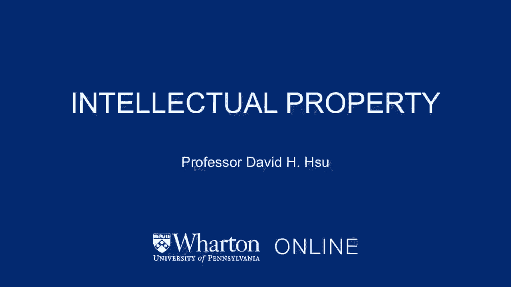
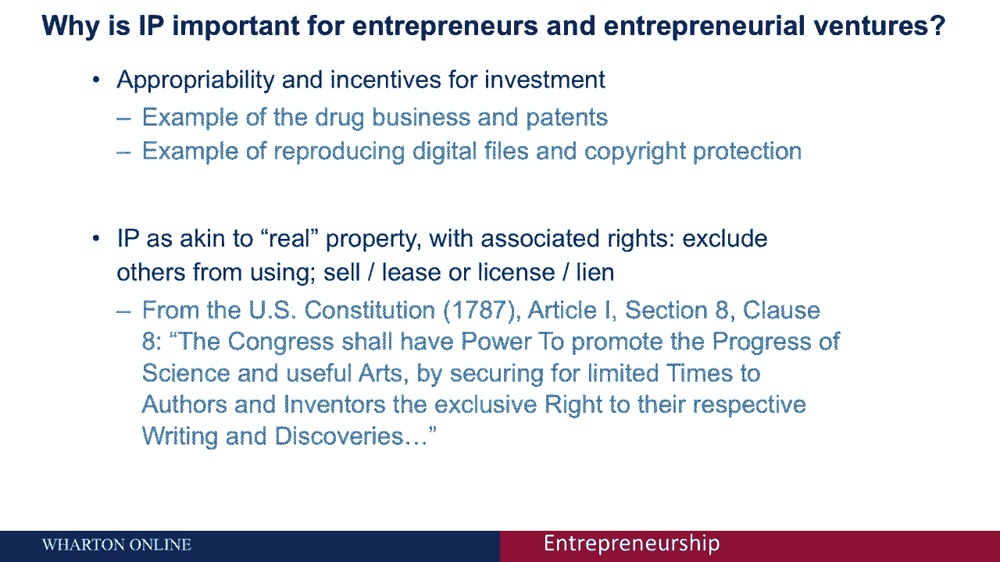
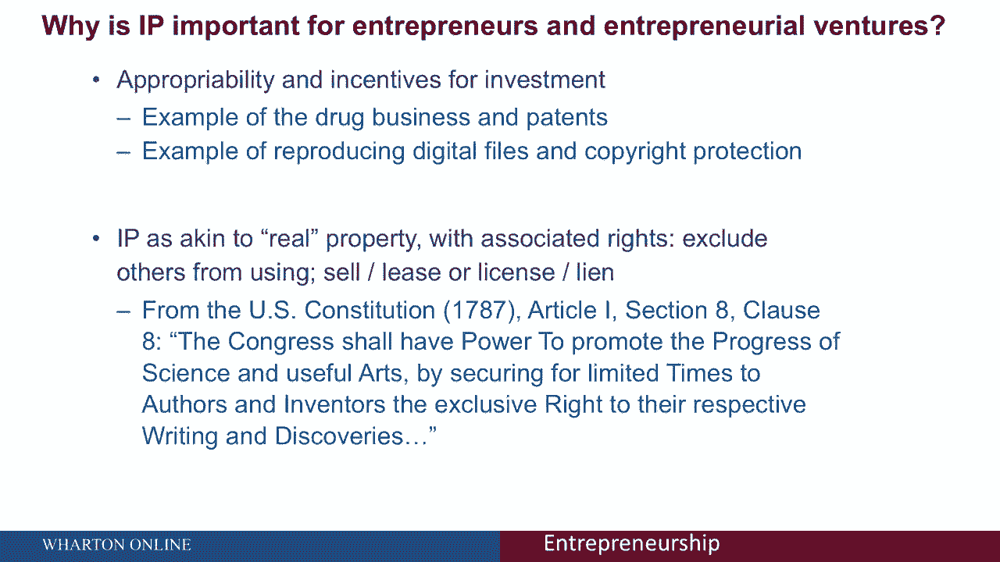
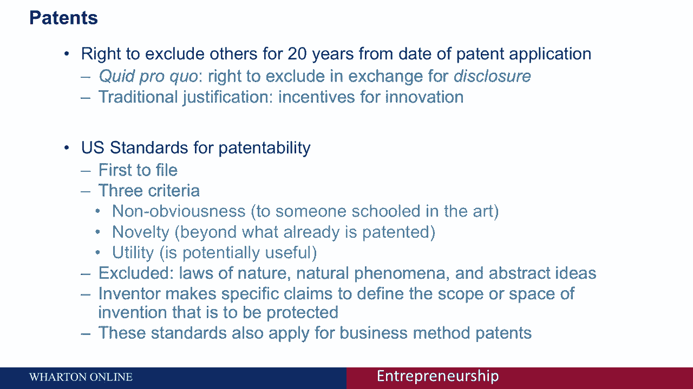
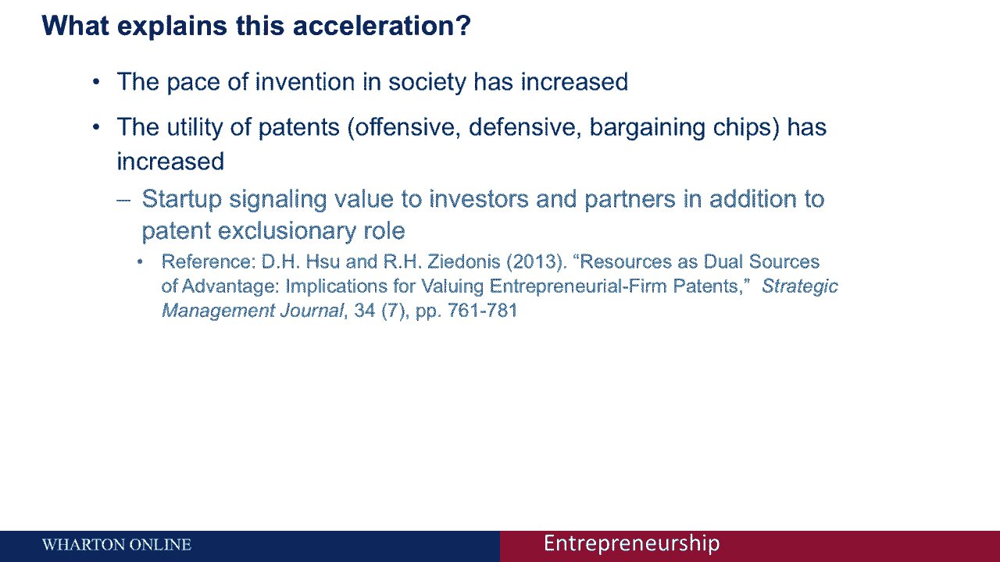
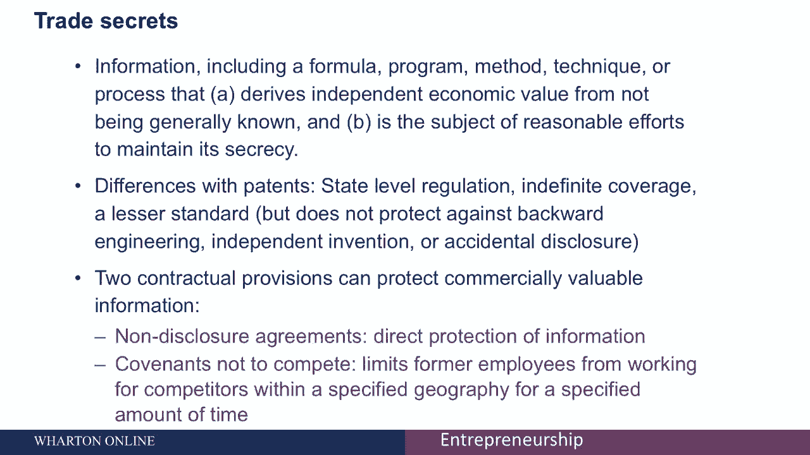
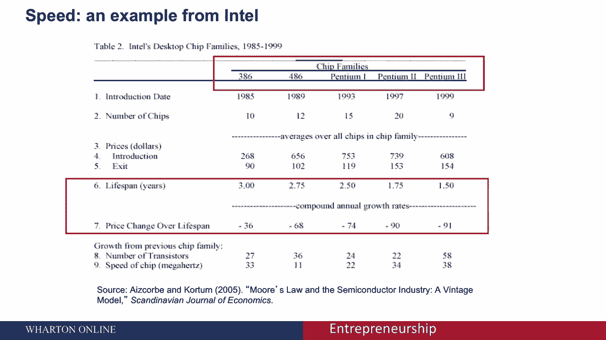

# 📚 沃顿商学院创业课 P52：知识产权概述

在本节课中，我们将学习知识产权（IP）的基本概念、主要形式及其对创业者的重要性。知识产权是保护创新成果的法律工具，理解它有助于你保护自己的创意，并在商业竞争中建立优势。

知识产权之所以重要，其传统理由是为了激励创新。政府通过授予一定期限的垄断权，以换取创新者公开其发明细节，从而促进社会整体技术进步。

---

## 🧠 知识产权为何重要？

上一节我们提到了知识产权激励创新的根本目的，本节中我们来看看其具体作用。

知识产权赋予创新者在一定时间内对其创意的专有使用权。这主要有两个目的：
1.  **激励投资**：给予创新者时间以收回其在时间、精力和资金上的投入。
2.  **促进披露**：作为交换，创新者需详细公开其发明（如专利），使社会能在此基础上继续进步，避免重复发明。

在数字时代，复制成本极低，因此像**版权**这样的保护形式对于激励歌曲、软件等创造性作品的产生至关重要。

---

## 🏠 知识产权的性质

认识到知识产权的性质，有助于我们更好地利用它。知识产权类似于不动产。

你可以像买卖房屋一样**出售**专利权，也可以像出租房屋一样**许可**他人使用你的知识产权。你保留所有权，但授予他人使用权。这种类比有助于理解知识产权的交易和运营方式。

美国宪法早在1787年就包含了保护知识产权的条款，旨在激励作者和发明家披露其成果以换取法律保护。

---

## 📋 知识产权的形式

以下是知识产权的主要形式，我们将逐一进行介绍。

知识产权主要有三到四种类型：

1.  **专利**：允许发明者在特定期限内（如20年）排除他人使用其发明。期限结束后，发明进入公共领域。例子：轧棉机、灯泡。
2.  **版权**：允许作者控制其创造性作品（如书籍、音乐、软件代码）的复制和分发。保护的是**表达形式**而非思想本身。
3.  **商业秘密**：允许公司保护具有商业价值且不为公众所知的信息。只要保密措施得当，保护期可以是无限的。例子：商业计划、肯德基的秘制酱料配方、独特的生产流程。
4.  **速度（作为非正式保护）**：在信息更迭极快的行业（如半导体），有时依靠快速创新和进入市场比寻求正式法律保护更有效。

---

## ⚖️ 专利详解

上一节我们概述了知识产权的形式，本节中我们深入探讨其中最重要的一种：专利。

在美国，专利赋予权利人自申请日起**20年**的排他性权利。其核心逻辑是：**鼓励披露 → 给予保护期以收回投资 → 促进社会累积进步**。

专利遵循“先申请制”。一项发明要获得专利，必须满足三个标准：
*   **非显而易见性**：对该领域普通技术人员而言不是显而易见的。
*   **新颖性**：相对于已有技术是新的。
*   **实用性**：必须有实际用途。

**自然规律**（如热力学定律）、**抽象概念**和**自然现象**不能申请专利。但**经人工改造**的事物（如转基因生物、新植物品种）则可以。

专利申请必须包含明确界定发明范围的**权利要求**。商业方法（如亚马逊的“一键下单”专利）和新的算法也可以申请专利。

数据显示，专利的授予速度在加快，这可能源于社会创造力提升，或专利作为竞争工具、谈判筹码的价值日益凸显。

对于创业者，专利不仅是防御工具，也是向投资者展示**差异化优势**和**技术壁垒**的重要信号。

---

## 🤫 商业秘密详解

与专利的公开换保护不同，商业秘密的核心在于“保密”。本节我们来看看这种保护形式的特点。

商业秘密保护的是能为企业带来竞争优势的保密信息。它与专利有几个关键区别：
*   **管辖级别**：主要由州法律管辖，而非联邦法律。
*   **保护期限**：只要信息保持秘密，保护可以**无限期**持续。
*   **获得方式**：不能阻止他人通过**独立发现**、**反向工程**或你**无意披露**后获得该信息。

作为持有者，你必须采取**合理的预防措施**来保护商业秘密。法律工具可以帮助你，但前提是你自己要先做好保密工作。

以下是实现商业秘密保护的重要合同工具：
*   **保密协议（NDA）**：在向他人披露敏感信息前签署的法律合同，约束对方不得泄露。
*   **竞业禁止协议**：限制前雇员在一段时间内为竞争对手工作或创办竞争业务，以防止商业秘密被直接带入竞争对手公司。

---

## ⚡ 速度：非正式的保护策略

在某些领域，正式的知识产权保护可能并非最优策略。本节我们探讨“速度”作为一种替代或补充手段。

在技术迭代极快的行业（如半导体），知识的商业寿命非常短。以英特尔芯片为例，一个芯片系列的生命周期可能只有18个月，其价格在此期间会暴跌。

在这种情况下，依靠**快速创新**、**持续推出新品**和**迅速占领市场**所带来的领先优势，其价值可能远超耗时申请专利或费力维护商业秘密。因为当竞争对手复制时，你的下一代产品可能已经面世。

---

## 📝 总结

本节课中，我们一起学习了知识产权的核心概念与主要形式。

我们了解到，知识产权（包括专利、版权、商业秘密等）是保护创新、激励投资的重要制度。对于创业者，需要根据自身业务特点（如技术迭代速度、创新类型）选择合适的保护策略：是利用专利建立壁垒，还是依靠商业秘密长期保护核心配方，亦或是在快节奏行业中凭借速度取胜。理解这些工具，能帮助你在创业路上更好地保护自己的创意与成果。