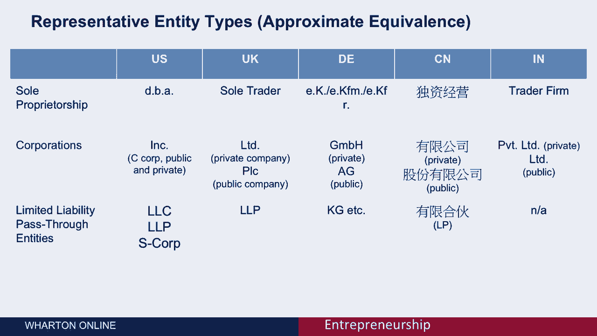

# 【沃顿商学院】创业 四部曲：发现机会、建立公司、增长战略、融资和盈利 - P53：[P53]05_3-4-summary-legal-forms-of-the-enterprise - 知识旅行家 - BV19Y411q713

这节课是关于企业的法律形式，当我最近访问伊斯坦布尔时，我从这里展示的鱼面包的家伙那里买了一个三明治，几乎可以肯定，这位企业家是以通常所说的独资企业的形式经营的，意思是他和他的生意没有区别。

所有的钱都在他的口袋里进进出出，他可能有一个与他的活动有关的支票账户，但他没有单独的法律实体。

对于这个星球上的大多数新企业来说，这可能是真的，他们是独资企业，但我们将在本届会议上考虑替代方案，以及为什么你可能会被激励做一些事情而不是作为一个独资经营者经营。

这是另一个名为Sastop和Saw的公司的例子，停止使桌子锯，他们的好处是如果你不小心把手指伸进锯子里，它不会切掉你的手指，它会在毫米内立即停止刀片，现在，我想让你反思一下你可能面临的一些问题。

作为企业家，如果你想继续做生意，作为独资业主看到停止，你将面临的一个关键问题是法律责任，所以让我们想象一下，有一天，由于某种原因，这不起作用，有人在独资企业下切掉了自己的手指。

遭受这些损害的人可以起诉你，也可以亲自起诉你，也许拿走你所拥有的一切，所以，创建单独法律实体的一个关键目的，是将实体的责任限制在实体本身，而不是对你个人。

围绕sastop的第二个问题是它可能需要一些外部投资，为了成长和成功，事实上，它确实有外部投资，几乎总是外部投资者会要求你的企业是一个独立的法律实体，因为他们想知道他们拥有什么所有权。

以及围绕新业务的整个法律体系，围绕形成新的实体在一定程度上建立了，这样你就可以分配利润利益或企业的价值，对他人的公平，包括投资者，做独资企业以外的事情的第三个原因，你经常想为你的经理和员工创造激励。

所以你想把利润分配给他们，公司权益或股份，要做到这一点，你真的需要股票机制和一个新的法律实体，因此，这些是在创业中形成一个新的法律实体的主要动机，现在我想说得很清楚，围绕新业务的法律差异很大。

根据你的管辖范围，根据你的地理位置，按国家甚至按国家内部的州，所以你真的必须咨询律师，我怎么强调都不为过，你不能自己做这件事，你真的必须咨询律师才能把这件事做好，根据您的位置和管辖范围的详细信息。

让我给你一个感觉，这涉及到一个相对简单的新业务的合并，那是创始人唯一拥有的，并且没有任何外部投资，可能会产生大约1000到5000美元的法律费用，为了建立新的合资企业，这可能是你可以期望花的钱。

如果你需要从外部投资者那里筹集资金，这通常需要大量资金，额外法律费用，风险投资的律师费通常在1万到5万美元之间，如果你有一个机构投资者，他们会要求与投资相关的大量法律保证，现在，好消息是。

许多专门从事新企业的律师，我习惯于和那些没有很多钱的公司打交道，他们才刚刚开始，他们通常会推迟或打折他们对创业公司的费用，经常推迟付款，直到收到来自外部的第一轮融资，我想指出的最后一件事是。

跨境问题特别具有挑战性，所以当你如果你是，例如，a u，A：A：A：计划在中国销售产品的公司，这可能很有挑战性，如果您没有使用中国的中介作为您的分销伙伴。

所以你真的需要咨询一个在这些十字架上有专业知识的律师，边境交易，有许多不同的法律形式，具体情况因国家而异，所以我不可能把他们都描述出来，拥有，说，那个，通常有两个主要的。

区分你在世界各地不同法律形式中看到的属性，首先是收入是如何纳税的，两个主要的选择是实体本身被征税，另一种选择是，实体通过其收入，将其利润转给实体的所有者，他们纳税，然后在通过的收入上，当然啦。

单独征税的实体的缺点，那可能会导致双重课税，所以公司可以先纳税，然后可以向股东分红，然后他们将反过来为股息纳税，因此导致双重征税，这就是为什么在大多数国家，在大多数司法管辖区都有一个所谓的通过实体。

允许公司将其收入转嫁给所有者的一种商业形式，因为他们只为此纳税一次，第二个区别是在不同的法律形式之间经常做的，股票是否在公开市场交易，或者公司是否完全由私人拥有，所以我想做的是向你展示。

五个不同区域的一些代表性实体类型，当然，我们不可能覆盖世界上所有的地区，但这给了你一种相对等价物的感觉，不同司法管辖区不同类型实体的近似等同物，在不同的地理区域，我在这里展示了三种类型的实体，独资。

这就像鱼，面包，盖伊，通过实体与公司与有限责任的区别，通过实体是围绕税收的区别，公司通常在实体一级征税，然后在股东层面，那是他们的两倍税，和有限责任通过实体只征税一次，它们只由利润利益的最终所有者征税。

所以在美国，这些不同类别的标准名称是独资业主被称为独资业主，但他们通常有一个叫做DBA或做生意的东西，所以鱼面包的家伙，如果他位于美国，实际上可以打电话给他的企业，鱼面包男。

他实际上可以得到一个支票账户，他可以用在他的名片上，这叫做DBA，可以向政府注册，但它没有给予任何法律保护，它不允许你将利润利益分配给其他人，而不是你自己，在美国。

你通常会看到公司只是用缩写Inc来标记，意思是合并的简称，i，c，美国时期，Inc适用于公众拥有的两家公司，股票在公开市场交易，在股票市场上，和私人控股公司，他们都是所谓的C军团在美国，然后在美国。

通过实体传递的有限责任通常称为有限责任公司，也有LLPS和S军团，但它们现在不太常用了，更典型的是，你会在LLC中看到，这些是你在美国看到的典型类型，我不会详述其他实体的所有细节。

但实际上每个国家都有类似于这三类法律实体的，虽然有些国家没有过境实体，例如，印度没有过境实体，这和美国的有限责任公司完全一样。

所以你通常需要组建一个法律实体，你通常这样做是为了限制你的责任，以便该实体本身可能负有责任，对于任何，可能对供应商或客户造成的损害，而不是你个人，其次，法律实体给你货币，通常是公司的股份。

为您的团队成员和员工提供激励，最后，法律实体通常是外部投资的要求，所以出于这些原因，你通常需要成立一个法律实体，法律实体的确切类型将取决于你希望如何对待税收，你居住在什么法律管辖区，对于这些细节。
