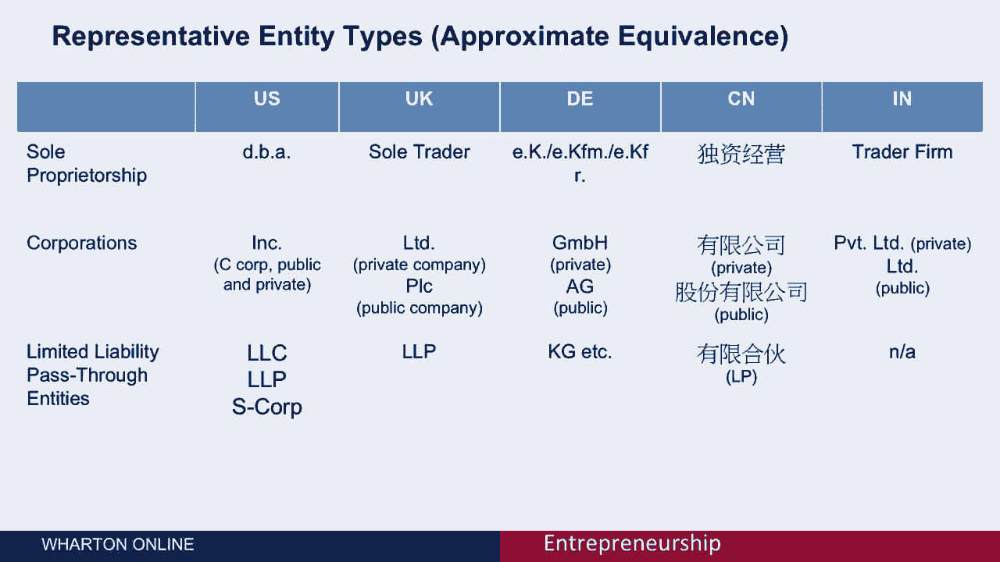

# 🏛️ 课程名称：创业四部曲 - 第53课：企业的法律形式

## 📖 概述
在本节课中，我们将学习企业在创立初期可以选择的不同法律形式。理解这些形式对于保护创始人、吸引投资以及规划税务至关重要。我们将探讨独资企业、公司以及有限责任实体等主要形式，并分析它们各自的优缺点。

---

## 🏪 什么是独资企业？
上一节我们介绍了课程概述，本节中我们来看看最常见的企业形式——独资企业。

当我最近访问伊斯坦布尔时，我从一个卖鱼面包的小贩那里买了一个三明治。几乎可以肯定，这位企业家是以通常所说的独资企业的形式经营的。这意味着他个人和他的生意在法律上没有区别。所有的钱都在他的口袋里进进出出。他可能有一个用于经营活动的支票账户，但他的生意并非一个独立的法律实体。

对于这个星球上的大多数新企业来说，情况可能都是如此，它们都是独资企业。

---

## ⚖️ 为何需要其他法律形式？
然而，在本届会议上，我们将考虑独资企业之外的替代方案，以及你为何有动机选择其他形式来经营。

以下是另一个名为“SawStop”（安全台锯）公司的例子。这种台锯的好处是，如果你不小心把手指伸进锯片，它不会切掉你的手指，而是能在毫米级距离内立即停止刀片。

现在，请思考一下，如果你作为企业家，想以独资业主的身份继续经营“SawStop”这样的生意，可能会面临哪些问题。

你将面临的一个关键问题是**法律责任**。让我们想象一下，如果某天由于某种原因，安全机制失效，有人在你的独资企业下被切掉了手指。遭受损害的人可以起诉你个人，并可能拿走你所拥有的一切。

因此，创建一个独立法律实体的一个关键目的，是将实体的责任限制在实体本身，而不是追究你个人的责任。

围绕“SawStop”的第二个问题是，它可能需要一些外部投资来成长和成功。事实上，它确实获得了外部投资。几乎总是，外部投资者会要求你的企业是一个独立的法律实体，因为他们想知道自己拥有什么所有权。

整个围绕新业务的法律体系，在一定程度上就是为了让你能够将企业的利润、权益或价值，公平地分配给包括投资者在内的其他人。

选择独资企业以外形式的第三个原因，是你经常想为你的经理和员工创造激励。所以你想把利润、公司权益或股份分配给他们。要做到这一点，你真的需要股票机制和一个新的法律实体。

因此，**限制个人责任**、**吸引外部投资**和**创建股权激励机制**，是创业时成立新法律实体的主要动机。

---

## ⚠️ 重要注意事项：咨询律师
现在我想说得很清楚，新业务所涉及的法律因你的管辖范围、地理位置、国家甚至国家内部的州而异，差异很大。

所以你**必须**咨询律师。我怎么强调都不过分：你不能自己做这件事。你真的必须咨询律师才能把这件事做好。

根据你所在的位置和管辖权的具体情况，让我给你一个概念。对于一个相对简单的、仅由创始人拥有且没有任何外部投资的新公司，其成立可能产生大约**1000到5000美元**的法律费用。这是你为建立新企业可以预期花费的金额。

如果你需要从外部投资者那里筹集资金，这通常需要大量额外的法律费用。风险投资的律师费通常在**1万到5万美元**之间。如果你有一个机构投资者，他们会要求与投资相关的大量法律保证。

现在，好消息是，许多专门从事新企业业务的律师习惯于和那些没有很多钱、刚刚起步的公司打交道。他们通常会推迟或打折对创业公司的收费，经常将付款推迟到公司获得第一轮外部融资之后。

我想指出的最后一件事是，跨境问题特别具有挑战性。例如，如果你是一家计划在中国销售产品的美国公司，这可能很有挑战性，尤其是如果你没有使用中国的中介作为你的分销伙伴。所以你确实需要咨询一位在跨境交易方面有专业知识的律师。

---

## 🌍 全球主要法律形式概览
有许多不同的法律形式，具体情况因国家而异，所以我不可能把它们全部描述出来。

通常，世界各地不同法律形式有两个主要的区分属性：
1.  **收入是如何纳税的**。两个主要选择是：实体本身被征税；或者实体将其利润“转嫁”给实体的所有者，由所有者纳税。
2.  **股票是否在公开市场交易**，或者公司是否完全由私人拥有。

单独征税的实体的缺点是可能导致**双重课税**。例如，公司可以先纳税，然后可以向股东分红，股东随后又需要为股息纳税，从而导致双重征税。这就是为什么在大多数国家和司法管辖区，都有一种所谓的 **“转嫁实体”** 的商业形式，允许公司将其收入转嫁给所有者，因为收入只被课税一次。

我想做的是向你展示五个不同区域的一些代表性实体类型。当然，我们不可能覆盖世界上所有的地区，但这给了你一种感觉，即不同司法管辖区内不同类型实体的近似等同物。

---

## 🇺🇸 以美国为例
我在这里展示了三种主要类型的实体：**独资企业**、**公司**与**有限责任转嫁实体**的区别。

*   **转嫁实体**是围绕税收的区别。
*   **公司**通常在实体层面征税，然后在股东层面再次征税，那是双重课税。
*   **有限责任转嫁实体**只征税一次，它们只由最终获得利润权益的所有者纳税。

在美国，这些不同类别的标准名称是：
*   **独资业主**被称为独资经营者，但他们通常有一个叫做 **DBA**（Doing Business As，即以……名义经营）的东西。所以那个卖鱼面包的人，如果他位于美国，实际上可以将他的企业命名为“鱼面包男”。他可以得到一个支票账户，并把这个名字用在名片上。这叫做DBA，可以向政府注册，但它不提供任何法律保护，也不允许你将利润权益分配给你自己以外的其他人。
*   在美国，你通常会看到公司用缩写 **Inc.** 来标记，意思是“Incorporated”（股份有限公司）的简称。Inc. 既适用于股票在公开市场（股市）交易的公众公司，也适用于私人控股公司。它们在美国都被称为 **C型公司**。
*   在美国，有限责任转嫁实体通常称为 **有限责任公司**。也有LLPs（有限责任合伙）和S型公司，但它们现在不太常用了。更典型的是，你会看到 **LLC**。

这些是你在美国看到的典型类型。我不会详述其他国家的所有细节，但实际上每个国家都有类似于这三类的法律实体，虽然有些国家没有转嫁实体。例如，印度就没有完全等同于美国有限责任公司的转嫁实体。

---

## 🎯 总结
本节课中我们一起学习了企业的不同法律形式。

你通常需要组建一个法律实体。你这样做通常是为了：
1.  **限制你的个人责任**，使得实体本身可能对给供应商或客户造成的任何损害负责，而不是你个人。
2.  法律实体为你提供了**货币（通常是公司股份）**，以便为你的团队成员和员工提供激励。
3.  法律实体通常是**外部投资的要求**。

出于这些原因，你通常需要成立一个法律实体。法律实体的确切类型将取决于你希望如何对待税收，以及你居住在什么法律管辖区。对于这些具体细节，务必咨询专业律师。