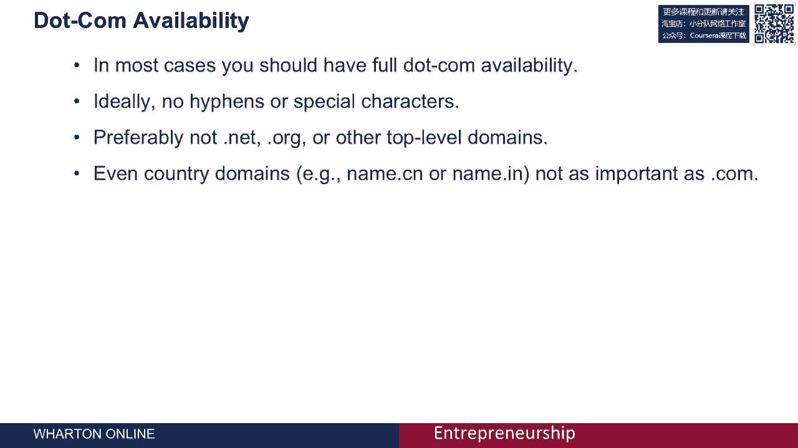
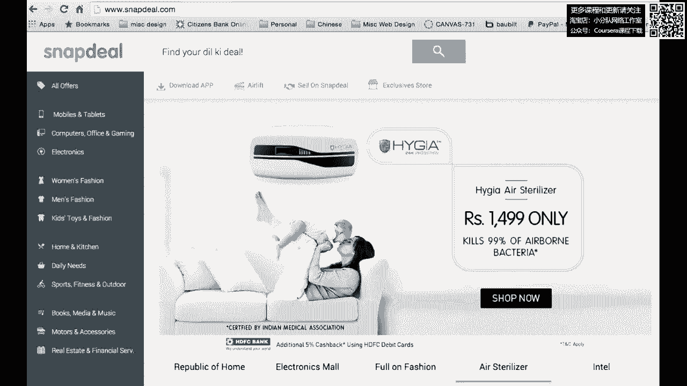
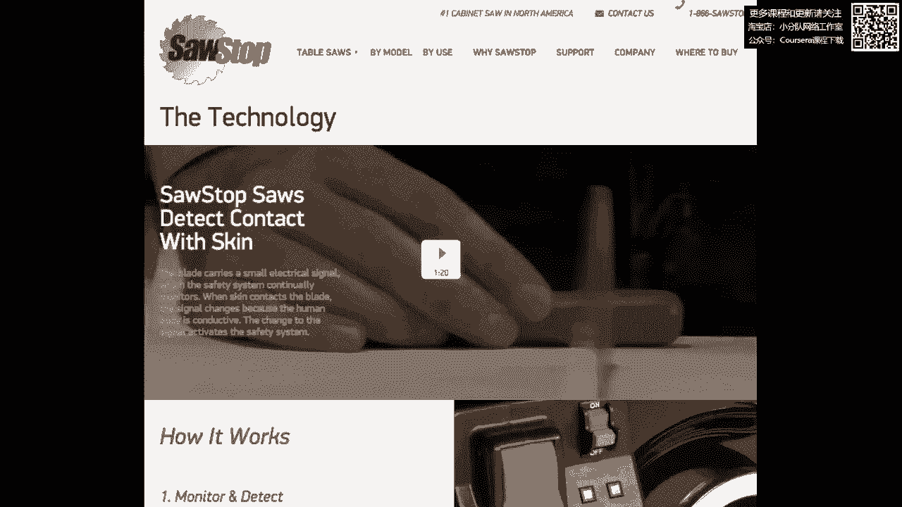
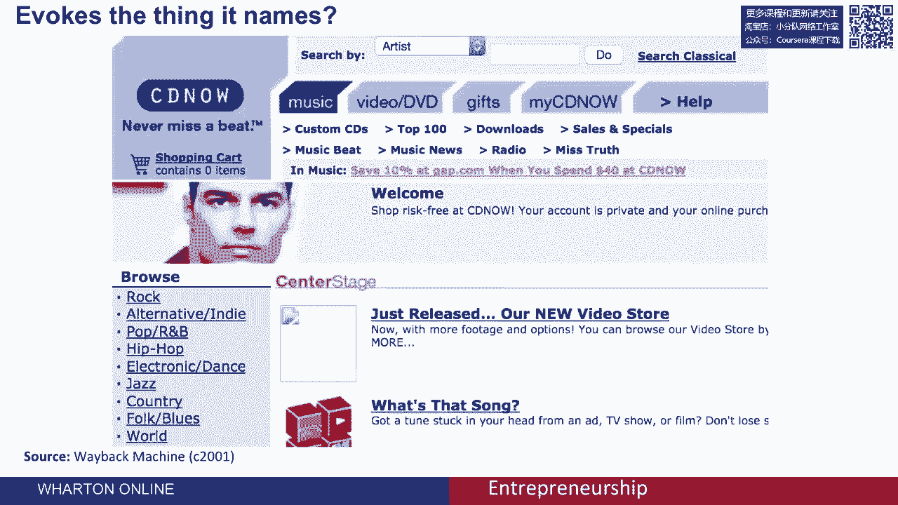
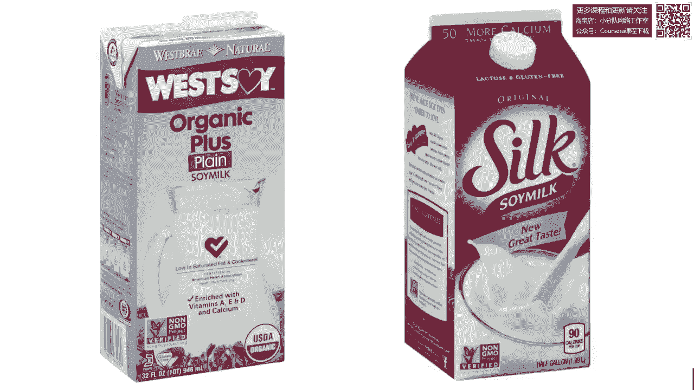
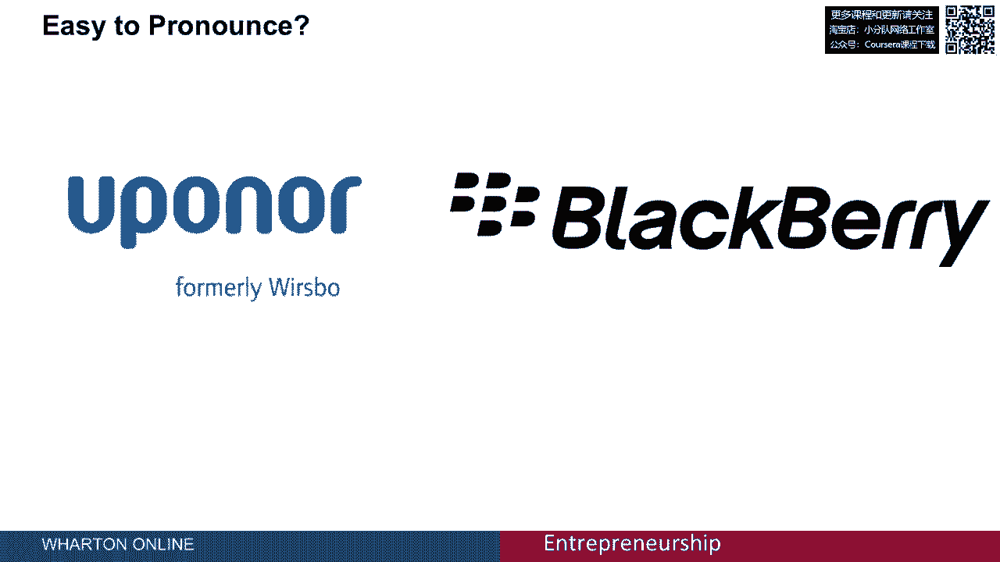
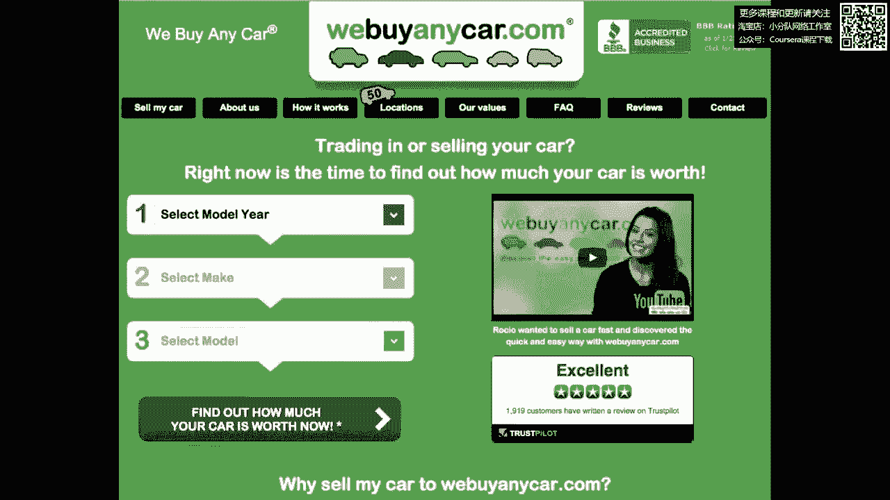
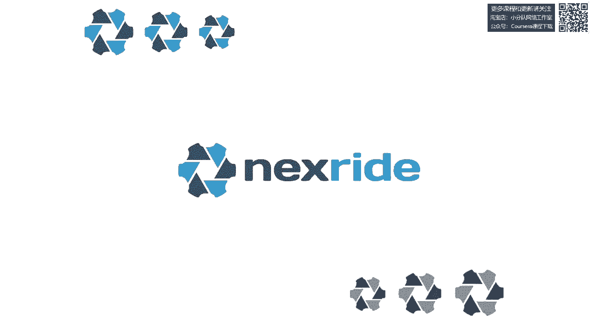

# 【沃顿商学院】创业 四部曲：发现机会、建立公司、增长战略、融资和盈利 - P54：[P54]01_4-0-branding-and-naming - 知识旅行家 - BV19Y411q713

这节课是关于品牌和命名的，我们将讨论给贵公司命名的问题，以及命名您的产品或服务，我想从这个故事开始，我最近参与了一家初创公司的工作，当他们来找我的时候，他们被称为生命包。

他们为所谓的冷链包装制造绝缘材料，意思是包装，用于向消费者运送冷冻食品或冷藏食品的，他们的公司叫生命包，但他们面临的问题是，他们没有域名Lifepack。com，结果。

当顾客听到他们产品的名字并进入网站时，他们找不到他们，他们经常不得不去搜索引擎，他们担心他们会因为沮丧而失去大量客户，在网上找到它们，Life Pack最终做的是改变他们的名字，他们最后改名为脾气包。

脾气包现在是公司的名字，正如你在这里看到的，他们拥有完整的网络，脾气包网络，有趣的是，他们最终命名了他们的第一个产品，黄麻箱，因为它们的绝缘材料是由黄麻纤维制成的，他们认为。

它也是一个关于单词点唱机或音乐播放盒的游戏，所以他们的产品叫点唱机，他们的公司名字叫脾气包，这个例子说明了在命名一个新企业时的一些关键挑战，你必须决定拥有这个点有多重要。

com或Internet地址为您的业务，你必须考虑是否应该给公司起和你的产品一样的名字，或者你是否应该为产品和公司使用不同的名称，我将采取非常强硬的立场，在大多数情况下，您必须具有完全的COM可用性。

没有连字符，没有特殊字符，最好不是点网或点组织，或任何其他顶级域，但是网络，我的论点是你是，你的事业才刚刚开始，你没有理由不能选一个名字，那是完全可用的。com。

这是你一开始就能采取的为数不多的行动之一，这消除了流失客户的主要来源之一，就是他们在网上找不到你，考虑到你是个企业家，考虑到你刚刚开始你的业务，你可以选择一个现在完全可用的名字。

我认为即使在美国以外也是如此，例如，Snap Deal是印度最大的网络公司之一，事实上，Snap Deal是由我以前的一个学生创建的，管球，尽管它主要在印度运营，但它很快就达成了协议。

使用域名Snapdeal。com，不是快照，我是这样的，即使你主要在中国经营，主要在印度，或者主要在另一个拥有不同顶级域名的国家。

我认为在创业之初，您应该花时间再次找到一个完全可用的名称，这是你能做的最简单的事情之一，以确保你不会失去客户，因为他们找不到你，这是该公司的一个例子，锯子停止装置制造一种停止桌子锯的装置。

如果它在刀片中遇到手指或身体部位，这是一件了不起的事，它可以在几毫米内停止刀片，如果它检测到人体组织的存在。

现在这个名字的伟大之处在于，除了有完整的谈话，查看停止的COM可用性，www。icj-cij。com，这个名字准确地描述了这个产品的功能，并立即将利益主张传达给消费者，作为一个初创企业。

你在营销上花费的资源太少了，你真的想让你的营销组合的每一个元素都为你努力工作，所以你要做的一件事就是选一个名字，对你来说很努力，一旦消费者看到了，他们马上就知道你的产品是做什么的，它现在的好处是什么。

那是一方面，另一方面，你在以你的公司命名时面临的挑战之一，一个非常具体的产品和利益主张，它没有给你很大的灵活性，对于未来可能发生的事情以及你可能需要如何适应，例如。

2000年早期的主要公司之一是一家名为CD Now的公司，现在你可能会想象CD现在在今天不是一个很好的名字，对于一个卖音乐的企业来说，因为光盘基本上已经过时了，所以在这种情况下。

一个在2000年为公司努力工作的名字，在2015年不太好用。

我想给你们看的第二个例子是这两个品牌的豆奶，左边那个叫西豆，右边那个叫丝绸，现在，你更愿意喝哪一个名字。

唤起产品的属性，当你听到和看到一个名字，你和那个品牌丝绸联系在一起实际上是一个很棒的名字，依我看，因为它巧妙地将大豆和牛奶结合在一起，但这也意味着这将是一种非常光滑的饮料，这将给你一个很好的体验。

所以当你试图推销豆奶之类的东西时，有一个让人联想到光滑的名字，比有一个没有任何唤起的名字要好得多，或者有点武断，就像西豆，下一个问题我想用例子来说明，这个名字的发音有多容易，有一家供热用品公司。

以前叫WO，并更名为Upanner，我认为，当你思考的时候，有一些可取的属性，这个字很难发音，尤其是英语，相比之下，黑莓这个名字在英语中非常容易发音，其他一切平等，你喜欢一个容易发音的名字，在目标市场。

你在哪里销售你的产品。

在某种程度上，黑莓是一个比你想象的更好的名字，我想强调的名字的下一个属性，拼写歧义，这是YouTube的网站，www。icj-cij。com，不是那个YouTube，而是你是网络，这是环球管公司的网站。

他们已经拥有了，域名YouTube，在视频分享网站YouTube之前，它的拼写是Y O T U B E点，www。icj-cij。com，而是因为有太多的人错过了一个版本而错过了另一个通用管。

实际上已经建立了他们的网站作为广告门户，不要成为他们管材制造业务的门户，这向你表明它有多昂贵，具有拼写歧义的域，这可能会将用户引导到您自己以外的其他站点，这里的策略是选择一个可以明确拼写的名字。

或者提前拥有，您的用户可能遇到的所有合理的拼写变体，名称中另一个真正需要的属性，是因为它令人难忘，这是大屁股粉丝的网站，现在大屁股粉丝是一个非常令人难忘的名字，事实上。

这个名字的产生是因为顾客过去常常打电话给制造商说，你是，那些让那些大屁股粉丝记不起公司实际名称的人，所以最终企业家决定你知道吗，我们应该把我们的公司改名为大屁股粉丝。

所以这是一个非常令人难忘的名字的例子，事实上，我猜在这次会议之后很久，你还会记得这家公司的名字，所以这是一个非常理想的财产，以一个非常令人难忘的名字，其他一切平等，你更喜欢短一点的名字而不是长一点的。

这是因为人们更容易记住较短的名字，而且他们打错的可能性也更小，当他们在找你的时候，在网上或他们的手机上，但这是一家名为我们购买任何汽车com的公司，虽然真的很长，但实际上相当令人难忘。

我认为它实际上工作得相当好，它传达了品牌的利益主张，这是相当令人难忘的，它可能相对容易拼写，但它唯一的属性是负面的。

它是相当长的，所以我用它来突出，其他一切都平等的事实，你喜欢短一点的名字，而不喜欢长一点的名字，但在某些情况下，长度是可以克服的，如果这个名字本身就很令人难忘，而且没有很多拼写歧义，我之前提到过。

全球挑战，在世界各地拥有单一品牌的挑战，有时，基于罗马字母的同一个品牌可以在全球范围内工作，例如，波音是一个在全球范围内只使用一个品牌的品牌，它似乎工作得很好，但对一些国家来说。

尤其是对于使用不同字母表的国家的消费品牌，您可能需要，或者是双品牌，例如，你可以在这里看到星巴克在中国的所作所为，它其实是个很棒的名字，他们继续使用星巴克咖啡标志，该标志有英文版。

但他们也增加了一个中文版，使用了辛巴克这个角色，然后只是语音烘焙来唤起星巴克，所以它是和星星意思相同的组合，与英国星巴克的一些相同的声音，所以这是一个很好的例子，一个全球品牌适应一个地区市场。

使用不同字符或不同字母的地方，总之，当你考虑给你的公司和你的产品命名时，这些是你应该考虑的属性或标准，首先呢，我能合法实际地使用这个名字吗，这意味着我有完整的COM可用性吗，我还要注意的是。

你必须避免侵犯他人的商标，这个问题超出了本届会议的范围，但当你给你的公司命名时，你当然想做商标搜索来验证，事实上，没有其他人在使用这个名字，你所设想的，第二个标准是名字让人想起你命名的东西。

所以这个例子，酱汁停止努力唤起它命名的东西，第三是名字有积极的联想，想想丝绸，与西方大豆相反，第四是名字容易说，你更喜欢黑莓而不是Upanner，其次是它有明确的拼写，事实上。

如果你要叫它YouTube，你已经锁定了，YouTube的拼写变体或附加拼写变体，其次是它令人难忘，那个大屁股粉丝，在这次会议之后很久，你可能还记得，这是一个非常令人难忘的名字，最后，名字不太长。

但我有时会说，如果它非常令人难忘，或者使用了一个句子或短语，它可以很容易地打字，它可以毫不含糊，仍然令人难忘，同时比你预期的要长，和，当然，所有这些因素都需要在瞄准全球市场的背景下考虑。

你需要注意这个名字在你的本土市场之外会发挥什么作用，我现在想谈谈生成和选择这些名字的实际过程，为了做到这一点，我将用我创造的自行车座椅的例子，和你谈谈这个自行车座椅的命名过程。

所以自行车座椅有这种理想的特性，还挺舒服的，它舒适的原因是因为座椅的几何形状，还因为座椅的枢轴允许它旋转，为了配合运动，骑手腿的兜售动作，在命名过程方面，我建议两个步骤，第一步是生成一个列表。

列出我要调用的内容，块和块只是单词的分数，它们是一组字符，通常表示一个单词的片段，其中一些将是字典中的单词，例如柔软或弯曲，那些都是字典里的词，有些是与你的产品有关的专有名词，例如，它可能是阿尔卑斯山。

杜埃兹或阿姆斯特朗，如果你想唤起骑自行车的下一个，下一个是寻找其他路线，可能来自拉丁语或希腊语，例如根，莱格或维洛或工作室或科索，这些都是其他语言的词根，拉丁语或希腊语，这让人想起。

你试图用产品唤起的一些相同的东西，当然它们是词缀，这些是前缀或后缀，可以应用于名称，它可能是像Pro或Max这样的东西，或者星星，或者技术，或者类似的东西，所以一旦你有了一个块列表。

通常你会生成大约一百个块，然后你可以操纵这些块来创建整个单词，还有一些大块的，当然你可以直接用，有些可以和其他块结合使用，一些你可以变异的块，添加附加字符、数字或拼写修改，当然你可以添加词缀。

前缀或后缀，为了创建一组完整的单词，这里显示的是该练习的一组结果，其中一些名字是自然名，意思是它们是词典中真正有意义的单词的组合，它们要么是专有名词，要么是字典里的单词，放在一起有意义。

其中一些是完全合成的意思，它们是对自然名称的暗示或唤起的构造词，和文字在，在，英文，或者用你的目标语言，但它们实际上是合成的意思，字典里没有，当然在大多数情况下，即使我说了点，COM真的很重要。

你就拿不到点了，搜索字典中的单词，大部分都是，它们非常昂贵，所以在大多数情况下，在命名你的公司或命名你的产品时，你要创造一个复合词，几块放在一起，或者字典里不存在的合成名称。

下一步是对这些名字做一些分析，我在这里展示了我在命名这个产品时使用的实际电子表格，这里有十几个我考虑过的选择，我在这里向你们展示我在电子表格中添加的标准，字符中的长度，然后只是长度的一到三个等级。

它们是积极的还是消极的联系，用这个词，它有拼写歧义吗，它的色调适合这个品牌吗，面向性能的自行车部件，它的品牌色调合适吗，说起来有多容易，这只是这些都只是主观判断，这些判断是由内部团队完成的。

只是为了评估大量的替代方案，这项分析的结果是确定了前十名，或者前六个左右的名字，现在我想顺便指出，每一个都是完全可用的，我持相当强势的立场，那个，我甚至不会考虑一个我没有完全com可用性的名字。

这就是标准没有出现在这个电子表格上的原因，一旦你创建了短名单，那么我建议你做一些测试，我要给你看一个实际的调查，我用它来测试这些名字，在这种情况下，我使用了调查工具Qualtrics。

但是有很多可用的调查工具，SurveyMonkey和其他可供您运行调查的工具，带有目标消费者样本的A，所以我想先介绍一下产品，告诉人们产品或公司是关于什么的，然后让他们继续查看最终提名候选人的名单。

在这种情况下，六到十个候选人，并简单地将他们从讨厌它到喜欢它进行5分制的排名，然后我给被告一个机会提供一个免费的关联，提供一些关于名称的评论，以防万一我们错过了什么，有些事我们没有想到。

也许与名字有负面关联，现在，当你设计调查时，这当然很重要，您将这些名字的呈现随机化，因为在调查答复中通常会有订单效应，所以随机排序，呈现目标用户，有六到十个名字的调查受访者。

让他们在五个盒子的尺度上给他们排名，如图所示，然后给他们机会评论名字，然后你做一些我认为很聪明很有趣的事情，也就是你要求你进入调查的下一个屏幕，你问他们，而不回去简单地键入任何名字。

他们记得它的作用是给你两条信息，它帮助你识别拼写错误，因为他们现在没有提到你的名字，他们只是简单地回忆名字并键入它，所以你可以看到人们是如何键入和键入错误的名字的，那是非常有价值的信息。

它测量的第二件事是召回，人们真正记得哪些名字，所以你可以使用这个文本输入，识别拼写变体并识别回忆，我建议你对大约50名受访者进行这项调查，那就是你试图让大约50个受访者参加调查。

这会给你一个很好的喜欢的估计，人们如何喜欢协会的名字，人们用回忆的名字，以及是否有拼写歧义，在此基础上你通常会确定一两个明显的赢家，对你的产品或你的公司来说是成功的，在我们的案例中。

我们确定了名为Nexride的品牌，接下来我们做的事，我认为这对欣赏一个名字很有价值，就是做一些平面设计，为品牌创建图形标识，在这种情况下，我使用了一个众包设计平台，在这种情况下。

一家名为99设计的公司，以便生成该名称的一些替代图形处理，这里显示的是五个决赛选手，我喜欢的五个，我收到的99个设计中最好的一个，仅仅基于团队内部的共识，我们挑了最下面的，这实际上是产品的名称。

和公司的。

你在命名中学到的一件事，尽管这是一个痛苦的过程，充满了挫败感，你觉得这很有挑战性，你永远不会得到你满意的东西，一旦你真正经历了这个过程，进行调查，选择了名称，拥有完整的网络可用性，然后你做一点平面设计。

您查看结果输出，你说，那当然是我们公司的名字，那是产品的名称，不可能是别的，事实上，现在回顾一下我们正在考虑的一些替代方案。
