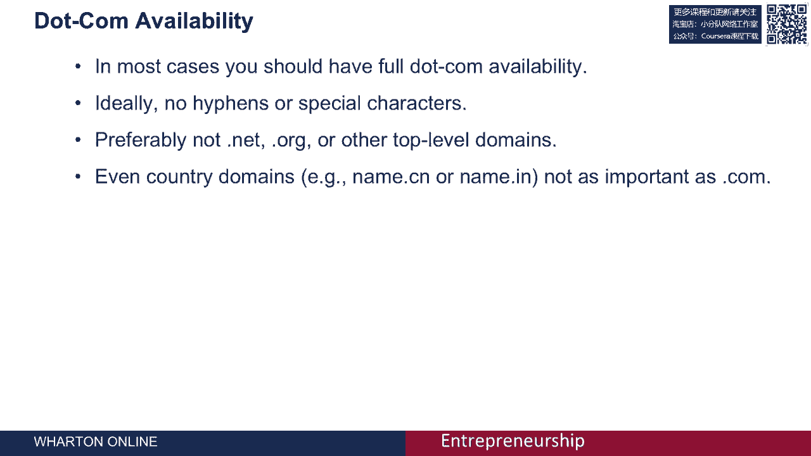
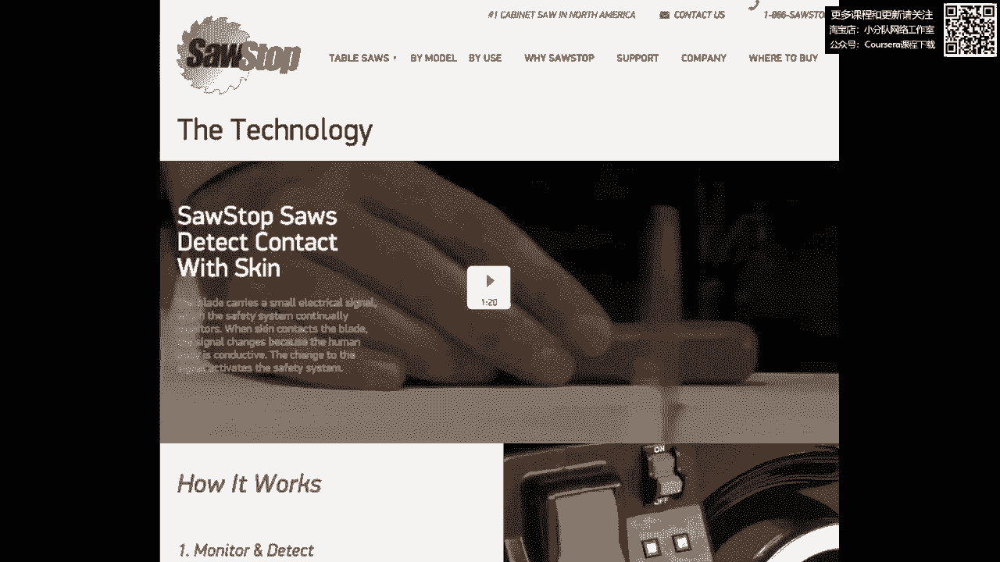
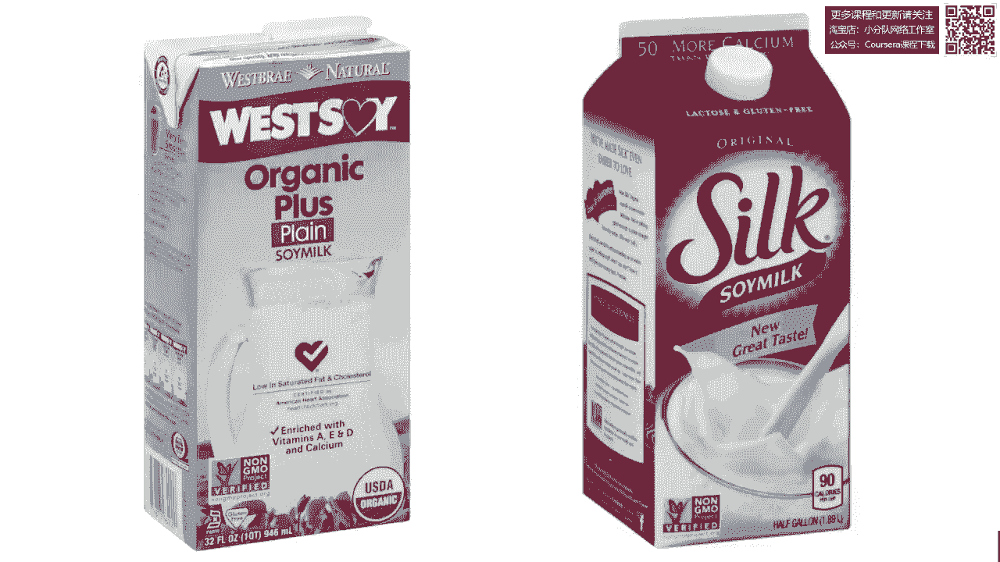
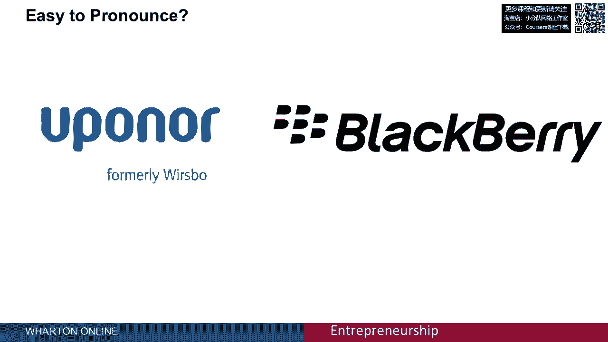
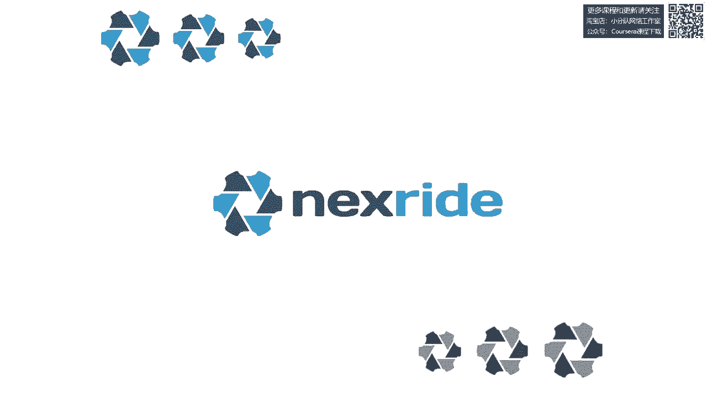

# 🏷️ 课程名称：品牌与命名 | 编号：P54

## 📖 概述

在本节课中，我们将学习如何为你的公司或产品选择一个合适的名称。一个好的名字是品牌建设的第一步，它能帮助客户记住你、找到你，并理解你的价值主张。我们将通过具体案例，分析命名的关键原则和实用步骤。

---

## 🎯 品牌命名的核心挑战与原则

上一节我们概述了课程内容，本节中我们来看看品牌命名面临的核心挑战，并通过案例学习关键原则。

### 案例一：从“生命包”到“脾气包”

一家初创公司最初名为“生命包”（Lifepack），生产用于冷链运输的绝缘包装材料。他们面临一个严重问题：无法获得 `Lifepack.com` 这个域名。当客户在网上搜索他们时，常常因为找不到正确网站而流失。最终，公司将名字改为“脾气包”（Temperpack），并成功获得了 `Temperpack.com` 域名。同时，他们的第一款产品被命名为“黄麻箱”（Jukebox），既体现了材料（黄麻纤维），又玩了一个关于音乐播放盒的文字游戏。

这个案例说明了两个关键挑战：
1.  **域名可用性至关重要**：你必须确保能获得对应的 `.com` 域名。
2.  **公司名与产品名可以不同**：公司名（Temperpack）更宽泛，产品名（Jukebox）更具体。

**核心原则一：确保完整的 `.com` 域名可用性。**
对于初创企业，选择一个能完全匹配 `.com` 域名的名字是初期就能完成的关键任务。这能避免客户因在网上找不到你而流失。公式可以表示为：
**理想命名条件 = 公司名/产品名 + 可用的 `.com` 域名**

即使业务主要在美国以外（如印度、中国），拥有一个全球通用的 `.com` 域名也利于品牌的长远发展。

### 案例二：描述性命名——“锯停”

“锯停”（SawStop）是一家生产台锯安全装置的公司，其产品能在检测到人体组织时瞬间停止锯片。这个名字的伟大之处在于：
*   拥有 `SawStop.com` 域名。
*   名字准确描述了产品功能（停止锯子），并立即向消费者传达了核心价值主张（安全）。

**核心原则二：名称应努力传达核心价值。**
初创公司营销资源有限，因此名字本身就应该成为一个高效的营销工具，让消费者一眼就能明白产品是做什么的、有什么好处。

**核心原则三：避免名称过于具体而限制未来发展。**
描述性名称也有风险，它可能限制公司未来的业务拓展。例如，一家在2000年代初名为“CD Now”（光盘现在）的音乐销售公司，在光盘过时后，其名称就成为了负担。

### 案例三：唤起积极联想——“丝绸” vs “西豆”

比较两个豆奶品牌：“丝绸”（Silk）和“西豆”（WestSoy）。哪个名字更吸引人？
*   “丝绸”是一个出色的名字，它巧妙结合了“大豆”（Soy）和“牛奶”（Milk），同时唤起了“顺滑口感”的积极联想。
*   “西豆”则相对平淡，缺乏唤起感。

**核心原则四：名称应唤起积极的属性联想。**
一个好的名字能激发消费者对产品优良品质的想象。

### 案例四：易读性与拼写明确性

*   **易读性**：对比“黑莓”（BlackBerry）和“Upanner”（一个供暖公司旧名）。“黑莓”在英语中非常容易发音。在其他条件相同时，应选择在目标市场易于发音的名字。
*   **拼写明确性**：视频网站YouTube的域名是 `YouTube.com`。但曾有一个拼写类似的网站 `YoTube.com`（属于一家管道公司），这可能导致用户误入。因此，应选择拼写明确的名字，或提前注册所有常见的拼写变体域名。

**核心原则五：名称应易于发音和拼写。**

### 案例五：令人难忘与长度——“大屁股风扇”

“大屁股风扇”（Big Ass Fans）是一个令人过目不忘的公司名。这个名字源于顾客常打电话说“我要你们造的那些大屁股风扇”，却记不住公司本名。于是公司索性改名。这个名字非常令人难忘。

**核心原则六：名称应令人难忘且长度适中。**
通常，短名字比长名字更容易记忆和输入。但长度劣势可以被其他优势克服，例如“我们购买任何汽车.com”（WeBuyAnyCar.com）虽然长，但因其直接传达了价值主张且易于理解，同样令人难忘。

### 案例六：全球化考量——星巴克在中国

品牌全球化时需考虑名称在不同文化中的适应性。星巴克（Starbucks）进入中国时，在保留英文标识和“星巴克咖啡”字样的同时，增加了中文名“星巴克”（Xīngbākè），其中“星”字与英文“Star”呼应，“巴克”是“bucks”的音译。这是一个成功的本地化适配案例。

**核心原则七：考虑名称的全球适用性。**
如果你的目标是全球市场，需要确保名字在其他语言和文化中没有负面含义，并考虑是否需要为不同市场进行本地化适配。

---

## 🔧 命名实战：步骤与方法

上一节我们探讨了命名的核心原则，本节中我们来看看如何将这些原则付诸实践，通过一个具体案例学习命名的步骤与方法。

我们将以为一款新型舒适自行车座命名为例。

### 第一步：生成名称“块”列表

命名过程始于头脑风暴，生成一个“块”（Chunk）列表。“块”是指单词的片段或组成部分。
以下是“块”的几种类型：
*   **字典词**：如“柔软”（Soft）、“弯曲”（Flex）。
*   **专有名词**：与产品领域相关，如“阿尔卑斯”（Alps）、“阿姆斯特朗”（Armstrong）。
*   **词根**：来自拉丁语、希腊语等，能唤起相关感觉，如“leg”（腿）、“velo”（速度）、“corso”（课程）。
*   **词缀**：前缀或后缀，如“Pro-”、“Max”、“-tech”、“-star”。

目标是生成约100个这样的“块”。

### 第二步：组合与创造完整名称

利用这些“块”来创造完整的名称：
1.  **直接使用**：某些“块”本身就可作为名字。
2.  **组合**：将两个或多个“块”组合起来（如“SoftFlex”）。
3.  **变形**：对“块”进行拼写修改或添加字符。
4.  **添加词缀**：为“块”加上前缀或后缀。

通过以上方法，可以得到两类名称：
*   **自然名**：由有意义的词典词或专有名词组合而成（如“RockRider”）。
*   **合成名**：创造的、在词典中不存在的词，但能暗示某种含义或感觉（如“Nexride”）。

**注意**：由于常见的词典词 `.com` 域名通常已被注册或价格昂贵，初创公司更常创造“合成名”。

### 第三步：分析与筛选

将生成的大量名称放入电子表格进行初步筛选。评估标准可包括：
*   **长度**（字符数）
*   **积极/消极联想**
*   **拼写歧义**（高/中/低）
*   **品牌调性契合度**（是否适合高性能自行车配件）
*   **易读性**
*   **最重要的是：`.com` 域名是否完全可用**（此为标准前提，不符合者直接淘汰）

通过团队内部的主观评分，可以筛选出6-10个最佳候选名称，进入下一轮测试。

### 第四步：消费者测试

使用调查工具（如Qualtrics, SurveyMonkey）对目标消费者进行测试。调查流程如下：
1.  **介绍产品**：简要说明产品或公司是做什么的。
2.  **评估名称**：向受访者随机展示候选名称列表（避免顺序效应），让他们在5分制量表上评分（从“讨厌”到“喜欢”）。
3.  **收集联想与评论**：让受访者提供对每个名称的自由联想或评论，以发现潜在的负面含义。
4.  **记忆与拼写测试**：在调查的后续页面，不提供名称列表，让受访者凭记忆键入他们记住的名字。这能测试**名称的记忆度**和**常见的拼写错误**。

建议收集约50份有效回复，以获得可靠的偏好、联想和拼写数据。

### 第五步：确定最终名称并设计标识

根据测试结果，通常会有一两个名称脱颖而出。在我们的案例中，最终胜出的名称是 **Nexride**。

接下来，为选定的名称设计视觉标识（Logo）。可以利用众包设计平台（如99designs）来获取多种设计方案。通过内部评审，选择最符合品牌气质的设计。最终，你会拥有一个完整的品牌名称和视觉形象。

**关键收获**：命名过程可能充满挑战和挫折，但一旦你遵循系统性的步骤——生成、筛选、测试、设计——并最终确定名称后，你会感觉“这就是我们公司/产品的名字，不可能是别的”。

---

## 📝 总结

在本节课中，我们一起学习了品牌与命名的完整知识体系。

我们首先通过“生命包”、“锯停”、“丝绸”等多个案例，深入理解了命名的**七大核心原则**：
1.  **确保 `.com` 域名可用**
2.  **努力传达核心价值**
3.  **避免过于具体限制发展**
4.  **唤起积极联想**
5.  **易于发音和拼写**
6.  **令人难忘且长度适中**
7.  **考虑全球适用性**

接着，我们通过为一个自行车座命名的实战案例，系统掌握了命名的**五个步骤**：
1.  **生成“块”列表**
2.  **组合创造完整名称**
3.  **内部分析与筛选**
4.  **目标消费者测试**
5.  **确定名称并设计视觉标识**

记住，一个好的名字是品牌宝贵的无形资产。花时间进行严谨的命名过程，能为你的创业之路奠定坚实的基础。