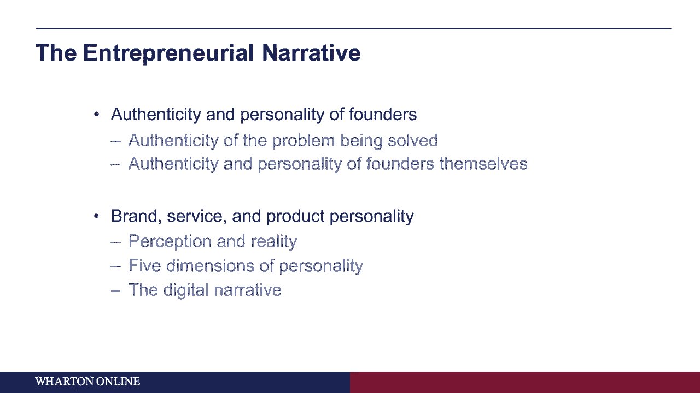
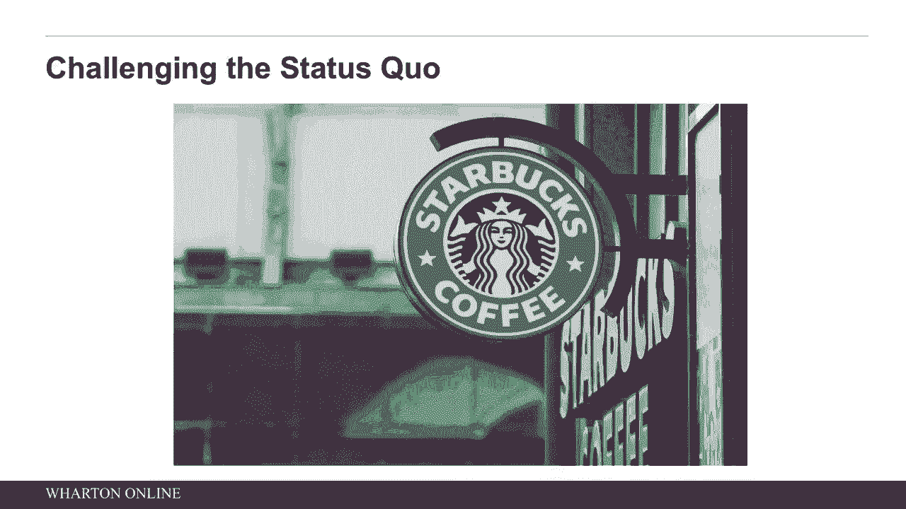
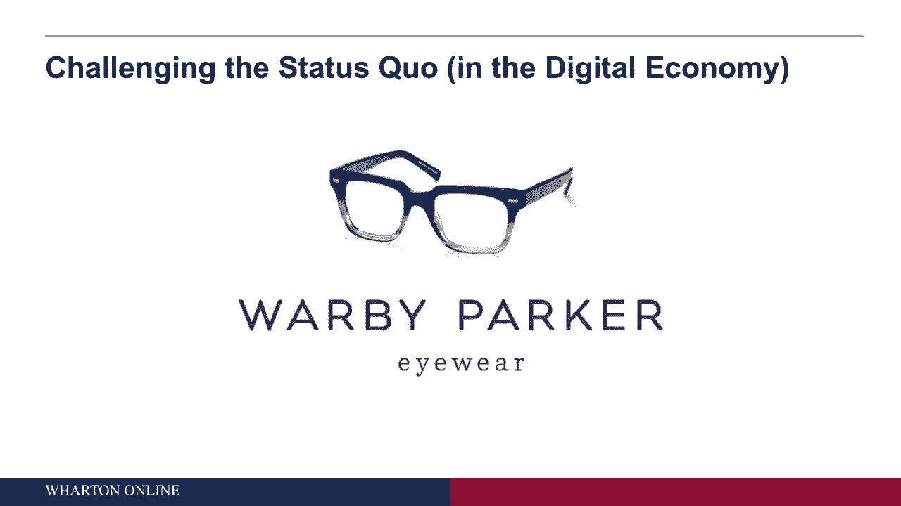
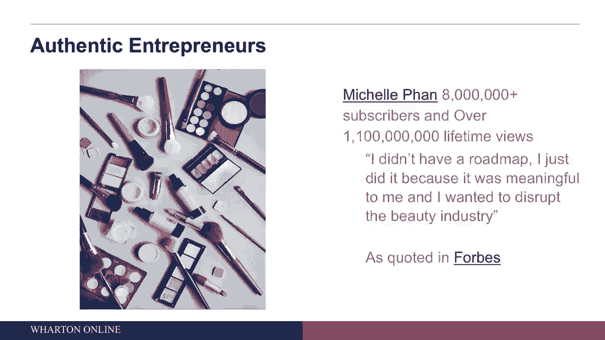
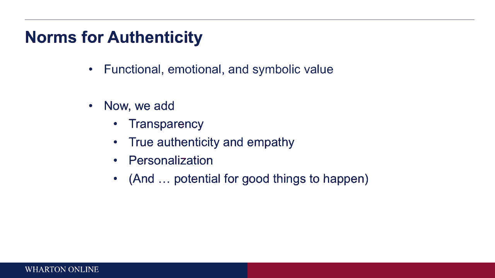
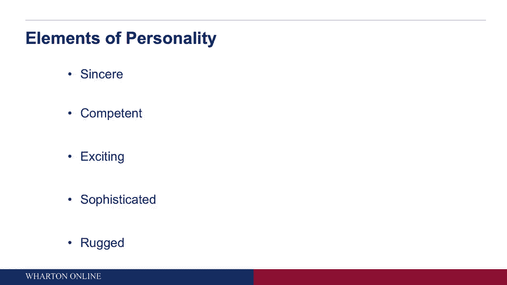
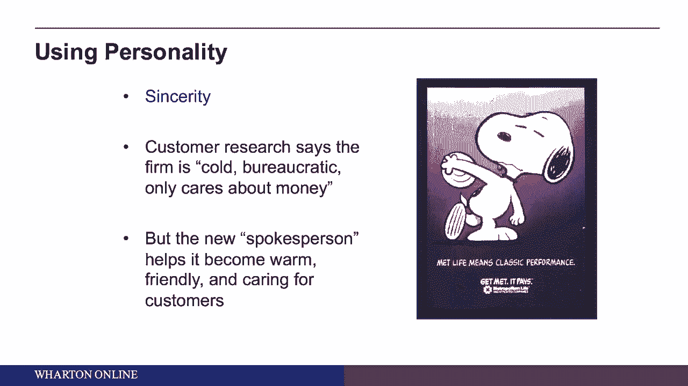
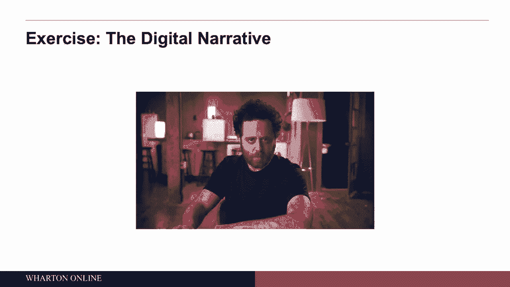
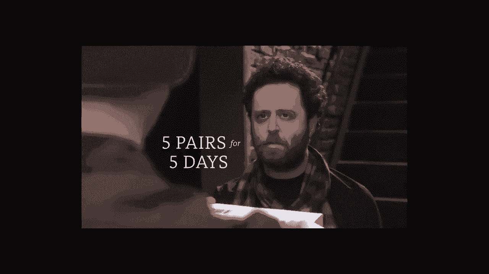
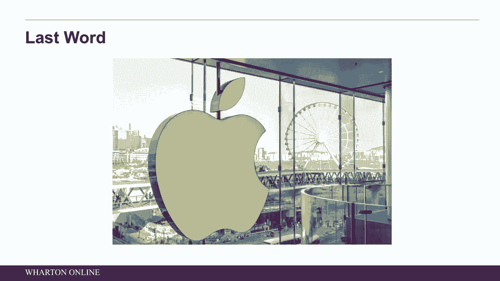

# 【沃顿商学院】创业四部曲：发现机会、建立公司、增长战略、融资和盈利 - P55：真实性与个性 🎭

在本节课中，我们将探讨创业中真实性与个性的重要性。我们将从创始人自身和品牌两个层面进行分析，并学习如何通过建立真实、透明的品牌个性来赢得客户信任。

---

## 创始人层面的真实性与个性

上一节我们介绍了课程的整体框架，本节中我们首先来看看创始人自身的真实性与个性。这主要涉及三个方面：所解决问题的真实性、挑战现状的方法以及创始人自身的真实特质。

以下是创始人需要思考的三个核心问题：

1.  **我是否在解决一个真实的问题？**  
    成功的创业需要解决人们真正关心的问题。以星巴克为例，霍华德·舒尔茨发现美国人虽然喝大量咖啡，但主要在家饮用品质较低的咖啡，这与他在意大利体验到的优质咖啡馆文化形成鲜明对比。他提出的核心问题是：**“现状有什么问题？”** 这个问题引导他创立了星巴克，将其定位为家庭和工作场所之外的“第三空间”。

2.  **我是否有挑战现状的真实方法？**  
    在数字经济时代，创业者常常需要质疑现有模式。Warby Parker的创始人们提出了一个关键问题：**“为什么一副眼镜要和iPhone一样贵？”** 通过调查，他们发现眼镜行业被少数大公司垄断，导致价格虚高，且线上销售渠道匮乏。这促使他们创立了一个直接面向消费者的线上眼镜品牌。

3.  **我自身是否有解决该问题的真实特质？**  
    创始人的个人经历和热情是品牌故事的重要组成部分。例如，美妆企业家Michelle Phan在创业前就热衷于制作化妆教程视频并上传至YouTube。她的成功源于真实的热情：“我没有路线图，我这么做只是因为它对我有意义。” 这启示我们，在数字时代，分享个人真实激情的故事更容易引起共鸣。

---

## 品牌层面的真实性与个性

在思考了创始人自身的真实性后，我们接下来看看如何将这种真实性赋予品牌、服务或产品。这里需要特别注意“感知”的力量。

### 感知与现实：品牌塑造的关键

一项关于啤酒的盲测研究揭示了感知的重要性。当消费者在不知道品牌的情况下品尝啤酒时，他们认为多数主流啤酒口味相似。然而，当从原装瓶子中饮用时，他们却能清晰地感知到不同品牌之间的差异。这表明，**营销和传播（尤其是在数字时代）对产品、品牌乃至创始人的“被感知方式”有着巨大影响**。

### 构建品牌价值与个性

一个成功的品牌需要提供三种核心价值：
*   **功能价值**：解决客户的具体问题。（例如，Warby Parker以实惠的价格提供眼镜。）
*   **情感价值**：让客户产生某种感觉。（例如，佩戴Warby Parker眼镜可能让人感觉时尚。）
*   **象征价值**：通过品牌表达客户的某种身份或态度。（例如，选择Warby Parker可能被视为一种精明、务实的消费观。）

在数字经济中，品牌还需要额外具备四种特质：**透明、真实、共情、个性化**。当品牌做到这些时，可能引发积极的连锁反应。例如，捷蓝航空（JetBlue）曾推出“600美元月票”的促销活动，一位用户借此在29天内飞往29个城市为癌症募捐。这个真实的故事被广泛传播，进一步提升了品牌的好感度和知名度。

### 品牌个性的五个维度

研究表明，品牌可以通过五个维度来塑造个性，就像描述一个人一样：

1.  **真诚**：值得信赖、踏实。（例如，某些金融机构）
2.  **能力**：可靠、高效、智能。（例如，麦肯锡咨询公司）
3.  **兴奋**：大胆、充满活力、富有想象力。（例如，维珍集团）
4.  **成熟** 精致、高端、有魅力。（例如，蒂芙尼）
5.  **粗犷**：坚韧、户外、强壮。（例如，哈雷戴维森）

需要注意的是，这些维度具有文化差异性。例如，在东亚文化中，“粗犷”维度的重要性下降，而“平和”变得更重要；在拉丁文化中，“能力”维度的重要性降低，“激情”则更为关键。

**应用实例**：大都会人寿（MetLife）通过调研发现客户认为其品牌形象“冷漠”。为了塑造“真诚”的个性，他们采用了卡通形象史努比（Snoopy）作为品牌代言人。此举成功地将品牌感知转变为“温暖、友好、关心客户”。

---

## 综合案例：Warby Parker的视频分析

现在，让我们将以上概念综合起来，分析Warby Parker的一段宣传视频，看看它如何传达真实性与个性。

以下是视频中体现真实性、透明度及品牌价值的几个要点：

*   **人物设定**：视频主角是一位有高品味、对眼镜有要求的专业人士，这容易引起目标客户共鸣。
*   **痛点呈现**：明确展示了传统精品店（昂贵）和折扣店（结果不可预测）的失望体验。
*   **解决方案**：清晰演示了“虚拟试戴”和“家庭试戴”两大核心服务流程，解决了线上购镜的信任和适配难题。
*   **价值传递**：
    *   **功能价值**：以95美元的价格提供高品质、合身的眼镜。
    *   **情感价值**：找到合适镜框后的满意与自信。
    *   **象征价值**：复古时尚的镜框设计，以及“买一捐一”的社会公益项目，赋予了品牌精明、时尚且有社会责任感的形象。
*   **品牌个性**：整个视频传递出一种**真诚**（解决真实问题）、**有能力**（提供创新解决方案）且略带**兴奋感**（颠覆传统）的混合个性。

---

## 总结：苹果公司的启示 🍎

本节课中我们一起学习了如何从创始人和品牌两个层面构建真实性与个性。最后，我们以苹果公司的成功哲学作为总结，它建立在三个核心概念上，对创业者极具启发：

1.  **共情**：深度理解客户需求，甚至超越客户自身的认知。
2.  **专注**：明确什么对客户绝对重要，并以最高标准去执行。
3.  **归因**：打造一种产品吸引力，让客户在看到产品时几乎无需解释就产生“我想要”的直觉。

希望这些关于真实性、个性及品牌塑造的思考，能帮助你为自己的创业项目构建一个真实、动人且独具魅力的叙事。