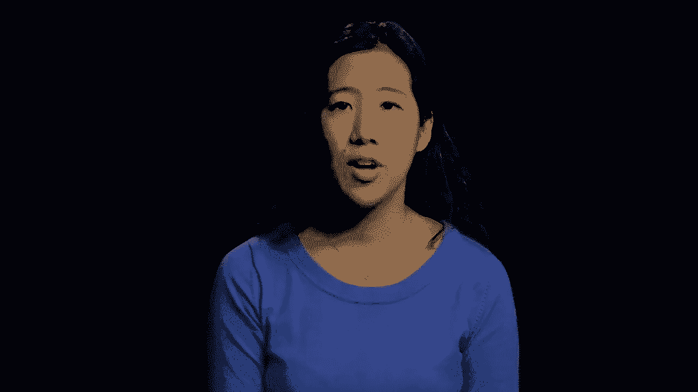
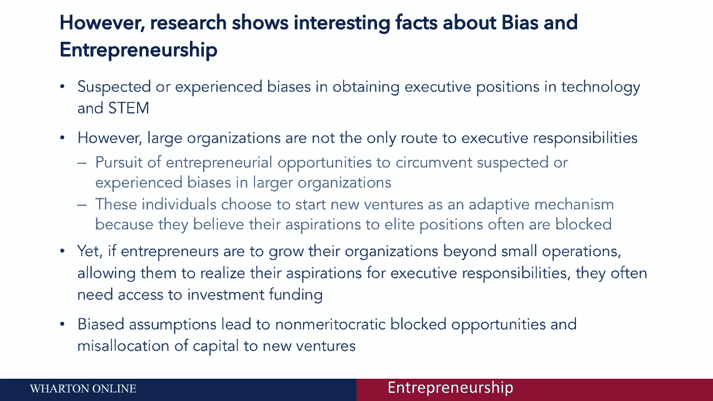
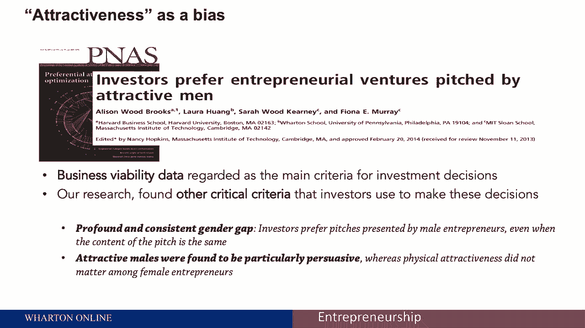
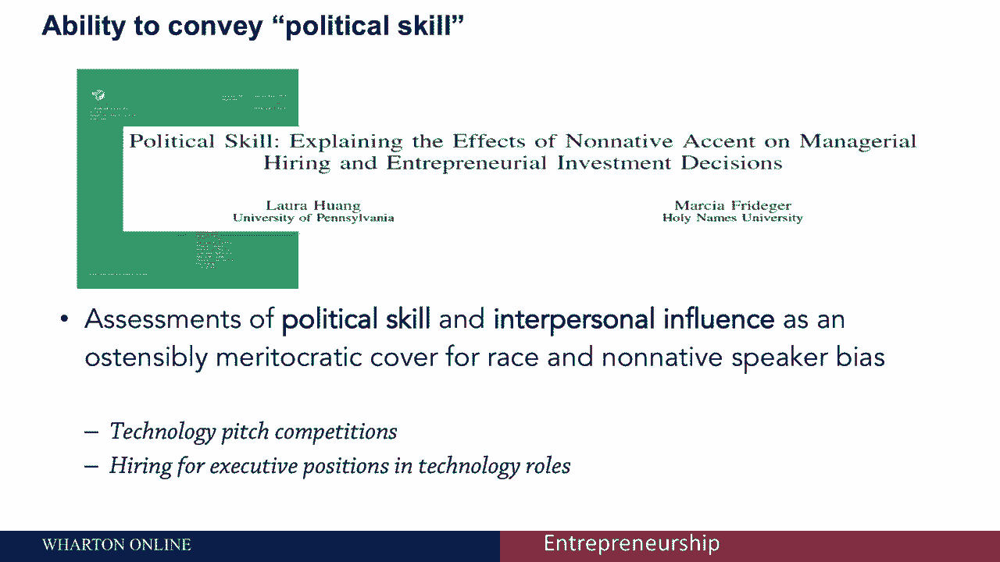
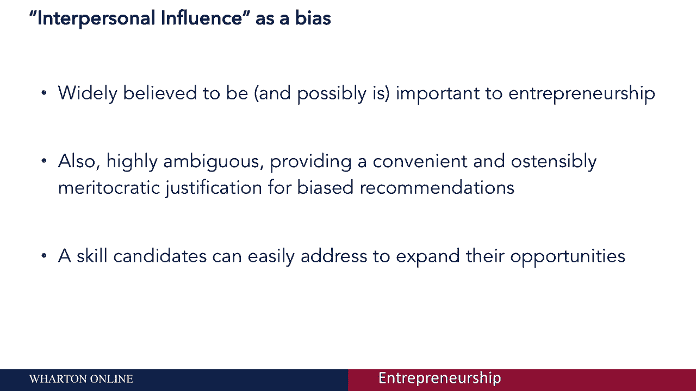
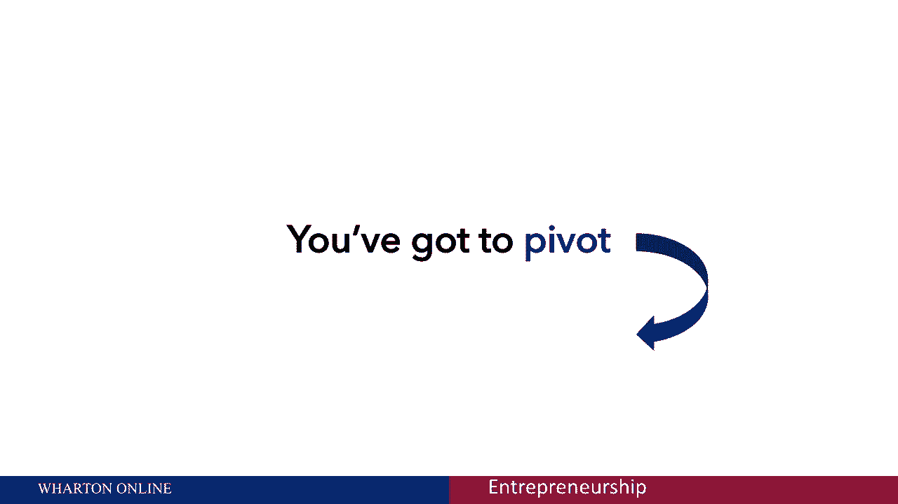
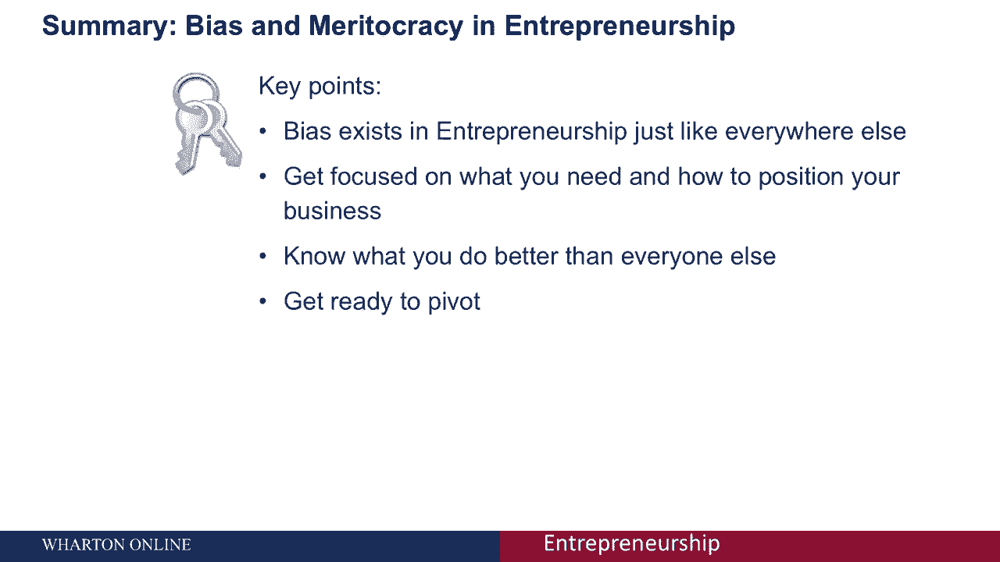

# 沃顿商学院创业课 P56：创业中的偏见与任人唯贤 🧠

在本节课中，我们将探讨创业领域中一个关键但常被忽视的议题：偏见与任人唯贤。许多人认为创业是基于想法质量和市场规模的纯粹任人唯贤的努力，但现实情况往往更为复杂。我们将分析偏见如何影响创业机会、融资和成功，并学习如何识别及应对这些挑战。

---

## 创业并非纯粹的任人唯贤

上一节我们介绍了创业的基本框架，本节中我们来看看“任人唯贤”这一理想在现实中的情况。

任人唯贤意味着进步应基于个人的能力和才能，而非其他外部因素。人们希望创业是基于**想法质量**或**市场规模**的公平竞争。

然而，研究表明，创业领域并非总是如此。例如，众所周知的“玻璃天花板”效应在科技和创业界尤为突出。创业常被视为一种男性主导的努力，存在显著的性别差异。

这不仅仅是性别问题。种族、民族等其他形式的偏见同样存在于创业生态中。创业之所以在这方面问题突出，是因为许多人将其视为当他们在传统职业道路上遭遇挫折或偏见时的替代选择。

---

## 偏见如何影响创业融资

如果创业者希望将组织发展壮大，超越小规模经营，他们通常需要获得投资。不幸的是，在寻求融资时，他们可能会遭遇与之前在传统职场中相似的、非任人唯贤的待遇。

研究显示，即使在业务生存能力等客观数据相同的情况下，偏见依然会影响投资决策。

以下是影响投资者决策的一些非任人唯贤因素：

*   **性别**：实验表明，投资者更倾向于选择由男性创业者进行的项目推介，即使推介内容完全相同。
*   **外表吸引力**：尤其对于男性创业者，外表魅力被发现具有特别的说服力。而对于女性创业者，外表的影响则不那么明显。
*   **口音与种族**：人们可能不会公开进行歧视，但会通过评价“政治技巧”或“人际影响力”等模糊标准来间接体现偏见。有特定口音或来自特定种族背景的人，常在这些方面获得较低评价。

这些因素具有高度模糊性，恰恰为带有偏见的判断提供了表面上任人唯贤的理由。

---

## 应对策略：将挑战转化为优势

认识到创业中存在的偏见是第一步。好消息是，创业者可以采取主动策略来应对这些问题，扩大自己的机会。

需要理解的核心是，偏见会导致在**时间**、**建议**和**资金**这些关键资源分配上的不平等。创业者需要思考，在可能处于劣势的情况下，如何获取这些资源。

你可以专注于以下两个广泛的主题：

1.  **承认现实**：首先，要明白我们通常不善于主动索取资源，女性尤其不善于向他人求助。其次，必须承认创业并非纯粹的任人唯贤，而非我们试图说服自己的那样。
2.  **主动管理印象**：一旦认识到偏见的存在，就可以开始采取行动。

你的项目推介是关键舞台。这既可能是偏见集中体现的场合，也可能是你扭转劣势、夺回优势的战场。

以下是具体的行动建议：

*   **打造你的“不公平优势”**：深入思考并清晰传达是什么让你成为经营这个创业项目最合适的人。例如，你的国际经验可以将口音从潜在劣势转变为一种资产。
*   **建立联系与共性**：人们倾向于认同与自己相似的人。主动寻找并明确展示你与听众（如投资者）之间的共同点和联系，让他人的注意力从差异点上移开。
*   **广泛而公开地交流**：不要只在正式推介时才沟通。多分享关于你自己的故事和叙述，让他人有机会发现与你的联系。
*   **调整认知与策略**：如果你需要资金，可以先尝试征求建议。这虽然是一种简化，但关乎改变你对创业互动的认知定位。思考所有被隐含考虑的因素，以及你如何管理他人对你的印象。

---

## 总结与行动指南 🎯

本节课中我们一起学习了创业中偏见与任人唯贤的复杂关系。我们看到，偏见确实存在于创业领域，就像在其他领域一样。

关键在于专注于你需要什么，以及如何在业务中定位自己，明确你比他人做得更好的地方。准备好持续调整你的方法，就像在商业模式中迭代一样，不断优化那些影响你成功机会的因素，并最大限度地减少不利条件。

最后，记住这三件事：
1.  持续以你的方法为中心，进行迭代。
2.  不要为自己寻找借口，要学会变得有策略。
3.  艺术性地争取你所需的时间、建议或资金。

通过主动认识和巧妙应对，你可以更好地驾驭创业环境，将挑战转化为独特的优势。