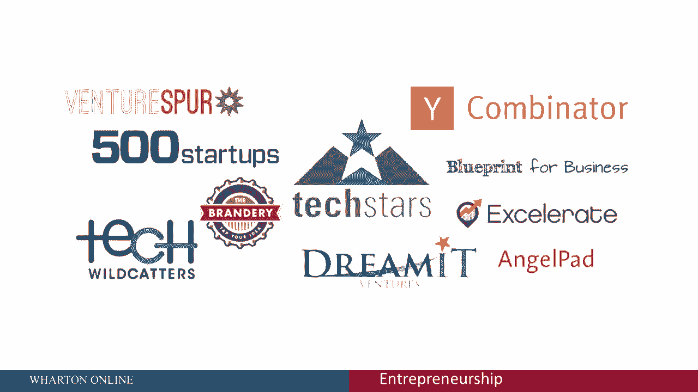
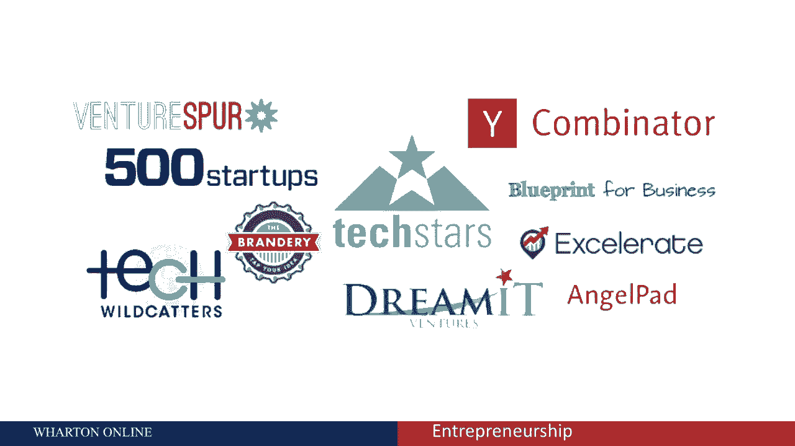
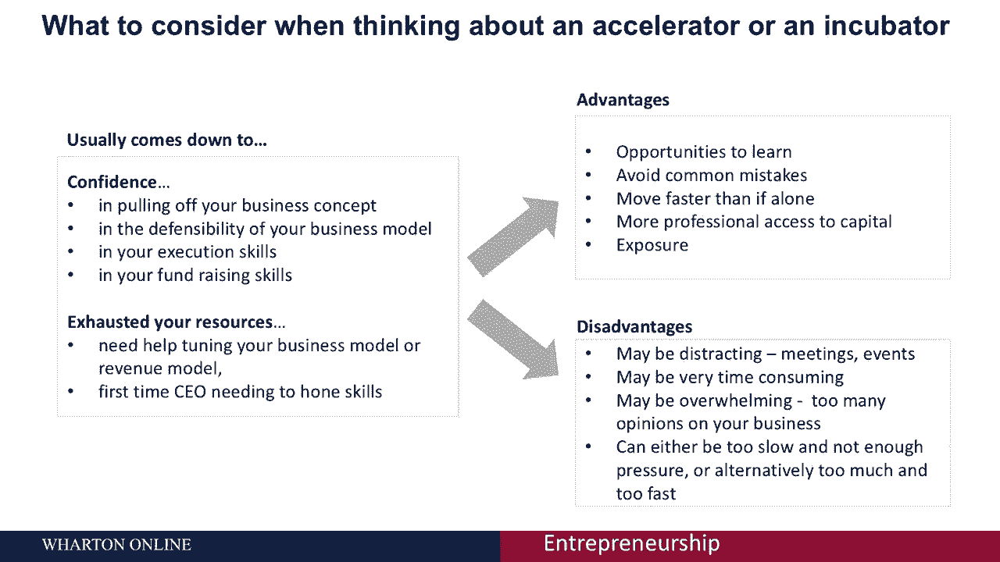
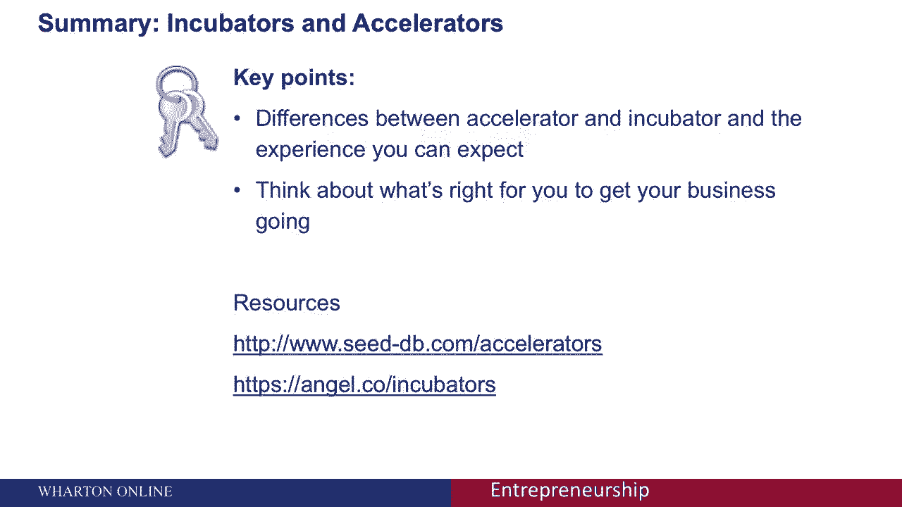

# 🚀 沃顿商学院创业课 P57：孵化器与加速器详解

在本节课中，我们将学习创业生态系统中两个重要的支持机构：孵化器和加速器。我们将探讨它们的定义、核心差异、各自的优缺点，以及如何根据自身情况做出选择。

---

## 🔍 孵化器与加速器的核心差异

上一节我们介绍了创业支持机构的概念，本节中我们来看看孵化器和加速器的具体区别。

孵化器和加速器都能帮助你快速启动创业。让我们从它们的差异开始。

当你加入一个**孵化器**时，你的业务会与许多其他初创公司被安置在一个中心工作区。在许多情况下，这些孵化器中的初创企业可以由同一投资者团体资助。你可以在这个空间里停留任意长的时间，直到你的业务发展到需要搬迁到自己的独立空间为止。导师通常由经验丰富的企业家或投资者担任，他们通过分享自身经验来提供指导。

现在，让我们来看**启动加速器**。启动加速器与孵化器非常相似，但有一些明显的区别。你在加速器中的时间通常被限制在三到四个月内，其核心目标是快速启动你的业务，然后让你独立发展。加速器本身对你的业务的现金投资通常非常少，大约只有两万美元，仅够基本生活开销。然而，参与加速器项目应该能显著提高你从后端第三方实体筹集风险资本的机会。你从这个项目毕业后，导师通常来自与加速器有关联的企业家和投资者，他们通常是经验丰富的CEO、寻找下一个机会的投资者，或者只是想帮助当地初创企业社区的人。Techstars和Y Combinator，以及这里看到的其他机构，都是启动加速器。

---

## 📊 孵化器与加速器的关键方面对比

以下是孵化器与加速器在一些关键方面的详细对比：

*   **项目强度与时长**：孵化器通常强度较低，项目周期更长。加速器则是一个更密集的项目，通常限制在三到四个月内。
*   **导师网络**：孵化器有一个较小的导师网络。而加速器可以带来一个大型的、由导师驱动的网络。
*   **申请流程**：孵化器可能有申请限制。而对于加速器，任何人都可以申请，但这是一个极具选择性的过程。
*   **股权与资源**：在孵化器和加速器中，你都可能需要放弃部分股权，但这具体取决于该机构的规定。在孵化器中，你拥有一些资源。而加速器则能提供更大的资源池。
*   **进度检查**：在孵化器中，你有更长的检查周期。而在加速器中，你通常每周都要进行定期检查。
*   **演示日**：孵化器通常没有演示日（尽管这可能因机构而异）。而加速器会安排一个向潜在投资者进行推销或演示的“演示日”。

---

## ⚖️ 如何选择：考虑因素与利弊

在考虑加入加速器或孵化器时，你需要权衡你将提供的价值与你将获得的洞察力和工具集。具体来说，你可以评估以下几点：
*   你对实现商业概念的信心有多高？
*   你的商业模式的防御性如何？
*   你自身的执行技巧如何？
*   你的筹款技巧如何？

如果你已经耗尽了自身资源，需要帮助来调整商业模式或收入模式，或者你是第一次担任CEO，需要磨练自己的技能，那么加入这些机构可能是有益的。然而，也需要考虑一些潜在的优缺点。

**优点包括：**
*   有机会向他人学习，从而避免常见的错误。
*   相比独自摸索，你可能走得更快。
*   能更专业地获取资本和资源。

**缺点可能包括：**
*   **容易分心**：你可能会被拉去参加很多会议和活动，这可能非常耗时。
*   **意见过载**：对你的业务有太多的意见可能会让你不知所措。
*   **节奏问题**：项目的节奏可能太慢、压力不足，或者对你来说太多、太快。

---

## ✅ 课程总结

本节课中，我们一起学习了孵化器与加速器如何帮助创业者快速启动业务。正如我们所看到的，孵化器和加速器在帮助你跳跃式启动创业方面很有价值。你的业务是更适合孵化器、加速器，还是两者都不适合，将完全取决于你的特殊情况。建议查看具体的加速器和孵化器列表，深入了解后再做决定。