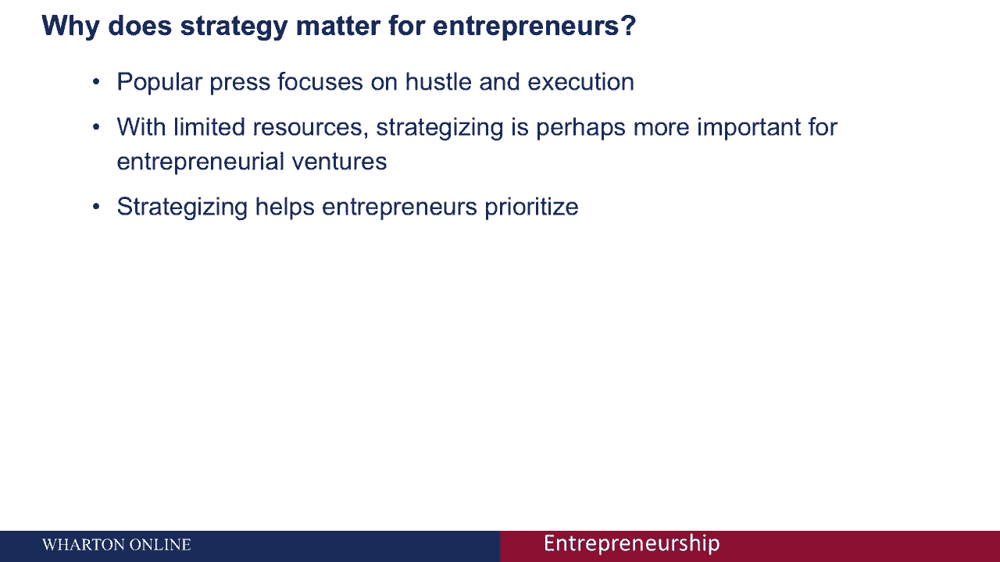
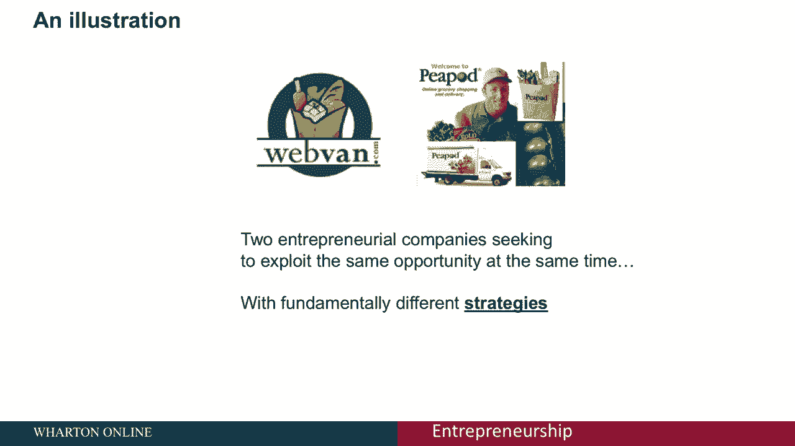
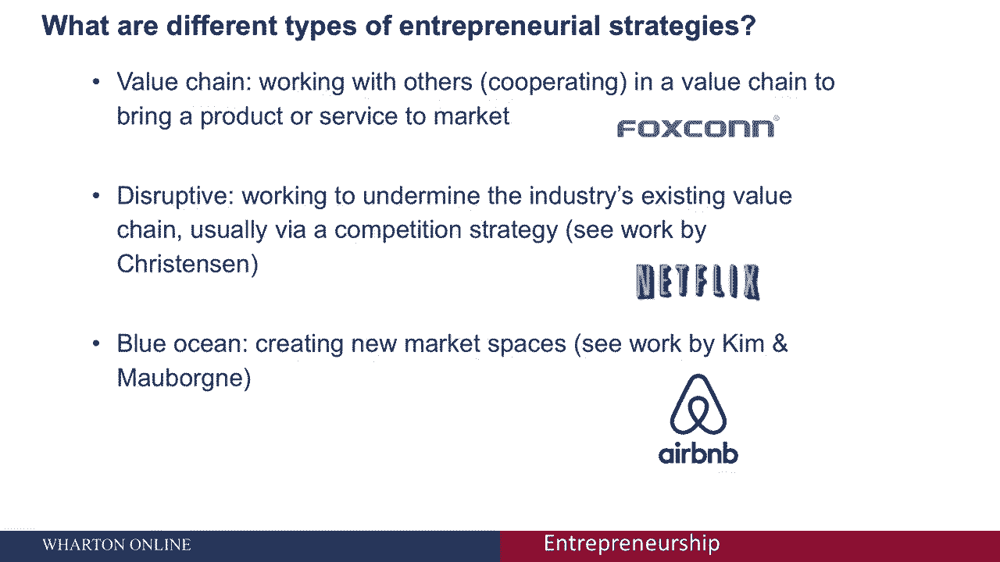
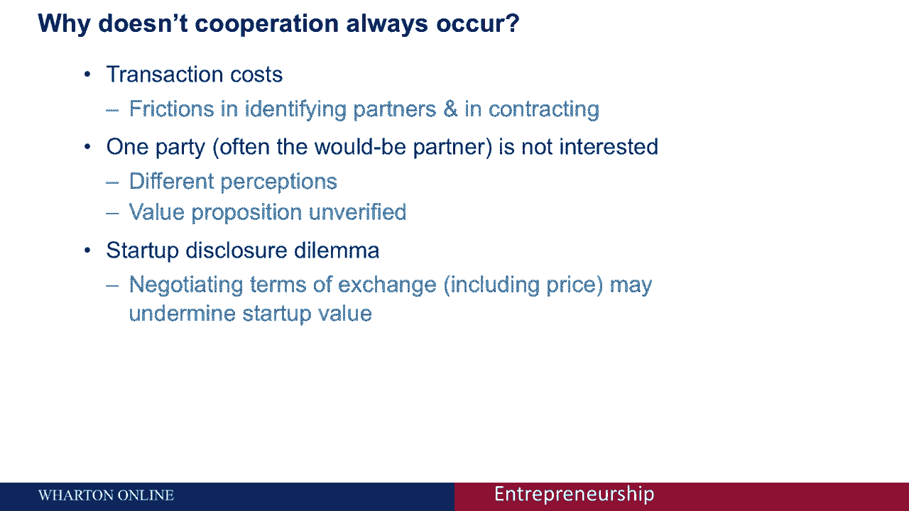
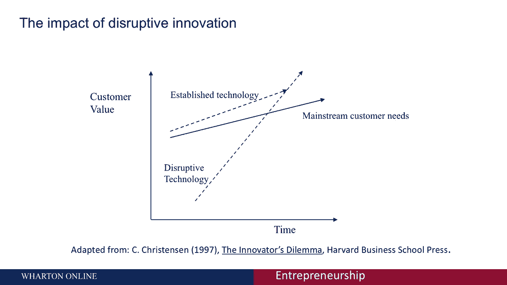
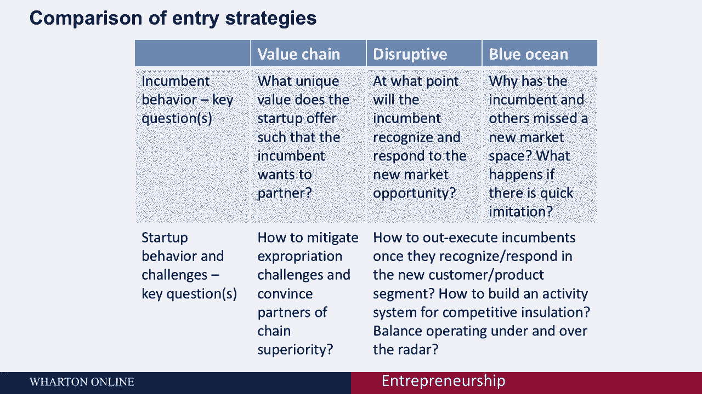
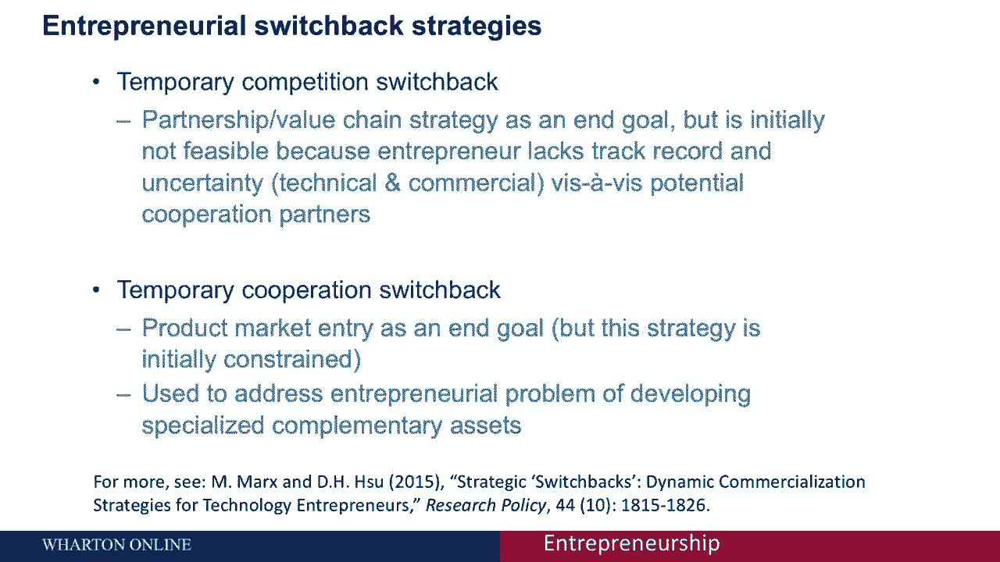
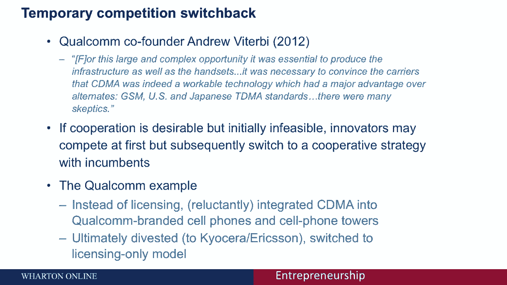

# 创业战略：从理论到实践 🚀

## 课程概述

在本节课中，我们将学习创业战略的核心概念与具体策略。我们将探讨为什么战略对创业者至关重要，并深入分析三种主要的创业入门策略：价值链战略、颠覆性战略和蓝海战略。最后，我们将介绍一种动态的“转换策略”，帮助创业者在资源有限的情况下灵活应对市场挑战。

---

## 为什么战略对企业家至关重要？🤔

在商业媒体上，我们常看到关于成功创业的报道。一种极端的观点认为，成功源于“埋头苦干”和击败竞争对手，战略似乎不那么重要。另一种极端的观点则认为，由于创业者的资源极其有限，制定周密的战略、预测竞争对手的反应、并建立一套关于自身成功原因的理论假设，比单纯执行更为重要。这些理论假设将补充你的执行力，帮助你与更成熟的竞争对手抗衡。归根结底，拥有一个清晰的战略，能帮助创业者在起步阶段就明确优先级，专注于为成功进入市场所必须完成的核心任务。

---

## 战略选择的真实案例：Webvan与Peapod 🛒

让我们看一个真实案例。回到1999年，一家备受瞩目的公司WebVan试图通过在线杂货配送颠覆行业。它消耗了大量风险资本，但最终失败了。其战略是直接挑战并试图取代现有的行业巨头。

大约同一时期，另一家公司Peapod成立了。它的策略并非替代现有杂货连锁店，而是作为它们的补充。Peapod允许顾客通过网站订购杂货并由合作商店配送。其营销重点不是“取代杂货店”，而是成为它们的“在线部门”。这家公司最终取得了成功。

这里的教训是：两家初创公司都试图抓住互联网兴起带来的同一创业机会，却因采用了截然不同的战略而结果迥异。

---

## 三种核心创业入门策略 🧭

基于以上案例，我为创业者提出三种不同的核心战略。

### 1. 价值链战略

这种战略的核心是与行业现有企业（“在位者”）合作，强化他们已经建立的价值。创业者在价值链的某个环节进行创新，并与在位者互补。

**公式表示：** `初创企业创新 + 在位者下游资产 = 合作共赢`

例如，富士康为苹果和亚马逊生产iPod、iPhone和Kindle。它专注于制造环节的创新，与拥有品牌、设计和渠道的行业巨头合作。

### 2. 颠覆性战略

这种战略更类似于WebVan的路线，旨在通过引入一个全新的平台或价值链来破坏现有市场格局。

**核心概念：** 颠覆性技术最初在主流性能指标上不如现有技术，但其改进速度更快，最终能超越并满足更广大市场的需求。

例如，Netflix最初通过邮寄DVD进入市场，其便利性和片库广度不如传统音像店，但它基于订阅的模式和后来的流媒体技术，最终颠覆了整个影视租赁行业。

### 3. 蓝海战略

这种战略旨在完全避开竞争，开创一个全新的、未被开发的市场空间。

**核心概念：** 创造新的市场需求，而非在现有市场中争夺份额。

例如，Airbnb创造了一个全新的“共享住宿”市场类别，它并非直接与传统酒店竞争，而是开拓了“住在当地人家中”这一此前未被充分开发的需求。

---

## 哪种策略更有效？来自“独角兽”的数据 📊

“独角兽”指估值超过10亿美元的私营公司。我们对140家独角兽公司的分析显示，**价值链战略**的使用频率远高于颠覆性战略。这一数据表明，与在位者合作可能是一种非常重要且有效的策略，而不仅仅是媒体常报道的颠覆性策略。

---

## 深入探讨：价值链战略的利弊 ⚖️

强调价值链战略，本质上是强调“合作”而非“竞争”。

**合作的好处包括：**
*   **分工明确：** 初创企业专注于其最擅长的上游创新，而在位者利用其成熟的下游资产（如制造、分销、营销）将产品推向市场。
*   **社会效益：** 避免重复投资，实现社会层面的高效分工。

**然而，合作也存在摩擦：**
*   **交易成本高：** 寻找合适伙伴、签订复杂合同、明确权责利的过程成本高昂。
*   **信念分歧：** 双方可能对创新的价值或前景判断不同。
*   **披露困境：** 初创企业需要向潜在合作伙伴披露信息以促成交易，但这可能削弱其自身的议价能力。

电影《天才闪光》就讲述了一位发明家试图向汽车公司推销其改进的雨刷技术，却遭遇怀疑和拒绝的故事，这凸显了与在位者谈判的挑战。

**对于初创企业的额外考虑：** 如果你有志于未来成长为一家成熟企业，掌握生产等下游能力至关重要。长期仅通过“保持距离”的合作方式，可能不利于你学习这些必要技能。

---

## 深入探讨：颠覆性战略的核心 📈

上一节我们讨论了合作战略，本节我们来看看与之形成对比的竞争策略——颠覆性战略。

哈佛商学院克莱顿·克里斯坦森教授的研究揭示了颠覆性技术的典型模式：
*   与现有技术相比，**颠覆性技术初期在关键性能指标上表现更差**。
*   但它的**性能改进轨迹比现有技术陡峭得多**。
*   最终，当它的性能足以满足主流市场需求时，便实现了对现有市场的颠覆。

以Airbnb为例（它也具有蓝海特性），初期它提供的是“睡沙发”的体验，在舒适度、安全性等关键指标上远不如希尔顿等传统酒店。因此，酒店业在位者并未将其视为威胁。但Airbnb在房源多样性、本地体验、价格等方面的改进速度极快，最终其提供的价值组合满足了庞大消费群体的需求，从而颠覆了酒店业。

像Netflix、Airbnb、Uber这样的公司，其希望在于：当行业在位者意识到颠覆来临时，为时已晚，因为市场已被侵蚀。

---

## 策略对比与挑战总结 📋

以下是三种战略的对比总结，涵盖了在位者与初创企业双方面临的挑战：

| 战略类型 | 在位者的核心挑战/疑问 | 初创企业的核心挑战/疑问 |
| :--- | :--- | :--- |
| **价值链战略** | 为什么要与你合作？ | 如何防止创意被侵占？如何让合作伙伴相信合作的价值？ |
| **颠覆性战略** | 何时会醒来并做出反应？ | 当在位者醒来并激烈竞争时，你如何保护自己并执行计划？ |
| **蓝海战略** | 为何会错过这个新市场机会？ | 如何执行并建立壁垒，防止在位者快速跟进？ |

---

## 引入新概念：创业者的转换策略 🔄

在讨论了三种基本战略后，我们引入一个新概念：**转换策略**。很多时候，创业者可能无法直接采用理想的合作或竞争策略。这类似于登山，最直接的路线可能受阻。

因此，一种可行的策略是“迂回前进”：先采取一种策略，为最终实施目标策略创造条件。这就是**企业家的转换策略**。

### 1. 暂时性竞争转换

**目标：** 最终与在位者合作（价值链战略）。
**困境：** 在位者不相信你的创新或能力。
**解法：** 先以竞争姿态进入市场，用实际产品证明你的创新是真实可行的。一旦证明了价值，合作便会更容易达成。

**案例：高通**
高通发明了CDMA通信技术，但初期没有运营商相信其可行性。于是，高通自己投入巨资建设网络和手机来证明技术可行。在技术得到验证后，它便剥离了这些重资产业务，转型为一家专注于知识产权授权和芯片设计的公司，与各大手机厂商（在位者）合作。

### 2. 暂时性合作转换

**目标：** 最终在市场上独立竞争（颠覆或蓝海战略）。
**困境：** 初创企业缺乏独立竞争所需的制造、营销等下游“互补资产”。
**解法：** 初期先与在位者合作（如做代工、联合开发），在此过程中学习并积累必要的组织能力。待能力成熟后，再终止合作，推出自己的品牌参与竞争。

**案例：宏碁**
宏碁早期为戴尔等公司做代工（OEM），后来升级为原始设计制造商（ODM）。通过与一流品牌合作，它逐步积累了设计和制造能力。最终，宏碁推出自有品牌，成为全球知名的消费电子公司。

**其他案例：** 生物科技公司Genentech早期也是通过与大型药企合作将其首款胰岛素产品推向市场，后期才成长为拥有强大独立研发和品牌能力的公司。

---

## 课程总结 🎯

本节课我们一起学习了创业战略的核心框架。
1.  我们首先明确了**战略对资源有限的创业者至关重要**，它能帮助明确优先级。
2.  通过WebVan和Peapod的案例，我们看到了**不同战略导致不同结果**。
3.  我们深入分析了三种核心创业入门策略：
    *   **价值链战略**（合作互补）
    *   **颠覆性战略**（竞争替代）
    *   **蓝海战略**（开创全新市场）
4.  数据表明，**价值链战略在成功独角兽公司中应用广泛**。
5.  我们探讨了每种战略的利弊与核心挑战。
6.  最后，我们引入了灵活的**转换策略**，包括“暂时性竞争转换”和“暂时性合作转换”，为创业者在无法直击目标时提供了迂回达成战略目标的路径。

理解这些战略，并能够根据自身资源、能力与市场环境灵活运用或组合它们，是创业者制定有效商业计划、应对激烈竞争的关键。