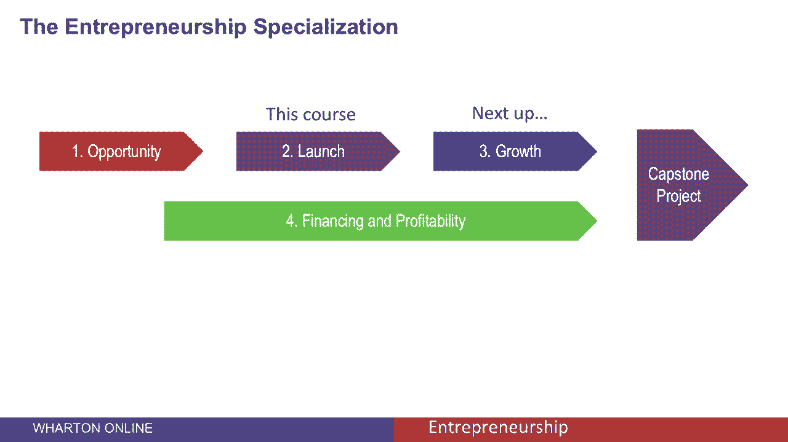

# 【沃顿商学院】创业 四部曲：发现机会、建立公司、增长战略、融资和盈利 - P59：[P59]04_4-5-course-wrap-up - 知识旅行家 - BV19Y411q713

大概，为这门课程做启动你的创业，本课程是四门课程组合的一部分，第一个课程是发展机会，那么这门课程启动你的初创企业接下来是增长策略，第四个课程是融资和盈利，在你完成那四门课程之后。

你可以把你在顶点项目中学到的东西应用起来，这让你抓住了一个你已经确定的机会，开发它，并为实际启动您的业务制定一个计划。

我们从一个有效的机会开始了这门课，本课程为你提供了进入市场所需的工具，然后开始销售产品，我们将转向挑战，你如何获得客户，你如何发展你的业务。
