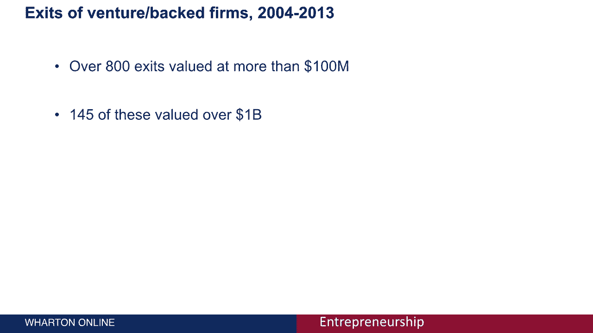

# 创业课程 06：创业在社会中的角色 🏢

在本节课中，我们将学习一个简化的模型，用以理解创业活动在社会经济体系中的位置和价值创造过程。我们将重点关注几个核心参与者，并分析相关的统计数据。

为了系统地思考创业在社会中的作用，我们需要建立一个非常简化且风格化的模型。这个模型只包含整个生态系统中极小但关键的一部分行为者，以便我们能集中分析几个核心实体。通过这个模型，我们可以审视相关数据，真正理解创业所创造的价值。

## 核心参与者模型

上一节我们提到了一个简化的分析框架，本节中我们来看看这个模型中的具体参与者及其互动关系。

模型主要包含三个核心实体：**创业公司**、**风险投资**和**老牌公司**。它们之间存在两种主要的流动：**资金流**和**人才流**。

以下是模型中各参与者的角色：

*   **企业家与创业公司**：他们是新想法的来源和创始团队，是价值创造的起点。
*   **风险投资**：为许多具有高增长潜力的初创企业提供必要的资金。资金流在模型中通常用**绿色箭头**表示。
*   **老牌公司**：指已经成立的公司。除了可能投资与其业务互补的初创企业外，它们还是重要的人才来源。人才从老牌公司流向初创企业的过程，在模型中用**红色箭头**表示。

## 人才流动：老牌公司的“衍生”效应

我们已经介绍了资金从投资者流向创业公司。接下来，我们探讨另一种关键流动：人才。

我们在其他模块讨论过，老牌公司在面对颠覆性创新时容易表现出“惯性”。这些公司的专业人才可能会感到被这种惯性所限制。当他们渴望追求新技术或新想法时，最终可能导致一部分人离开，去创立自己的公司或加入能实践这些想法的实体。

这种现象在科技领域尤为常见。一个经典的历史案例是硅谷的**仙童半导体公司**。仙童公司孕育了许多著名的半导体公司，其成员离开后创建了新的企业。例如，**英特尔**就是仙童的“后代”之一。当然，这不仅仅发生在高科技公司。在专业服务领域（如咨询公司），合伙人离开并创立新公司的情况也屡见不鲜。其核心思想是：**老牌公司会产生“后代”初创企业**。

## 创业创造的价值：就业与公司

在了解了参与者如何互动后，让我们聚焦于创业活动本身所创造的价值。首先，我们关注新企业创造的直接价值：就业机会和企业数量。

根据考夫曼基金会的数据，2014年约有**3%** 的美国成年人是企业家。作为对比，同年美国自营职业者（拥有某种企业）的比例是**0.3%**。虽然3%听起来是个小数字，但美国成年人口基数庞大。实际上，美国有超过**2800万**家企业，其中超过**99%** 被定义为小企业（员工少于250人）。根据小企业协会的数据，美国私营部门**60.7%** 的就业机会是由这些小企业创造的。

在高科技领域，这个比例较低，但依然显著：高科技初创企业贡献了美国私营部门约**30.7%** 的就业机会。这表明，许多就业岗位确实是由创业活动产生的。

## 创业创造的价值：独角兽与高价值退出

除了创造就业，创业也通过催生高价值公司来创造财富。近年来，许多注意力集中在所谓的“独角兽”公司上——即估值超过**10亿美元**的初创企业。

“独角兽”这个名字本身就暗示了其稀有性。虽然独角兽公司的数量在增长，但依然罕见。在所有获得风险投资的初创企业中，只有不到**2%** 最终能成为独角兽。目前存在的80多家独角兽公司，其估值分布极不均匀：大多数估值集中在10亿至20亿美元之间，而像**Uber**这样的离群值估值则超过400亿美元。值得注意的是，约**65%** 的独角兽估值是“纸面财富”，基于融资条款，尚未通过上市或收购实现。

我们可以进一步审视“退出”的统计数据。“退出”指公司通过**首次公开募股**或**被收购**实现价值变现。在2000年至2013年间，所有获得风险投资的公司中，有超过800次退出价值超过1亿美元，其中145次退出价值超过10亿美元。重要的是，这些高价值退出中，**75%** 发生在广义的信息技术领域，这些交易占据了总退出价值的**86%**。由此可见，科技领域是创造巨额价值的主要阵地。而价值创造的第二大行业是医疗保健。

---

在本节课中，我们一起学习了创业在社会中的角色。即使通过最简单的初创企业、老牌公司和投资者模型，我们也可以看到创业活动是就业机会的重要来源，并且在科技等领域创造了巨大的经济价值。理解这些基本的互动关系和统计数据，是认识更复杂创业生态系统的第一步。