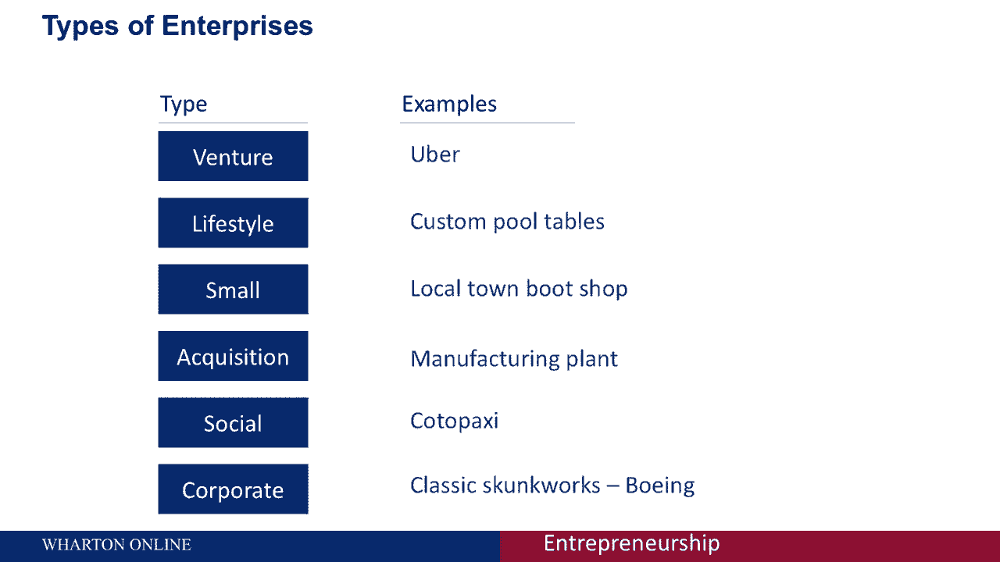

# 🏢 创业四部曲 P7：五种企业类型详解

在本节课中，我们将学习五种常见的企业类型。我们将探讨每种类型在商业影响、融资方式、增长预期和生活方式方面的特点，帮助你理解如何根据个人目标选择合适的企业模式。

选择企业类型时，需要重点考虑三个核心要素：**价值创造**、**价值分配**和**业务范围**。价值创造指你通过日常活动为客户创造价值的方式；价值分配关注财富在所有投资方之间的分配；业务范围则是指你触达和服务目标客户的能力。

例如，一家本地理发店能创造价值（提供理发服务），但其业务范围有限，难以服务大规模人群。相反，一个手机应用可能拥有巨大的可扩展性，能触达数百万人，但关键在于它是否能创造出用户愿意付费的价值。你需要平衡商业期望与个人目标。

以下是五种最常见的企业类型，每种都会对你的商业和生活方式产生不同影响。

## 💰 1. 风险投资支持的初创企业

这是一种高成长性企业，旨在为创始人和投资者带来巨大回报。

**商业与融资影响：**
这类公司诞生时规模通常很小，但被设计成能迅速扩大，常被称为“可扩展的初创企业”。它们通常遵循硅谷模式，依赖多轮天使投资或风险投资，并从一开始就规划了退出策略，因为投资者期望收回资金。

**增长与生活方式影响：**
公司被期望快速增长以实现退出。创始人的个人生活往往退居次位，“必须增长”的心态可能带来巨大压力，影响生活方式，甚至需要你为业务增长付出一切。

**典型例子：**
优步（Uber）就是一个典型例子，它早期获得了大量风险投资，并被寄予快速增长的厚望。

## 🏝️ 2. 生活方式型企业

这类企业的商业抱负直接由创始人期望的生活方式驱动。

**商业与融资影响：**
创始人对企业最终规模（收入或利润）有清晰规划。融资通常来自创始人自身、亲友，有时是银行贷款，一般不涉及正式的外部私人投资者。

**增长与生活方式影响：**
企业会增长以覆盖股权或债务成本，但当达到创始人理想的生活方式时，增长通常会停止。通常没有正式的退出计划，创始人经营企业是为了维持其想要的生活方式。这类企业通常能实现较好的工作与生活平衡，因为创始人用更高的增长潜力换取了生活方式。

**典型例子：**
夏威夷的一家潜水店，让一位业余海洋学家能将工作与对海洋的热爱结合，虽然利润不高、增长潜力有限，但满足了创始人的个人追求。

## 📈 3. 有机增长型企业 / 主流街边企业

这类企业专注于经营一项稳定、可管理的业务。

**商业与融资影响：**
创始人通常专注于开办并运营一家实体店，而非追求财务上的高增长。融资方式与生活方式型企业类似，多来自创始人或亲友。

**增长与生活方式影响：**
增长目标通常是支付成本并为经营者提供回报，而非为扩张融资。可能没有正式的退出设想，创始人经营企业是为了养家糊口和维持某种生活方式。虽然可能实现工作与生活平衡，但经营小企业本身也伴随着压力和长时间工作的可能。

**典型例子：**
每个社区都有的甜甜圈店、点心铺或家庭经营的家具作坊，它们是社区的固定设施，目标是为经营者带来最大回报。

## 🔄 4. 收购型创业

通过购买现有业务进入创业领域。

**商业与融资影响：**
创业者寻找有吸引力但可能表现不佳的企业，通过购买和运营来提升其价值。融资可由创始人、亲友完成，大型收购可能涉及私募股权等更大规模的私人资金。

**增长与生活方式影响：**
增长与创始人的抱负及投资者需求挂钩。如果收购是为了获取现金流，创始人可能跳过了压力巨大的初创阶段。但关键在于**尽职调查**，就像买房买车一样，需要彻底了解潜在问题。

**典型例子：**
收购一家运营良好的制造公司，如果你能发现并解决其运营低效问题，就能为自己创造更多价值。

## 🌍 5. 社会型企业

这类企业追求社会影响力，同时也可能包含盈利使命。

**商业与融资影响：**
创始人追求增长和利润，以支持更广泛的社会使命。融资通常通过创始人、亲友完成，某些情况下也可能获得天使或风险投资。

**增长与生活方式影响：**
增长预期取决于创始人和投资者。退出通常侧重于实现特定的社会目标，而非财务上的正式退出。生活方式影响很大程度上取决于企业类型、影响范围及其融资状况。

**典型例子：**
Cotopaxi 是一家共益企业（B Corp），它将财务使命与社会使命相结合。

## 🎯 如何选择：明确你的目标

我们已经详细讨论了五种不同的企业类型。首先需要问自己的问题是：**你的目标是什么？**

*   你想建立下一个谷歌或Facebook吗？即，你的目标是**快速增长**吗？
*   你只是想自己做主，让事情保持简单可控吗？
*   你希望积累大量财富，还是适可而止？
*   你还不确定，但想先投入试试？
*   你的主要动力是**帮助他人**吗？
*   或者，你希望在一个现有的大型组织内部进行创新？

正如我们所看到的，将以下三者结合起来考虑至关重要：
1.  **你选择的企业类型**
2.  **启动企业的需求**
3.  **你的个人目标与期望的生活方式**

---

本节课中，我们一起学习了五种主要的企业类型：风险投资支持的初创企业、生活方式型企业、有机增长型企业、收购型创业以及社会型企业。理解每种类型在商业、融资、增长和生活方式上的特点，是做出明智创业选择的第一步。请根据你的个人抱负和生活方式偏好，仔细权衡这些选项。