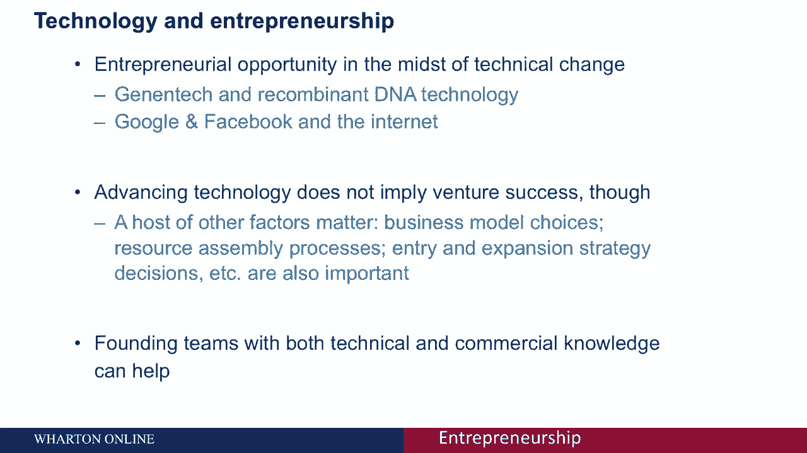
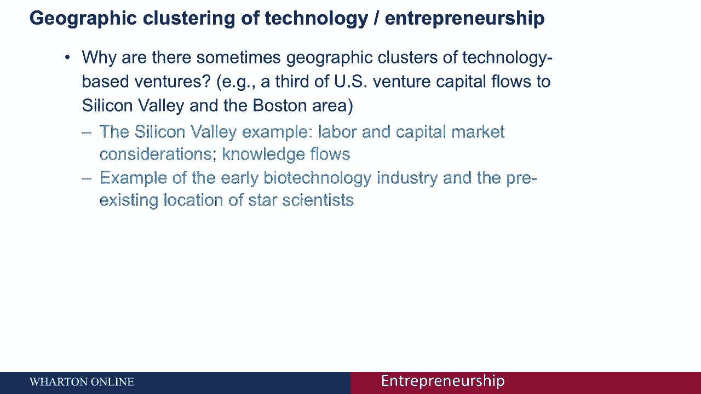
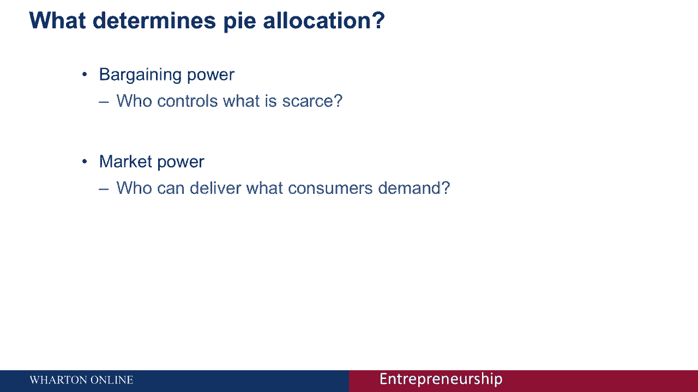
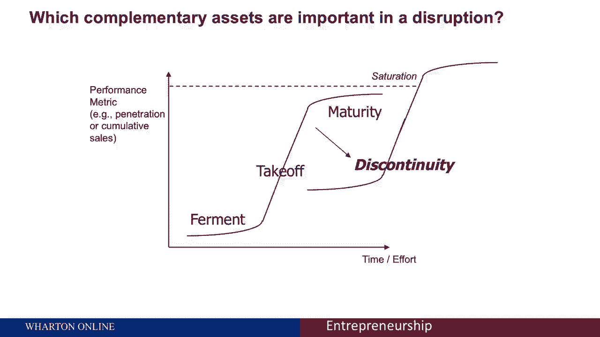
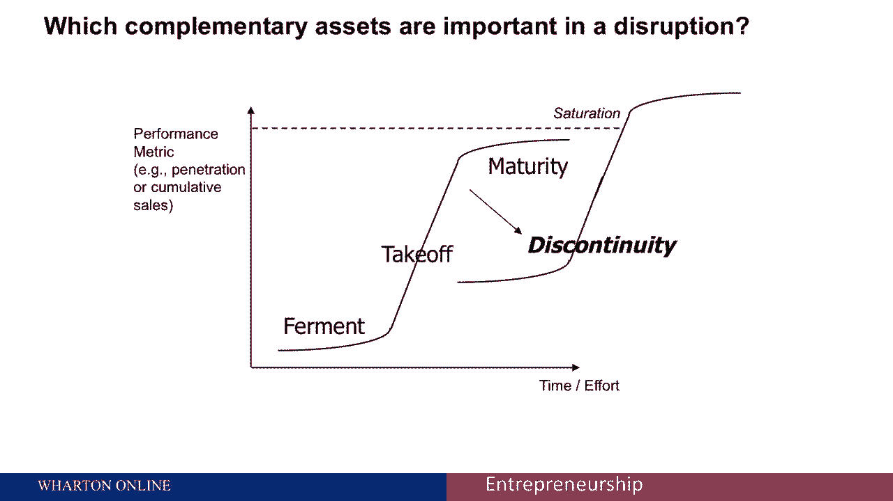
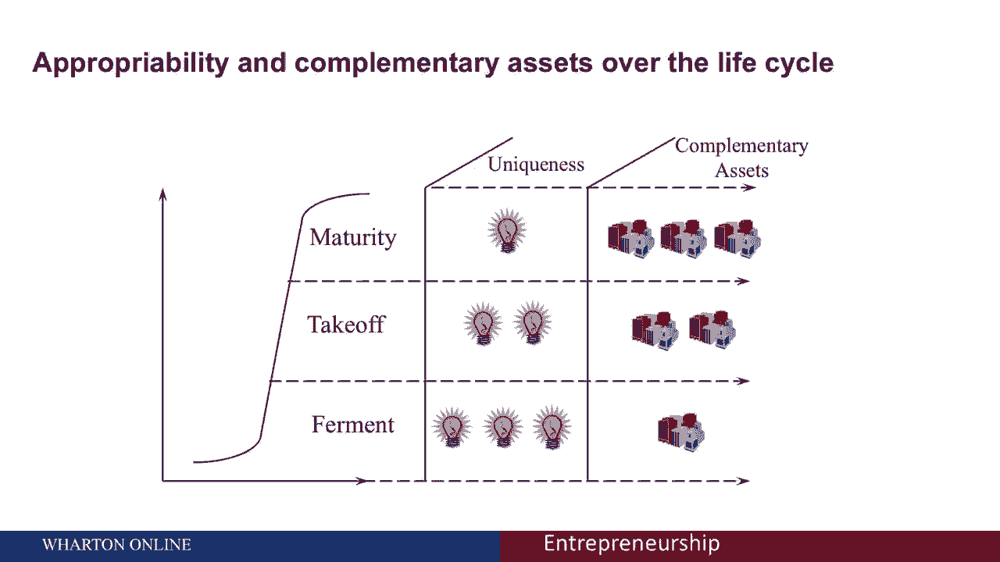

# 🚀 沃顿商学院创业课 P8：技术创业的核心要素与挑战

在本节课中，我们将探讨技术创业的独特之处。我们将了解技术如何催生创业机会，以及除了技术本身之外，哪些关键因素决定了创业的成败。课程还将分析技术生命周期、价值获取策略以及行业演变对创业者的影响。

---

## 🔍 技术变革与创业机会

技术领域的创业有一个有趣的方面：有时是技术本身发生变化，或者技术能够带来创业机会。

为了说明这一点，我们都知道这些例子。互联网的兴起使得像谷歌或脸书这样的公司登上舞台。像DNA重组这样的技术进步，则为像Genentech这样的公司进入市场提供了机会。

然而，仅仅因为存在一项先进技术，并且你认识到了这项技术进步，并不能确保你能够建立一家商业上成功的公司。

在决定这种成功方面，还有许多其他决策至关重要。例如**商业模式设计**、你所整合的资源选择、招聘关键人员和行政人员的能力、以及进入和扩张的节奏。所有这些类型的决策都相当重要，而不仅仅是对创业机会的识别。

在预测技术进步所能带来的商业成功方面，这些因素同样关键。

---

## 👥 团队构成与集群效应

此外，有一件事尤其在技术领域对我们有帮助。当我们谈论技术创业时，为创始团队或早期高管配备人员时，应同时具备商业和技术专长。因为处于这两个维度的前沿会有所帮助，学术研究已经证明了这一点。

现在有一个有趣的现象，这在某种意义上是“硅谷现象”。为什么会出现我们的科技创业集群？这有几个原因。一个标志是：美国约三分之一的风险资本仅流向两个地区——硅谷和大波士顿地区。你可能会想为什么会这样。

如果你从匹配的角度来考虑，劳动者和资本知道关注哪里。它就在这些拥有大量知识的地区，这些知识在公司的诞生和发展中很重要。希望利用某一特定创新或将其商业化的公司会聚集于此。

仅举一个具体的例子：在美国生物技术产业诞生之际，所有早期的生物技术公司都位于前沿知识所在的地方，即当时著名学术机构的科学家所在地，因为那是专业知识所在的地方。随着行业的发展，地理位置限制有所缓解，但在行业刚开始的时候，这种共同的位置并非偶然。

---

## 📊 技术创业的经济影响

就技术创业的经济重要性而言，这是一种激励。以下是一些关于私人和公共价值的统计数据。

研究发现，在20世纪80年代至90年代上市的所有公司中（大约有7900家公司），其中约36%是风险投资支持的。现在，风险投资支持和基于技术的创业并不完全等同，但这是一个很好的代理。原来约58%的科技公司首次公开募股是由风险资本支持的。

我们知道一些轶事：比尔·盖茨、史蒂夫·乔布斯、马克·扎克伯格，这些都是影响力巨大的成功科技企业家。还有二阶效应：一旦你创造了一家非常成功的科技公司，就会产生各种下游影响。

例如，谷歌在首次公开募股之后，催生了许多非常富有的人。他们后来成为天使投资者，即对许多其他公司进行私人和个人投资的个人。众所周知的“PayPal黑手党”也是如此，其中许多成员，如里德·霍夫曼，都成为了著名的企业家，符合这种模式。

---

## 📈 技术采用的生命周期

如果你考虑技术生命周期，你可以用典型的S形采用曲线来描述。

与这条曲线相关的有三种不同的模式：
*   **初期发酵阶段**：一开始，有相当多的实验。你付出了很大的努力，却没有很大的进步，这解释了相当平缓的初期发酵曲线。
*   **起飞阶段**：然后事情突然就位了。你能想出一个吸引市场主流的设计，你会获得吸引主流的网络效应，这真正使产品或服务因为用户基数的大小而更有价值。想想Facebook，它之所以更有价值，正是因为你所有的朋友都在这个网络上。这导致了这段起飞时间。
*   **饱和阶段**：最后有一个饱和点。这可能是因为你已经利用了社交网络可以覆盖的所有人，或者存在物理限制。风不会吹得更快，所以你的帆船从根本上受到了限制。

这是商业领域技术发展的典型模式。

---

## ⚠️ 生命周期中的关键挑战

现在有一些与这些过渡点相关的挑战。

**从发酵期到起飞期**：这个特定的转折点真的试图吸引主流。你可以开发一个非常利基的产品或服务，真正只吸引早期采用者或创新者。但这不足以真正“跨越鸿沟”，正如杰弗里·摩尔的名著所述，去真正吸引主流并进入最大的市场份额市场。

你可能会想，尤其是在更多的技术环境中，你如何成为一个平台玩家？你如何诱导我们之前谈到的那些网络效应？这样你就更有可能成为下一个LinkedIn，避免像Friendster或MySpace一样被颠覆。这需要什么？可能是加入你网络的低门槛或补充程序，或者真正服务于被行业现有者忽视的服务不足的市场空间，这样你就可以成为下一个真正增加价值的iTunes平台。

---

## 🥧 价值获取与议价能力

就试图达到你可以提取价值的地方而言，因为毕竟，这里有一个与典型技术创新价值创造方面相关的供应链或价值链。作为这个链条中的创新者或发明家，你需要担心的是你能分到多大的“馅饼”。

让我们来讨论是什么决定了“馅饼”的大小。作为这一价值链的一部分，本质上存在两种结构：**议价能力**和**市场力量**。在某种程度上，你能够增加你作为发明者或作为这个价值链一部分的影响力，你期望得到的馅饼就越大。

想想这个：你在其他可以进入这个领域的人的竞争空间中有多独特？这反过来会塑造你有多独特，以及你现在有多大的讨价还价和市场力量。

---

## 💪 塑造市场力量的三大因素

如果市场和议价能力真的决定了你作为发明者或价值链中任何其他参与者得到的馅饼大小，那么是什么塑造了这种力量？主要有三件事：

1.  **专有性**：你能控制你创造的知识吗？
2.  **互补性资产**：在提取价值方面很重要的资产，能提高你与他人讨价还价的能力，或者提供与你相似的功能。
3.  **行业演进阶段**：尤其是“主导设计”的概念。

现代的主导设计将是iPhone。在iPhone问世后，每一部智能手机都必须看起来具有iPhone的特点和功能。在iPhone之前，有很多种配置。我们可以覆盖和以前相同的例子：在汽车工业的早期，福特T型车前后。在福特T型车之后，要成为一辆合法的汽车，它必须看起来像我们现在所知的汽车。在主导设计出现之前，你有各种各样的实验和假设关于一辆车应该是什么样子。

这三个因素将塑造一个参与者在价值链中的市场和议价能力。

---

## 🔬 三大因素的深入解析

现在让我把这三个因素分开，再详细一点。

**1. 专有性**：这是什么？如果你能适当地利用和控制你从一项发明中创造的知识，那么你就能够真正地掌舵并控制知识的用途。它本质上是一种通过知识产权等形式保护你所创造知识的独特性和控制力，这样你就可以防止别人进来复制你所做的。

**2. 互补性资产**：本组织的其他资产，这怎么会重要呢？想想一个行业的颠覆时刻，有一个新的平台或新产品就位了。

给大家举个例子：在生物技术引入之前，药物发现是以非常传统的方式进行的。随着生物技术的出现——一种引入药物发现的非常不同的方式——尽管潜在的科学是相当具有颠覆性的，但行业的现有者实际上免受生物技术的竞争压力。为什么？因为老牌制药公司控制了互补性资产，即FDA（联邦药品管理局）的审批流程以及市场营销（医生会告诉最终的消费者——病人服用什么药物）。因为在药物发现的层面上出现了颠覆，但在互补性资产一级，组织保存了这些资产，这对保护制药公司相对于面对新药物发现方式（但不是以最终消费者消费这些药物的方式）的生物技术新进入者的议价能力非常重要。

**3. 行业演变**：我谈到了主导设计之前和之后。重要的是，如果我们结合其他结构——我们通过专有性谈论独特性，以及互补资产的作用——这里有趣的是：在行业进化的开始阶段（即发酵时代），控制思想很重要，而互补资产在获取价值方面不那么重要。但是走向饱和时代时，这些力量的相对重要性几乎相反。也就是说，谁控制思想不再那么重要，但谁通过组织资产和互补资产来提供这些产品和服务变得非常重要。

---

## 📝 总结

本节课中，我们一起学习了技术创业如何成为一个独特的切入点。技术中断时刻提供了创业机会，但有一整套关于“价值获取”的考量，当你思考如何从创新中获得回报时，这些因素至关重要。我们探讨了技术生命周期、成为平台玩家的挑战、以及决定你在价值链中分得多少价值的三大关键因素：专有性、互补性资产和行业演进阶段。理解这些，将帮助你在技术创业的道路上做出更明智的决策。