# 【沃顿商学院】创业四部曲 P9：影响企业家精神 💡

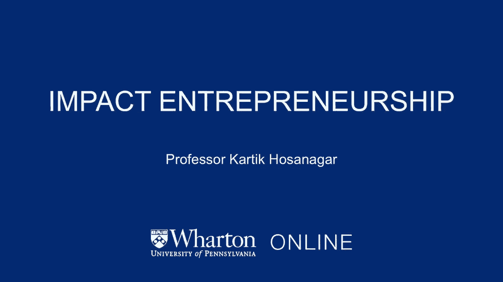

在本节课中，我们将学习“影响企业家精神”这一概念。我们将了解它与传统企业家精神的区别，其核心的三重底线原则，以及社会企业家在创业、增长和融资过程中面临的独特挑战与机遇。

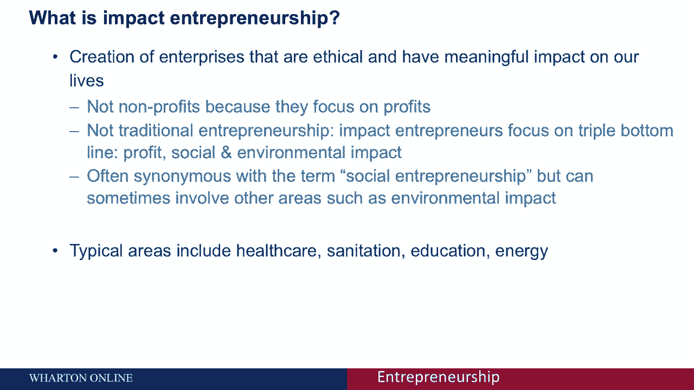

---

## 什么是影响企业家精神？🤔

影响企业家精神指的是创建有道德、透明，并对社会产生有意义影响的企业。

当我们想到一家公司对我们的生活有影响时，很自然会想到非营利组织或慈善机构。然而，影响企业家与他们不同。影响企业家专注于利润和长期的可持续性，不依赖捐助者。他们专注于通过市场策略创造社会影响。

## 三重底线：核心原则 📊

与传统企业家不同，影响企业家专注于双倍或三倍的底线。

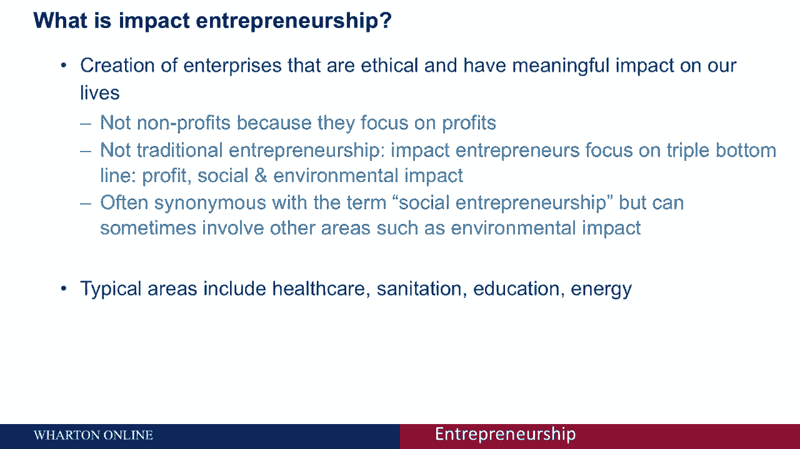

三重底线具体包括：
*   **第一条底线：利润**。这是传统的会计底线，每个企业都专注于此。
*   **第二条底线：社会影响**。
*   **第三条底线：环境影响**。

因此，社会企业或有影响力的企业的使命是多方面的。影响企业家精神是社会企业家精神的同义词，但它有时会涉及社会影响以外的其他领域，例如环境影响。

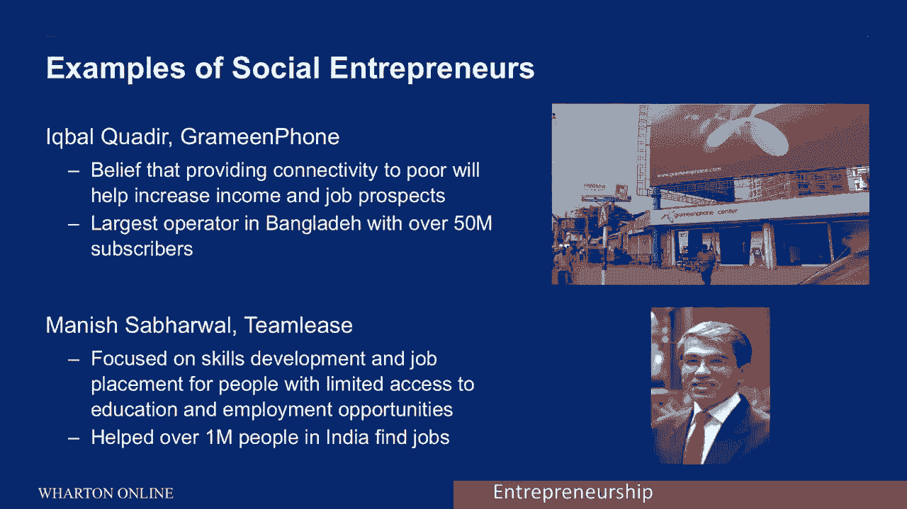

以特斯拉为例，它是一家电动汽车公司。它对环境有积极影响，并且以开源的方式向整个社会提供其专利，让其他人都可以利用特斯拉所做的研发。这再次表明，影响企业家处理的典型领域包括医疗保健、能源、环境卫生、教育等，这些领域有很大的社会影响，有时也未被充分服务。

## 著名社会企业家案例 🌟

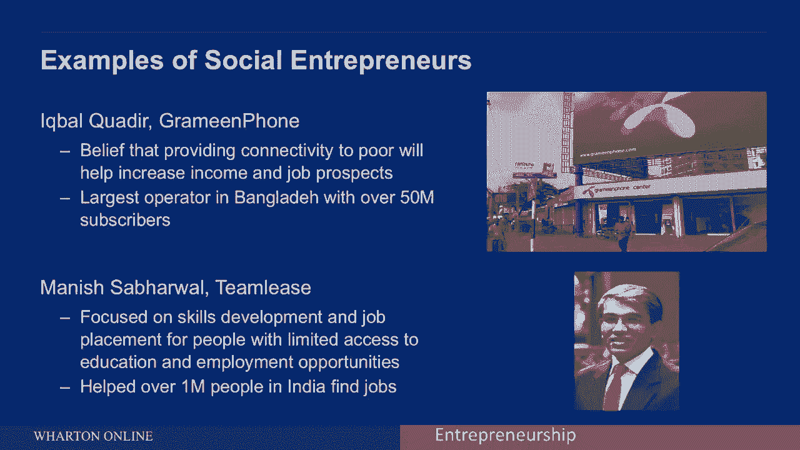

以下是几位著名的社会企业家案例：

*   **穆罕默德·尤努斯**：诺贝尔奖得主，格莱珉银行（又称乡村银行）的创始人。该公司已向800多万借款人提供了贷款，还款率超过95%。公司不依赖捐赠者，并根据这些贷款的利率实现自我维持。
*   **伊克巴尔·阿德尔**：格莱珉手机的创始人。这是一家由格莱珉银行部分拥有的公司，在孟加拉国成立的移动电话运营商。它基于为孟加拉国的穷人提供连接的信念而创立，这有助于增加他们的收入，改善生计。如今，格莱珉电话是孟加拉国最大的运营商，拥有超过5000万订阅者。
*   **TeamLease的创始人（沃顿商学院校友）**：他的公司专注于印度的技能、就业和就业能力，并帮助印度100多万人找到了工作。

请注意，在我提到的所有这些例子中，这些企业都专注于利润，它们确实是以营利为目的的企业，拥有商业模式。但同时，它们有一个非常明确的社会使命。利润焦点与社会影响焦点的结合，使它们成为社会企业家或影响企业家。

## 社会企业家的独特挑战 ⚠️

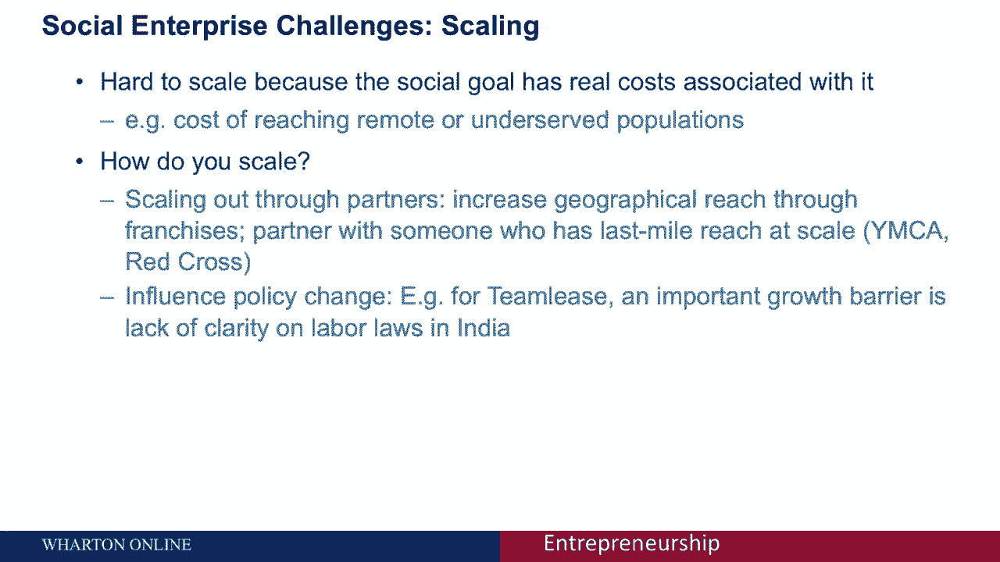

在大多数方面，社会企业家需要做与其他企业家同样的事情：解决产品市场适配问题、用有限预算雇佣人才、管理财务、思考如何增长。但同时，社会企业家确实面临一些独特的挑战。

其中一个非常重要的问题是**规模化**。扩大一个社会企业的规模并不容易，因为这些企业家通常会选择一些最棘手的问题。这些问题本身就难以规模化或增长。此外，社会目标（如向偏远地区提供服务）会带来额外的真实成本，这使得企业很难超越最初的一两个社区。

虽然扩大任何企业的规模都很难，但扩大社会企业的规模可能更难。因此，社会企业家需要考虑如何实现规模化。有几种途径可用：

*   **通过合作伙伴扩大规模**：例如，通过特许经营来增加地理范围，或者与在特定地区有“最后一英里”影响力的组织（如基督教青年会）合作。
*   **影响政策变化**：对于前面提到的TeamLease公司，推动印度的政策变化是其扩大规模的一项重大投资。

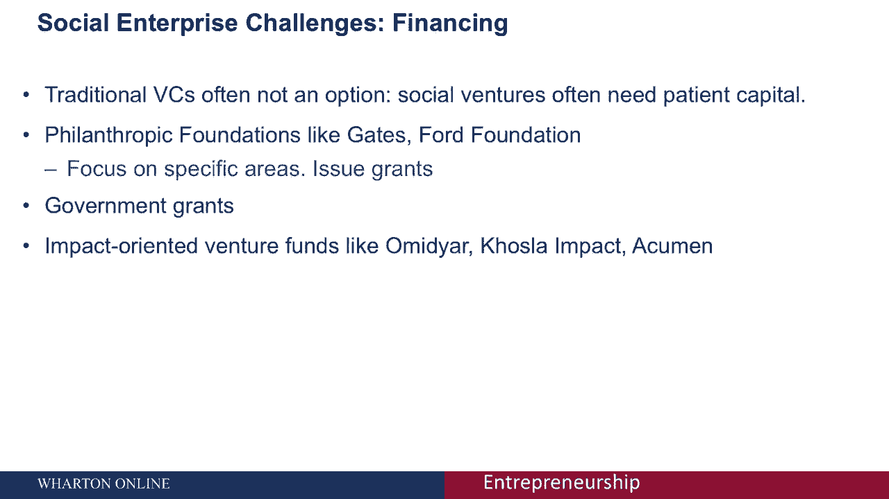

## 融资：寻找“耐心资本” 💰

社会企业家精神与传统企业家精神的另一个不同方面，是筹款和融资过程的管理方式。

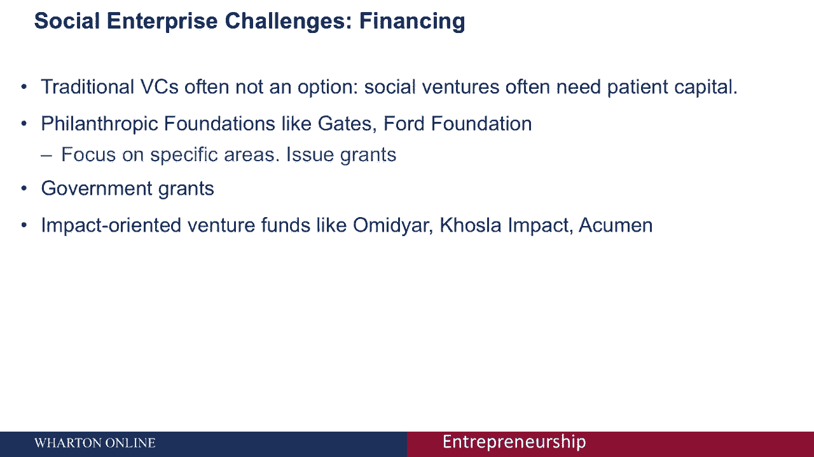

传统的风险资本家通常希望在五到七年内退出投资，因为他们的基金寿命通常不超过十年。然而，社会企业往往需要更多时间才能规模化。因此，社会企业家需要“耐心的资本”来支持增长。

当寻找耐心的资本时，你可能不会经常看到传统的风险资本家，但可以考虑以下来源：

*   **慈善基金会**：如盖茨基金会或福特基金会。它们专注于特定领域，通过发放赠款来支持项目。
*   **政府**：也是社会企业家的另一个资金来源。
*   **影响力导向的风险基金**：如Acumen Fund、Omidyar Network。这些是风险资本家，但他们愿意更有耐心，因为他们专注于社会影响。

现在很多基金都关注影响力，但它们并不总是“耐心的资本”。因此，企业家必须认真思考自己业务的可能退出时间，并将其与投资者的预期进行比较，确保它们一致。

有时，当社会企业满足一些主要标准（如庞大的市场规模和快速扩张的能力）时，它们也可以通过主流风险投资渠道筹集资金。有许多对社会产生重大影响的企业，在通过主流风投融资的意义上，是非常主流的公司。

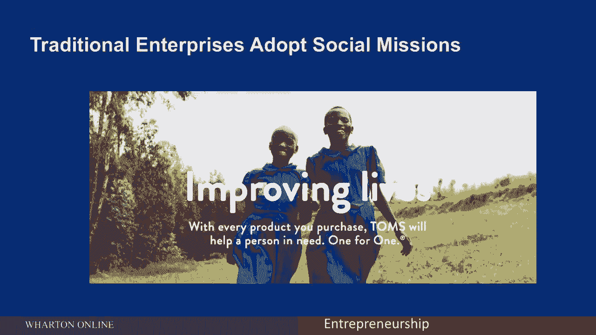

## 传统企业与社会使命的结合 🔄

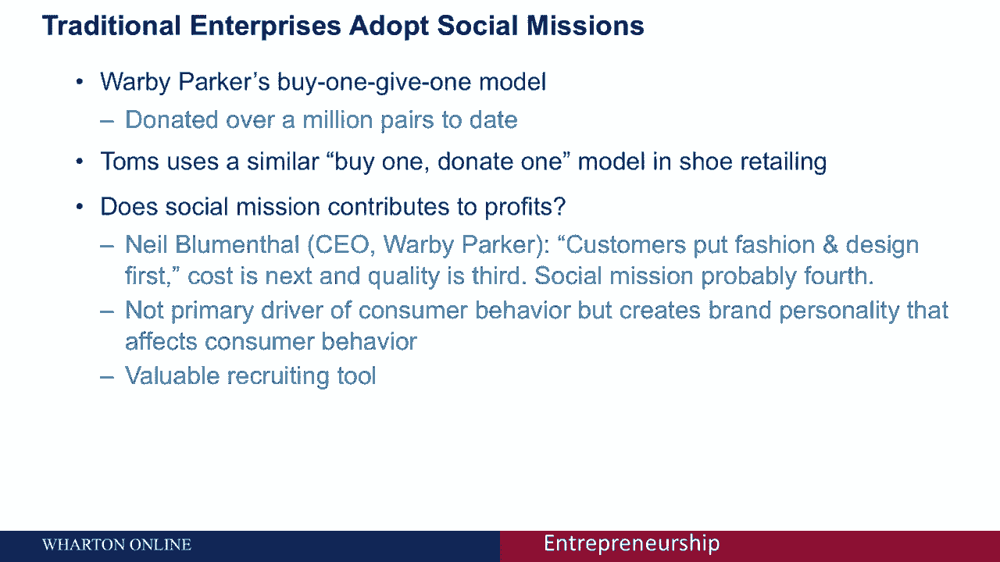

我们已经讨论了影响企业家精神。现在，人们也看到了传统企业采用社会使命的例子，这当然也是传统企业家应该考虑的。

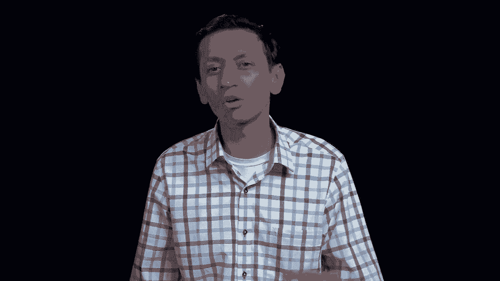

*   **Warby Parker**：一家在线销售处方眼镜的零售商。它采用“买一捐一”模式，每售出一副眼镜，就向有需要的人捐赠一副。该公司已通过此模式捐赠了100多万副眼镜。
*   **TOMS**：一家鞋类零售商，使用非常相似的“买一捐一”模式。

重要的是要认识到，这类模式确实需要资金支持。因此，关键问题是：社会使命是否有助于利润？以及如何将社会使命与公司可能拥有的其他优先事项进行排序？

Warby Parker的首席执行官（我以前的学生）表示，顾客选择眼镜时，通常将时尚和设计放在第一位，成本其次，质量第三，而社会使命可能排在第四位。显然，社会使命不是消费者行为的主要驱动力。但尽管如此，它为Warby Parker创造了某种品牌个性，而品牌个性反过来会推动消费者的选择。因为消费者越来越被目标驱动，他们意识到自己购买行为的社会影响。此外，社会使命也是一个很好的招募和留任工具，因为人们希望自己的工作能产生二次影响。

## 总结与关键原则 🎯

总而言之，如果你的想法有两倍或三倍的底线影响（对环境或社会有影响），值得问的问题是：我应该像其他企业一样经营，还是应该以不同的方式扩大业务或筹款？同时，如果你有一个传统的企业，值得一问的是：社会使命是否应该是你组织的核心使命？如果是，下一个问题是如何将社会使命与盈利模式结合起来。

从我们所看到的，有几个原则可以应用：

1.  **产品优先，使命其次**：客户首先因为你的产品解决了他们的根本痛点而选择你，之后社会使命才发挥作用。
2.  **使命必须真实可信**：仅仅因为认为有助于品牌塑造而强行附加一个使命是没有意义的，顾客能看穿这一点。
3.  **使命实现过程应简单易懂**：例如Warby Parker的“买一捐一”模式，对任何潜在客户都非常容易理解。

总之，我们在这门课中关于识别机会和发展企业的大部分内容，同样适用于社会企业。所以，如果你是一位社会企业家，请记住这些原则，并将它们应用到你的创业旅程中。

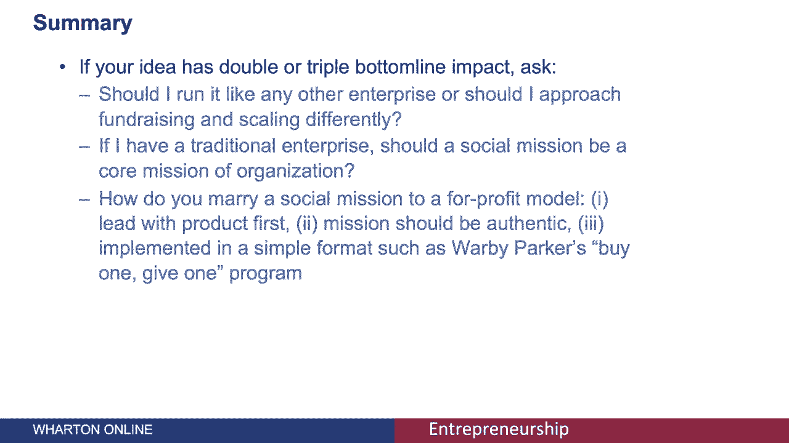

---

本节课中，我们一起学习了影响企业家精神的核心概念——三重底线，了解了社会企业家的典型案例、面临的独特挑战（如规模化）以及融资时寻找“耐心资本”的重要性。我们还探讨了传统企业如何结合社会使命，并总结了将社会使命与商业模式成功结合的关键原则。