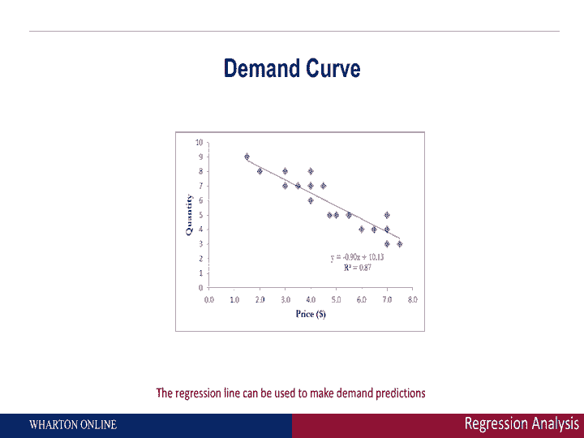

# 【沃顿商学院】商业分析 全套课程（客户、运营、人力资源、会计） - P12：[P012]03_regression-analysis-part-1-the-demand-curve - 知识旅行家 - BV1o54y1N7pm

欢迎来到客户分析，正如皮特提到的，大致上有两种方法可以考虑量化数据，一个是提前一个时期做出预测，另一个是预测未来两个以上的时期，所以在这个模块中，我们将讨论第一个在一个周期前做出预测的人，我们怎么做。

这是通过回归分析来完成的，所以我们在这个模块中要做的是讨论一个简单的例子，展示如何进行回归，展示它能做出什么预测，然后我们和皮特一起把它脱掉，谁会更多地谈论未来的两个时期，所以让我们从回归分析开始。

什么是回归，它是关于量化两个或多个变量之间的关系，让我们举一个简单的例子，假设你在看需求或人们购买的数据，你知道价格是如何变化的，我们想做的是考虑如何开始，思考价格如何改变需求，换句话说。

在后面加上一些数字，让我们来看看回归的一些行话，我们要做的是解释一个因变量在这种情况下销售或需求，作为自变量的函数在这种情况下价格，所以换句话说，我们在回归中所做的只是试图预测，不同价格的需求会是多少。

回归是一种使用简单的，线性加法模型来做出这类预测，举一个简单的例子就会变得很清楚，让我们想象一下，这是一家特定公司在不同价格下的需求数据，这家公司想做的是试图了解他们的价格是如何改变需求的。

所以他们最终改变了价格，他们观察到需求，当我们开始考虑量化关系时，我们应该做的第一件事，只是绘制数据，所以让我们来绘制它，情节是这样的，我们在这里看到了什么，在横轴上我们有价格，在垂直轴上。

我们有销售额，我们在这里看到的，这就是你直觉上期望看到的，是随着价格上涨，一方面销售量下降，很直观，很有道理，这就是你所说的需求曲线，价格上涨，销售额下降，回归从哪里来，回归给出了一些硬数字。

你可以盯着它看，随着你的价格上涨，销售额确实下降了，但我们想具体看看，换句话说，我们想回答以下问题，如果我把价格提高一美元，销售额下降了多少，这就是回归的用武之地，回归是做什么的。

试图将我们在这里看到的数据拟合成一条直线，并试图把正式的数字放在需求曲线后面，从广义上讲，我们将要谈论的，一个简单的例子是需求分析，这是回归的一个特定示例，您可以考虑对许多其他类型的数据这样做。

我们在这里做的是销售作为价格的函数，你可以把销售看作是广告的一个功能，你可以考虑你想看到的各种不同的变量，如果它们连接在一起，所以我们能做的最简单的回归分析形式是销售，这是我们的因变量，是价格的函数。

这是我们的自变量，所以如果你看左手边，我们右手边有销售，我们有价格，在价格前面的系数b，在下一张幻灯片中基本上测量价格敏感性，我将向你们展示如何理解B是什么，基本上可以帮助我们理解。

如果我把价格提高一美元，销售额会下降多少？现在，这个方程，哎呀，我们在这里看到的这个方程是一个一般回归例子的形式，你可以把销售额看作是由y表示的，而价格是由x表示的，所以在下面的方程中，我所展示的。

你是一个一般的形式，在那里你可以考虑用许多不同的方式来表达你关心的，比如说，如果你在一家专注于广告和销售的公司，在您的示例中，为什么会是销售，这就是你试图预测的，那是因变量，X是广告，那是你的自变量。

在我们向您展示的这个例子中，Y是销售额，也是价格，一旦你运行回归，你在这里看到的是一条回归线或预测线，这就是你在图表上看到的线，在队伍里，你还会看到一个回归方程。

它基本上告诉你你的销售和价格是如何联系在一起的，你也会看到一个叫做R正方形的东西，让我先给你们一个r平方的直觉，r平方基本上告诉你回归线有多好，你从直线上看到的散射越多奥斯卡就越小，换句话说。

直线不能捕捉到所有的变化，直线越接近直线，你会看到r平方相当高，接近1，换句话说，回归做得相当好，一旦你确定回归做得很好，一般是百分之七十到八十，然后你就可以开始使用这个回归来做出预测。

