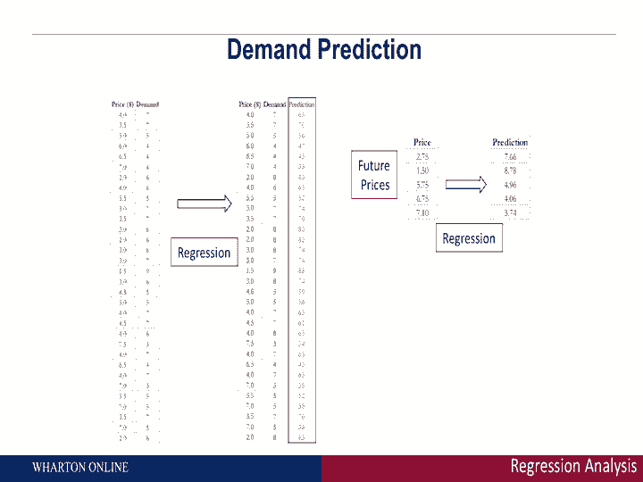
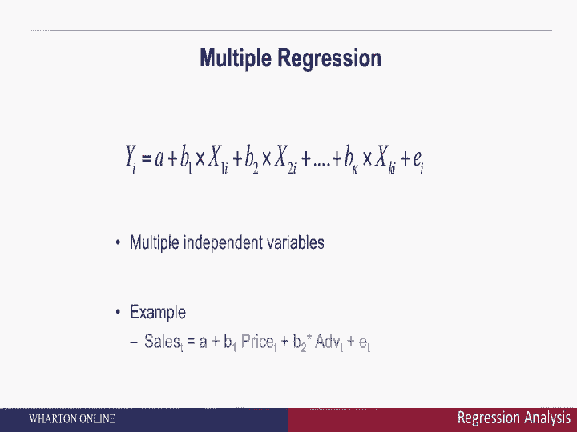
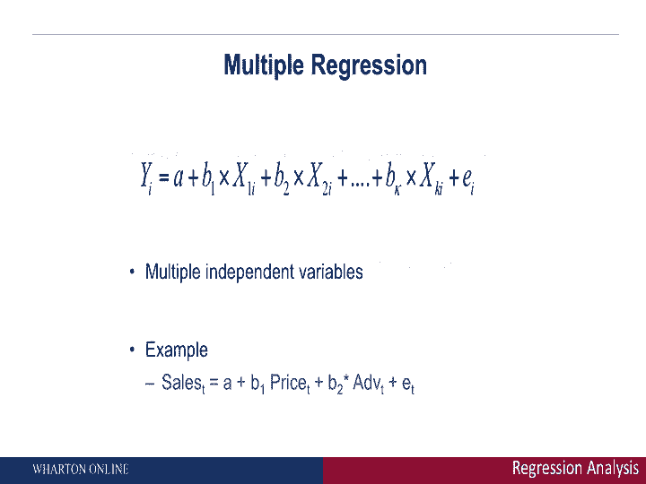

# 【沃顿商学院】商业分析 全套课程（客户、运营、人力资源、会计） - P13：[P013]04_regression-analysis-part-2-making-predictions - 知识旅行家 - BV1o54y1N7pm

我们在横轴上看到了什么，我们在垂直轴上有价格，我们有单位的需求，除了你之前看到的点，我们也看到一条直线，那是你的回归线，这基本上是在捕捉，价格如何影响需求，特别是，如果你注意到价格前面的系数是负9。

当价格上涨一美元时，这告诉你什么，预计销售量将下降九分，它是负面的这一事实很有道理，为什么随着价格的上涨，预计销售量将下降。我们在这里还看到了什么，回归线预测的也是，如果你的价格是零，几乎是免费的。

大约会卖出十台，这就是我们在回归线中得到的，我们还看到了什么，我们还看到一个叫做r平方的东西，那是从零到一的数字，它基本上捕捉到了你的回归有多好，那个数字越接近1。

回归很好地捕捉到了需求是如何随价格变化的，那个数字越接近零，不幸的是，回归做得不是很好，我们在这里看到了什么，r平方相当高，大约是百分之八十九，那是一个很高的r平方，典型的R平方70%到80%。

这是相当高的，我们现在能做的就是，我们确信，回归很好地理解了需求是如何与价格等待的，我们可以开始使用这种回归来做出预测，这就是我们所追求的，我们要找的是，我们如何预测不同价格下的需求。

这就是我们下一步要做的，所以这么做，我们可以采取多个步骤，我们从看回归线开始，这就是我们之前展示的，开始插入不同的价格，我们可以首先取数据集中已经有的价格，并比较我们预测的回归线。

或者从回归中做出预测是与实际数据进行比较，这就是首先显示的，我们在这里看到的是实际数据，和预测的回归线非常接近，这并不奇怪，回归的r平方，记住哪些措施，这种回归有多好是相当高的，我们还能做的是更进一步。

这就是回归的力量，我们也可以开始考虑需求，对数据集中没有的价格的预测，这就是我接下来要做的，看看上面的价格，对呀，当你看到这些价格，这些是数据集中没有的价格，这些是未来的价格。

这时经理可以开始考虑如何使用回归，对他没有测试过的价格做出需求预测，到目前为止。

我们在这里看到的是回归可以预测需求，也是这个价格，这就是回归的美妙之处，看一些数据，我们可以开始理解需求与价格的定量关系，看回归的拟合度，穿过r平方，一旦你确信回归做得很好。

您可以开始使用回归来进行需求预测，一旦你能做出需求预测，最优价格仅一步之遥，直觉是这样的，如果我们能以不同的价格做出预测，我们可以开始考虑收入和利润，以这些不同的价格，一旦你能做到这一点。

然后你就可以开始了解应该收取什么价格来获得最大的收入或最大的利润，如果你知道你的潜在成本，所以回归的美妙之处在于我们从整体数据开始，我们开始量化变量之间的关系，一旦我们有了这些。

我们就开始考虑如何做出需求预测，下一个，你可以开始考虑最优价格和不同的价格。

弄清楚你的需求是什么，我们刚才给你看的是一个简单的例子，使用一个因变量和一个自变量，但当然，回归可以扩展到涵盖多个自变量。

总体思路又是这样的，在左手边，我们有y，它是因变量，在右手边，我们有X，哪些是你的自变量，在这一页的底部，你看到一个例子，人们可以推测销售额是价格的函数，但价格可能不会驱动一切，可能是广告，可能是升职。

回归可以处理任意多的自变量，这个想法，你想做的和你想做的完全一样，就是看看右手边价格的变量组合，广告促销，看看每一个的相对影响，看看他们现在对整体销售的贡献有多大。

回归，正如我提到的，只是做出需求预测的一个例子，它是了解需求驱动因素的一个很好的工具，作出需求预测，谈最优定价。

但还有很多很多其他的例子，所以回归是一种方法，你可以开始考虑像手推车这样的事情，你可以开始思考神经网络之类的东西，P后面会讲到的所有这些预测分析工具。
