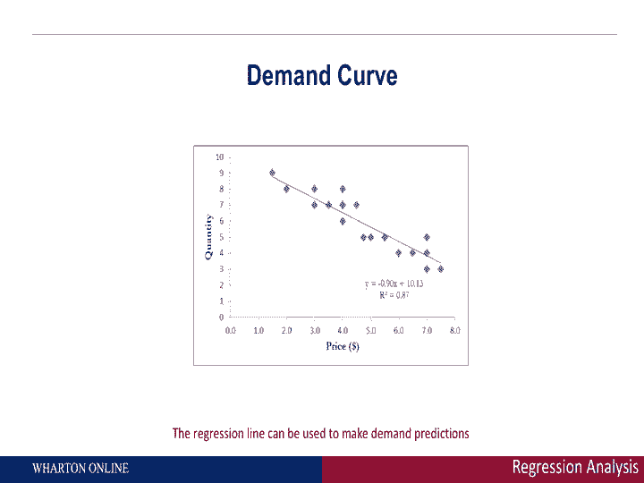
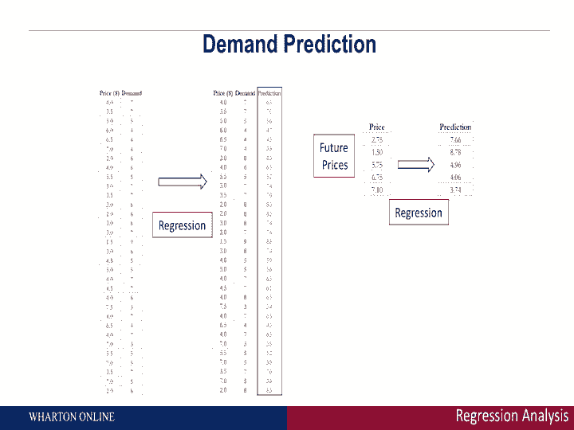
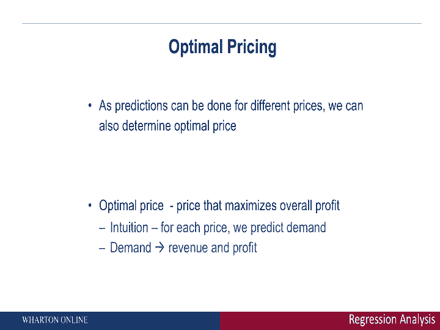
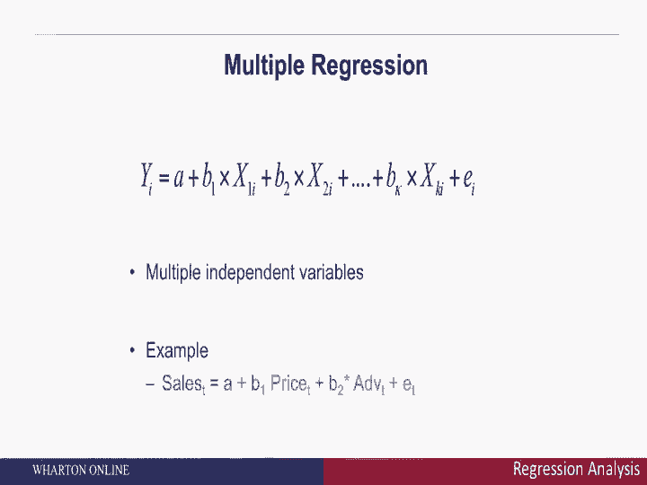
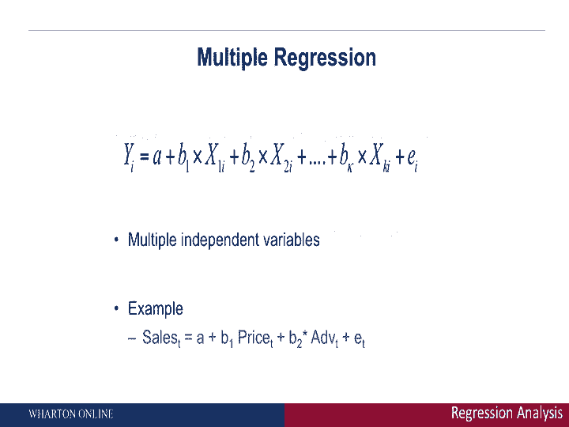
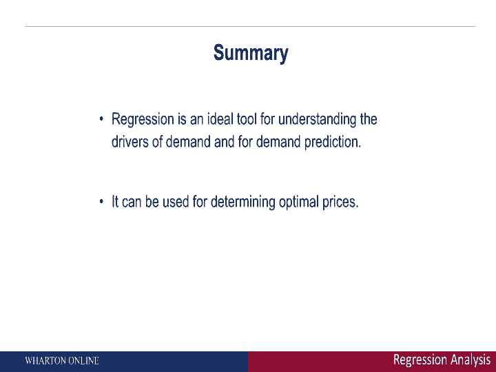

# 📊 沃顿商学院商业分析课程 P13：回归分析（第二部分）—— 进行预测

在本节课中，我们将学习如何利用回归分析的结果进行需求预测，并探讨如何将其应用于最优定价决策。我们将从理解回归线开始，逐步学习如何用它来预测数据集中存在和不存在价格下的需求，并最终扩展到多变量的回归分析。

---

## 🔍 理解回归线与R平方

上一节我们介绍了回归分析的基本概念。本节中，我们来看看如何解读回归分析的结果。

在回归分析中，我们通常会得到一条回归线。这条线在图表上表现为一条直线，其作用是捕捉自变量（如价格）如何影响因变量（如需求量）。例如，如果回归方程中价格的系数是 **-9**，这意味着当价格上涨1美元时，预计需求量会下降9个单位。系数为负是合理的，因为价格上涨通常会导致需求下降。

除了回归线，我们还会看到一个重要的指标：**R平方**。R平方是一个介于0到1之间的数值，它衡量了回归模型对数据变动的解释程度。R平方越接近1，说明回归模型能很好地解释需求随价格的变化；越接近0，则说明模型的解释力较弱。例如，一个0.89的R平方值（即89%）被认为是相当高的，通常70%到80%的R平方值就已经是良好的模型了。

---

## 📈 使用回归模型进行预测

当我们确信回归模型（通过高R平方值判断）能够很好地描述变量间关系后，就可以用它来进行预测了。我们的目标是预测在不同价格水平下的需求量。

以下是使用回归模型进行预测的步骤：

首先，我们可以用数据集中已有的价格进行预测，并将预测结果与实际数据进行比较。这能帮助我们验证模型的准确性。由于R平方值很高，预测的需求量通常会与实际数据非常接近。

其次，回归模型的强大之处在于，它可以对数据集中**没有出现过的价格**进行需求预测。这意味着管理者可以考虑使用模型来预测尚未测试过的价格水平下的需求，从而为未来的定价决策提供依据。

---

## 💡 从需求预测到最优定价

一旦我们能够利用回归模型做出可靠的需求预测，距离确定最优价格就只有一步之遥了。

其逻辑是：如果我们能预测不同价格下的需求量，我们就可以进一步计算在这些价格下的预期收入和利润（如果知道成本的话）。通过比较不同价格点对应的收入或利润，我们就能找出能带来最大收入或最大利润的那个价格点。

因此，回归分析的美妙之处在于，它让我们从原始数据出发，量化变量之间的关系，进而做出需求预测，并最终为最优定价策略提供数据支持。

---

## ➕ 扩展到多变量回归分析

我们刚才演示的是一个简单的例子，只包含一个因变量（需求）和一个自变量（价格）。然而，回归分析可以扩展到包含多个自变量。

总体思路保持不变：等式左边是因变量 **Y**（如销售额），等式右边是一个或多个自变量 **X**（如价格、广告投入、促销活动等）。

例如，一个多变量回归模型可能如下所示：
`销售额 = β₀ + β₁ * 价格 + β₂ * 广告投入 + β₃ * 促销活动 + ε`

这个模型可以让我们同时分析价格、广告、促销等多个因素对销售额的相对影响，看看每个因素对整体销售额的贡献有多大。

---

## 🛠️ 回归分析与其他预测工具

回归分析是进行需求预测、理解需求驱动因素和探讨最优定价的一个强大工具。

但它只是众多预测分析方法中的一种。在商业分析中，你还会接触到其他工具，例如决策树、神经网络等更高级的预测分析技术，这些我们将在后续课程中探讨。

---

## 📝 课程总结

在本节课中，我们一起学习了回归分析的第二部分——进行预测。我们首先学习了如何解读回归线和R平方值，以评估模型的优劣。接着，我们探讨了如何使用回归模型对已知和未知的价格进行需求预测。然后，我们了解了如何从需求预测推进到最优定价决策。最后，我们看到了回归分析如何扩展到处理多个自变量，并简要提及了其他预测分析工具。

通过掌握回归分析，你可以将数据转化为 actionable insights，为企业的定价和商业策略提供坚实的量化基础。