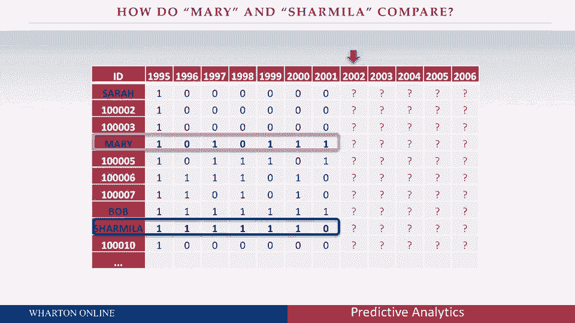

# 课程名称：商业分析 - 第15课：使用数据集进行预测 📊

## 概述

在本节课中，我们将学习如何利用真实数据集进行预测分析。我们将从一个非营利组织的捐赠者数据入手，探讨一种通用的数据结构，并基于客户过去的行为来预测其未来的行为。通过本课，你将理解如何将抽象的分析概念应用于实际商业场景。

---

## 从抽象到现实：引入真实数据集

上一节我们讨论了基于时期的抽象分析模型。本节中，我们来看看如何将其应用于真实数据。

我们将从一个非营利组织的案例开始。这个组织长期观察其捐赠者。许多公司也会对其客户采取类似的做法：他们会将客户（在此案例中是捐赠者）划分为不同的“队列”进行分析。我认为，这不仅是预测模型的核心，也是公司管理客户的重要基础。

以下是队列分析的核心思路：
*   **队列**：指在同一时间段内、通过相同方式（例如，同一营销活动、同一渠道或进行首次购买）获得的一组客户。
*   **本案例队列**：我们将关注在1995年首次向该非营利组织捐款的一群捐赠者。在1995年之前，他们对组织而言是不存在的。

我们将追踪这群人在1995年之后的六年（1996-2001年）内的行为，并基于此预测他们再往后五年（2002-2006年）的行为。这种长期历史数据的积累，在数字化时代正变得越来越容易，也对于预测客户未来行为至关重要。

---

## 理解通用数据结构

在深入分析之前，让我们先理解这个数据集的结构。

数据结构可以想象成一个电子表格：
*   **行**：代表11,104位不同的客户（捐赠者）。
*   **列**：代表年份。我们关注一个简单问题：客户在某一年是否捐款？
*   **数据值**：如果捐款，标记为 **`1`**；如果未捐款，标记为 **`0`**。我们暂不关心捐款的具体金额（F（频率）中的M（货币价值）部分）。

第一列数据全部是1995年，表示所有客户都在该年被“获得”。右侧各列则显示了他们在随后六年里每年的捐款情况（0或1）。

这种数据结构具有极强的通用性，并不局限于非营利捐款。它可以应用于多种商业场景：

*   **连锁酒店**：客户每月是否入住？
*   **信用卡公司**：客户每月是否产生循环利息？
*   **手机游戏**：用户每天是否登录游戏？

无论1和0代表购买、发帖、入住还是付费，也无论时间段是年、月、周还是日，这种“客户-时间-行为（是/否）”的结构都是通用的。希望你能认识到，无论是作为消费者贡献数据，还是作为企业使用数据，这种结构都非常常见。

---

## 基于有限信息的预测练习

现在，让我们基于你在这张幻灯片上看到的有限信息，尝试对几类客户进行预测。

以下是几个具体的预测问题，请先思考你的答案：

**1. 预测“鲍勃”类客户**

看看“鲍勃”的数据：他在被获得（1995年）后的六年里，每年都捐款（6次中有6次）。我们不对1995年做预测，因为那是获得他的时间点。

**问题**：对于所有像鲍勃一样（过去六年每次都捐款）的客户，在接下来的五次捐款机会中，他们平均会捐款多少次？（请写下你的猜测数字）

> **提示**：我们并不真正关心单个“鲍勃”，而是关心所有具有相同特征（过去六年全勤）的客户群体。在这个数据集中，大约有1200个“鲍勃”。他们中有些人未来可能捐0次，有些人可能捐5次，我们需要预测的是这个群体的平均次数。

**2. 预测“莎拉”类客户**

现在看看“莎拉”：她在被获得后的六年里，一次款都没捐（6次中有0次）。

**问题**：对于所有像莎拉一样（过去六年从未捐款）的客户，在接下来的五次机会中，他们平均会捐款多少次？

> **提示**：你可能会想，为什么还要关注“莎拉”？单个“莎拉”可能价值很低。但关键在于，这类客户的数量非常庞大。在此数据集中，他们约占客户总数的33%。在许多数据集中，这个比例常常超过50%。尽管个体价值低，但总量可能不容忽视。

**3. 比较“玛丽”与“查米拉”类客户**

最后，请观察“玛丽”和“查米拉”的数据。

请回答两个问题：
1.  在接下来的五年里，哪一类客户的平均价值会更高？（是玛丽类，还是查米拉类？）
2.  高多少？（请给出你的估计值）

花点时间，对比玛丽和查米拉过去六年的行为模式（0和1的序列），思考是什么让其中一类的未来预测价值高于另一类。

---

## 总结

本节课中，我们一起学习了如何将预测分析框架应用于真实数据集。我们从一个非营利组织的捐赠者数据出发，介绍了一种以客户为中心、按时间序列记录行为（是/否）的通用数据结构。通过“鲍勃”、“莎拉”、“玛丽”和“查米拉”的预测练习，我们初步体验了如何根据客户过去的行为模式，对其未来行为进行群体层面的预测。在接下来的课程中，我们将深入探讨用于做出这些预测的具体逻辑和方法。