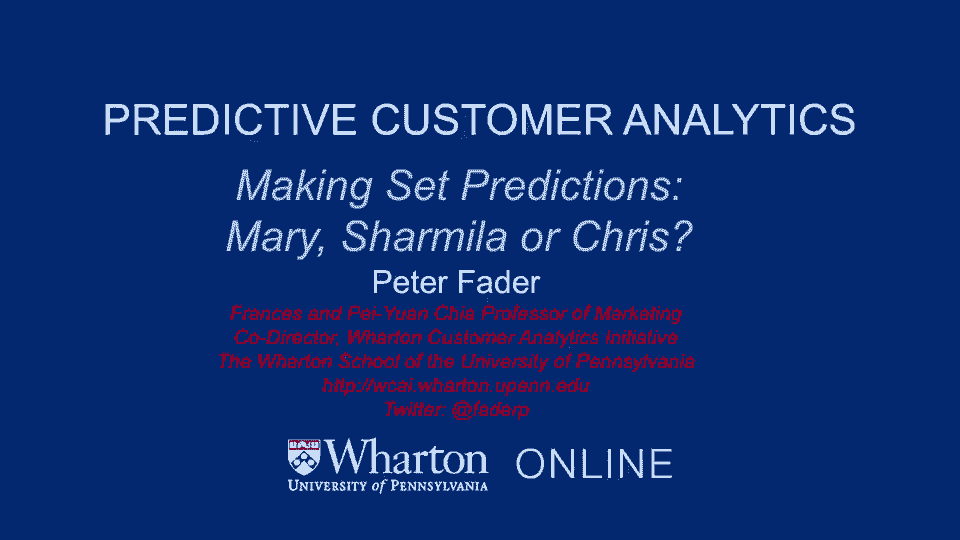
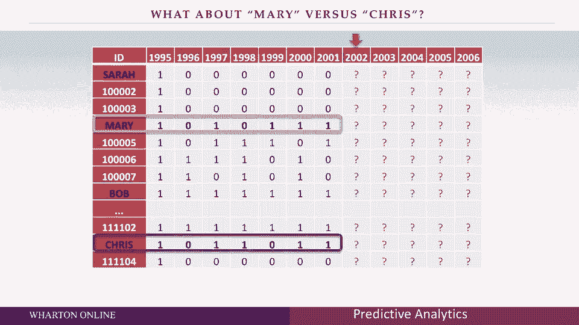

# 课程名称：沃顿商学院商业分析 P16 - 客户价值预测：从数据模式到核心洞察 🎯

在本节课中，我们将学习如何分析客户的历史行为数据，并基于此预测其未来价值。我们将通过比较几位虚拟客户（玛丽、莎米拉、克里斯）的捐赠记录，理解“最近购买时间”（Recency）和“购买频率”（Frequency）这两个核心概念如何比单纯加总交易次数更能揭示客户的潜在价值。课程将引导你像一名数据分析师一样思考，超越表面数字，构建数据背后的故事模型。

---

## 客户价值比较：玛丽 vs. 莎米拉

上一节我们引入了客户行为分析的重要性，本节中我们来看看如何具体比较两位客户。

假设需要判断玛丽和莎米拉谁在未来五次机会中可能捐赠更多，即谁更具未来价值。仅从捐赠总数看，玛丽捐了4次，莎米拉捐了5次。然而，分析时不能只看总数。

以下是分析玛丽与莎米拉行为模式的关键点：

*   **行为模式差异**：玛丽的历史记录中虽有两次未捐赠（0），但之后都恢复了捐赠（1）。莎米拉的最后一次记录是0。
*   **核心洞察**：最后的“0”可能意味着不同情况。对玛丽而言，可能是偶然遗忘；对莎米拉而言，可能意味着客户流失、需求变化或不再活跃。因此，**最近的活跃状态（Recency）比总捐赠次数（Frequency）更能预示未来行为**。
*   **结论**：尽管莎米拉总次数更多，但玛丽因最近有捐赠记录，更可能在未来继续捐赠。这印证了RFM模型（Recency, Frequency, Monetary）中 **R（最近性）> F（频率）** 的基本原理。

---

## 深入理解：数据背后的故事

上一节我们通过比较理解了“最近性”的重要性，本节中我们进一步探讨如何解读数据。

数据本身（0和1的序列）并非我们直接相信的真理，而是**潜在、不可观测的客户状态**（如购买倾向、流失风险）的指示器。我们的目标是透过数据，构建关于这些潜在状态的故事，从而做出长期预测。

例如，对于莎米拉最后的0，我们需要判断这是“一次偶然遗漏”还是“永久离开”。这个判断直接影响对其未来价值的预测。分析就是为数据模式寻找一个合理的、关于客户潜在状态的解释。

---

## 进阶比较：玛丽 vs. 克里斯

理解了核心原则后，我们来看一个更具挑战性的比较案例：玛丽和克里斯。

两人的历史记录模式不同，但提取关键汇总统计量时发现：
*   **最近一次捐赠（Recency）**：两人都是1（最近一期有捐赠）。
*   **捐赠频率（Frequency）**：两人在过去五期中都捐赠了3次。

以下是分析此案例的思考过程：

*   **避免过度拟合**：不应机械套用“0,1,1”的周期模式来预测克里斯的未来。真实客户行为存在噪音，不应期待完美重复的周期。
*   **核心统计量的效力**：当两人的 **R** 和 **F** 都相同时，它们构成了强有力的、简洁的汇总信息。基于此，没有明确理由将两人区分开。
*   **接受平局**：在商业分析中，当缺乏足够信息进行有效区分时，**将客户归类为同等价值是合理且专业的做法**，这比强行寻找不稳健的差异（如比较倒数第三次的行为）更为可靠。

---

## 课程总结与下步展望

本节课中，我们一起学习了客户价值预测的基本分析思路。

我们通过具体案例认识到：
1.  **核心指标**：在RFM框架中，**最近性（R）** 通常比**频率（F）** 更具预测力。
2.  **解读数据**：分析是解读数据模式、构建客户潜在状态故事的过程，而非单纯相信表面数字。
3.  **模型思维**：应依赖稳健的汇总统计量（如R和F），而非拘泥于具体、可能带有噪音的序列模式。
4.  **专业判断**：当核心指标无法区分时，接受“平局”是合理的分析结论。

基于这些洞察，我们接下来将建立一个具体的数学模型，来形式化地描述数据背后关于客户活跃与流失的故事。这个模型将帮助我们更系统、更准确地对鲍勃、莎拉、玛丽、莎米拉和克里斯等所有客户做出预测。

---