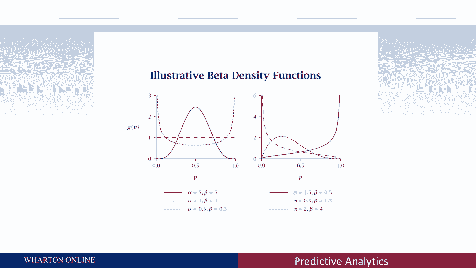

# 课程名称：沃顿商学院商业分析 P17 - 概率模型 🎲

## 概述
在本节课中，我们将学习如何利用概率模型来分析客户行为数据。与传统的回归模型不同，概率模型旨在揭示数据表面之下的随机过程，并能够对更长期的未来进行预测。我们将重点介绍“购买直至‘死亡’模型”的核心思想及其应用。

---

## 从回归模型到概率模型
上一节我们介绍了使用回归模型进行预测的方法。本节中，我们来看看当预测需求超越单一时期、延伸至更长远未来时，我们可以采用何种方法。

如果我们只关注预测下一个时期（如下半年）的捐款额，回归模型（使用R²等指标）是合适且有效的工具。然而，如果我们希望利用所有数据（例如每位客户六年的数据）来预测客户在整个生命周期内的行为，标准回归模型就显得力不从心。

此时，概率模型便展现出其优势。它能够讲述驱动数据（如捐款与否的0和1记录）背后更深层的故事，并回答更长期限的问题，尽管有时会以牺牲短期预测的精确度为代价。

---

## 核心思想：将行为视为随机过程
回归模型侧重于利用解释变量（如营销活动、人口统计）来讲述故事。而概率模型则试图提出一个我们无法直接观察到的行为机制。

我们可以设想一个最简单的过程：将每个人是否捐款的决定，视为一次**抛硬币**。正面代表捐款，反面代表不捐款。当然，这并非字面意义上的抛硬币，而是比喻决策中包含了大量我们无法观测的复杂、细微因素，使得其整体表现如同随机事件。

关键在于，**不同的人抛的是不同的硬币**。每个人的硬币出现正面的概率（即捐款倾向）各不相同。有人可能是10%，有人可能是90%。概率模型的核心就是捕捉这种人与人之间的差异（统计学上称为“异质性”）。

我们可以用以下方式描述一个人的捐款倾向：
`P(捐款) = p_i`
其中，`p_i` 是第 `i` 个人的个人捐款概率，它服从某个能描述人群差异的统计分布。

---

## 引入“死亡”机制：客户流失
然而，仅凭捐款倾向还不足以描述像马里恩和查米拉那样的长期模式。我们还需要考虑客户是否会停止参与（即“死亡”或流失）。

因此，我们需要引入**第二枚硬币**——“死亡”硬币。每个时期我们都会抛这枚硬币：
*   若结果为正面，客户继续“存活”，获得下一个捐款机会。
*   若结果为反面，客户“死亡”，永久性停止所有后续捐款行为。

同样，不同客户的“死亡”倾向（流失率）也各不相同，我们需要用另一个统计分布来捕捉这种异质性。

---

## “购买直至死亡”模型
将这两枚硬币——**捐款硬币**（捕捉购买倾向的异质性）和**死亡硬币**（捕捉存活/流失倾向的异质性）——结合起来，就构成了强大的 **“购买直至死亡”模型**。

以下是该模型的关键要点列表：
*   **模型基础**：该模型假设客户行为由两个独立的随机过程驱动：重复购买机会和可能终止关系的“死亡”事件。
*   **应用广泛**：此类模型在过去近30年里被广泛应用于各种存在重复机会的场景，如交易、网站访问、保险索赔等。
*   **预测能力**：它们在长期行为预测方面非常强大。对于短期预测，其表现可能与回归模型相当；但对于长期预测，则更具优势。
*   **核心优势**：其力量在于将数据视为一个随机过程的故事，并通过数学计算将这个故事的长期含义推导出来。

---

## 总结
本节课中，我们一起学习了概率模型的基本思想，特别是“购买直至死亡”模型。
1.  我们认识到，当预测视野从短期扩展到长期时，需要新的建模思路。
2.  我们探讨了将客户行为抽象为随机过程（如抛硬币）的价值，这有助于理解表面数据之下的驱动机制。
3.  我们引入了两个核心概念：**捐款倾向的异质性**和**流失（“死亡”）倾向的异质性**。
4.  最后，我们了解到，通过结合这两个随机过程构建模型，可以对客户生命周期价值等长期指标做出有力的推断。

虽然我们跳过了具体的数学推导，但实现此类模型的难度并不高。关键在于转变视角：从寻找解释变量与结果之间的直接关系，转变为讲述一个关于随机倾向和过程如何产生我们所观测数据的故事。