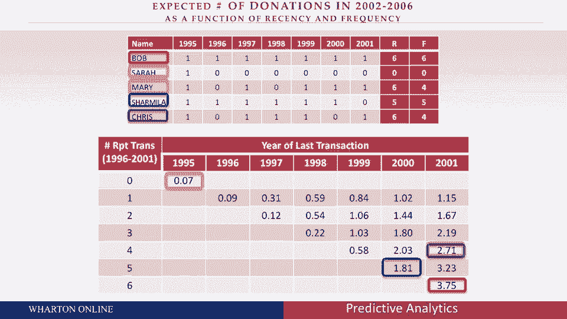
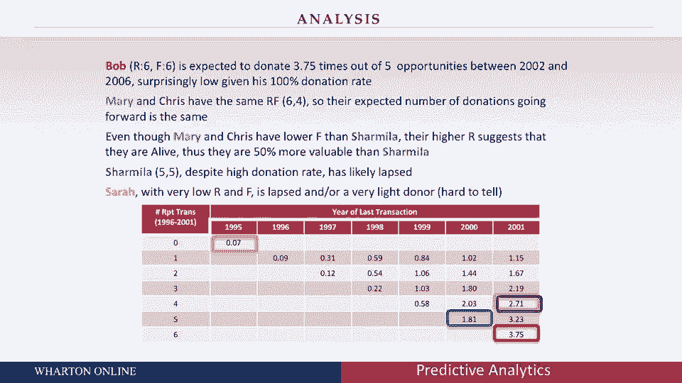
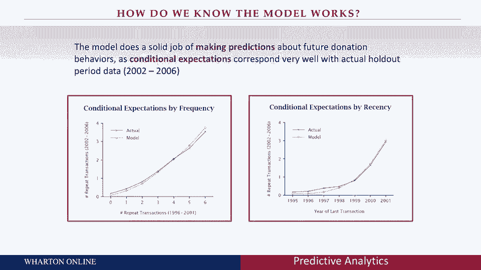
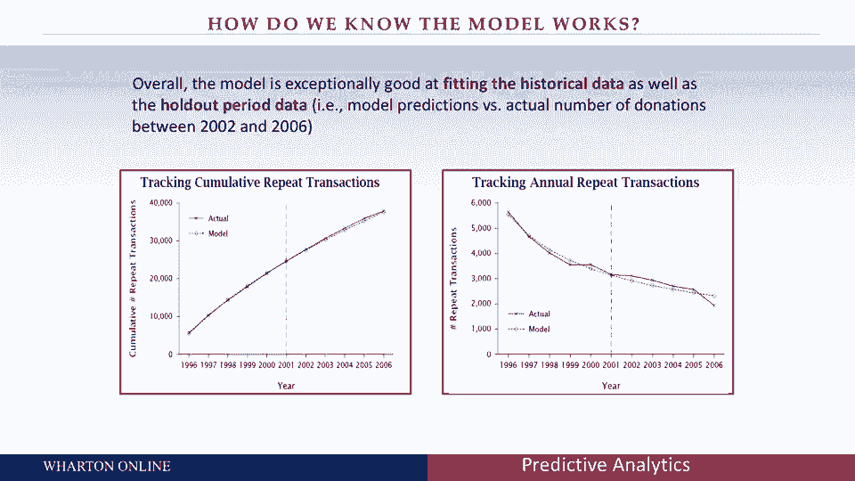
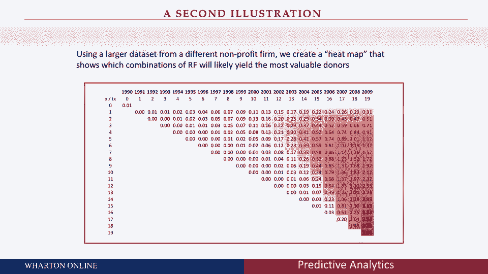
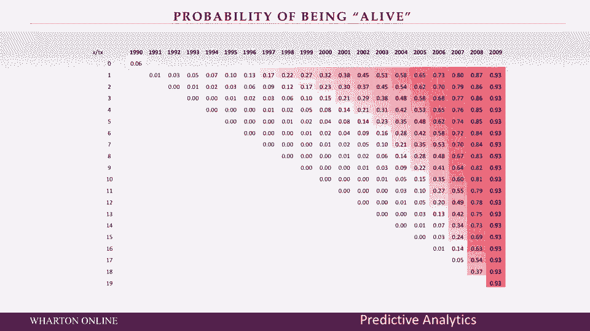

# 📊 沃顿商学院商业分析课程 P18：模型实施与客户行为预测

在本节课中，我们将学习如何利用一个简单的概率模型来预测客户未来的行为。我们将通过分析一个捐赠者数据集，理解“最近一次消费时间”和“消费频率”如何影响预测，并探讨这些洞察对商业决策的意义。

---

## 🔍 模型预测结果解读

上一节我们介绍了用于预测客户未来行为的概率模型框架。本节中，我们来看看如何解读该模型对具体客户群体的预测结果。

首先，我们以一位名为鲍勃的客户为例。根据模型预测，鲍勃在接下来的五次捐赠机会中，预计会捐赠 **3.75** 次。

> 这个预测数字可能低于一些人的直觉判断。考虑到鲍勃过去六次机会全部捐赠，有人可能预测他会捐赠五次。然而，模型纳入了行为的随机性，认为即使是忠诚的客户也无法保证百分之百持续参与。

这个较低的预测值具有重要商业意义。许多公司会为高端客户设立专属俱乐部并投入大量资源，但如果对客户的长期价值预期过高，可能导致投资过度或对投资效果的误判。

---

## 📈 不同客户类型的预测对比

以下是模型对不同行为模式客户的预测结果分析：

*   **莎拉（低频且久未消费）**：对于过去捐赠次数很少且最近未捐赠的客户（如莎拉），模型预测其未来捐赠次数仅为 **0.07**。虽然单个客户价值低，但由于这类客户基数庞大，其集体价值不容忽视。
*   **玛丽 vs 查米拉（频率与近因的权衡）**：这是一个关键对比。
    *   玛丽：过去捐赠4次，且**最近一次捐赠了**。模型预测其未来捐赠 **2.711** 次。
    *   查米拉：过去捐赠5次（频率更高），但**错过了最近一次捐赠**。模型预测其未来仅捐赠 **1.81** 次。
    *   尽管查米拉历史捐赠次数更多，但玛丽因其最近的活跃行为而被预测具有高出约50%的未来价值。这凸显了“最近一次消费时间”相对于“消费频率”往往具有更强的预测力。
*   **玛丽与克里斯（模型简化）**：当模型仅依据“最近”和“频率”两个维度时，行为模式相近的客户（如玛丽和克里斯）可能被预测为价值相似。在战略层面，有时无需进行过度细致的区分。

---

## 📊 模型准确性评估

为了评估模型表现，我们将预测值与客户后续的实际行为进行对比。以下是按“消费频率”和“最近消费时间”分组后的平均预测值与实际值对比：

*   **按频率分组**：模型预测（上图）与实际购买（下图）高度吻合。从历史捐赠6次的“鲍勃”到捐赠0次的“莎拉”，预测曲线都紧密跟踪实际曲线。
*   **按最近时间分组**：预测与实际值的匹配度依然良好，尽管对于长期未消费的客户，模型存在轻微低估。总体而言，对于一个简单模型，其表现已相当出色。

---

## 🔮 整体预测与客户“存活”概率

最后，我们观察模型对整个客户群在预测期内的总购买量的预测。下图显示，模型的累计预测（虚线）与客户实际累计购买（实线）几乎重叠，证明了其在宏观层面的准确性。

此外，模型还能估算客户的“存活”概率（即仍是活跃客户的可能性）。分析显示：
*   最近消费的客户存活概率接近100%。
*   历史消费频繁但最近突然停止的客户（如“查米拉”），其“死亡”（流失）概率显著升高。
*   有趣的是，从未消费的客户（如“莎拉”），其存活概率可能高于那些曾消费过但已长期沉默的客户。因为后者给出了明确的“退出”信号。

---

## ✅ 课程总结

本节课中我们一起学习了如何实施一个客户行为预测模型，并解读其结果。核心收获在于理解了两个关键概念：
1.  **最近一次消费时间（Recency）** 是预测未来行为的强力指标，其影响力常超过消费频率。
2.  模型预测有助于形成对客户长期价值的**理性预期**，避免因过度乐观或悲观而导致商业决策失误。

通过将客户按 `(Recency, Frequency)` 分类并观察模型输出，我们能够获得关于客户留存、未来价值及整体客户群演变趋势的深刻洞察，这是预测分析在商业实践中的核心价值所在。