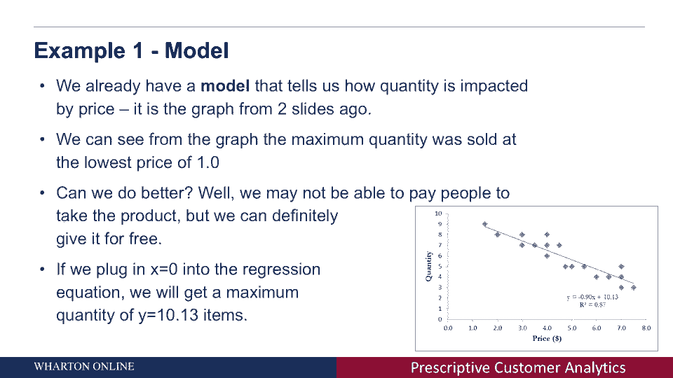

# 【沃顿商学院】商业分析 全套课程（客户、运营、人力资源、会计） - P21：[P021]02_what-is-prescriptive-analytics - 知识旅行家 - BV1o54y1N7pm

今天我们要讨论规定性分析，我想做的第一件事，讨论了规定性分析和描述性分析之间的区别，和预测分析，你们在以前的讲座中接触过，描述性分析获取收集的数据，并尝试将数据映射到您可以在数据中理解的模式。

和预测分析，试图从消费者的行为中提取并从他们过去的行为中预测，他们将来要做什么，我们要怎么处理处方，我们要试着给出一个建议，我们会试着说，考虑到我们以前的预测，并给出了消费者如何与。

比如说公司和其他消费者，我们能就公司需要做什么提出建议吗，为了改变消费者的行为，我们将涵盖四件事，今天我们将讨论如何定义处方问题，或者如何定义目标，你想解决什么，为了改善公司的行为，我们将定义两个术语。

是公司的目标或公司的目标，我们也会试着看看一个公司如何优化，一个公司能做些什么来达到这个目标，一个公司可以做些什么来实现这个目标，最后我们要看模型，我们要讨论，采取行动如何与公司的目标联系起来。

并影响公司的目标，最后，我们将对比赛进行一个非常简短的介绍，或者公司如何互动和回应其他公司的行动，首先我想告诉你问题出在哪里，现在听起来很模糊，所以我将在几秒钟后展示一个例子，但是通过说一个问题。

我想说的是，我想说我需要有一个目标，我想最大化的东西，优化实现，我可以通过采取行动来实现这个目标，现在，地图的方法，行动如何影响目标被称为模型，现在让我们花几分钟来看看。

你们在上一节课中看到的非常独特的例子，所以我想说的第一个例子是，你如何找到最优价格或最优价格，为了销售最大数量的产品，所以在描述性讲座中，Yanar教授已经向你展示了下面的需求曲线或下面的图表。

在这张图中，你可以在x轴上看到的是你为一个产品设定的价格，在y轴上你可以看到出售的数量，当你改变产品的价格时，当你提高价格时，你可以看到，数量下降了，现在让我们试着定义一个目标。

我们想做的第一件事是我想说，我们怎样才能最大限度地增加产品销售呢？我们怎样才能最大限度地提高现有产品的销量呢？在这种情况下目标或目的只是最大化数量，我们想把它做得越大越好。

我们能采取的行动只是一个简单的行动，我们可以改变价格，我们可以改变产品的价格，增加它或减少它，通过改变价格，我们鼓励或不鼓励消费者购买或不购买该产品，最后我们需要一个模型现在模型可能非常非常复杂。

但在这种情况下，我们已经有了模型，模型基本上是图，我之前给你们看过两张幻灯片，你也可以在右下角看到，模型基本上告诉我们如果我们改变价格，比如说，如果我们提高价格，数量会减少多少，用于，例如，如果我们。

我们看这个图，我们可以看到，设定一个售出的价格，产品的最大数量，问题是，我们能把价格再调高一点吗，我们能用某种预测或表扬来给公司，说，我们能不能增加销售量？答案其实是肯定的，我们可能无法，你知道的。

给人们钱买产品，我们实际上可以花钱让他们购买产品，但我们可能会免费给他们产品，我们实际上可以将价格设置为零，在这种情况下，我们采取了我们以前见过的回归，或者是把线延伸到左手边。

然后我们可以用回归方程看到，如果我们把x等于零，这意味着价格等于零，我们得到y的值是十三点十三。

这是我们能卖出的最大数量，所以在这个例子中，我想给你看的是，我们可以通过改变价格来增加或减少销售量。2。我们的目标是最大限度地增加销售量，模型只是图表，Yena教授给你看的回归方程。

我已经向你展示了如何找到更低的价格。
