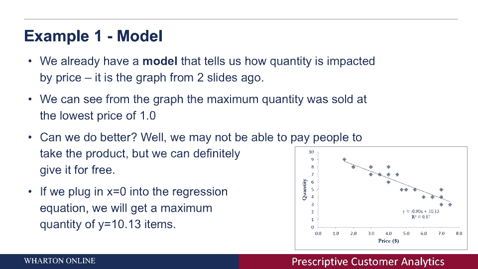

# 📘 沃顿商学院商业分析课程 P21：什么是规定性分析

在本节课中，我们将学习**规定性分析**。我们将探讨它与描述性分析、预测分析的区别，并了解如何通过定义目标、行动和模型，为公司提供可执行的建议，以优化其业务表现。

---

## 🔍 规定性分析与描述性、预测分析的区别

在之前的课程中，我们接触过描述性分析和预测分析。

**描述性分析**获取收集的数据，并尝试识别数据中可理解的模式。

**预测分析**试图从消费者过去的行为中提取信息，并预测他们未来可能采取的行动。

**规定性分析**则更进一步：它基于已有的描述和预测，尝试为公司提供具体的行动建议，以改变消费者行为或优化业务结果。

---

## 🎯 如何定义规定性分析问题

规定性分析的核心是解决一个明确的“问题”。这听起来可能有些抽象，我们稍后会通过例子具体说明。所谓“问题”，通常包含以下几个要素：

1.  **目标**：我们需要明确一个希望最大化或优化的指标。
2.  **行动**：我们可以采取哪些措施来影响这个目标。
3.  **模型**：我们需要理解行动如何具体地影响目标。这种映射关系就是模型。

接下来，我们通过一个具体的例子来理解这些概念。

---

## 💡 示例：寻找最优定价以最大化销量

上一节课中，Yanar教授向我们展示了需求曲线。在这个图表中：
*   X轴代表产品价格。
*   Y轴代表产品销量。

图表显示，当价格上升时，销量会下降。

现在，让我们用规定性分析的框架来审视这个问题：

**我们的目标**是**最大化产品销量**。我们希望售出的数量越多越好。

**我们可以采取的行动**是**调整产品价格**。我们可以提高或降低价格，从而鼓励或抑制消费者购买。

**我们需要的模型**就是那条**需求曲线**（或回归方程）。这个模型清楚地告诉我们，价格变化会如何影响销量。例如，从图表中我们可以直观地看到，价格越低，销量越高。

根据这个模型，为了最大化销量，理论上我们可以将价格设为零。如果我们使用回归方程进行计算，将价格（X）设为零，可以得出对应的销量（Y）约为13.13。这就是我们通过模型分析得出的**规定性建议**：将价格降至最低（甚至免费赠送）可以实现销量最大化。

---

## 📝 本节总结

本节课我们一起学习了规定性分析的基本概念。

我们首先区分了规定性分析与描述性、预测分析的不同之处。接着，我们了解到定义一个规定性问题需要明确**目标**、**行动**和**模型**这三个核心要素。最后，我们通过一个“最优定价”的实例，具体演示了如何应用这个框架：以**最大化销量**为目标，通过**调整价格**这一行动，并依据**需求曲线模型**，得出了具体的行动建议。

在接下来的课程中，我们将继续探讨公司如何设定更复杂的目标，以及如何优化行动以实现这些目标。