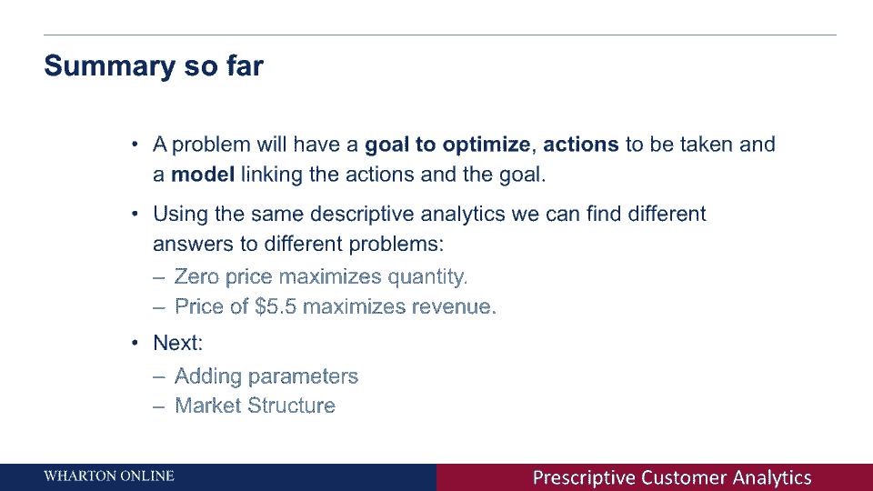

# 📊 商业分析课程 P22：利用数据最大化收入

在本节课中，我们将学习如何利用描述性分析中相同的数据，通过设定不同的目标，为公司得出完全不同的结论和行动建议。我们将重点关注如何通过调整价格来最大化公司的收入，而非仅仅最大化销量。

---

## 🎯 定义目标与行动

上一节我们探讨了如何通过价格调整来最大化销量。本节中，我们来看看如何将目标转变为**最大化收入**。大多数公司的核心目标并非售出最多产品，而是通过销售创造最多的收入。

我们需要明确以下两点：
*   **目标**：最大化收入。
*   **行动**：设定或改变产品价格。

核心问题是：改变价格将如何影响销售产品所带来的总收入？

---

## 🤔 收入模型与权衡

为了回答上述问题，我们需要一个模型来描述定价与销售量之间的关系，并计算其对收入的影响。

公司的总收入由以下公式决定：
**总收入 = 价格 × 销售数量**

当我们调整价格时，会引发两种相反的力量：
1.  **降低价格**：销售量通常会上升，但每件产品带来的收入减少。
2.  **提高价格**：每件产品带来的收入增加，但销售量通常会下降。

这种情形被称为**权衡**：采取行动（调整价格）对最终目标（收入）的影响是双向的，我们无法直接判断收入会上升还是下降。因此，关键问题在于：我们如何才能找到那个能带来最大收入的最优价格？

---

## 📈 在数据中寻找最优价格

以下是我们可以采取的一种方法：利用Excel等工具创建一个数据表，列出不同价格水平下对应的需求（销售数量），并计算各自的收入。

例如，从数据表中我们可以看到：
*   价格为 **$3** 时，需求为 **7.43**，总收入为 **$22.29**。
*   随着价格提高，需求下降，但收入可能先上升后下降。

我们可以通过排序快速找到表中产生最大收入的价格。然而，对于更复杂的问题（涉及多个变量和行动），这种方法可能不够高效。

---

## 📊 图形化解决方案

另一种更直观的方法是绘制收入随价格变化的曲线图。在图中，Y轴代表收入，X轴代表价格。

通过观察曲线，我们可以找到收入的最高点（峰值）。从该点向下引一条垂直线至X轴，对应的价格便是能使收入最大化的最优价格。在本案例的图表中，这个最优价格大约是 **$5.5**。

---

## 🔄 总结：从描述性分析到处方性分析

本节课中，我们一起学习了如何利用相同的描述性分析数据，通过改变优化目标，得出不同的处方性结论。

一个完整的处方性分析问题包含三个部分：
1.  **目标**：需要最大化或最小化的指标（如收入）。
2.  **行动**：决策者可以采取的措施（如调整价格）。
3.  **模型**：描述行动如何影响目标的数学或逻辑关系。

基于相同的数据模型（需求曲线），我们得到了两种不同的建议：
*   若目标是**最大化销量**，则应设定价格为 **$0**（免费赠送）。
*   若目标是**最大化收入**，则应设定价格为 **$5.5**。

下节课，我们将探讨模型中的参数以及市场结构如何影响最终的决策和建议。