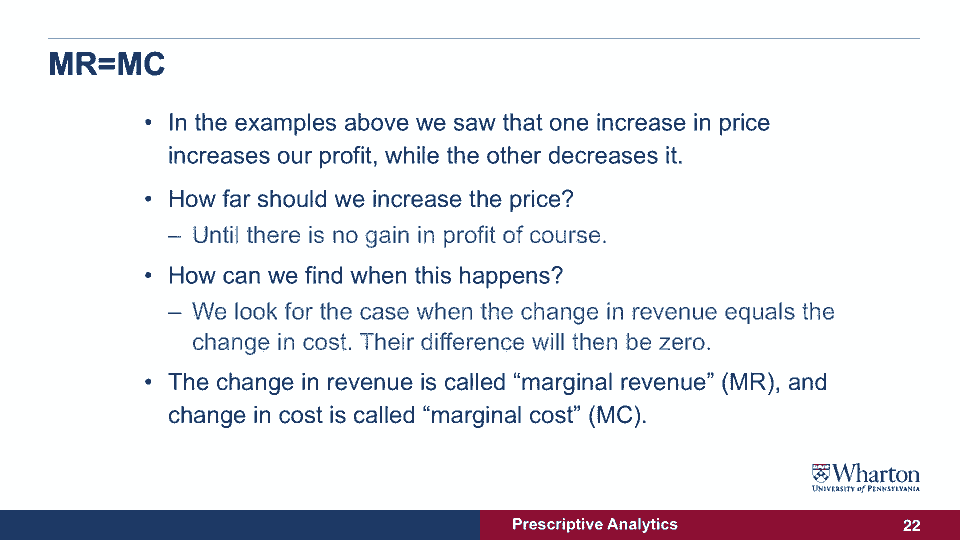

# 📊 沃顿商学院商业分析课程 P23：模型参数详解


在本节课中，我们将学习如何在模型中引入成本参数，并探讨公司在追求利润最大化时，如何通过调整价格来平衡收入与成本。我们将从基本的利润概念出发，逐步推导出寻找最优价格的核心原则。

---

## 📈 利润最大化基础

上一节我们介绍了收入模型，但收入并不等同于利润。公司运营会产生成本，利润是收入减去成本后的剩余。因此，公司的目标是实现**利润最大化**，即：

**利润 = 收入 - 成本**

假设每个产品的生产成本是 **2美元**。我们可以在之前绘制的收入图上增加一条**总成本线**（通常以红色虚线表示）。通过对比收入（蓝点）与成本（红点），我们可以直观地看到：

*   当产品定价过低时，销量可能很高，但收入低于成本，利润为负（红点高于蓝点）。
*   当定价过高时，销量下降，成本也随之降低，但收入增长可能停滞。
*   在某个中间点（图中绿色箭头指示处），收入与成本之间的差额最大，即**利润达到最大化**。

---

## 🔍 从图表到原则

虽然通过图表或计算每个价格对应的利润（如下表所示）可以找到最大利润点（例如约 **6.5美元**），但这种方法对于大量价格组合来说效率低下。

| 价格 | 收入 | 成本 | 利润 |
| :--- | :--- | :--- | :--- |
| ... | ... | ... | ... |
| 6.5美元 | ... | ... | **（最大值）** |

因此，我们需要一个通用原则，无需复杂计算即可找到最优价格。观察发现，引入成本后，实现**利润最大化**的最优价格（如6.5美元）通常会高于实现**收入最大化**的价格（如5.5美元）。这引出了一个问题：我们如何系统地确定这个价格？

---

## ⚖️ 理解价格调整的权衡

利润最大化的过程，本质上是逐步调整价格并观察利润变化的过程。让我们通过两个例子来理解背后的力量：

**1. 低价区提价的影响**
当价格从 **1.5美元** 提高到 **2.0美元**：
*   收入增加：**+3.49美元**
*   成本减少（因为销量下降）：**-0.90美元**
*   总利润变化：**+4.39美元**。此时提价能增加利润。

**2. 高价区提价的影响**
当价格从 **6.5美元** 提高到 **7.0美元**：
*   收入减少：**-1.01美元**
*   成本减少：**-0.90美元**
*   总利润变化：**-0.11美元**。此时提价反而会减少利润。

由此可见，从低价开始提价，利润先增加；但提到某个高点后，继续提价会导致利润下降。关键是如何找到那个转折点。

---

## 🎯 核心原则：边际收益等于边际成本

最优价格出现在**利润变化为零**的时刻，即利润从正增长转为负增长的临界点。要找到这一点，无需计算总利润，只需比较收入的变化和成本的变化。

当**增加一单位销量所带来的收入增加（边际收益）**，等于**增加一单位产量所带来的成本增加（边际成本）** 时，总利润达到最大。这就是 **“边际收益 = 边际成本”** 原则。

用公式表示决策逻辑：
```
如果 边际收益 > 边际成本：提高产量（或调整价格以增加销量）仍有利可图。
如果 边际收益 < 边际成本：减少产量（或调整价格）以避免亏损。
当 边际收益 = 边际成本：利润达到最大化，此时的价格和产量为最优解。
```

我们可以通过分析数据表，计算每多卖一件产品带来的收入变化（边际收益）和成本变化（边际成本），当两者相等时，就找到了最优价格和最大利润点。

---

## 📝 本节课总结



本节课中，我们一起学习了：
1.  **利润**是收入减去成本，公司的目标是利润最大化。
2.  通过图表可以直观看到利润随价格变化的关系，并找到最大利润点。
3.  更高效的方法是运用 **“边际收益等于边际成本”** 原则。该原则指出：当多销售一件产品带来的额外收入，等于多生产这件产品的额外成本时，总利润达到最大。
4.  这一原则是商业分析中用于优化决策（如定价、生产规模）的核心工具之一。