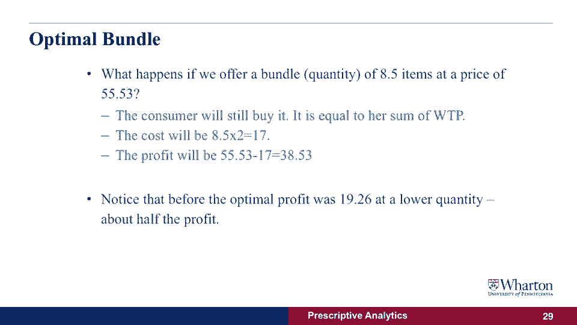

# 课程名称：沃顿商学院商业分析 P24 - 市场结构分析 🏪

## 概述

在本节课中，我们将要学习市场结构的概念。我们将探讨不同类型的消费者和市场上的公司如何影响最优价格的选择，以及如何影响我们在之前课程中发现的最大化利润。

---

## 市场结构简介

上一节我们介绍了利润最大化的基本概念。本节中我们来看看市场结构如何改变我们的决策。

市场结构是商业模型的一部分。我们试图回答的问题是：市场参与者的行为如何影响我们想要最大化的目标。现在，我们增加了一个新问题：当我们采取行动时，市场上的其他人在做什么？例如，如果我们改变价格，市场上的其他公司是否也在调整价格？

问题在于：我们能否使用与之前相同的描述性数据，来指导我们在不同市场结构下寻找最优价格？答案是肯定的。让我们通过第一个例子来理解这一点。

---

## 多消费者市场

我想告诉你，当我们知道市场上有许多消费者购买产品时会发生什么。

我们现在假设市场上有许多消费者。我们在图表中看到的需求曲线是由每个消费者生成的，每个消费者最多购买一件商品。因此，消费者要么购买零件商品，要么购买一件商品，但没有消费者想购买更多。

如果我们把价格降低到最低限度，每个消费者最多会购买一种产品。使用我们在上一节课中发现的利润最大化价格，答案其实是肯定的。如果你仔细想想，需求函数和图表没有变化，我们产生的收入表也没有变化，因为我们知道有多个消费者，每个人最多只想买一样东西。

---

## 单消费者市场

我现在想看的是，如果我们知道之前看到的需求曲线来自一个消费者，会发生什么。

问题是，如果市场上只有一个消费者，与市场上有多个消费者相比，有什么区别？我们可以考虑或注意到的一件关键事情是：如果只有一个消费者，需求曲线显示在不同的价格下，有多种商品被出售。这可能意味着消费者可能想购买不止一种商品。

所以，我们能做的就是尝试改变我们向消费者销售商品的方式。问题是：消费者是否愿意为同一商品的不同数量支付不同的价格？我们能否以不同的价格出售？让我们来看看下表，了解这是如何工作的。

以下是计算消费者支付意愿的步骤：

1.  **计算支付意愿**：支付意愿是消费者愿意为我们卖给他们的下一件商品支付的最高价格。
2.  **分析销售过程**：想象顾客来了，我告诉他们第一件商品要十美元，第二件要九美元，第三件要七美元。消费者是否仍然愿意购买桌上的所有这些产品？
3.  **计算平均价格**：我们可以计算需求曲线下方的面积，这基本上给出了消费者愿意为商品的每一个部分支付的平均价格。

让我们来看两个例子：

*   **第一个半件商品**：如果从未向消费者出售过任何商品，我知道对于第一个小数项目，消费者愿意支付11.26美元的价格。当消费者买到半件商品时，他们最多愿意为这个额外的部分支付10.70美元。如果我们按这个平均价格（基本上是曲线下方的梯形面积）计算，愿意支付的是5.49美元。
*   **第三到三个半件商品**：对三到三个半的项目进行同样的分析，我们会看到数量在3到3.5之间，愿意支付的是3.82美元。

现在我们知道消费者愿意为每增加一件商品支付多少钱。问题是我们的利润是多少？为了了解利润，我们也需要看看成本。

---

## 利润计算与捆绑销售

为了计算利润，我们需要将支付意愿与成本进行比较。如果我们做计算，基本上就是将支付意愿减去成本，得到我们每增加向消费者出售半件商品所获得的利润。

*   **前半件商品**：我们能得到4.49美元的利润。
*   **后半件商品**：我们能得到4.29美元的利润。
*   **总计（第一件商品）**：第一个项目（前半部分加后半部分）的利润现在是4.49美元加上4.29美元。

如果我们想知道出售第四种商品能赚多少钱（即三到四个项目），我们就会得到愿意支付3到3.5的价格，利润是2.82美元；利润在3.55到4.04之间，利润是2.54美元。这笔钱就是我们出售商品的利润。

我们能做的就是计算出每一捆我们将获得的总利润，或者我们将销售的每一数量的产品。所以我们可以计算最多卖一件、两件、三件，一直到九件商品的利润。你会注意到，在最后的第九个半项目（实际上是第18个半件），利润正在变成负数。那是因为消费者的支付意愿低于我们生产产品的成本。这意味着对我不值得，我不会从给消费者发送额外的商品中获利，我可能想停下来。

那么我们如何利用这一切来增加利润呢？我们能做的就是销售一种叫做“捆绑”的东西。

---

## 捆绑销售策略

一捆基本上是一个“要么接受，要么离开”的向消费者提供的方案。在一捆里，我们告诉消费者：你可以按这个价格买这么多的东西，否则你什么都得不到，这是你的选择。

如果我们给消费者提供8件半商品，价格是55.53美元，我们想问的第一个问题是：消费者是否还会购买我们的产品？答案是肯定的。因为这是消费者支付意愿的总和，我们知道对于这些部分项目中的每一个，消费者还是愿意付出代价。

我们想问的第二个问题是：生产这个包的总成本是多少？答案是八个半项目乘以两美元，这是我们要生产的整个产品的成本，这是十七美元。

利润就是收入（55.53美元）减去成本（17美元），一共是38.53美元。

有趣的是，如果我们比较这个案例（向一个消费者出售一个捆绑包），我们实际上是在为消费者设定更高的产品数量，我们也赚了更高的利润。与之前多个消费者的情况相比，我们看到最优利润几乎是以前的，我们卖给消费者的数量也少得多，不能再好了。

---

## 总结

本节课中我们一起学习了市场结构分析的核心内容。

这里的结论是：如果我们知道市场是单个消费者还是多个消费者，以及这些消费者是真的想要一件还是多件商品，我们可以选择是否以捆绑的形式卖给他们。这将增加我们的利润。否则，如果我们需要为每个消费者以相同的价格为每一件商品定价，那么我们就不能利用消费者对不同数量商品的支付意愿差异来提升利润。

**核心公式与概念**：
*   **利润计算**：`利润 = 支付意愿 - 成本`
*   **捆绑销售**：提供一个固定数量和总价的“套餐”，利用消费者对商品组合的总支付意愿高于单件商品价格之和的特点。
*   **支付意愿**：消费者为购买额外一单位商品所愿意支付的最高价格。