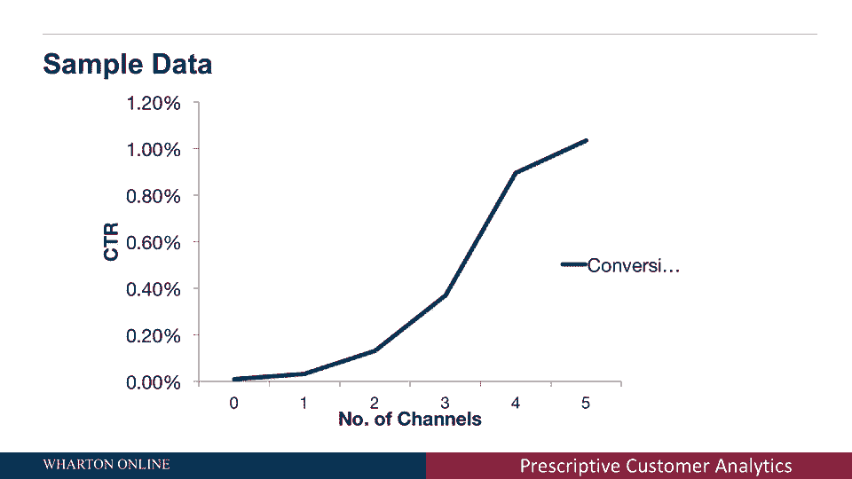

# 【沃顿商学院】商业分析 全套课程（客户、运营、人力资源、会计） - P25：[P025]06_competition-and-online-advertising-models - 知识旅行家 - BV1o54y1N7pm

在这个讲座中，我将展示不同模型的不同例子，问一个不同的问题或一个错误的问题，我可能会给你错误的建议或处方，这就是为什么在规定性分析中，了解这些行为实际上是如何影响的是非常重要的，我们试图最大化的目标。

所以到目前为止，我们所涵盖的是我们的目标，什么是行动，什么是模型，好的，我们已经看到了几个改变模型的例子，但使用相同的数据会影响建议的行动，我们已经看到有时我们建议较低的价格，比如说。

最大限度地提高销售量，有时建议更高的价格以最大化销售收入，有时会建议更高的价格来最大化所有产生的利润，主要是因为引入了成本，问正确的问题是非常非常重要的，我们试图最大化什么。

我们的消费者在这个市场上做什么，让我们看几个例子，我想讨论的第一个例子是两个不同公司之间的竞争，所以问题是，我们在之前的分析中是否假设了任何不适用于竞争公司的情况。

当有一个竞争产品可以从我们的产品中夺取市场份额时，答案是肯定的，我们做了，我们假设如果我们改变价格，消费者的行为符合我们从数据中描述的需求模型，但我们没有说其他公司是否也会回报，价格更低。

或者更高的价格，但实际上如果我们降低价格，竞争对手不也降低价格吗，然后这个问题，我们需要做些什么来应对，2。如果竞争对手把价格降低到比我们低一点的话，所有的消费者都去购买竞争对手的产品，1。

我们该不该降低价格？甚至比消费者低一点，如果我们这样做，竞争对手也会削价，我们会降低价格，他们会降低价格，我们会打价格战，实际上利润会被侵蚀，可能利润为零，我刚才描述的。

也就是我的公司在回应竞争对手的公司，竞争对手的公司对我的价格变化做出了回应，这叫做战略互动，这就是博弈论领域通常处理的问题，并试图解决另一个问题，我现在要介绍，在下一节课中。

我将向你们展示一些关于它的细节，所以让我们来看看在线广告是如何在网络上运作的，基本上这些是你们都浏览的网站，这些都是你看到弹出作为追逐的在线广告，你和跟随，你必须你，把产品放进购物车。

当公司给你看这些广告时，他们能做什么，他们需要做出选择，他们给你看广告了吗，还是他们把广告展示给不同的消费者，还有他们能做什么，他们可以说我想给一个消费者看同样的广告，但是在多个网站上。

如果这个消费者访问雅虎网站和eBay网站，亚马逊网站和CNN网站，我要展示同样的广告，对同一消费者，这些广告会追逐，因为很难分辨，如果这些广告真的影响了消费者购买产品的决定。

公司所做的是他们做一些叫做归因的事情，在过程结束时，他们试图衡量每个广告的影响，关于消费者决定购买的一个简单方法，也就是说，消费者点击广告了吗，如果消费者点击广告，更可能的是广告有更大的影响力。

公司试图衡量的是所谓的点击率，基本上，如果我把这个广告给一百个消费者看，他们中有多少人会真正点击广告，点击到，看过广告的消费者数量，实际上是广告的点击率，所以让我们看一个例子。

你在这个图中看到的基本上是，广告商如何在线分析数据，他们说的是，他们说，我要把这些广告在不同的频道上给同一个消费者看，或者X轴上的不同网站，你看到了吗，向同一消费者显示广告的频道数。

所以一些消费者看到了零广告，只是没看到任何广告，一些消费者看到了一个广告，一些消费者在两个网站上看到了广告，一些消费者在三个网站上看到了，在左手边，我们看到点击率，概率是多少。

或者实际点击广告的消费者百分比，所以如果你没有看到广告，你不点击广告那很好，太完美了，从这个分析来看，如果你在不同的网站上向消费者展示越来越多的广告，随着点击概率的增加，他们点击的次数越来越多。

这意味着这些广告实际上变得越来越有影响力，你在下一节课上展示的广告越多，我将向你展示的是如何分析这些数据并试图理解，这个模型有意义吗。

向消费者展示越来越多的广告，实际增加。
