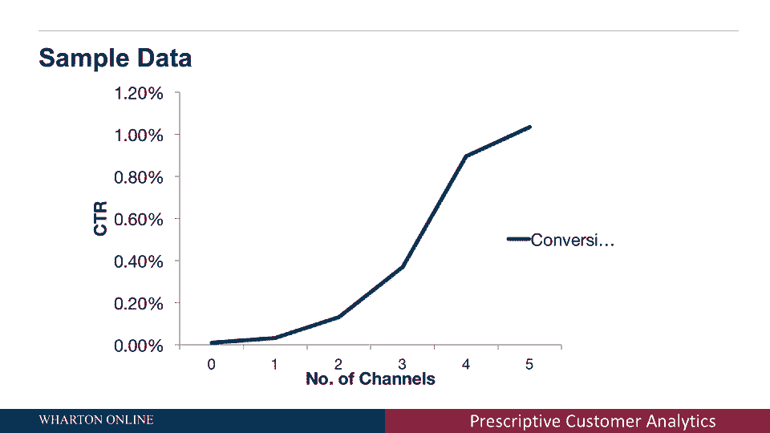

# 📊 沃顿商学院商业分析课程 P25：竞争与在线广告模型

在本节课中，我们将探讨商业分析中的两个重要概念：**市场竞争中的战略互动**与**在线广告的效果评估**。我们将看到，选择不同的分析模型或提出不同的问题，会直接导致截然不同的商业决策。理解消费者和竞争对手的真实行为，是做出正确规定性分析的关键。

---

## 🎯 回顾：模型选择如何影响决策

上一节我们介绍了规定性分析的核心要素：目标、行动与模型。我们已经看到，即使使用相同的数据，改变模型也会影响建议的行动。例如，为了最大化**销售量**，我们可能建议降低价格；为了最大化**销售收入**，我们可能建议提高价格；而引入成本后，为了最大化**总利润**，建议的价格策略可能再次不同。

**核心要点**：提出正确的问题、明确我们想要最大化的目标，并理解消费者的实际行为，是至关重要的。

---

## ⚔️ 引入竞争：战略互动与博弈论

到目前为止，我们的分析假设了一个前提：当我们改变价格时，消费者的行为会按照我们从数据中推导出的需求模型来变化。但我们没有考虑其他公司（竞争对手）的反应。

然而在现实中，竞争是存在的：
*   如果我们降低价格，竞争对手也可能降价。
*   如果竞争对手将价格降到比我们更低，消费者可能会转而购买他们的产品。

这就引发了两个战略问题：
1.  我们是否应该将价格降得比竞争对手更低？
2.  如果我们降价，竞争对手也跟进降价，可能会导致价格战，最终侵蚀甚至将利润降至为零。

我所描述的这种情况——我的公司根据竞争对手的行动做出反应，而竞争对手也对我的价格变化做出回应——被称为**战略互动**。研究这类问题的领域叫做**博弈论**。

**过渡**：在下一节课中，我们将深入探讨博弈论的细节。现在，让我们先看看另一个领域的模型应用：在线广告。

---

## 🌐 在线广告模型：归因与点击率

我们每天浏览网站时都会看到弹出的在线广告。当公司展示这些广告时，他们需要做出选择：
*   是否向某个消费者展示广告？
*   是否在多个网站上向同一消费者展示相同的广告？（这就是广告“追随”你的原因）

一个关键挑战是：很难判断究竟是哪个（或哪些）广告最终影响了消费者购买的决定。为了解决这个问题，公司会进行**归因分析**，试图衡量每个广告对购买决策的影响。

一个简单的衡量方法是看消费者是否**点击**了广告。点击通常意味着广告产生了更大的影响。公司用来衡量的核心指标是**点击率**。

**点击率公式**：
`点击率 = (点击广告的消费者数量) / (看到广告的消费者数量)`

---

### 分析广告展示频次的影响

以下是如何分析广告展示数据的一个例子。公司会研究向同一消费者展示广告的网站数量（渠道数量）与点击率之间的关系。

*   **X轴**：向同一消费者展示广告的渠道数量（0个、1个、2个、3个网站……）。
*   **Y轴**：点击率（点击广告的消费者百分比）。

从典型的分析图表中，我们可以观察到以下模式：
1.  如果消费者没有看到任何广告，他们自然不会点击。
2.  随着在不同网站上向消费者展示的广告数量增加，点击的概率（点击率）也会增加。

这表明，在一定范围内，向消费者展示更多的广告，确实能提高广告的影响力。

**过渡**：在下一节课中，我将向你们展示如何具体分析这类数据，并探讨“展示越多广告效果越好”这个模型是否总是合理，以及在什么情况下成立。

---

## 📝 本节课总结

在本节课中，我们一起学习了：
1.  **模型的重要性**：重申了选择正确的分析模型对于得出有效商业建议的决定性作用。
2.  **竞争分析**：引入了**战略互动**的概念，指出在存在竞争对手的市场中，必须考虑对方的反应，这属于**博弈论**的研究范畴。
3.  **在线广告评估**：介绍了在线广告的**归因分析**，并学习了用**点击率**来衡量广告效果。我们看到了广告展示频次与点击率之间的正相关关系。

通过这两个例子，我们深刻认识到，商业分析不能脱离真实的竞争环境和消费者行为。在接下来的课程中，我们将深入探讨博弈论和更复杂的广告效果模型。