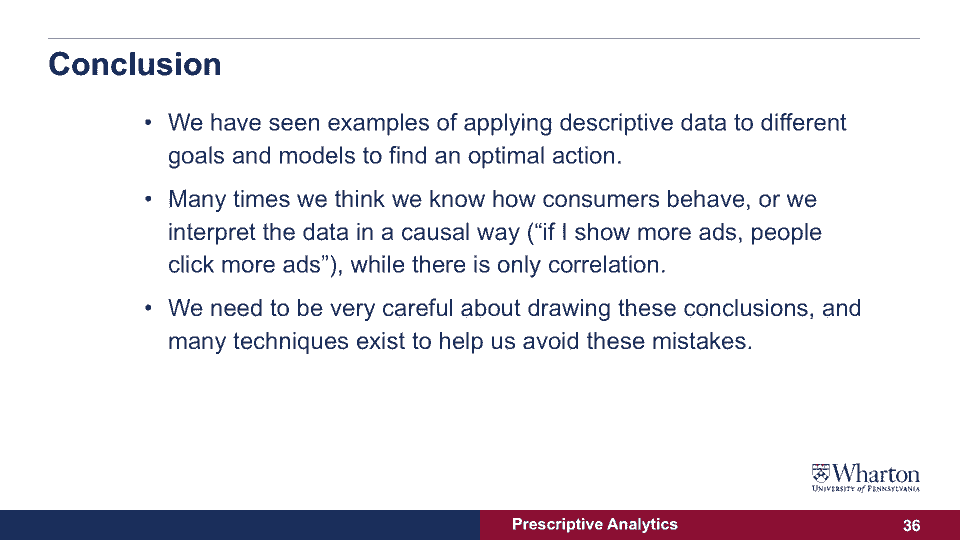
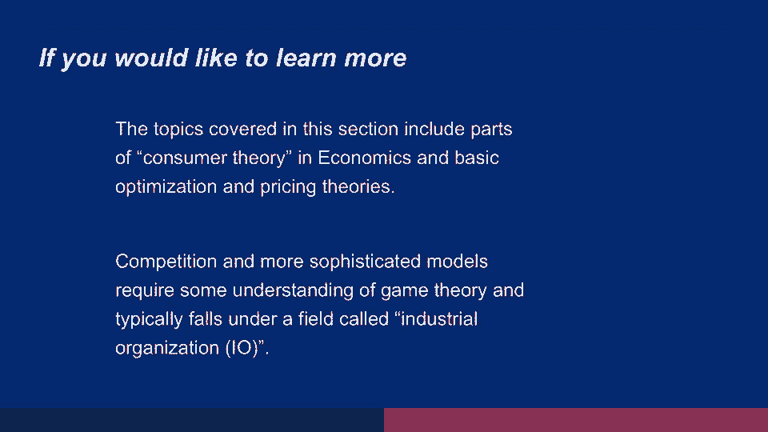

# 【沃顿商学院】商业分析 全套课程（客户、运营、人力资源、会计） - P26：[P026]07_conclusion-s - 知识旅行家 - BV1o54y1N7pm

在上一节课的最后，我向你们展示了一个在线广告活动的图表，我们在x轴上看到的，使特定消费者接触广告的网站数量，在左边的y轴上，我们将看到点击率，消费者点击这些广告的概率是多少。

如果他们在不同的频道上看到越来越多的广告，这个结论正确吗？让我们好好想想，我们让消费者接触的越多，他们点击的越多，有没有其他解释，或者我们能想到这些数据中可能发生的其他事情，你知道吗。

让我们试着看一个不同的实验，我们试着看看数据告诉我们什么，因为我们测量点击率，因为这些网络实际上是通过点击率来补偿的，那就是广告商付钱给网站，如果消费者点击更多的广告。

也许网站会向真正点击广告的消费者展示广告，无论如何，那就是网站知道如何识别消费者，点击了很多广告，他们给他们看广告，即使广告没有影响，这可能就是发生的事情，所以让我们来看看这个图表，这个图非常非常有趣。

在这个例子中，我们看到的是我们显示的和点击率，或者点击添加的概率，在消费者已经访问了广告商网站之后，那是一位消费者说过的，我将以极高的概率购买该产品，只有在那之后。

网站才开始向消费者展示这些广告很多很多很多很多次，我们可以看到，如果你在访问后展示一个单独的广告，实际上点击率有所上升，实际上消费者说，哦，这个广告让我想起了那个产品，我没有买了就放在购物车里。

或者我想再看看这个品牌，实际上有一个凸起从零到一，从没有看到广告到真正看到一个广告，但是当我们增加广告的数量时，显示的越来越多，那就是当我们在不同的网站上显示越来越多的广告时，我们回到以前的速度。

就在我们展示附加广告之前，那就是，这些网站实际上知道如何识别无论如何都会点击广告的消费者，但对点击率没有影响，点击率没有上升，它只是保持不变，我展示的广告越来越多，所以总结一下。

我们已经看到了如何应用相同的描述性数据的例子，对不同目标的相同预测分析，不同的模型实际上找到了不同的最优动作，我们已经展示了如何根据我们的目标找到这个动作，我们觉得，或者我们有时会错误地说这个图表。

其实，这张图描述了消费者实际做的事情，如果我降低价格，消费者会购买更多，如果我提高价格，消费者会减少购买，这是一个普遍的真理，但我们所知道的是在这张图之外发生了什么，很多时候。

解释是一个因果模型是有点问题的，正如我们在上一张幻灯片中看到的，如果我们认为广告是随机展示给消费者的，那当然，当我们播放更多的广告时，这张图暗示消费者点击广告的次数更多，但如果网站可以选择向谁展示广告。

也许他们会把广告给消费者看，他们会点击广告来最大化他们的利润，然后我们的结论，所以总结一下我们需要做的是，我们需要非常，非常小心地从描述性数据中得出结论性结论，变成可能产生错误结论的行动。

为了解决这个问题，我们有时需要做一个实验，或者我们需要测试不同的模型看看哪一个最能描述现实。

因此，如果您想了解更多关于这些主题的信息，我在这节课中所讨论的内容涵盖了不同的领域，在经济学中，在市场营销中，以及在其他领域，特别是，经济学中的消费者理论涵盖基本的定价理论，我们在这节课中做的优化练习。

此外，竞争和更复杂的模型需要了解一些博弈论，在经济学中，这个领域被称为产业组织或IO。

它着眼于公司如何竞争，也如何与消费者互动，在接下来的一系列讲座中，您将看到一系列讨论不同案例研究的应用程序，并应用你在这些讲座中学到的不同原则。
