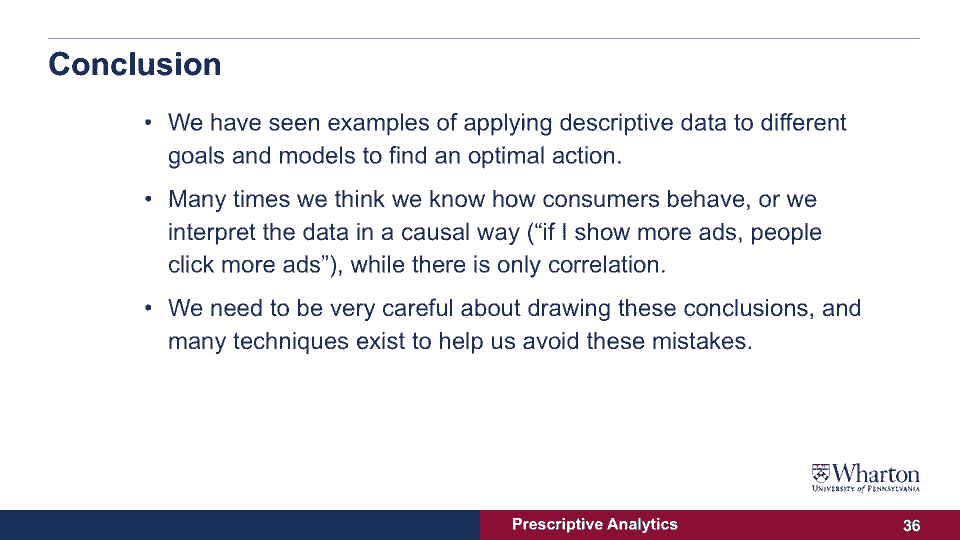

# 课程名称：沃顿商学院商业分析 P26 - 从数据到决策：警惕相关性陷阱 🧐

## 概述

在本节课中，我们将学习如何审慎地解读数据分析结果，特别是如何区分数据的“相关性”与“因果性”。我们将通过一个在线广告活动的具体案例，揭示从描述性数据中直接推导行动方案可能存在的风险，并探讨如何通过实验和模型验证来得出更可靠的商业结论。

---

## 回顾与问题引入

在上一节课程中，我们分析了一个在线广告活动的图表。该图表显示，随着消费者在不同网站上看到的广告数量（X轴）增加，广告的点击率（Y轴）似乎也随之上升。

这个观察似乎指向一个直接的结论：**向消费者展示越多的广告，他们点击广告的可能性就越大。**

然而，这个结论真的正确吗？是否存在其他解释？本节中，我们将深入探讨这个案例，看看数据背后可能隐藏的其他故事。

---

## 深入剖析：另一种可能性

让我们尝试从另一个角度审视这个实验。我们测量的点击率是广告商向网站付费的关键指标——消费者点击越多，网站收入越高。

因此，存在一种可能性：**网站可能有意向那些本身就倾向于点击广告的消费者展示更多广告**。换句话说，网站能够识别出高点击率的用户群体，并针对性地向他们投放广告。如果这是真的，那么“展示更多广告”和“点击率上升”可能只是同时发生的两件事，而非前者导致后者的因果关系。

为了验证这个想法，我们来看一个调整后的实验图表。

---

## 关键实验：访问后的广告展示

这个新图表非常有趣。它展示的是在**消费者已经访问过广告商网站之后**，再向他们展示广告时的点击率。

以下是实验观察到的核心现象：
*   当消费者访问网站后，首次看到广告时，点击率确实有一个明显的上升。这可能是因为广告提醒了消费者之前感兴趣的产品。
*   但是，**随着后续广告展示次数不断增加**，点击率并没有持续增长，而是迅速回落并保持在访问前的基线水平。

这个模式表明，网站很可能在消费者表现出购买意向（访问网站）后，才向他们大量推送广告。而这些额外的广告**并没有进一步提升点击率**。

---

## 核心教训：相关性 ≠ 因果性

总结一下，我们从中学到的核心教训是：

**`观察到的相关性（A和B同时发生）` ≠ `因果性（A导致B发生）`**

我们最初看到的图表（展示越多，点击越多）很容易被误解为因果模型，即：
> 增加广告展示 **→** 提升点击率

但实际上，更可能的情况是一个混杂因素（如“用户购买意向”）同时影响了“广告展示量”和“点击率”，导致了表面的相关性。网站只是根据这个混杂因素来优化广告投放，而非广告本身创造了点击。

---

## 如何做出正确决策？

那么，我们该如何避免这种错误，做出正确的商业决策呢？以下是两个关键方法：

1.  **设计可控实验**：最可靠的方法是进行A/B测试或随机对照实验。例如，随机将用户分为两组，一组增加广告曝光，另一组保持原样，然后比较两组的点击率差异。这能帮助我们直接检验“增加广告”这个动作是否真的“导致”了“点击率上升”。
2.  **构建并检验因果模型**：不要满足于单一的描述性模型。尝试构建不同的解释模型（例如，包含“用户意图”作为变量的模型），并使用数据检验哪个模型最能预测现实情况。

---

## 知识延伸与应用

本节课讨论的内容横跨多个领域：
*   **经济学中的消费者理论**：涵盖了基础的定价模型，与我们做的优化练习紧密相关。
*   **产业组织与博弈论**：要分析企业间的竞争以及更复杂的市场互动，需要了解博弈论。这在经济学中被称为**产业组织**领域，它研究公司如何竞争以及与消费者互动。

在接下来的系列讲座中，你将看到如何将这些原则应用到不同的商业案例研究中。

---

## 总结

本节课中，我们一起学习了数据分析中的一个关键陷阱：将相关性误认为因果性。我们通过广告案例看到，草率地从描述性数据得出结论可能导致错误的商业行动。要解决这个问题，我们必须保持审慎，并通过**设计实验**和**验证多种因果模型**来确保我们的决策建立在可靠的理解之上。记住，好的分析不仅要看数据“是什么”，更要追问“为什么”。