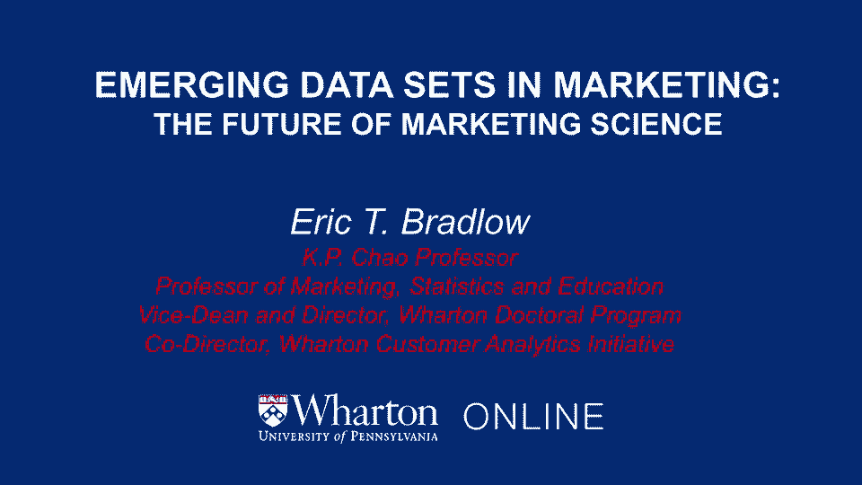
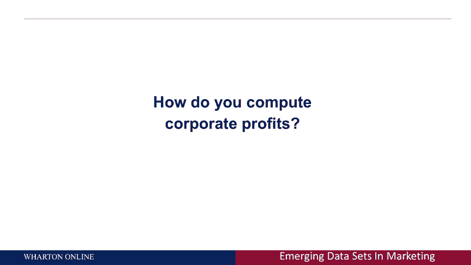
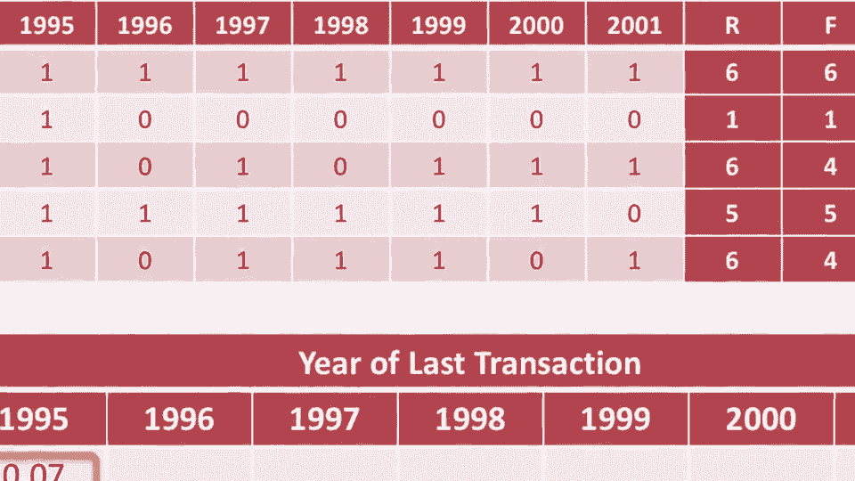
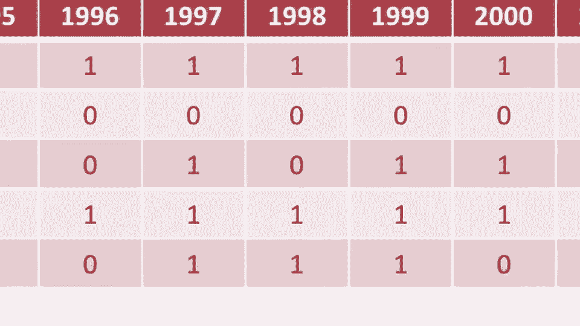
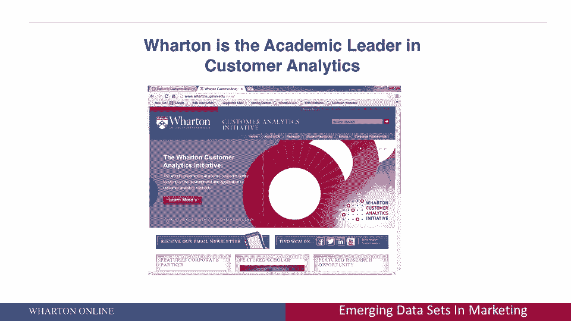

# 【沃顿商学院】商业分析 全套课程（客户、运营、人力资源、会计） - P28：[P028]02_the-future-of-marketing-is-business-analytics - 知识旅行家 - BV1o54y1N7pm

喜欢欢迎大家，如果你想了解我们演讲的内容，论商业分析与市场营销的应用，可能连你都知道，我总是喜欢从前面的幻灯片开始教东西，如果你注意到这里，幻灯片上写着营销的未来，然后在括号里是科学。

我这么说是因为对我来说，营销的未来是商业分析，今天没有公司，应该考虑纯粹的大众营销，今天不应该有公司，这不是在考虑个人层面的客户，今天没有商号了，不应该使用技术来更好地衡量他们的客户。

括号里的原因是科学现在你可以测量东西，市场营销真的成了一门科学，意思是，我们有数据我们在我的介绍中一直在讨论，这是第一步，你捕捉到了什么数据，我们有办法探索这些数据，今天有方法探索海量数据集。

第三件事我们有模型可以建立，我们有方法可以优化，然后我们可以给我做商业决定，听起来像一门科学，又是这样，本讲座下节课的重点将是商业的应用。

分析与市场营销，如果你想问第一个问题，我总是喜欢问，你如何计算公司利润，现在你可能会说，这不是一个很难的问题，收入减去成本，那是公司利润，我说有点，我是说，是呀，从金融角度看，那可能是对的。

但不是从营销分析的角度，从营销分析的角度。

你应该想的不是，如果你愿意，想象一个矩阵，你的客户的行和他们购买的产品的列，矩阵的条目为，他们在一个给定的产品上花了多少钱，当然，其中一些可以是零，他们没有买任何产品，但如果你想这么想，很多人都说。

我把这些列加起来，我要看看每种产品能赚多少钱，我要看看制造那种产品要花多少钱，我会计算公司利润，而商业分析的营销观恰恰相反，专栏不是你的利润中心。

产品不是你的利润中心，但行是你的利润中心，你应该为每一个顾客着想，我卖给每个顾客多少钱，我为那个顾客服务要花多少钱，我从每个顾客身上赚了多少钱，然后我把行相加，希望你们都记得，对我们大多数人来说。

这可能是八年级的数学，无论从列还是行中添加数字表，和还是一样，所以经典的财务方法是收益减去成本，关于利润的经典商业分析和营销方式是。

我从每个客户那里得到多少收入减去成本，让我们把它加在所有的顾客身上，现在这样思考营销分析的优势，就是有些客户有负值，你应该怎么做，你解雇那些顾客，有些客户对公司有很大的价值，这些是你不仅要培养和保留的。

但你必须找到更多的，所以即使是在第一张实质性的幻灯片上，你可以在某种程度上看到营销分析的心态是如何运作的，它一次工作一个客户，所以再次盈利，一次一个客户，这真的将是这些幻灯片剩下的潜在主题。

我要告诉你们像谷歌和亚马逊这样的领先公司，等，想着赚一笔钱，一次一个客户，技术是如何改变这一点的，所以如果你愿意，这真的是技术的交集，已取得的数据和统计数字，商业分析与市场营销，今天的科学，所以让我从。

嗯，什么是客户分析，对你们中的许多人来说，这似乎是一件显而易见的事情，嗯，我们实际上花了七年时间来写这个定义，你可能会说等等，你干这行已经二十年了，你花了七年时间写这个定义是什么，答案是肯定的。

这就是花了多长时间，但如果你看看我们说的话，客户分析是指集合，所以首先你必须有数据，你必须收集它，就像我在介绍中所说的，如果你不测量它，就像什么都没发生过一样，二是数据的管理。

所以必须有人能把这些数据收集到大型数据库中，以及是否将其存储在云中，或通过服务器，或者在本地，有人必须管理数据，你必须分析数据，数据本身就是数据数据，不会给你直接的洞察力，你得分析数据。

最后是这些数据的战略杠杆，所以客户分析指的是集合，组织粒度数据的管理分析和战略杠杆，关于其客户的行为，另一部分是关键，我刚才说的是粒度的本质，这又回到了如何计算，利润分析，商业分析，客户分析。

从市场营销的角度来看，是关于粒度数据的，在最细粒度的级别跟踪每一个客户，下一个，你又可以看到了，固有颗粒，它侧重于个人层面的行为，不是聚合模式，所以这个例子，嗯，我喜欢一直用，就是，你知道。

如果一家公司想预测某个州的销售额，非常有趣，非常重要的业务问题，但那不是客户分析，你想计算它，一次一个客户，其次是行为上的，嗯，二十年前真正改变的事情，当我开始在杜邦，我在他们的客户营销部门工作。

当我们想了解顾客的情况时，我们调查了他们，我们问他们是做什么的，但现在你可以衡量他们的所作所为，而古老的营销表达是，你知道，什么预测未来的行为，真的很好，过去的行为，行为预测行为比所谓的。

陈述意图数据符合行为第三，这是前瞻性的，我在介绍中谈到了这一点，当我给那个老营销笑话，你知道只有很难预测，当它关乎未来，但是市场营销的商业分析是一门前瞻性的科学，我的客户下一步要做什么，它是多平台的。

所以这不仅仅是你可以在网上测量什么，它是线上离线调查数据的集成，等，如果你喜欢这种语言，你会听到所有的时间，有数据融合的问题，如何将来自不同平台的数据融合在一起，所有这些都是营销客户分析的一部分。

广泛适用，所以请注意，客户这个词在引号中，例如，如果我是Expedia，那么客户可能是去我的网站寻找旅行的人，我的客户可能是向慈善机构捐款的人，或者献血的人，如果我是辉瑞，像制药公司。

我的顾客可能是医生，也可能是消费者，直接向消费者，所以从最广泛的角度来考虑客户，最后是多学科的，所以如果你在看这个课程，你在市场统计领域，计算机科学，信息科学，运筹学，适用于各个垂直行业。

它适用于零售业，制药，电信，等，客户分析应用的好处在于，它没有行业界限，这真的是跨学科的，对你们这些人说几句话，想了解更多关于客户分析的信息，除了在市场营销方面，除了它的应用，在本课程中。

你可以去一个网站，WCAI沃顿结束，埃杜，嗯，我的同事，皮特·法德和我，www。icj-cij。co。uk，客户分析总监，和，大家可以看一下。

