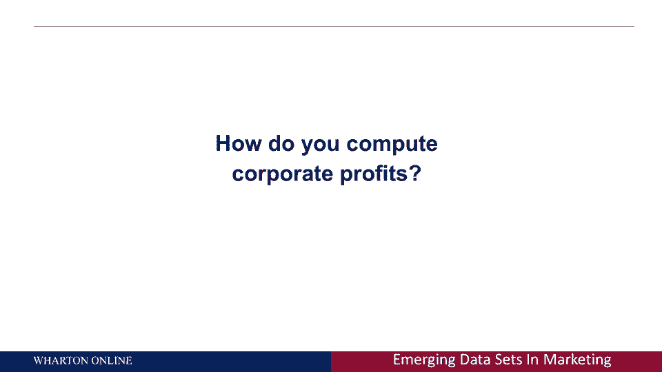
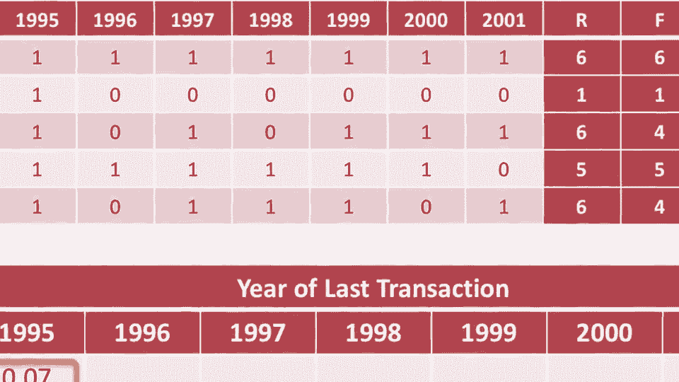

# 课程名称：商业分析与市场营销应用（第28课）📊

## 概述

在本节课中，我们将要学习商业分析在市场营销领域的核心应用。我们将探讨如何通过数据驱动的方式，从客户层面理解利润，并了解客户分析的定义、关键特征及其在现代商业中的重要性。

---

## 营销的未来是商业分析 🔮

上一节我们介绍了课程的整体方向，本节中我们来看看营销的未来。幻灯片上明确指出：营销的未来是商业分析。如今，任何公司都不应再只考虑大众营销，而必须关注个体客户。技术使我们能够更好地衡量客户，营销因此成为一门科学。这意味着：
1.  我们能够捕获数据。
2.  我们拥有探索海量数据集的方法。
3.  我们可以建立模型并进行优化。
4.  最终，我们可以基于此做出商业决策。

这整个过程正是一门科学的实践方式。本讲座的重点，正是商业分析在市场营销中的具体应用。

---

## 如何计算公司利润？💰

如果你想问第一个问题，那通常是：如何计算公司利润？从财务角度看，答案很简单：**利润 = 收入 - 成本**。

但从营销分析的角度看，视角完全不同。你不应只关注整体，而应想象一个矩阵：
*   **行** 代表你的每一位客户。
*   **列** 代表他们购买的各种产品。
*   **矩阵中的每个值** 代表某位客户在某个产品上的花费（有些值可能为零）。

传统的财务方法是将列（产品）相加，计算每种产品的收入与成本之差。然而，商业分析的营销观恰恰相反：**行（客户）才是你的利润中心**。

你应该思考的是：我从每位客户那里获得了多少收入？服务这位客户的成本是多少？我从每位客户身上赚了多少钱？然后将所有客户（行）的利润相加。

无论是按列加还是按行加，总和都是一样的。但这样思考的优势在于，你能识别出：
*   有些客户带来**负利润**，你应该考虑终止与他们的关系。
*   有些客户带来**高价值**，你不仅要维护和保留他们，还要寻找更多类似的客户。

因此，营销分析的核心心态是：**一次服务一位客户，并基于此实现盈利**。这将是后续内容的潜在主题。像谷歌、亚马逊这样的领先公司，正是以这种方式思考盈利。技术、可获得的数据和统计学，共同推动了这场市场营销的科学化变革。

---

## 什么是客户分析？🔍

上一节我们了解了利润计算的新视角，本节中我们来深入探讨客户分析的定义。这一定义看似简单，实则凝聚了多年的思考。

客户分析是指：
1.  **集合**：首先，你必须收集数据。如果不进行测量，一切就无从谈起。
2.  **管理**：必须有人将这些细粒度数据组织并存储到大型数据库、云端或服务器中。
3.  **分析**：数据本身不会直接产生洞察，你必须对其进行分析。
4.  **战略杠杆**：最终目的是利用这些数据驱动战略决策。

因此，客户分析指的是**对客户行为的细粒度数据进行集合、管理、分析，并以此作为战略杠杆的过程**。关键在于“细粒度”，这与我们之前讨论的利润计算方式一脉相承——它关注的是最微观的个体客户层面。

以下是客户分析的几个关键特征：

*   **聚焦个体**：它关注个人层面的行为，而非聚合模式。例如，预测单个客户的购买行为是客户分析；预测整个州的销售额则不是。
*   **基于行为**：过去，我们通过调查（询问）来了解客户；现在，我们可以直接测量他们的行为。过去的行为是预测未来行为的最佳指标。
*   **前瞻性**：它是一门预测未来的科学，核心问题是“我的客户接下来会做什么？”
*   **多平台**：它涉及整合线上、线下、调查等多种来源的数据，解决“数据融合”的挑战。
*   **广泛适用**：“客户”的定义非常广泛，可以是消费者、捐赠者、医生（对制药公司而言）或网站访客。
*   **多学科**：它融合了市场营销、统计学、计算机科学、信息科学和运筹学等多个学科。
*   **跨行业**：其应用没有行业界限，适用于零售、制药、电信等各个垂直领域。

如果你想了解更多关于客户分析的信息，可以访问沃顿商学院客户分析倡议（WCAI）的网站。

---

## 总结

本节课中，我们一起学习了商业分析如何重塑市场营销。我们认识到，营销的未来在于基于数据的科学分析。我们探讨了从客户个体层面计算利润的新视角，并深入了解了客户分析的定义及其**聚焦个体、基于行为、前瞻性**的核心特征。掌握这些理念，是运用数据驱动营销决策的第一步。