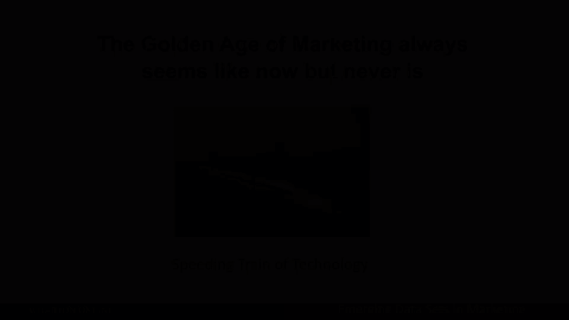
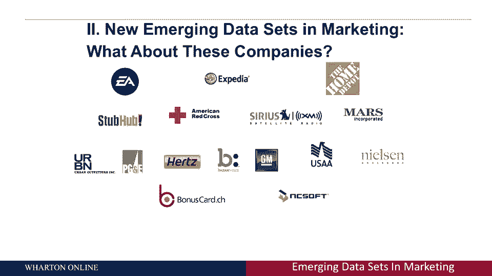

# 课程名称：沃顿商学院商业分析 - P29：营销的黄金时代 📈

## 概述

在本节课中，我们将探讨营销数据分析的演变历程，从二十世纪五十年代的商店级数据，到如今互联网时代丰富多样的客户级数据。我们将了解不同时期可用的数据类型、它们能解答的商业问题，以及如何利用这些数据进行有效的客户分析和预测。

---

## 营销数据简史 📜

上一节我们概述了课程内容，本节中我们来看看营销数据收集和分析的历史演变。理解历史有助于我们认识当前数据的价值。

### 二十世纪五十年代：商店级数据时代

在二十世纪五十年代，数据的黄金时代意味着公司能够掌握每家商店的情况。当时，许多决策都基于商店级别的数据。

以下是当时可用的数据类型和能解答的商业问题：

*   **数据类型**：商店级别的销售、价格、优惠券兑换和促销活动数据。
*   **可解答的商业问题**：
    *   如何将商店级别的价格与销售额关联？这可以通过建立**回归模型**（例如：`销售额 = β0 + β1 * 价格 + ε`）来预测价格变动对销售的影响。
    *   优惠券的效果如何？
    *   不同地区或商店存在哪些差异？
    *   店内促销活动的效果如何？

**关键局限**：数据停留在商店层面，无法进行客户级别的分析。公司知道“卖出了什么”，但不知道“是谁买的”。

### 二十世纪六七十年代：直邮与家庭级分析

直邮在那个时代占据了主导地位，许多现代营销分析方法都源于此。公司开始能够进行家庭级别的目标营销。

以下是直邮时代带来的新能力：

*   **数据类型**：公司知道向每个家庭邮寄了哪些目录或传单，并能追踪其购买反应。
*   **可解答的商业问题**：
    *   价格、产品分类和广告信息如何影响个人或家庭的购买行为？
    *   发送邮件的频率和时机如何影响效果？
    *   可以测试不同的广告创意（如颜色、字体）。

**关键局限**：公司只知道客户在自己目录内的购买行为，不了解客户在竞争对手或其他渠道的消费，无法计算客户的钱包份额或完整的终身价值。

### 二十世纪八十年代：扫描仪与现代客户分析的兴起

商店扫描仪和忠诚度计划的出现，标志着现代客户分析时代的开始。公司终于能够将购买行为与具体的客户联系起来。

以下是这个时代的关键进步：

*   **数据类型**：通过扫描仪和忠诚卡/信用卡，公司可以追踪单个客户随时间变化的购买记录，形成**面板数据集**。
*   **可解答的商业问题**：
    *   可以长期追踪客户行为，进行个性化的目标营销和优惠券发放。
    *   分析客户的购买周期和偏好。

**关键局限**：数据仍然主要局限于线下购买行为，缺乏对客户“购买前”考虑过程的洞察。

---

## 互联网时代：数据的融合与全景视图 🌐

上一节我们看到了客户追踪的突破，本节中我们来看看互联网如何彻底改变了营销数据的格局。互联网的核心贡献并非仅仅是作为一个销售渠道。

一个关键事实是：在美国，通过互联网销售的商品比例刚刚达到6%。互联网更大的价值在于**测量和广告投放**。

互联网数据与线下数据的融合，为公司提供了前所未有的客户全景视图：

1.  **洞察客户考虑过程**：公司不仅能知道客户“买了什么”（线下数据），还能知道他们“看了什么”、“考虑了哪些产品但最终没买”（线上数据）。这能区分销售额低是由于产品不受欢迎，还是缺乏知名度。
2.  **情境化广告与重定向**：可以根据用户浏览的网站内容（如汽车网站、度假网站）展示相关广告，甚至在用户离开后继续通过广告进行“重定向”。
3.  **连接线上与线下行为**：许多客户会线上研究、线下购买，或线下体验、线上购买。通过**忠诚度计划**、优惠券等方式，将线上用户ID与线下购买记录关联起来至关重要。未能打通这两类数据的公司，将难以进行有效的现代客户分析。

---

## 当今新兴的数据集与公司案例 🚀

我们已经了解了互联网的核心作用，本节中我们来看看当今还有哪些令人惊讶的数据源和公司正在利用客户级数据盈利。

以下是一些拥有丰富客户级数据并用于盈利的公司例子，它们可能超出你的常规认知：

*   **Expedia（在线旅游）**：追踪用户的每一次搜索、浏览和预订行为，了解旅行偏好和计划周期。
*   **SiriusXM（卫星广播）**：分析用户的收听行为（如音乐类型、电台），预测用户流失风险，或进行内容推荐。
*   **Hertz（汽车租赁）**：根据用户的租车历史，预测其下次可能租赁的车型，并尝试进行升级销售。

**这些公司的共同点**：它们都基于**单个客户层级的数据**进行盈利，并应用客户分析方法来优化业务决策。

---

## 总结

本节课中我们一起学习了营销数据分析从商店级到客户级的演变历程。我们回顾了二十世纪五十年代的商店数据、六七十年代的直邮数据、八十年代的扫描仪与忠诚度数据，直至互联网时代带来的线上行为数据与线下购买数据的融合。关键启示在于：**更精细的数据（客户级）能支持更优的决策**，但不应追求“完美数据”而停滞不前。当今许多公司，包括旅游、媒体、租赁等行业，都在利用独特的客户级数据进行深度分析和盈利。对于企业而言，推动数据收集向更细粒度发展，并有效整合线上与线下数据，是迈向“营销黄金时代”的关键。