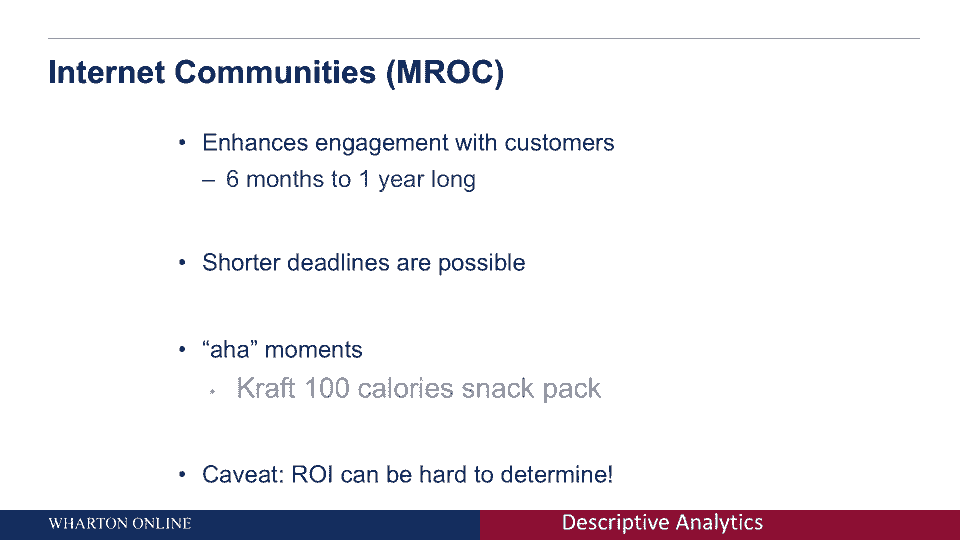

# 课程名称：客户分析基础 - 第1课：什么是描述性分析 📊

在本节课中，我们将学习描述性分析的基本概念。我们将了解它是什么，管理者如何运用它来回答不同类型的问题，以及进行探索性数据收集的常用方法。

---

## 概述

描述性分析是一种将市场与企业决策联系起来的方法。它是做出可操作决策所需的信息，也是系统收集和解释数据的原则。其核心在于获取优质数据，并实现数据与管理者决策之间的协同作用。

---

## 什么是描述性分析？

描述性分析可以通过多种方式定义。

一种定义是：**描述性分析是一种通过决策将市场与企业联系起来的方法**。

另一种思考方式是：**描述性分析是做出可操作决定所需要的信息**。

还有一种方法是：**描述性分析是系统收集和解释数据的原则**。

这些定义的共同主线是获取良好的数据。但更重要的是，它是数据与管理者必须做出的决策之间的协同作用，这种协同有助于实现良好的分析。

---

## 管理者需要做出的决策类型

管理者可能需要做出多种不同的决策。理解这些决策类型，有助于我们明白需要收集何种数据。

以下是管理者常见的几类决策问题：

*   **探索性问题**：这类问题旨在理解现象背后的原因。例如，品牌经理发现销售额下降，需要探究原因。这可能是因为顾客偏好改变，或竞争对手吸引了顾客。这个阶段的目标是纯粹探索和理解。
*   **描述性问题**：这类问题旨在了解现状和事实。例如，品牌经理想知道：我的顾客钱包份额是多少？他们在我的产品和竞争对手产品上各花了多少钱？我们的客户是谁？市场细分情况如何？这类问题需要确凿的数据来量化描述。
*   **因果性问题**：这类问题旨在确定行动与结果之间的因果关系。例如，如果更改网站登陆页面，会如何改变消费行为？是会提高点击率，还是降低？回答这类问题需要最系统的数据收集和严谨的实验设计。

我们可以看到，从探索性到因果性问题，所需数据的类型和收集条件的要求都在不断增加。

---

## 探索性数据收集方法

上一节我们介绍了管理者面临的各类问题，本节中我们来看看如何为探索性问题收集数据。

探索性数据收集通常是为了形成初步的预感或洞察。例如，品牌经理探究销售额下降的原因。这一步非常关键，它能帮助我们广泛理解潜在问题，并为后续更严格的研究提供方向。

以下是进行探索性数据收集的典型技术：

*   **焦点小组**：这是一种传统方法。通常邀请8-10名顾客在一个房间内，由主持人引导进行相对无结构的自由讨论。品牌经理可以借此观察群体动态，深入了解消费者的痛点。
*   **在线社区（互联网社区）**：这是在大数据时代演进的焦点小组形式。它规模更大（可达数百人），时间更长（可能持续数月到一年）。其理念是与消费者建立长期关系，让他们在更舒适的环境中分享真实感受和见解。例如，C Space就是提供此类服务的公司之一。

在线社区有许多优点：它能提高客户参与度；由于是长期在线进行，避免了线下召集的后勤难题，能更快地获得洞察。一个著名的成功案例是卡夫公司通过在线社区发现了消费者对“低卡路里零食”的需求，从而推出了大获成功的“100卡路里包装”产品。

然而，这种方法也有其警告：并非每次投入都能获得明确的、可行动的洞察。在决定是否采用在线社区时，必须仔细评估其长期投资是否值得，并明确希望通过它解决什么问题。

---

## 总结

本节课中，我们一起学习了描述性分析的核心概念。我们了解到描述性分析是连接数据与商业决策的桥梁。管理者利用它来回答探索性、描述性和因果性等不同类型的问题。针对探索性问题，我们介绍了焦点小组和在线社区这两种重要的数据收集方法，并讨论了它们的优缺点。

掌握这些基础知识，将帮助你在面对任何描述性数据分析任务时，都能更有效地思考问题和选择方法。