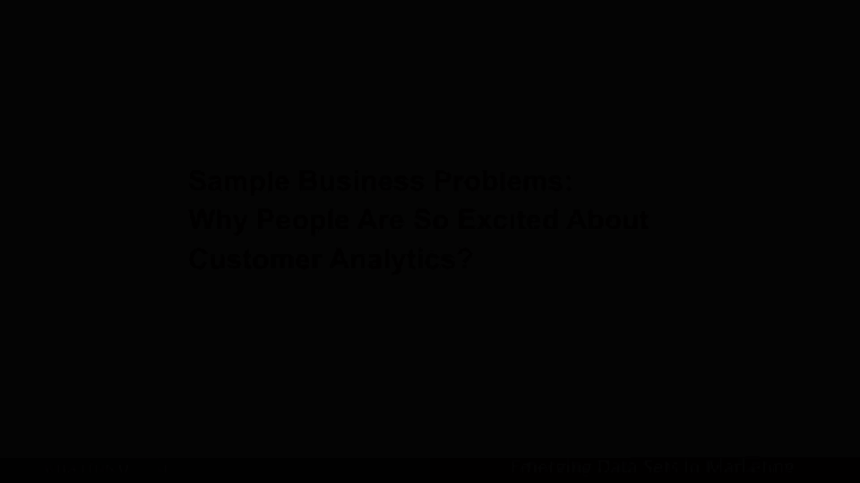
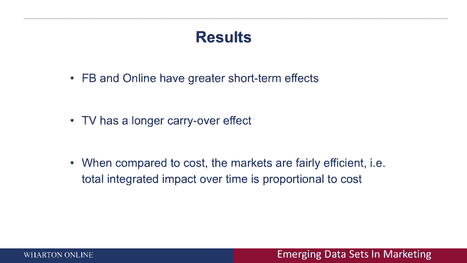

# 📊 商业分析课程 P30：投资回报率（ROI）的应用

在本节课中，我们将探讨商业分析中几个核心问题的应用，特别是如何衡量不同营销渠道的投资回报率。我们将通过具体案例，了解如何利用数据分析解决广告归因、渠道蚕食效应、折扣价值评估以及社交媒体影响力等实际问题。

---

## 🎯 广告归因问题

上一节我们介绍了商业分析的重要性，本节中我们来看看广告归因这一具体应用。广告归因的核心问题是：如何确定每个广告渠道（如电视、广播、搜索引擎）对最终销售的实际贡献价值，即计算其投资回报率。

一个常见的、但不够精确的行业做法是“最后一次点击归因”。这种方法将所有功劳归于客户购买前接触的最后一个广告。例如，如果客户在购买前最后点击了一个广播广告，那么该广播广告将获得全部功劳。

然而，这种逻辑存在缺陷。客户最终的购买决策通常受到之前一系列广告接触的影响。例如，客户可能先看到了电视广告，然后在搜索引擎上进行了搜索，最后才点击广告完成购买。真正重要的是理解客户接触广告的完整路径。

以下是一个汽车网站的用户行为路径示例：

1.  用户在 Edmunds.com 上查看了一则广告。
2.  用户访问 CNN.com 并成为广告目标。
3.  用户在凯利蓝皮书（Kelley Blue Book）上看到广告。
4.  用户使用谷歌进行搜索。
5.  用户访问广告商网站。
6.  用户在该网站完成转化（如预约试驾）。

在“最后一次点击归因”模型下，所有功劳会归于第5步（谷歌搜索点击）。但这可能并不准确，因为前几步的广告曝光共同促使用户进行了那次搜索并最终转化。

---

## 📱 渠道蚕食效应分析

在理解了多渠道归因的复杂性后，我们接下来探讨另一个关键问题：新增渠道是否会对现有渠道产生蚕食效应。以ESPN在世界杯期间推出移动观看平台为例，其核心商业问题是：移动平台会蚕食电视收视和在线流媒体吗？

这个问题之所以重要，是因为不同渠道的盈利能力不同。电视广告通常比移动广告能收取更高的费用。如果移动渠道蚕食了利润更高的电视渠道，这可能不是一件好事。

这涉及到市场营销中的“总收视点”（GRP）概念。GRP衡量的是广告触达的广度和频率，公式可以简化为：

**GRP = 触达率（Reach） × 频率（Frequency）**

ESPN关心GRP，因为更高的GRP意味着可以收取更多的广告费。因此，分析问题在于：增加一个移动渠道，如何影响ESPN可服务的总GRP？

以下是针对该问题的研究发现：

*   **存在蚕食**：推出移动频道确实会部分蚕食其他渠道（如电视）。例如，如果某一天用户在手机上花费了更多时间，那么当天他看电视的时间可能会减少。
*   **总体积上升**：尽管存在蚕食，但通过分析发现，为用户提供额外的接触渠道后，用户与品牌的总互动量（总体积）实际上增加了。

这个发现具有普遍意义。无论是销售（线上与线下）还是营销，企业应关注的是跨渠道的**总盈利能力**，而非单个渠道的利润最大化。只有通过更精细的数据和分析，才能准确评估渠道间的相互作用。

---

## ⛳ 折扣价值的网络效应

除了渠道互动，分析还能帮助我们更全面地评估营销活动的价值，例如价格折扣。传统评估方法只衡量收到折扣的客户是否增加了消费，但这会低估折扣的真实效果。

以高尔夫折扣为例：如果你给一位对价格敏感的客户埃里克发送了折扣券，他可能会更频繁地打高尔夫。然而，埃里克很少独自打球，他很可能会邀请三位朋友一起。因此，折扣不仅刺激了埃里克的消费，还通过他的社交网络刺激了其朋友的消费。

研究表明，折扣的价值大致分布为：

*   **约三分之二** 的价值来自直接收到折扣的客户。
*   **约三分之一** 的价值来自他们的朋友（即社交网络效应）。

如今，通过社交媒体数据（如Facebook）或特定应用程序，企业可以更好地衡量这种“口碑”效应。这意味着，有些客户之所以更有价值，不仅因为他们对营销反应积极，更因为他们能将信息“外化”给更多朋友。

---

## 👍 社交媒体影响力的真实衡量

最后，我们来探讨一个常见问题：Facebook上的“点赞”或提及到底有多大价值？一个直觉的回归分析可能会显示，点赞越多的人购买也越多。但这并不能证明是“点赞”导致了购买。

正确的商业问题不是“点赞是否有价值”，而是“在已知传统广告（如在线广告、电视广告）效果的情况下，Facebook数据是否能提供**额外的**预测能力？”

这需要通过包含多维度数据的模型来验证：

```python
# 伪代码示例：评估Facebook数据的增量预测价值
购买行为 = β0 + β1 * 在线广告曝光 + β2 * 电视广告曝光 + β3 * Facebook互动数据 + ε
```

如果在这个模型中，Facebook互动数据（β3）的系数显著为正，则意味着即使控制了传统广告的影响，Facebook数据仍然能额外帮助我们预测购买行为。这才是Facebook等社交媒体平台价值的核心——提供独特的客户洞察。

具体研究发现包括：

*   **短期影响**：Facebook和在线广告具有更大的短期影响力。
*   **长期影响**：电视广告的影响持续时间更长。
*   **市场效率**：有趣的是，研究显示市场似乎是有效的。虽然电视广告成本可能是Facebook广告的数千倍，但其产生的经济价值也相应更高，使得各渠道的“花费/影响”比率大致保持恒定。

---

## 📝 课程总结

本节课中，我们一起学习了商业分析在评估营销投资回报率方面的四个关键应用：

1.  **广告归因**：需要分析用户接触广告的完整路径，而非仅仅归功于最后一次点击。
2.  **渠道蚕食**：评估新渠道时，应关注跨渠道的总体盈利和互动量，而非孤立看待单个渠道。
3.  **折扣价值**：折扣的效果包含直接效应和通过社交网络产生的间接效应，评估时需考虑后者。
4.  **社交媒体影响力**：衡量社交媒体的价值，在于其能否在传统广告数据之外提供增量预测能力。



这些问题的解决，都依赖于在客户个体层面收集更丰富、更精细的数据，并运用分析模型进行综合评估。这凸显了现代数据分析在驱动精准商业决策中的核心作用。